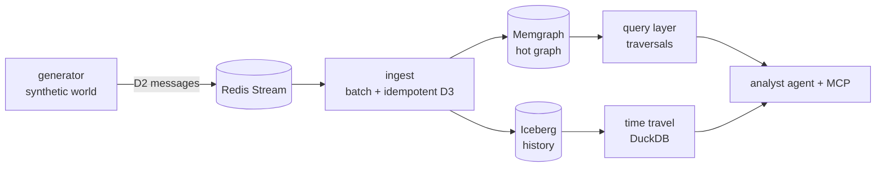

# resgraph

A mini referential data platform, built in public: a synthetic cloud-
infrastructure world streams updates into a graph hot store and an
Iceberg cold store, queryable by traversal and time travel — with agents,
serving, and compliance layers built on top. Honest benchmarks only:
every number ships with hardware + methodology.

Runs on any OCI runtime — tested with Docker/OrbStack; Podman-compatible
(rootless).

Status: phases 0–4 complete — foundations + security posture, the
deterministic generator, the graph hot store, the streaming ingest, and
the Iceberg cold store with event-time travel (phase 4 in review).
Each increment lands via issue → PR, citing the SPEC decisions
(D-numbers) it implements; every phase's end state is tagged
(`phase-N-*`) and benchmarked (BENCHMARKS.md).
