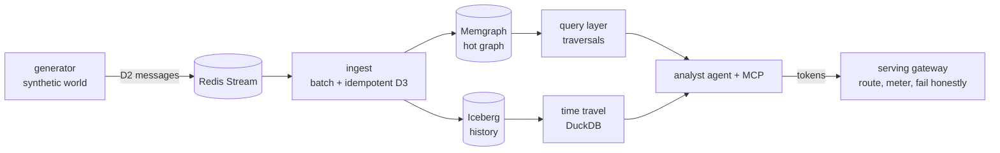

# resgraph

[](https://github.com/fespino/resgraph/actions/workflows/ci.yml)
[](https://scorecard.dev/viewer/?uri=github.com/fespino/resgraph)

A mini referential data platform, built in public: a synthetic cloud-
infrastructure world streams updates into a graph hot store and an
Iceberg cold store, queryable by traversal and time travel — with agents,
serving, and compliance layers built on top. Honest benchmarks only:
every number ships with hardware + methodology.

Runs on any OCI runtime — tested with Docker/OrbStack; Podman-compatible
(rootless).



## Status

Part I — the data foundation — is complete (phases 0–6); Part II — the
AI layer — has landed the MCP surface, the analyst + its eval harness,
the safe runtime, the serving gateway, and misuse detection over the
audit trail (phases 7–11). Each phase is tagged at its end state:

| Phase | What landed | Tag |
|---|---|---|
| 0 | Foundations: SPEC-driven decisions, CI + security posture | `phase-0-foundations` |
| 1 | Deterministic synthetic world generator (`--seed`) | `phase-1-generator` |
| 2 | Hot graph store (Memgraph) + traversal queries | `phase-2-graph-store` |
| 3 | Streaming ingest: one watermark, idempotent batch apply | `phase-3-ingest` |
| 4 | Iceberg cold store, event-time travel, DR rebuild | `phase-4-cold-store` |
| 5 | Query layer: mini planner, push-down, one API over both stores | `phase-5-query-layer` |
| 6 | Observability: wide events, SLOs, the chaos drill (INC-001) | `phase-6-observability` |
| 7 | MCP server: 5 task-shaped tools from one registry, drift guard, skills-as-prompts | `phase-7-mcp-server` |
| 8 | Analyst agent + eval harness: planted ground truth, 8 pre-registered iterations, zero fabrications ever | `phase-8-analyst` |
| 9 | Safe runtime: permission tiers, approval gate + audit at rest, budgets, honest degradation (INC-002/-003) | `phase-9-safe-runtime` |
| 10 | Serving gateway: task-class routing with recorded source, honest stream failure, two measured cache layers, the failover drill (INC-004) | `phase-10-token-path` |
| 10.5 | Institutional memory as a log-structured store: archive/history/working-set split, fed-context sha pinned per run | `phase-10.5-institutional-memory` |
| 11 | Misuse detection (resgraph-sentinel): three cost-ordered layers over the audit trail, benign FP rate as the headline, review queue whose labels close loops in code, CI recall gate | `phase-11-sentinel` |

Each increment lands via issue → PR, citing the SPEC decisions
(D-numbers) it implements. Next: the gateway phase (#263) — closing
the measured distance between this miniature and a production API
gateway (one model/many endpoints, percentile routing windows,
price-weighted sampling, per-caller billing), each workstream
doc-validated against the real thing before any code.

## Quickstart: to a live dashboard

```bash
docker compose --profile obs up -d   # redis, memgraph, prometheus, grafana
uv sync

# terminal 1 — hot consumer (metrics on :9101)
uv run resgraph ingest --metrics-port 9101

# terminal 2 — cold consumer (metrics on :9102)
uv run resgraph cold init
uv run resgraph cold ingest --metrics-port 9102

# terminal 3 — the API over both stores, on :8000
uv run resgraph serve

# terminal 4 — seed a 10k-resource world, then churn at 2,000 msg/s
uv run resgraph-gen seed --sink redis
uv run resgraph-gen run --sink redis --rate 2000 --duration 600
```

Grafana is at <http://localhost:3000> (anonymous, provisioned from the
repo): throughput, consumer lag against its SLO threshold, API latency
by store, error-budget burn — all moving.

<!-- SCREENSHOT: docs/blog/images/07-dashboard-under-load.png —
     the overview dashboard during the INC-001 chaos drill. -->

Ask it something:

```bash
uv run resgraph query blast-radius --id vm-000042
curl "localhost:8000/blast-radius/vm-000042?at=2026-01-03T00:00:00Z"
```

## Ask it through an agent: the MCP server

Five task-shaped tools over the same query layer — `blast_radius`,
`dependency_path`, `resource_history`, `world_diff`, `fetch_resource` —
plus two investigation playbooks served as MCP prompts. One registry
defines the surface; the HTTP routes above and the MCP server are both
projections of it, and CI asserts nothing exists outside it. Budgets
live inside the tools: depth clamps that answer instead of erroring,
bare refs with one polymorphic fetch, a hard token cap with prose
pagination hints, freshness on every response.

`.mcp.json` wires it into Claude Code/Desktop:

```bash
uv run resgraph-mcp   # stdio; or let the client spawn it
```

A real capture (stdio, seeded 100k world plus a 900-dependent hub —
trimmed, not staged):

```text
> blast_radius(resource_id="host-hub000", depth=2)
{"total_count": 900, "truncated": true, "depth_clamped": false,
 "pagination_hint": "900 results total; this page covers 0..378.
  Call blast_radius again with offset=379 for the next page.",
 "source": "hot", "refs": [{"id": "container-hub0000",
  "type": "container", ...}, ...379 refs, under the token cap...]}

> fetch_resource(resource_id="container-hub0000")
{"found": true, "attrs": {"image": "app:v1.2.3", "restarts": 0,
  "state": "running", "zone": "z1"},
 "relationships": [{"type": "runs_on", "target_id": "host-hub000"}], ...}

> dependency_path(from_id="container-hub0000", to_id="host-hub000")
{"found": true, "path": ["container-hub0000", "host-hub000"],
 "rels": ["RUNS_ON"], ...}
```

A 900-node radius comes back as one capped page of refs with an
honest total and the next move in prose — not 54k tokens of attrs
(the measured fat alternative; see BENCHMARKS.md).

## Benchmark highlights

Apple M3 laptop, 8 GB RAM, stores in Docker alongside. Methodology,
full tables, and every caveat: [BENCHMARKS.md](BENCHMARKS.md) — the
README never carries a number that file can't back.

| What | Number | The caveat that keeps it honest |
|---|---|---|
| Hot ingest, single consumer | 12,500 updates/s (10,500 sustained) | measured **solo**; ~3,500/s with the full stack co-located |
| Cold append | 194k events/s (batch 8,192) | drops to 24.3k at batch 1,024 — the knee is the finding |
| Time travel (`state_at`, 1M events) | 0.17–0.39 s p50 | with snapshots; pure replay up to 0.55 s |
| Composite blast-radius as-of | 0.250 s p50 / 0.393 s p95 | 10k resources, 1M events; p95 is what the SLO is derived from |
| Storage, 1M events | 18 MB data / 25 MB total | at batch 8,192; small batches 14× the metadata |
| Hot-store loss to fully restored | 395 s, zero loss | induced (chaos drill): detected T+172 s by SLO burn, rebuilt in 21 s, reconciled exact — [INC-001](docs/incidents/INC-001-hotstore-loss.md) |
| Cost per passed triage, daily-driver model | $0.085 (Haiku) | k=3 paired arms; Opus $0.711, Sonnet $0.706 — the harness prices any worker ([EVALS.md](EVALS.md)) |
| Serving knee, local model | between c=2 and 4 | the knee belongs to the model server, not the gateway; TTFT is bimodal, so p50 alone lies — [docs/capacity.md](docs/capacity.md) |
| Backend death → paid failover | 47/47 served, $1.08/hour | induced ([INC-004](docs/incidents/INC-004-gateway-failover.md)); warm-prefix price at drill traffic; streamed traffic cannot fall forward yet (#219) |
| Replayed run through the response cache | 432.6 s → 0.07 s | same real item byte-identical, 13,634 backend tokens unspent; sampled traffic never cached, by design — [BENCHMARKS.md](BENCHMARKS.md) |

## Where things are

- [SPEC.md](SPEC.md) — the decision log: every choice with its
  rejections and reversal conditions (D-numbers, cited from PRs).
- [BENCHMARKS.md](BENCHMARKS.md) — methodology + hardware for every
  number above.
- [docs/evals-explained.md](docs/evals-explained.md) — how the evals
  work, from the ground up: planted ground truth, runs and trials,
  the graders, the pinned judge, baselines, arms, and the CI gate.
- [EVALS.md](EVALS.md) — the eval protocol and its spend ledger:
  pre-registrations before any paid run, every run's verdict recorded;
  the closed record lives in [EVALS-HISTORY.md](EVALS-HISTORY.md),
  compacted per the checkpoint-plus-log rule (D34).
- [docs/incidents/](docs/incidents/) — incident reports, starting with
  the induced hot-store loss.
- [docs/sentinel/](docs/sentinel/) — the misuse-detection memos: threat
  model, corpus design, detection economics (cost per correct verdict).
- [docs/security-posture.md](docs/security-posture.md) — the controls,
  each enforced, alarmed, or measured.
- [docs/blog/posts/](docs/blog/posts/) — the build, written up as it
  happened.
- [INDEX.md](INDEX.md) — repo map.
