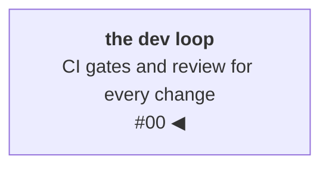
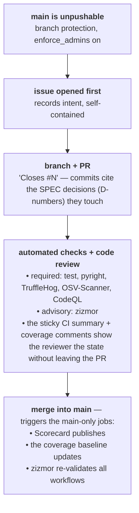

# One harness for humans and agents

Every serious codebase ships from inside a **secure development
lifecycle**: an unpushable default branch, an issue and a review in
front of every change, CI-enforced scanning, dependencies pinned
through lockfiles. This post builds that lifecycle for resgraph
from the first commit — the branch rules, the workflows, the
scanners, and the probes that verify each control from outside the
repo.

Only one frame comes before the techniques. **Harness engineering** is the
system built around a capable but fallible component, and the
oldest fallible component in software is the programmer: the
lifecycle *is* the harness the industry built for us, decades
before anyone called it that. The development loop now includes
coding agents, and the same lifecycle has to hold for both kinds of
contributor — that is the title, and the test every control below
passes.

<!-- more -->

!!! info "The resgraph series"
    This is the first post about [**resgraph**](https://github.com/fespino/resgraph), a mini data platform I
    am building for learning purposes. Browse the
    repository exactly as it stood when this was written:
    [`phase-0-foundations`](https://github.com/fespino/resgraph/tree/phase-0-foundations).
    The whole phase is 22 files; every snippet below is copied from
    that tag, trimmed only for length.

In this phase: the foundations every later phase inherits. The
platform to come — a synthetic cloud-infrastructure world streaming
updates into a graph store, queryable by traversal and (later) time
travel, with agents and compliance layers on top — ships every phase
with measured numbers and the method behind them. The theme runs
the whole series: later phases build harnesses around the
platform's own agents — evals, judges, budget gates. Phase zero
does the same for the loop that builds them, so it is not a
feature. It's the harness.

The platform so far, with this post's piece highlighted:



Nothing in this post is AI tooling — an all-human repo would want
every control here. Agents just add one more contributor to the same
loop; what changes is the property you select for: each control
must be legible and binding to a contributor that isn't human — one
that is fast, tireless, plausible-sounding, and occasionally
confidently wrong. Review by vibes fails that test; a branch rule
plus a gate that prints which leg failed passes it. That double
duty — security hygiene that also passes the agent test — is the
lens for this post.

## Where a harness lives in the development cycle

Map the loop a change travels — written, merged, deployed, operated —
and a layer exists for each stage:

1. **Before the change**: recorded context — the spec, the decision
   log, the instructions file the contributor reads before touching
   code. (That's the next post.)
2. **At the merge**: gates that fail the build, identically for human
   and agent.
3. **After the merge**: scheduled sweeps for what slips past the
   gates, wired to land somewhere durable.
4. **Around the loop itself**: an audit of the machinery, and a
   published measurement of the whole thing.

Those four stages collapse into two halves. The **context half** is everything the contributor
reads before acting — instructions, decisions, prior exceptions — so
the right action is derivable from the repo alone. It's the old
discipline of writing issues and PRs and documenting each step; the
developer joining in six months always needed it. An agent makes it
load-bearing — it joins *every* session cold, so written context is
the only kind it has, and the only way to move fast without tribal
knowledge — the kind that accumulates when a team runs on informal
catch-ups instead of written discipline, and leaves with whoever
holds it.

The **verification half** is everything that checks the work after
it exists, so correctness never depends on the contributor having
been careful. Stage 1 is context and it's the next post; stages 2–4
are the verification half, and they're this one. Each control in
them is one of three things, never merely asserted:

- **Enforced** — a gate that fails the build.
- **Alarmed** — a scheduled scan that opens a tracking issue when it
  finds something.
- **Measured** — a published number you can point at.

If a control isn't one of those, it's decoration — a request that the
contributor behave, which is exactly the thing a harness exists to
not depend on. And exceptions are always documented in a checked-in
file, never silent — Layer 4 shows what that looks like.

Here is the full surface at a glance — the rest of the post walks
it layer by layer, with the code:

| Control | What | When | Why |
|---|---|---|---|
| ruff check / format | lint (incl. import order) + formatting | every PR/push | correctness bugs and diff noise die here |
| bandit | Python SAST (pattern-level) | every PR/push | cheap first pass; feeds the CI summary gate |
| pytest + coverage | 12 tests incl. the SPEC anti-drift fixture | every PR/push | the schema's invariants are enforced, not documented |
| CodeQL | deep SAST (taint tracking, dataflow) | every PR/push + weekly | catches what pattern-matching can't; weekly cron picks up new query packs without a code change |
| TruffleHog | secret scan, verified findings only | every PR/push + weekly | `--only-verified` = the credential authenticates; near-zero false positives |
| osv-scanner | dependency CVEs from `uv.lock` | every PR/push + weekly | broader ecosystem coverage and faster CVE ingestion than Dependabot alerts alone |
| zizmor | audits the workflows themselves | PRs touching workflows + every main push | the CI is part of the attack surface; it must pass its own audit |
| Scorecard | OpenSSF posture measurement, published | main pushes + weekly | turns "is this repo secure" into a tracked number (see badge) |
| Dependabot | version + security updates | weekly | keeps `uv.lock` and action pins current |

## Layer 1: the merge gate

Four checks run on every push and PR: **ruff** (lint + format),
**bandit** (Python SAST), **CodeQL** (taint tracking and dataflow,
catching what pattern-matching can't), and **pytest** with coverage.

In
[the CI job](https://github.com/fespino/resgraph/blob/phase-0-foundations/.github/workflows/ci.yml),
every leg runs with `continue-on-error: true`, results collect into
a summary table, and a single `Gate` step at the end fails the build
if any leg failed.

```yaml
# .github/workflows/ci.yml
- id: lint
  name: ruff check
  run: uv run ruff check .
  continue-on-error: true
- id: format
  name: ruff format
  run: uv run ruff format --check .
  continue-on-error: true
- id: bandit
  name: bandit
  run: uv run bandit -c pyproject.toml -r src/ -q
  continue-on-error: true
- id: tests
  name: pytest
  run: uv run pytest 2>&1 | tee pytest.out
  continue-on-error: true
# ... a step assembles the outcomes into a markdown table, posts it
# as a sticky PR comment, and then:
- name: Gate
  if: steps.lint.outcome == 'failure' || steps.format.outcome == 'failure' || steps.bandit.outcome == 'failure' || steps.tests.outcome == 'failure'
  run: exit 1
```

One round trip surfaces every failure at once — lint, format, and
the failing test together. For a human that saves push-and-wait
cycles; for an agent it is the difference between one fix-iteration
and four, and each avoided iteration is avoided context burn and
avoided drift. The sticky PR comment aims the same idea at the next
actor in the loop: machine-legible state pushed to where the
reviewer — human or agent — already is.

## Layer 2: the unbypassable path

Gates only harness what has to pass through them, so **branch
protection** on `main` makes the path mandatory: no direct pushes,
force-pushes, or deletions — and `enforce_admins` is on, so the rules
bind the repository owner too. You can verify that claim from the
outside, which is the point:

```bash
gh api repos/fespino/resgraph/branches/main/protection \
  --jq '{admins: .enforce_admins.enabled,
         required: .required_status_checks.contexts}'
```

The whole lifecycle, as the platform enforces it:



A rule that binds the human and the agent *identically* is exactly
what you want with a stochastic contributor in the loop.
Every change — mine or an agent's — goes through issue → branch →
pull request → green gates → merge, and there is no privileged path
for the agent to be talked into using, because there is no privileged
path at all. An owner can always dismantle the protection in the
settings first, so "can't bypass" would be overclaiming; what the
control actually buys is that bypass stops being a slip and becomes a
deliberate, visible act. The harness is a mechanical fact, not a
convention that holds until someone — or something — is in a hurry.

The issue coming *before* the PR is the other property that matters:
the issue records what and why in self-contained form, the PR
records how, so a reader can audit intent and implementation
separately.

Which checks are required is itself a decision. `test`,
`TruffleHog`, and `OSV-Scanner` blocked merges from the first week;
pyright joined when Layer 6 landed. CodeQL started advisory —
newer here — and was promoted to required once it had stable run
history. zizmor stays deliberately *not* required:
it is path-conditional on PRs, and a required-but-untriggered check
would block merges forever.

Three more controls live in platform settings rather than the
tree — invisible to a reader of the files, which is why probes like
the one above are the only way to verify this class of control:

- **Secret scanning with push protection** — a recognized credential
  is blocked at `git push`, before any scanner runs. The scanners
  are the second net, not the first.
- **Private vulnerability reporting** — the reporting channel in
  [SECURITY.md](https://github.com/fespino/resgraph/blob/main/SECURITY.md).
- **Vulnerability alerts + automated security fixes** — Dependabot's
  security half, distinct from its weekly version bumps.

The probe for this class is one call:

```bash
gh api repos/fespino/resgraph --jq '.security_and_analysis'
# {"dependabot_security_updates":{"status":"enabled"},
#  "secret_scanning":{"status":"enabled"},
#  "secret_scanning_push_protection":{"status":"enabled"}, ...}
```

## Layer 3: the scheduled alarms

A red check on a pull request is in your face. A failed scan at 6am
on a Monday is invisible — unless it lands somewhere durable. Two
weekly sweeps cover the failure classes the merge gate can't:

- **TruffleHog** — secret scanning over full git history, verified
  findings only (`--only-verified` means the credential actually
  authenticates against the issuing service), so near-zero false
  positives.
- **osv-scanner** — dependency CVEs read straight from `uv.lock`
  against the [OSV.dev](https://osv.dev) database.

The TruffleHog invocation scopes itself by event: on PRs it scans
only the new commits; on push and schedule it sweeps everything.

```yaml
# .github/workflows/secret-scan.yml
- uses: trufflesecurity/trufflehog@6f3c981e7b77f235fd2702dd74af25fc4b72bf11  # v3.96.0
  with:
    path: ./
    base: ${{ github.event_name == 'pull_request' && github.event.pull_request.base.sha || '' }}
    head: ${{ github.event_name == 'pull_request' && github.event.pull_request.head.sha || 'HEAD' }}
    extra_args: --only-verified
```

When a *scheduled* run fails, a step opens a tracking issue — and
deduplicates, so Monday's re-scan comments on the existing open issue
instead of stacking a new one:

```yaml
- name: Open issue on scheduled-scan failure
  if: failure() && github.event_name == 'schedule'
  env:
    GH_TOKEN: ${{ github.token }}
  run: |
    TITLE="Security: scheduled secret scan found a verified credential"
    gh label create security --color D93F0B --force
    EXISTING=$(gh issue list --label security --state open \
      --search "$TITLE" --json number --jq '.[0].number')
    if [ -n "$EXISTING" ]; then
      gh issue comment "$EXISTING" --body "Re-scan — finding still present."
    else
      gh issue create --title "$TITLE" --label security --body "..."
    fi
```

The two alarms are deliberately *asymmetric*. The OSV issue pastes
the full scan output
(`head -c 50000 osv-results.txt` into a fenced block), because a CVE
in a public package is public information — the issue is a work item,
complete with the fix command (`uv lock --upgrade-package <name>`).
The TruffleHog issue carries **no scan output at all**, because a
verified finding locates a *live credential in a public repo*. The
issue is an alarm, not a report — rotate first, identify from the
run logs second, and do not "improve" it by pasting output. Its
body is an ordered response procedure:

```
1. Rotate the credential now — it authenticates; treat it as compromised
2. Identify it from the workflow run logs
3. Scrub it from history and force-push, or accept the history if rotated
4. Add a documented exception to .trufflehogignore only if it's a
   deliberate test fixture
```

The run logs are public too, so suppressing the issue body doesn't
hide the finding — it keeps it off
the most indexed, most permanent surface (issues are searchable
forever; logs expire). The suppression narrows exposure rather than
buying secrecy, and rotation is what actually closes the hole. The
two alarms share a mechanism and differ in disclosure because the
threat models differ.

Both alarms take the same shape: findings become *issues* — the
durable surface teams have always used to hand work to each other. In
a repo run with agents the same surface is also working memory: an
alarm that lands there is context the next session inherits, not a
log line nobody greps.

The TruffleHog path got its live test some time after this post
first shipped: the weekly sweep auto-filed exactly the issue above
([#165](https://github.com/fespino/resgraph/issues/165)) — ten
"verified" credentials, every one of them a **test function name**.
Lob, a print-and-mail API, issues keys shaped `test_` or `live_`
plus 35 word characters, so any test function whose name is exactly
40 characters matches the detector's pattern — and TruffleHog's Lob
verifier accepts whatever Lob's API answers for arbitrary strings,
so the matches came back *verified*, the one word the
`--only-verified` posture trusts. The alarm machinery worked end to
end — the finding was filed, labeled, and pointed at the run logs;
what failed was the assumption behind "near-zero false positives":
*verified* is a claim about the issuer's API discipline, not about
your repo. The fix excluded the Lob detector, with the reasoning in
the PR
([#181](https://github.com/fespino/resgraph/pull/181)), and the
response procedure held up in practice — identify from the run
logs, then either rotate or document the exception.

## Layer 4: the harness that audits the harness

The workflows themselves are an attack surface — a compromised or
sloppy GitHub Action can exfiltrate secrets — and they're also the
machinery everything above runs on, which nothing above inspects. So the repo
runs [**zizmor**](https://github.com/zizmorcore/zizmor), which
statically audits the workflow files for exactly that class of
problem. The whole workflow is two real steps:

```yaml
# .github/workflows/zizmor.yml
- uses: astral-sh/setup-uv@c771a70e6277c0a99b617c7a806ffedaca235ff9  # v9.0.0
- run: uvx zizmor==1.28.0 --no-progress .github/workflows/
```

On its first run, zizmor failed — on my own CI. It found five Actions
pinned to mutable tags instead of commit SHAs and a checkout step
that persisted credentials it didn't need. I fixed all six before
they ever ran on `main`. "The CI passes its own security audit"
stopped being a slogan the moment the audit failed. And note who got
caught: the human, not the agent — the harness doesn't distinguish.
I *assumed* my workflows were fine; the measurement disagreed, and
it was right.

One of the six later came back — deliberately. The coverage tooling
turned out to need that persisted credential to push its data branch,
so the finding returned as a **documented waiver** in zizmor's
config, with the justification written next to it. This is the entire
config file:

```yaml
# .github/zizmor.yml — documented exceptions only.
rules:
  artipacked:
    # ci.yml's checkout persists credentials deliberately: py-cov-action
    # pushes the coverage-data branch via git on main pushes and fails
    # without them (issue #12). The persisted token is the job's own
    # GITHUB_TOKEN, already contents:write scoped for that branch.
    ignore:
      - ci.yml
```

Every scanner has a documented escape hatch, because an
undocumentable exception is a control you'll eventually disable
entirely:

| Scanner | Exception file | Bar |
|---|---|---|
| TruffleHog | `.trufflehogignore` | deliberate test fixtures only |
| osv-scanner | `osv-scanner.toml` | justification + link required |
| zizmor | `.github/zizmor.yml` | written waiver per rule per file |
| bandit | inline `# nosec BXXX` | per-site only, never config-wide; rationale at the site |

A waiver with its argument written next to it is
durable memory: whoever reads the repo cold — a new teammate or an
agent starting a session — gets the exception *and* the argument for
it, no tribal knowledge required. Together, scanner and waiver block
silent drift in one direction and force exceptions into
writing in the other.

The standing bandit exception shows the bar in action. It arrived
with the query layer, phases later: B608 flags SQL built from
strings, and the query layer builds SQL from strings — dynamic WHERE
and projection make that unavoidable; identifiers cannot be bound
parameters in SQL, which is why every query engine does the same.
The suppression is sound because the injection boundary is
elsewhere: untrusted input is parsed at the HTTP edge into a closed
predicate algebra (fields from a generator-derived allowlist,
operators from a fixed set, values as bound parameters — D16, the
filter grammar), and raw query passthrough is a rejected alternative
on the record (D15, the endpoint table). A caller able to hand the
query function a hostile fragment is already running Python
in-process and needs no injection. **The suppression becomes wrong
the day any endpoint accepts SQL text** — that change must revisit
both the D15 rejection and this waiver. B608 stays enabled repo-wide
precisely so that day is loud.

## Layer 5: the published number

The last layer measures the other four. The repo runs
[OpenSSF Scorecard](https://scorecard.dev/viewer/?uri=github.com/fespino/resgraph),
which grades it against the industry checklist — branch protection,
pinned dependencies, SAST, token permissions, and more — and
publishes signed results the README badge reads from:

```yaml
# .github/workflows/scorecard.yml
- uses: ossf/scorecard-action@2d1146689b8cda280b9bc96326124645441f03bc  # v2.4.4
  with:
    results_file: results.sarif
    results_format: sarif
    publish_results: true
```

The number is taken *as-is*, including the deductions I can't fix. A solo repo scores zero on "Code-Review" because there's
no second approver. I'm not going to game that. Publishing the score
you didn't massage is the entire point of measuring — a harness whose
health you assert rather than measure decays exactly like the code it
was supposed to protect.

## Layer 6: the type checker

The merge gate grew this leg a week after the post first shipped —
**pyright in strict mode** as a required check (D0 in the spec,
issue #68) — and it's the purest layer of them all: it
converts "the contributor forgot a case" from a runtime surprise
into a named, located compile error.
You're not asking the contributor to be exhaustive; the environment
makes non-exhaustiveness impossible to miss.

The codebase was already written in the constructive style Alexis
King describes in her [constructive data modeling
talk](https://www.youtube.com/watch?v=0BXuYlNrUmE) — closed `Literal`
sets for operators and relationship types, frozen models, positive-
space types that can't represent invalid states — but nothing
*enforced* the style's payoff. Now the closed types dispatch through
`match` statements with `typing.assert_never` on the fall-through:

```python
# src/resgraph/graph/ingest.py
match msg.op:
    case Op.UPSERT:
        _write_upsert(tx, msg, label)
    case Op.DELETE:
        _write_tombstone(tx, msg, label)
    case _:
        assert_never(msg.op)
```

`assert_never` takes a parameter typed `Never`. If `Op` grows a third
member, `msg.op` in the fall-through narrows to that member instead
of `Never`, and the checker names each dispatch site that must handle
the new case — a compile-time obligation on every consumer, before
any test runs. Adopting it also paid immediately: the checker found
two API routes that would accept an empty-string timestamp and pass
`None` into a SQL layer. Both are now explicit 400s with tests:

```python
# src/resgraph/api/app.py
preds, at_t = _parse(filter, at)
if at_t is None:
    raise HTTPException(status_code=400, detail="at must be a non-empty ISO-8601 timestamp")
```

The obligation is enforced, not claimed, like everything else on
this page.

## Layer 7: the supply chain

The base pin is the lockfile: every Python dependency resolves
through `uv.lock`, Dependabot keeps it current, and osv-scanner
reads it for CVEs — no floating versions anywhere in the build. On
top of that sit three mechanical rules, all visible in the workflow
files, all aimed at the same idea: the loop's own dependencies are a
third kind of fallible contributor — one you never get to
interview:

**Pin actions to commit SHAs, not tags.** A tag can be repointed at
malicious code; a SHA can't. The human-readable version rides along
as a comment, and Dependabot keeps the pins current:

```yaml
- uses: actions/checkout@3d3c42e5aac5ba805825da76410c181273ba90b1  # v7.0.1
```

**Checksum-verify downloaded binaries before executing them.** A
release download is an unpinned dependency until its hash is checked.
The osv-scanner install fails closed on mismatch:

```yaml
env:
  OSV_VERSION: v2.3.8
  # SHA256 of osv-scanner_linux_amd64 from the release's SHA256SUMS file
  OSV_SHA256: bc98e15319ed0d515e3f9235287ba53cdc5535d576d24fd573978ecfe9ab92dc
```

```bash
curl -sSL --fail -o osv-scanner \
  "https://github.com/google/osv-scanner/releases/download/${OSV_VERSION}/osv-scanner_linux_amd64"
actual=$(sha256sum osv-scanner | awk '{print $1}')
if [ "$actual" != "$OSV_SHA256" ]; then
  echo "::error::checksum mismatch (expected $OSV_SHA256, got $actual)"
  exit 1
fi
```

**Least privilege, timeouts, and no persisted credentials.** Every
workflow declares a minimal `permissions:` block, and elevated
grants (`security-events: write`, `id-token: write`) live only in
the small single-purpose workflows that need them. Every job has
`timeout-minutes` and a concurrency group — a hung scan can't camp
on runners, and superseded PR runs cancel. And every checkout sets
`persist-credentials: false` — except the one documented waiver from
Layer 4, which the workflow itself explains at the site:

```yaml
# .github/workflows/ci.yml
concurrency:
  group: ci-${{ github.ref }}
  cancel-in-progress: ${{ github.event_name == 'pull_request' }}
jobs:
  test:
    runs-on: ubuntu-latest
    timeout-minutes: 10
    permissions:
      contents: write        # coverage badge/data branch (py-cov-action)
      pull-requests: write   # CI summary + coverage comments on PRs
    steps:
      - uses: actions/checkout@3d3c42e5aac5ba805825da76410c181273ba90b1  # v7.0.1
        with:
          # Documented exception (zizmor artipacked, see .github/zizmor.yml):
          # py-cov-action pushes its coverage-data branch via git on main
          # pushes and needs the persisted token — which this job already
          # holds as contents:write. Every subsequent step is a pinned,
          # audited action.
          persist-credentials: true
```

## The review, outside the numbering

Everything above is machinery, and machinery checks what machines
can check. Review checks what none of them can — intent, design,
and the thing that should be there and isn't — and it is
deliberately not Layer 8, because it fits none of the three types:
branch protection can require an approval, but nothing can require
attention. It is no less mandatory for that. No serious development
ships unreviewed code: the gates catch the wrong that is
detectable; review catches the wrong that is plausible. Here, where
most lines are agent-written, the human review of the PR is where
independence enters the loop.

The trap is running the layer backwards — treating the agent that
wrote the code as its reviewer. An agent works from your framing
and tends to agree with it; the session is an echo chamber with two
voices, not another pair of eyes.
[The query-layer review](06-pushdown-across-two-stores.md) walks a
shipped example: a gap that survived tests, benchmarks, and
documentation because everything examining the build shared the
builder's framing.

Independence can be partially manufactured, though. The technique
is a reviewer with no context about how the code came to be: a
fresh session — a different model, even — given only the spec and
the final diff, never the conversation that produced them.
Purpose-built review tools ([CodeRabbit](https://coderabbit.ai) is
one) package the same move. On a solo repo that is the difference
between unreviewed and reviewed by something independent; on a team
it makes review self-service — the author iterates until the
findings run dry, and the human spends the final check on
judgment.

An independent frame is still not an independent stake: one
maintainer means no second approver, which is the deduction the
Scorecard prices below.

## The limitations, stated

- **Solo review.** One maintainer means no second approver; branch
  protection enforces process, not additional eyes. This is the same
  deduction the Scorecard takes above, accepted in both places.
- **One alarm path is still unexercised.** The TruffleHog alarm
  fired for real (the Layer 3 story); the OSV issue-opening path
  never has — and a control that has never fired is a hypothesis.
- **Deferred, with trigger conditions.** Container scanning (e.g.
  Trivy) waits until the repo builds and publishes an image of its
  *own* — today `compose.yaml` runs only third-party dev/CI images,
  pinned by digest and updated by Dependabot, and scanning upstream
  base layers this repo cannot patch produces findings whose only
  remediation is the digest bump already automated. SBOM, artifact
  signing, and provenance arrive with the same trigger (when there
  are releases). Fuzzing beyond property-based testing is also
  deferred — the hypothesis suites landed with the generator and
  ingest paths.

## What I'd take to the next project

- **Harness before feature.** The test for every control: does it
  still work when the contributor is fast, tireless,
  plausible-sounding, and occasionally confidently wrong? Review by
  vibes fails that test; a gate that names exactly which leg failed
  passes it.
- **Supply-chain hygiene is cheap and compounding.** The whole list
  is SHA-pinned actions, checksum-verified binaries, least-privilege
  permissions, and timeouts everywhere. None of this is hard; it's
  just *early*.
- **Make the invisible visible.** Push protection blocks a leaked
  credential at push time, before any scanner runs — the scanners are
  the second net, not the first. Scheduled failures open deduplicated
  issues, and issues are inheritable context, not just alerts.
- **Measure the thing you're claiming.** A Scorecard number and a
  self-auditing CI turn "this is secure" from an opinion into
  evidence — and occasionally, into a failing check that teaches you
  something.

The security work itself went through the lifecycle this post
documents — issue, branch, PR, required checks — and the history is
part of the artifact: the issues record the intent and the pull
requests record the build.

Next post: the other half of the harness — context. The decision log,
why every locked decision carries a recorded rejection and a reversal
condition, and the test that makes the specification executable — so
the document the agent reads and the behavior the code has are
mechanically prevented from diverging.

