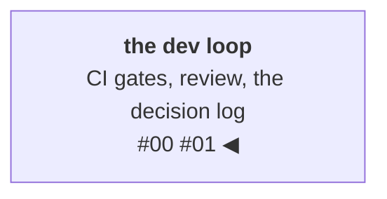

# Decisions with reversal conditions: the context half of the harness

A **decision log** treats design decisions as first-class artifacts
with a fixed shape: the decision, the alternative that lost and *why*,
and the **reversal condition** — the specific evidence that would
change the answer. A decision without a recorded rejection is just an
opinion: you can't tell later whether you weighed the alternative or
never saw it. The last post built the verification half of the
harness — the gates that check work after it exists. This one is the
context half: everything a contributor reads *before* touching code,
whether that contributor is you in six months, a teammate joining the
project, or a coding agent starting a session cold.

<!-- more -->

!!! info "The resgraph series"
    This is the second post about [**resgraph**](https://github.com/fespino/resgraph), a mini data platform
    I am building for learning purposes. Browse the
    repository exactly as it stood when this was written:
    [`phase-0-foundations`](https://github.com/fespino/resgraph/tree/phase-0-foundations).
    Every snippet below is copied from that tag, trimmed only for
    length.

Six months into any side project, you hit a line of code you don't
understand and can't remember writing. Why is this field a string
and not an enum? Why does the delete path behave differently? The
reasoning evaporated, the knowledge that would let you *safely
change* the code is gone, and you either cargo-cult around it or
break something. The fix isn't more comments — it's the decision
log, and for the one decision that matters most, a mechanism that
makes the log executable.

In this phase: still phase zero — the specification every later
phase cites by number. Every future component — the ingest, the
query layer, the agents — will point back at a decision here, so the
specification is the load-bearing wall the rest of the house hangs
off. And because an agent reads `SPEC.md` at the start of a session
the same way a new teammate reads it in week one, the document has to
work cold, with no one around to explain it.

The platform so far, with this post's piece highlighted:



## The shape of a decision

Every locked decision in `SPEC.md` carries an ID (`D1`, `D2`, …), and
changing a locked decision isn't an edit — it's a *new* decision that
supersedes the old one, so the history stays intact. The spec's own
header states the rule:

```markdown
# resgraph SPEC

Decision log + phase contracts. Locked decisions carry D-NN ids;
changing one requires a new decision superseding it, not an edit.
```

Here is D1 as it actually appears — after a comparison table of the
two candidates, the record closes with the three required parts:

```markdown
**Decision:** Memgraph. Rationale: performance-per-watt on a laptop
fleet (performance is a budget), instant startup for test cycles, and
Cypher/Bolt compatibility means the skill and most queries transfer
to Neo4j unchanged.
**Rejected:** Neo4j — better name recognition, heavier local
footprint.
**Reversal condition:** if later on we hit MAGE/tooling gaps that
cost more than a day, or traversal benchmarks disqualify Memgraph,
switch — the Bolt driver and Cypher carry over; only Compose + index
DDL change.
```

The reversal condition is the underrated part, and it does two jobs.
It states the evidence that would justify a change, so revisiting is
never relitigating — for any contributor. And it prices the exit
("only Compose + index DDL change"), which is half of whether a
decision is safe to make now. For an agent the mechanism is even more
direct: a proposal to swap the graph store can be answered from the
document alone — either the reversal condition is met, with evidence,
or the decision stands.

The spec ends with the enforcement hook that ties the log to the
change lifecycle from the last post:

```markdown
## Phase contracts
- The generator MUST emit D2 messages exactly and expose `--seed`
  for reproducibility.
- The hot-store ingest MUST implement D3 as stated.
- Any increment touching these contracts cites the D-number in its PR.
```

That last line is what keeps the log alive instead of decorative:
every PR that touches a contract names the decision it implements,
so the paper trail builds itself as a side effect of normal work.

## The decision that had to be executable

The most important decision in phase zero is **D2: the
update-message schema** — the contract between the generator that
produces events and the ingest that consumes them. Get this wrong and
every downstream component inherits the mistake. The spec records it
as a verbatim example message:

```json
{
    "schema_version": 1,
    "sequence": 184467,
    "event_time": "2026-07-17T14:03:22.512Z",
    "op": "upsert",
    "resource_type": "vm",
    "resource_id": "vm-a1b2c3",
    "attrs": {"zone": "z1", "cpu": 4, "state": "running"},
    "relationships": [
        {"type": "runs_on", "target_id": "host-9f8e"},
        {"type": "member_of", "target_id": "asg-web"}
    ]
}
```

The subtle risk with a schema-in-a-spec is *drift*. You write the
schema in a design doc, you implement it in code, and over months the
two quietly diverge until the documentation is actively lying. I
wanted that to be impossible, not merely discouraged. So the repo's
test suite contains this:

```python
# tests/test_schema.py
def test_spec_example_parses():
    spec = Path(__file__).parents[1].joinpath("SPEC.md").read_text()
    block = spec.split("### D2")[1].split("```json")[1].split("```")[0]
    msg = UpdateMessage.model_validate_json(block)
    assert msg.op is Op.UPSERT and msg.sequence == 184467
```

The spec's example *is* a test fixture: if the schema code and the
spec's example ever disagree, the build goes red. In the vocabulary
of the last post, this one artifact is both halves of the harness at
once:
context (the document a contributor reads to learn the contract) and
verification (a gate that fails when the document lies). That one
block of documentation cannot drift; the prose around it can still
rot like any prose, but the contract itself can't.

It did its job on the very first run — and not in the way I expected.
The test failed immediately, but not because the schema was wrong:
because I'd written the spec's fence as a bare ``` instead of
```json`, so the test couldn't *find* the block to parse. The
anti-drift mechanism caught a defect in the anti-drift setup itself,
on day one. That's the signal that the test is real: it fails when
reality disagrees with your intent, including when your intent is
sloppily expressed.

## Enforce the semantics, don't just describe them

D2's normative rules — "`delete` carries empty `attrs` and
`relationships`", "parsing is strict", "an unknown field is a
producer bug, not forward compatibility" — have a second problem:
prose doesn't run. So the model enforces what the spec states:

```python
# src/resgraph/schema.py
class UpdateMessage(BaseModel):
    # Messages are immutable events; unknown fields are producer bugs (D2:
    # schema grows only via schema_version bumps, so strict parsing is safe).
    model_config = ConfigDict(frozen=True, extra="forbid")

    schema_version: Literal[1] = 1
    # D2: generator world-time. Aware-only — a timestamp without an offset
    # is ambiguous, and the time-travel layer cannot afford ambiguity.
    event_time: AwareDatetime
    sequence: int = Field(ge=0)
    op: Op
    resource_type: ResourceType
    resource_id: str = Field(min_length=1)
    attrs: dict[str, str | int | float | bool] = Field(default_factory=dict)
    relationships: list[Relationship] = Field(default_factory=list)

    @model_validator(mode="after")
    def _delete_carries_no_payload(self) -> Self:
        # D2: delete is a removal statement, not an update.
        if self.op is Op.DELETE and (self.attrs or self.relationships):
            raise ValueError("delete must carry empty attrs and relationships (D2)")
        return self
```

Read it line by line against the spec: `frozen=True` makes messages immutable
events; `extra="forbid"` makes an unknown field a rejection, not
forward compatibility; `AwareDatetime` makes a naive timestamp a
validation error, because ambiguous time is the seed of a whole class
of downstream bugs; and the validator rejects a payload-carrying
delete outright. Note what the error message says: it cites **(D2)**.
The tests pin that:

```python
def test_delete_with_attrs_rejected():
    with pytest.raises(ValidationError, match="D2"):
        UpdateMessage(
            sequence=1,
            event_time="2026-01-01T00:00:00Z",
            op="delete",
            resource_type="vm",
            resource_id="vm-x",
            attrs={"cpu": 4},
        )
```

The `match="D2"` is not decoration — the test asserts that the
*failure output names the decision*. Whoever hits this error, human
debugging a producer or agent reading a stack trace, gets routed to
the paragraph of context that explains the rule. That's the context
half of the harness surfacing exactly at the moment it's needed.

This pattern has a canonical name — Alexis King's
["Parse, don't validate"](https://lexi-lambda.github.io/blog/2019/11/05/parse-don-t-validate/):
a parser turns less-structured input into a type in which the illegal
states cannot exist, so downstream code never apologizes for its
inputs. The schema here is a parser, not a checklist — a naive
timestamp, a payload-carrying delete, a v2 wearing v1's shape: none
of them can be *represented* past this boundary. That framing later
paid for itself directly, when applying the essay's lens to the grown
codebase surfaced an invariant two components relied on that no type
enforced — but that's a later phase's story.

One small decision looks wrong until you see its purpose:
`schema_version` is typed `Literal[1]` — a single allowed value, not
a general integer. That feels needlessly rigid until you realize it's
the *versioning hook*. When a version 2 arrives, it's a new model
with `Literal[2]`, and a discriminated union routes messages to the
right one — the schema does the dispatch. The shape it would take
(illustrative — v2 does not exist, so this is not in the repo):

```python
class UpdateMessageV2(BaseModel):
    schema_version: Literal[2] = 2
    ...

AnyUpdate = Annotated[
    UpdateMessage | UpdateMessageV2,
    Field(discriminator="schema_version"),
]
``` A plain `int` wouldn't fail
as loudly as you'd hope: strict parsing already rejects a v2 that
*adds* fields, so the Literal guards the subtler case — a version
that changes what fields *mean* without changing the shape, which is
exactly the kind of message that parses cleanly under v1 assumptions
and corrupts quietly. The tempting "single source of truth" constant
for the version number was actually a *false* one (you can't put a
constant inside a `Literal`), so I dropped it.

## Leaving decisions unmade, on purpose

Two questions came up that I genuinely couldn't answer well yet, and
they're parked at the top of the module — on the record, in the exact
place a reader of the schema will look:

```python
# src/resgraph/schema.py
# TODO — open D2 gaps, undecided (record in SPEC.md before enforcing here):
#   - duplicate relationships: is [(runs_on, host-1)] twice a producer bug
#     (reject), a parse-time dedupe, or the store's problem?
#   - self-edges (target_id == resource_id): reject or tolerate?
```

This is a *decision to not decide yet*, with its trigger stated: when
the ingest phase produces evidence about what those cases actually do
to the store, the decision gets made with data and recorded in the
spec before the code enforces it. A parked question on the record
also does harness work: no contributor — me on a tired evening, or an
agent pattern-matching toward a plausible answer — can silently
resolve it in passing, because the comment marks it as open and names
where the resolution must land first. A stated "unknown, revisit when
X" beats a confident wrong answer that nobody remembers making.

## What I'd take to the next project

- **A decision log with rejections and reversal conditions** costs a
  few minutes per decision and saves the archaeology later. The
  reversal condition is the underrated half: it states what evidence
  would justify a change, so revisiting isn't relitigating — and any
  contributor can check a proposal against it from the document
  alone.
- **Make the spec executable where you can.** A schema example that's
  also a test fixture cannot rot. The cheapest documentation is the
  kind that fails the build when it lies — context and verification
  in one artifact.
- **Enforce normative rules in code, not prose.** If the spec says
  "must," something should reject the "must not" — and the rejection
  message should name the decision, so the failure routes the reader
  to the reasoning.

Next post is where the data-driven part really begins: the
deterministic world generator — and the benchmark that told me my
first implementation was 45 times too slow, plus the profiler result
that proved my intuition about *why* was completely wrong.
