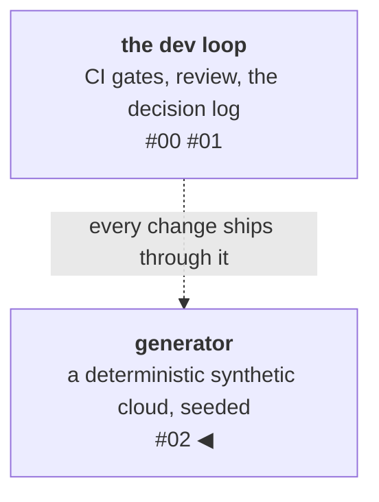

# Ground truth first: a deterministic world generator

**Ground truth** is data whose correct answers you already know —
because you generated it yourself, from a seed. In AI systems it's
what evaluations stand on; in a data platform it's what benchmarks
stand on; either way, it has to exist before the thing it measures.
You cannot measure a data platform without data, and real
infrastructure data is proprietary, messy, and impossible to replay,
while hand-written fixtures are too small and too tidy to stress
anything. So the first real component of resgraph isn't a store or a
query engine — it's a world generator. **Ground truth is a feature
you build first.**

<!-- more -->

!!! info "The resgraph series"
    This is the third post about [**resgraph**](https://github.com/fespino/resgraph), a mini data platform I
    am building for learning purposes. Browse the
    repository exactly as it stood when this was written:
    [`phase-1-generator`](https://github.com/fespino/resgraph/tree/phase-1-generator).
    Every snippet below is copied from that tag, trimmed only for
    length.

In this phase: the first component with real numbers to argue about.
The generator (`resgraph-gen`) seeds a plausible cloud-
infrastructure world — hosts, VMs, containers, databases, load
balancers — and emits an endless stream of update messages describing
how that world changes. It's the single most reused component in the
project: the load-test driver for the ingest now, and later the
*ground-truth factory* for evaluating agents — a world you generated
from a seed is a world whose correct answers you already know, which
is exactly what the harnesses of the later phases are built from.
Everything downstream leans on it, which is why it had to earn its
numbers.

The platform so far, with this post's piece highlighted:



## What "realistic and reproducible" actually requires

Two properties are in tension, and both are non-negotiable. The spec
locks them as D6 (determinism) and D7 (churn model), and the
determinism contract is short enough to quote:

```markdown
### D6 — Determinism contract

Given identical (seed, flags, message count), the generator emits a
byte-identical stream. Consequences:
- One `random.Random(seed)` owns ALL randomness (no module-level
  random, no set/dict-ordering dependence — iterate sorted).
- `event_time` is **simulated world time**: starts at a fixed epoch
  (2026-01-01T00:00:00Z) and advances deterministically per event
  (exponential inter-arrival times drawn from the seeded RNG).
  Wall-clock never appears in messages; `--rate` throttling is
  operational only and cannot change stream content.
**Rejected:** wall-clock event_time — kills reproducible benchmarks
and byte-identical test fixtures.
```

**Reproducible** means byte-identical — on the interpreter version
the repo pins. The boundary matters: Python only guarantees
cross-version stability for some of `random`'s methods, so the pinned
`.python-version` is part of the determinism contract, not a
convenience. Within that boundary, reproducibility is what makes
benchmarks comparable across runs and machines, and what makes agent
evaluations possible later (plant a known fault, check the agent
finds it). The claim is enforced the way post 00 demands — as a
property-based test that runs across random seeds:

```python
# tests/test_gen_properties.py
@given(seed=st.integers(0, 2**32 - 1))
@settings(max_examples=15, deadline=None)
def test_stream_deterministic(seed):
    a = [m.model_dump_json() for m in take(seed)]
    b = [m.model_dump_json() for m in take(seed)]
    assert a == b  # D6: byte-identical
```

**Realistic** means skewed. Real inventories aren't uniform: a small
fraction of resources are "hot" and churn constantly while most sit
quiet. D7 bakes it in — 5% of resources receive 80% of the updates —
because uniform churn is a lie that *flatters caches*: a later phase
measuring cache behavior under uniform load would get an optimistic,
useless number. The skew is a knob, so future phases can crank it to
something nastier than real clouds and see what breaks.

There's also a topology contract, D5, and here the spec-to-code
pattern from the last post repeats — the code carries the table
verbatim, labeled as such:

```python
# src/resgraph/gen/world.py
# D5 verbatim: (source type, relationship) -> (allowed target types, lo, hi)
TOPOLOGY: dict[tuple[ResourceType, str], tuple[tuple[ResourceType, ...], int, int]] = {
    (ResourceType.VM, "runs_on"): ((ResourceType.HOST,), 1, 1),
    (ResourceType.VM, "member_of"): ((ResourceType.ASG,), 0, 1),
    (ResourceType.VM, "attached_to"): ((ResourceType.SG,), 1, 3),
    (ResourceType.CONTAINER, "runs_on"): ((ResourceType.VM,), 1, 1),
    (ResourceType.DB, "runs_on"): ((ResourceType.HOST,), 1, 1),
    (ResourceType.DB, "attached_to"): ((ResourceType.SG,), 1, 2),
    (ResourceType.LB, "routes_to"): ((ResourceType.VM, ResourceType.CONTAINER), 1, 4),
}
```

VMs run on hosts, containers run on VMs, load balancers route to VMs
or containers — so the graph the generator produces is traversable
and its blast-radius questions have meaningful answers. The property
suite pins the invariants across seeds: strictly increasing sequence
numbers, topology bounds respected, and this one — every relationship
target alive at the moment its message is emitted:

```python
@given(seed=st.integers(0, 2**32 - 1))
@settings(max_examples=10, deadline=None)
def test_relationship_targets_alive_at_emit(seed):
    for msg, world in stepped(seed):
        for rel in msg.relationships:
            target = world.resources[rel.target_id]
            assert not target.deleted, (msg.resource_id, rel)
```

## Inside the churn engine

The component that turns the static world into a live stream is a
single class, and its core loop shows most of the design at once:

```python
# src/resgraph/gen/churn.py
def next_message(self) -> UpdateMessage:
    self.seq += 1
    mean = self.mean
    if self.burst_every > 0:  # D7: burst windows in world time — deterministic
        offset = (self.now - WORLD_EPOCH).total_seconds() % self.burst_every
        if offset < self.burst_len:
            mean = self.mean / self.burst_x
    self.now += timedelta(microseconds=self.world.rng.expovariate(1 / mean))
    roll = self.world.rng.random()
    if roll < 0.03:
        return self._delete()
    if roll < 0.08:
        return self._create()
    if roll < 0.20:
        return self._rel_change()
    return self._attr_update()
```

Five design decisions live in and around those lines.

**One dice roll decides the operation.** A single uniform draw,
partitioned into bands by cumulative thresholds:

```python
# src/resgraph/gen/churn.py (next_message)
roll = self.world.rng.random()
if roll < 0.03:
    return self._delete()
if roll < 0.08:
    return self._create()
if roll < 0.20:
    return self._rel_change()
return self._attr_update()
```

The bands read as 3% delete, 5% create (0.03–0.08), 12%
relationship rewiring (0.08–0.20), and 80% attribute updates. The
proportions mirror a real inventory — most events are boring
attribute flaps; rewiring is rarer; create and delete are rare. And
create (5%) deliberately outweighs delete (3%), so the world
*grows* over a long run — which is not an accident, it's the
mechanism behind a benchmark finding later in this post.

**Time advances by drawing gaps, not by looking at a clock.** The
whole simulated clock is these lines from the loop above:

```python
# src/resgraph/gen/churn.py (next_message)
if self.burst_every > 0:  # D7: burst windows in world time — deterministic
    offset = (self.now - WORLD_EPOCH).total_seconds() % self.burst_every
    if offset < self.burst_len:
        mean = self.mean / self.burst_x
self.now += timedelta(microseconds=self.world.rng.expovariate(1 / mean))
```

The `expovariate` line steps the clock forward by exponentially
distributed inter-arrival times from the seeded source — a
Poisson-style event process. Bursts are the three lines above it: a
window computed from *world time* ("first 5 seconds of every
simulated minute, 10× the rate"), so the spike lands at the
identical spot in every run. The result is deterministic load
spikes for stress-testing consumers reproducibly.

!!! note "Why exponential gaps? A short theory detour"
    A **Poisson process** is the standard model for events that arrive
    independently at some average rate λ — radioactive decays, calls
    hitting a switchboard, updates hitting an inventory. It's
    characterized by one property: **memorylessness**. The chance of an
    event in the next microsecond doesn't depend on how long you've
    already waited; the process carries no state between events.

    That property forces the shape of the gaps. If arrivals are
    memoryless, the waiting time between consecutive events *must*
    follow the exponential distribution — it's the only continuous
    distribution with no memory. That property yields the
    implementation: you
    don't simulate a rate, you **draw the next gap** from
    `Exponential(λ)` (mean gap = 1/λ) and add it to the clock. One
    random draw per event, no ticking, no discretization error.

    Two consequences the generator leans on:

    - **Realistic clumping for free.** Exponential gaps are mostly
      short with occasional long ones, so events arrive in ragged
      clusters separated by lulls — what production traffic looks like
      — rather than the metronome tick a fixed interval would produce.
      A uniform gap is exactly as unrealistic as uniform churn.
    - **Bursts are just a time-varying λ.** Making the rate a function
      of world time (10× inside a window, 1× outside) turns the model
      into an *inhomogeneous* Poisson process — the textbook way to
      model rush hour on top of baseline traffic. The implementation
      barely changes: check which window `now` falls in, draw the gap
      from that window's rate.

    The model has known limits: real infrastructure events aren't
    perfectly independent (an autoscaler reacting to a host failure is
    a *cascade*, which Poisson won't produce). For a load generator
    that's acceptable — the goal is realistic arrival texture at a
    controlled rate, not a causal model of incidents. If a later phase
    needs cascades, that's a self-exciting (Hawkes) process, and it
    would earn its own decision entry.

**Deletions revive.** When the engine creates a resource, 30% of the
time (`_REVIVAL_P = 0.3`) it resurrects a previously deleted id
instead of minting a fresh one. That exists for one reason:
delete-then-recreate is the awkward case the ingest's tombstone logic
(D3) has to survive, so the generator *manufactures* it constantly
instead of hoping it shows up. If a downstream component mishandles
revival, the stream finds out within seconds, not in production.

**Floors protect the topology.** Types that other types depend on are
never deleted below a minimum count:

```python
# Types that other types depend on (D5) are never churned below a floor —
# otherwise creation/repair pools could empty and violate cardinality lows.
TARGET_FLOOR: dict[ResourceType, int] = {
    ResourceType.HOST: 3,
    ResourceType.SG: 4,
    ResourceType.VM: 3,
    ResourceType.CONTAINER: 3,
    ResourceType.ASG: 2,
}
```

Without the floor, an unlucky run could delete the last host and
leave resource creation with no valid target, violating the
topology's own cardinality bounds. The invariants aren't just tested;
the engine is built so it *can't* emit a world that breaks them.

**Searches are bounded, then degrade.** Picking a deletable resource
tries at most eight skewed draws, then falls back to an attribute
update:

```python
def _delete(self) -> UpdateMessage:
    for _ in range(8):
        rid = self.world.pick_target()
        t = self.world.resources[rid].type
        if self.world.alive_count(t) > TARGET_FLOOR.get(t, 1):
            return self._emit(self.world.delete(rid), Op.DELETE)
    return self._attr_update()
```

An unbounded retry loop would consume a data-dependent number of
random draws — and any data-dependent draw count makes the stream's
determinism fragile. Capping the search keeps the random stream's
structure stable and the engine total: it always returns *a* message.

One subtlety that matters in later phases: when a resource
is deleted, the world silently repairs its dependents' dangling
edges — but emits **no repair messages**. The stream therefore
legitimately contains edges pointing at deleted resources. That's a
contract, not a bug (D7 records the rejected alternative): consumers
must tolerate dangling references, and the graph store's phantom-node
mechanics exist precisely because the generator refuses to pretend
the stream is referentially clean.

## The benchmark that said "45× too slow"

The performance budget for the generator (D4) was ambitious on
purpose: at least 100,000 messages per second, so it could never be
the bottleneck when stress-testing everything else. Budgets exist to
be *validated, then enforced* — a budget without a measurement is a
wish.

The first measurement, method and hardware stated as `BENCHMARKS.md`
requires (Apple M3, 8 GB RAM; `--seed 42 --resources 10000`; median
of 3 runs):

| Path | N | msg/s (median of 3) |
|---|---|---|
| naive kernel (first implementation) | 2M | **2,200** |
| kernel after index fixes | 500k | **88,000** |
| CLI end-to-end, stdout → /dev/null | 2M | **35,600** |
| CLI → redis, pipelined XADD, batch 500 | 1M | **33,900** |
| CLI → redis, XADD batch 1 | 20k | **7,100** |

That first row is not 10% short of the budget. It's forty-five times
short. The tempting response is to quietly tune something, re-run,
and hope. The disciplined one is to profile and find out *where*
the time goes before touching anything.

## The profiler versus my intuition

My intuition was confident: it's the JSON serialization. Each message
gets validated and serialized through a schema model; surely that's
the cost. I would have spent an evening swapping serializers.

The profiler (cProfile over 100k messages) said my intuition was
worthless. Serialization was about two microseconds per message —
0.19 s of a 16.2 s profile; it runs in compiled Rust under the hood
and was already cheap. **Ninety-three percent of the runtime was in
one place: dangling-edge repair on delete.** When a resource is
deleted, any resource pointing at it needs its edge fixed so the
world stays consistent. My naive implementation scanned *every*
resource in the world on *every* delete to find the dependents —
roughly 88 million comparisons across the benchmark. The cost wasn't
in the obvious, glamorous place; it was in an innocuous-looking
helper I hadn't given a second thought.

Two fixes followed, both structural rather than clever — and both
left their finding in the code, where the next reader will trip
over it:

```python
# src/resgraph/gen/world.py
# Reverse-dependency index (target_id -> dependent source ids):
# dangling-edge repair walks dependents, not the whole world —
# the O(world)-per-delete version was 93% of the first benchmark's
# runtime (see BENCHMARKS.md).
self._rdeps: dict[str, set[str]] = {}
```

1. The **reverse-dependency index** (target → the resources pointing
   at it), so repair touches only the dependents instead of the whole
   world. This alone took the kernel from 2,200 to roughly 80,000
   messages per second.
2. A second incrementally-maintained index, so picking a hot-set
   target no longer rebuilt a list on every message.

The result was **~88,000 messages per second** in the generation kernel. Had
I followed my intuition and optimized serialization, I'd have made
the one fast part slightly faster and moved the needle by nothing.
That's the whole argument for measuring: not that profiling is
virtuous, but that human intuition about performance is routinely,
confidently wrong.

## The number that kept moving, and why

End-to-end through the command-line tool, sustained throughput came
in lower — around 36,000 messages per second — and, tellingly, it
*degraded* across a long run: 39.1k, then 35.6k, then 31.9k. That's
not noise; it's a signal.

The cause is that the world *grows* during a run. Creates happen more
often than deletes (5% versus 3%), so a two-million-message run takes
the world from ten thousand resources to about fifty thousand, and
per-message index costs drift upward as the structures get bigger —
made worse by thermal and memory pressure on an 8 GB laptop also
running the store. Naming that mechanism is more valuable than the
headline number, because it tells a future reader exactly which
assumption will break at a larger scale.

The Redis rows in the table carry one more lesson for free:
per-message `XADD` round-trips (batch 1) run at ~7,100 msg/s against
~33,900 pipelined — a 5× cost for skipping batching. Batching is not
optional.

## Knowing when to stop — on principle, not exhaustion

I could have closed the remaining gap to 100k by disabling message
validation in the hot path (pydantic's `model_construct` skips it).
I chose not to, and the benchmarks doc records why: a generator that
*provably emits valid D2 messages* is a feature, not overhead. The validation is what
lets every downstream phase trust its input unconditionally. Trading
that for a bigger number would be optimizing the benchmark at the
expense of the thing the benchmark is supposed to protect.

So the budget itself moved — through the mechanism post 01
established. The 100k target was **amended by supersession**: retired
to ~30k sustained end-to-end on laptop hardware, with the reasons
recorded (pure Python with validation deliberately kept on; world
growth during long runs). The two algorithmic bottlenecks are fixed
and documented. The original figure isn't edited away as if it never
existed; it's superseded, with a paper trail. A performance budget is
a falsifiable claim, and this is what it looks like when the claim
gets falsified: measured, explained, amended on the record.

## What I'd take to the next project

- **Build your ground truth first.** A deterministic generator isn't
  test scaffolding you bolt on later; it's the instrument that makes
  every subsequent measurement possible. Reproducibility is what
  turns "it felt faster" into a number.
- **Profile before you optimize — always.** My intuition pointed at
  serialization; the truth was an O(n) scan hiding in a helper. The
  ninety-three percent was invisible until measured, and would have
  stayed invisible if I'd trusted my gut.
- **Let budgets be falsifiable.** When a target is missed by 45×,
  run it down: profile, fix what's fixable, and amend the budget with
  the reasons on the record rather than quietly lowering the bar.

The generator now feeds the next phase: the graph hot store, where
the same measure-don't-assume discipline produced an even better
story — a benchmark that first told me the graph database was 40×
*slower* than plain SQL, until the flatness of the numbers revealed
the result was a bug in my own query. That's the next post.
