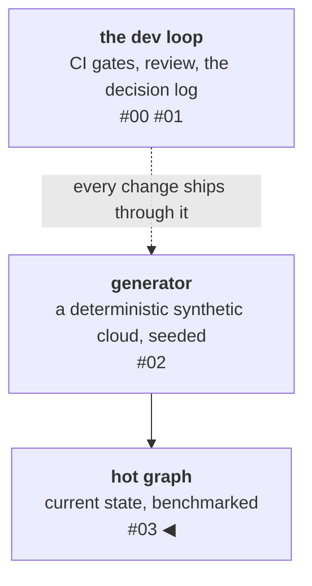

# The graph hot store: Memgraph vs Postgres

First things first: the responsible default is *not* to add a graph
database. It's another system to run and operate, and a plain
Postgres recursive query handles more traversal work than people tend
to assume. A graph store has to *earn* its place — which means the
first move isn't assuming it's faster, it's measuring whether it's
faster at all, on your actual workload. So I put the graph database and a plain Postgres recursive
query head-to-head on the same data. The first numbers said the graph
store was **40 times slower**. This post is about what I did next,
because the interesting part isn't the result — it's that the result
was a lie my own code was telling me, and the *shape* of the numbers
is what gave it away.

<!-- more -->

!!! info "The resgraph series"
    This is the fourth post about [**resgraph**](https://github.com/fespino/resgraph), a mini data platform
    I am building for learning purposes. Browse the
    repository exactly as it stood when this was written:
    [`phase-2-graph-store`](https://github.com/fespino/resgraph/tree/phase-2-graph-store).
    Snippets are copied from that tag, trimmed only for length; the
    addendum's snippets are current-HEAD and say so.

In this phase: the events get a home. The previous phase built a
deterministic generator that emits a realistic stream of
cloud-infrastructure events; this phase adds the **hot store**, the
component responsible for holding the *current* state of the world —
every resource, every dependency edge, updated as the stream arrives —
and for answering operational questions about it in interactive time:
"if this host dies, what's affected?" (blast radius), "why does A
depend on B?" (dependency path), "which resources lost a dependency
they require?" (orphans). It's the "now" half of the platform's
memory — a later phase adds the cold store, which remembers every
*past* state — and it's the substrate everything above will stand on:
the query layer plans against it, and the agents' tools ultimately
resolve to these traversals. This is where the platform stops being a
firehose and becomes something you can *ask questions of*, and where
a claim I'd taken on faith finally had to face a measurement.

The platform so far, with this post's piece highlighted:



## Why a graph store, and the claim under test

The data is a graph: VMs run on hosts, containers run on VMs, load
balancers route to things, each with a direction. D8 locks the
convention — edges point from *dependent* to *dependency* — because
getting the direction wrong is unfixable later without rewriting
every query. The blast radius of a host is then just "everything with
a directed path *to* it." In a graph database that's a single
traversal. In a relational database it's a recursive
common-table-expression that joins a table to itself, one level per
hop — and it's short enough to show whole:

```python
# benchmarks/traversal_bench.py
CTE = """
WITH RECURSIVE br(src, depth) AS (
  SELECT src, 1 FROM edges WHERE dst = %s
  UNION
  SELECT e.src, br.depth + 1 FROM edges e JOIN br ON e.dst = br.src
  WHERE br.depth < %s
)
SELECT count(DISTINCT src) FROM br
"""
```

The design decision to use a graph store (Memgraph, D1) had been made
on paper, with a recorded justification. But part of that
justification leaned on traversal performance — and if that's a
reason for taking on a second database, it's a *claim* that owes
evidence, not an axiom you get to assume. The burden of proof is on
the graph store, so the comparison has to be fair to the thing you'd
otherwise reach for. Concretely, in the benchmark script: the
Postgres `edges` table gets an index on the target column and fresh
statistics (`CREATE INDEX ON edges (dst)`; `ANALYZE edges`), and the
CTE uses `UNION`, not `UNION ALL` — dedup during recursion is the
semantics-fair equivalent of the graph side's `DISTINCT`; `UNION ALL`
would inflate Postgres's work and flatter the graph store. "Was the
SQL side even indexed?" is the first question a comparison like this
gets asked, so the answer is in the repo, not the comments.

Both stores load the *same* seeded world — identical graphs, because
the generator is deterministic — and run the same blast-radius
question: depth 3 and depth 5, twenty targets (ten hubs, ten leaves)
× five runs, on worlds of 10,000 and 100,000 resources.

## The result that didn't make sense

| World | Store | Depth | p50 |
|---|---|---|---|
| 100k | Memgraph | 3 | **17.5 ms** |
| 100k | Postgres CTE | 3 | 0.4 ms |
| 100k | Memgraph | 5 | 17.8 ms |
| 100k | Postgres CTE | 5 | 0.4 ms |

That's forty times slower. In a hurry, I'd have shrugged, written
"Postgres wins at this scale, interesting," and moved on — a
defensible conclusion, and completely wrong. One number in that
table says so.

## The tell was in the shape, not the size

Look at the two Memgraph rows: **17.5 ms at depth 3, 17.8 ms at
depth 5.** Going from a 3-hop traversal to a 5-hop traversal —
meaningfully more graph to walk — cost basically nothing. That's not
what a traversal cost looks like. If the traversal were the expensive
part, deeper would be slower. The flatness meant the traversal was
*cheap*, and something **constant** — paid once per query regardless
of depth — was eating the 17 milliseconds.

That observation is the whole post. A benchmark doesn't just produce
a number; it produces a *shape*, and the shape carries information
the headline number hides. A slower-than-expected result that's also
suspiciously *flat* is not "the graph database is slow." It's "you're
measuring something other than the graph database."

## Isolating the constant with two cheap probes

I didn't guess. I measured two more things, each a few lines:

- A trivial query (`RETURN 1`) measures the pure round-trip floor:
  **0.27 ms.** So the Bolt protocol overhead is negligible; that's
  not it.
- A single node lookup by ID (`MATCH (n {id: $id})`) measures
  *finding the starting point of the traversal*, before any walking
  happens: **9.4 ms.**

There it was. Just *locating the anchor node* cost 9.4 milliseconds
on a 100k-node graph. That's not a lookup; that's a full scan. The
database was reading every node to find the one I asked for.

The cause was a decision from the graph-modeling phase. D8 gives each
resource type its own label and its own index (`:host(id)`,
`:vm(id)`, …), because per-type indexes give the query planner
selectivity — the rejected alternative was a generic `:Resource`
label with a `type` property, one index, every query paying a filter.
Good decision — but it only pays off *if the query names the label*.
My blast-radius query anchored on a label-less pattern, "the node
with this id, whatever type it is." With no label, the per-label
index is unusable, so the database falls back to scanning. I had
silently reintroduced the exact full-scan cost the per-type-index
decision was supposed to eliminate.

The fix derives the label from the id prefix (ids are
`<type>-<counter>`) and names it in the query — and the measurement
lives in the helper's docstring, so the next reader gets the number
that justifies it:

```python
# src/resgraph/graph/queries.py
def _label(resource_id: str) -> str:
    """The anchor label, derived from the id prefix (ids are
    ``<type>-<counter>``). This is load-bearing, not cosmetic: per D8 the
    id index is per-label (``:host(id)``), so a label-less anchor match
    forces a full node scan — measured at 9.4ms vs 0.31ms indexed on a
    100k world (BENCHMARKS.md). Validating against the known type set is
    also the injection guard, since the label lands in the query string."""
    prefix = resource_id.split("-", 1)[0]
    if prefix not in _LABELS:
        raise ValueError(f"cannot derive resource type from id: {resource_id!r}")
    return prefix
```

Note the second job that validation does: the label can't be a query
parameter, it lands in the query string — so checking it against the
closed set of known types is also the injection guard. Depth gets the
same treatment (`int()` plus a `1..6` range check, since Cypher can't
parametrize variable-length bounds), and both guards have tests that
feed them crafted input. The anchored query, assembled from the
guarded parts:

```python
# src/resgraph/graph/queries.py (blast_radius)
depth = _check_depth(depth)
anchor = _label(resource_id)
rows = cypher(
    session,
    f"""
    MATCH (x:{anchor} {{id: $id}})<-[{DEP_EDGES} *BFS 1..{depth}]-(dep)
    {where}
    RETURN DISTINCT dep.id AS id, labels(dep)[0] AS type, dep.phantom AS phantom
    """,
    id=resource_id,
)
```

The one-line fix had a dramatic effect:

| Operation | Before | After |
|---|---|---|
| Anchor lookup | 9.4 ms | 0.31 ms |
| Whole blast-radius query | 17.5 ms | **0.2 ms** |

One loose end, accounted for rather than glossed: the anchor probe
explains 9.4 of the 17.5 milliseconds directly, yet naming the label
removed all of it. The plan evidently paid the label-less scan more
than once per query; I didn't chase down exactly where the second
payment lived, because the fix eliminated the whole constant and the
probes had already identified its kind. If the two numbers had *not*
reconciled after the fix, that gap would have been the next thing to
measure.

## The result: it's a tie

With the query actually using the index, here's the comparison
(matching the table of record in BENCHMARKS.md):

| World | Store | Depth | p50 |
|---|---|---|---|
| 100k | Memgraph | 3 | 0.2 ms |
| 100k | Postgres CTE | 3 | 0.2 ms |
| 100k | Memgraph | 5 | 0.2 ms |
| 100k | Postgres CTE | 5 | 0.2 ms |

The CTE's 0.4 in the first table against 0.2 here is run-to-run
jitter — at these magnitudes the difference between runs is bigger
than the difference between stores, which is itself the finding. Both
run sub-millisecond. The result is not a 40× graph loss and not the
comfortable graph win I originally expected — it is a **tie**. The
story the data actually tells
is: at laptop scale, with worlds that fit in memory and blast radii
of a few dozen nodes (≤36 at this seed), neither the graph's
pointer-chasing nor the relational engine's join-per-level is
stressed. The expected divergence — where graph stores pull ahead on
deep traversals over hub-heavy nodes — needs bigger worlds, deeper
queries, or higher fan-out than a 100k-resource fixture provides.

That is a more useful conclusion than either the wrong "Postgres
wins" or the biased "graph wins," and it forced a correction
upstream, in the decision log: D1 now stands
on the reasons the benchmark *does* support — in-memory footprint,
instant startup for test cycles, and the fact that the query language
and driver transfer to other graph databases — and explicitly *not*
on "traversal supremacy," which this scale can't demonstrate. The
reversal condition on that decision is now backed by data instead of
assumption. The D4 traversal budget (p95 < 50 ms at depth ≤3 on a
100k world) is validated with ~125× headroom — no supersession
needed this time; the target holds.

At this scale, a recursive CTE over an indexed edge table would do
the job — the graph store isn't earning its keep on traversal speed.
I'm keeping it for the non-speed reasons above, and because later
phases lean on graph-native operations (variable-depth traversals,
path queries, algorithms) that get awkward in SQL. That's a bet on
future workload, not a settled win. If those phases don't
materialize, dropping the graph store is the recorded reversal path,
and the decision log says so.

## A smaller lesson hiding in the test suite

One more measure-don't-assume moment. The blast-radius result must be
a *set* of affected nodes, not a *count of paths* — multiple paths
can reach the same dependent, and counting paths instead of nodes is
a classic wrong-metric bug. I wanted a regression test pinning that
distinction, so I needed a case where one node is reachable by two
paths.

I went looking for one in the fixture world and there wasn't a clean
one — at that seed, no load balancer happened to route to two things
on the same host. I only found that out by checking. So the test
constructs its diamond explicitly, and then asserts *both* metrics —
the right one and the wrong one — so the difference is pinned, not
implied:

```python
# tests/test_graph_integration.py
session.run(
    """
    CREATE (h:host {id: 'host-zz0', deleted: false})
    CREATE (v1:vm {id: 'vm-zz1', deleted: false})-[:RUNS_ON]->(h)
    CREATE (v2:vm {id: 'vm-zz2', deleted: false})-[:RUNS_ON]->(h)
    CREATE (l:lb {id: 'lb-zz3', deleted: false})
    CREATE (l)-[:ROUTES_TO]->(v1)
    CREATE (l)-[:ROUTES_TO]->(v2)
    """
).consume()
ids = [a.id for a in queries.blast_radius(session, "host-zz0", depth=3)]
assert ids == ["lb-zz3", "vm-zz1", "vm-zz2"]  # a set: lb once
path_rows = cypher(
    session,
    f"""
    MATCH (x:host {{id: 'host-zz0'}})<-[{queries.DEP_EDGES} *1..3]-(dep)
    RETURN dep.id AS id
""",
)
assert len(path_rows) == 4  # v1, v2, and the lb TWICE — a path count
```

Even "surely the random world contains this obvious pattern" is an
assumption to measure before you build a test on it.

## Addendum, three phases later: the impossible path

This section was added after publication, when the store produced
the failure it documents. One day CI started failing with a
dependency path that ended at the wrong node:

```
path=['container-000001', 'vm-000047', 'container-000001']
```

Read that carefully: the query pattern *requires* every match to end
at the target (`MATCH p = (a)-[…]->(b:host {id: $b})`), so a returned
path ending anywhere else isn't a wrong answer — it's semantically
impossible output. That distinction set the debugging strategy: stop
suspecting the golden data or the query, and make the store prove
itself at the boundary. The first move was a guard in
`dependency_path` that validates the returned path's endpoints and
raises with the **whole** path — the assertion diff had shown only
two elements; the guard's first catch delivered the line above, which
says the topology and edges were right and only the terminal node's
id was wrong. The guard is permanent; here it is at current HEAD:

```python
# src/resgraph/graph/queries.py (current)
p = PathResult(**rows[0])
# A legal match starts at `a` and ends at `b`; anything else is
# malformed store output — raise with the full path (issue #36).
if p.path[:1] != [from_id] or p.path[-1:] != [to_id] or len(p.rels) != len(p.path) - 1:
    raise RuntimeError(
        f"store returned a malformed path for {from_id!r} -> {to_id!r}: "
        f"path={p.path} rels={p.rels} (issue #36)"
    )
```

The bisection that followed killed every comfortable hypothesis in
order. The architecture hypothesis (CI is amd64, the laptop arm64)
died first, because the failure reproduced locally. The
store-version hypothesis died next, because 3.11.0 and 3.12.0 are
both affected. The trigger turned out to be state, not platform: a **fresh
store instance** that loads a world, bulk-deletes it, and loads
another. In that state the exact query text fails deterministically
while a semantically identical rephrasing succeeds — and `FREE
MEMORY`, which forces storage garbage collection, makes it vanish
(51/51 across fresh-container suite runs that previously failed every
time). Deleted-but-uncollected vertices from the wiped world were
getting bound into path materialization.

The fix is a `wipe()` helper at every full-wipe call site — all of
which are test fixtures and benchmarks; the ingest never bulk-deletes:

```python
# src/resgraph/graph/schema.py (current)
def wipe(session: Session) -> None:
    """Delete everything, then force storage GC. Without the GC pass,
    BFS paths can bind deleted-but-uncollected vertices (issue #36)."""
    session.run("MATCH (n) DETACH DELETE n").consume()
    session.run("FREE MEMORY").consume()
```

The upstream report is tracked in
[#36](https://github.com/fespino/resgraph/issues/36). Two lessons
from it: when output is *impossible* rather than
wrong, instrument the boundary instead of debugging your own code —
and a guard that dumps the entire artifact turns a flaky assertion
into a one-shot diagnostic.

## What I'd take to the next project

- **Read the shape, not just the number.** A flat curve where you
  expected a rising one is a louder signal than the magnitude of the
  number itself. The 40× was noise; the 17.5-vs-17.8 flatness was the
  finding.
- **Isolate before you optimize.** Two throwaway probes — a
  round-trip floor and an anchor lookup — turned "the graph database
  is slow" into "my query doesn't use the index." Neither took more
  than a minute to write.
- **A benchmark can correct a design decision's *rationale*, not just
  its score.** The graph-store choice survived, but the reasons for
  it changed. Letting the measurement rewrite the justification —
  including reporting the tie you didn't expect — is the whole point
  of running it.

The graph store now holds the world and answers questions about it in
a fifth of a millisecond. Next in this thread: the cold-history half
of the story — snapshotting this same world to an Iceberg store so
you can ask those questions not just about *now* but about any point
in the past. That phase isn't built yet, so that post comes when the
numbers do.
