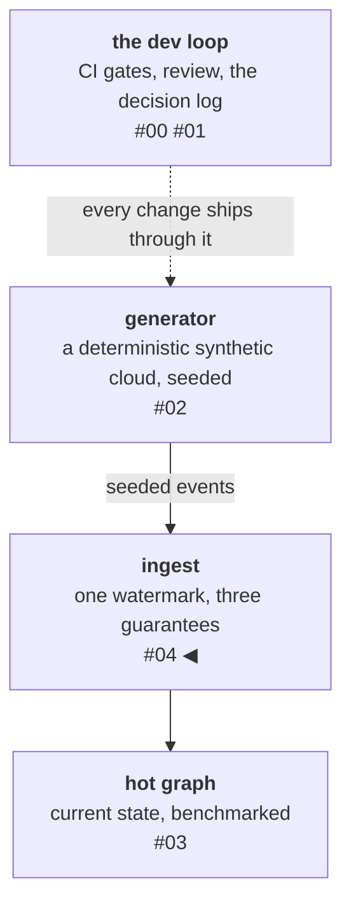

# One watermark, three guarantees

Every streaming pipeline faces the same three demons: messages arrive
more than once, messages arrive out of order, and consumers crash
mid-batch. The standard advice is old and correct: don't chase
exactly-once delivery — **make the consumer idempotent and let the
store own the guarantee.** This post is about how little machinery
that takes when you commit to it fully.

<!-- more -->

!!! info "The resgraph series"
    This is the fifth post about [**resgraph**](https://github.com/fespino/resgraph), a mini data platform I
    am building for learning purposes. Browse the
    repository exactly as it stood when this was written:
    [`phase-3-ingest`](https://github.com/fespino/resgraph/tree/phase-3-ingest).
    Every snippet below is copied from that tag, trimmed only for
    length.

In this phase: the loop closes. The generator emits a stream of
infrastructure updates; the graph store answers traversal questions
about the world's current state; until now, nothing connected them
continuously — the loader bulk-loads a snapshot and refuses anything
else. Now a consumer reads the update stream
and applies each message into the graph store, correctly, no matter
how delivery misbehaves. It's the phase where the platform's central
reliability claim stops being design prose and becomes a test suite.

The platform so far, with this post's piece highlighted:



The whole kit, one entry per section:

- **`applied_seq`, one integer per resource** — the watermark:
  replays and stale arrivals become no-ops.
- **Two message-shape rules** — upserts replace and tombstones carry
  no payload, so the final state is a pure function of the
  highest-sequence message.
- **The transport contract** — dangling edges become flagged
  phantoms, so cross-resource reordering cannot fail the apply and
  the window stays visible.
- **Property tests** — random arrival order plus full replay against
  an oracle, so convergence is proven, not asserted.
- **The crash test** — at-least-once delivery, exactly-once state,
  demonstrated.
- **The batch benchmark** — 760 → 12,500 updates per second, because
  a profile disagreed with the code I'd written.

## The rule, and what it buys

Each resource node in the store carries `applied_seq` — the sequence
number of the last message applied to it, a high-water mark in the
replication-log sense (no relation to the event-time watermarks of
stream processors). The whole ingest reduces to one rule, and it fits
in one function — the watermark check and the write share a single
transaction:

```python
# src/resgraph/graph/ingest.py
def _apply(tx, msg: UpdateMessage, label: str) -> bool:
    rec = tx.run(
        f"MATCH (n:{label} {{id: $id}}) RETURN n.applied_seq AS s", id=msg.resource_id
    ).single()
    current = rec["s"] if rec and rec["s"] is not None else -1
    if msg.sequence <= current:  # strict watermark: stale or replayed
        return False
    if msg.op is Op.UPSERT:
        _write_upsert(tx, msg, label)
    else:
        _write_tombstone(tx, msg, label)
    return True
```

Three guarantees fall out:

1. **Replays are no-ops.** A redelivered message has a sequence the
   node has already seen; the watermark skips it. At-least-once
   delivery becomes safe by default.
2. **Out-of-order within a resource is safe.** A stale message
   arriving late has a lower sequence than the node's watermark, so
   it is skipped.
3. **Deletes are survivable.** A delete writes a *tombstone* — the
   node stays, flagged `deleted`, payload cleared — so a later,
   higher-sequence upsert can revive it. Removal would make "delete
   then late-arriving update" unrecoverable.

All three compress to one sentence: the final state of a resource is
a pure function of its **single highest-sequence message**. Arrival
order stops mattering. That property has a name in the test suite —
convergence — and it's the anchor for everything else in this post.

One precondition carries all of it: **a single producer assigns
each resource's sequences, monotonically.** That's free here — one deterministic generator owns
the stream — but it is not a small assumption. In multi-writer
systems, sequence assignment is where the hard coordination lives
(producer epochs, fencing tokens), and a watermark alone can't
arbitrate between two writers that each believe their numbering.
Multi-writer sequencing is out of scope for this phase and tracked as
its own iteration
([#31](https://github.com/fespino/resgraph/issues/31)).

## Two ends of the stream, two contracts

The generator guarantees — and
[its property suite asserts](02-a-deterministic-synthetic-cloud.md) —
that every relationship target is **alive at emit time, in world
order**. It is tempting to conclude the consumer may rely on that.
It must not, because the two ends of the stream hold different
contracts:

- **The generator's guarantee** holds in *world order*: at the
  moment a message is emitted, its relationship targets exist.
- **The consumer's view** is the stream *after transport* —
  batching, consumer groups, retries — where the only ordering
  guarantee is **per-resource** (D2). Global order does not survive.

In plain terms: the stream is mail from many senders. Each sender's
own letters arrive in the order they were written — that is the
per-resource guarantee — but letters from *different* senders
interleave however delivery happens to shake out. So a letter that
says "about the package I sent you" can land before the package
does, even though nobody wrote anything out of order. The generator
writes in a consistent world; the consumer reads in whatever order
the mail arrived.

Concretely: a `vm → runs_on → host-000009` edge can reach the
consumer *before* `host-000009`'s create (cross-resource
reordering) or *after* its delete (the vm's message was emitted
while the host lived; the delete overtook it in transport).

This is why the ingest must tolerate dangling edges (D3, the
hot-store ingest contract) rather than enforce referential
integrity at apply time. The tolerance is a mechanism, not a
policy: an edge to an unknown target `MERGE`s a placeholder node
instead of failing the apply:

```python
# src/resgraph/graph/ingest.py (_write_upsert)
tx.run(
    f"""
    MATCH (s:{label} {{id: $sid}})
    MERGE (t:{label_for(rel.target_id)} {{id: $tid}})
      ON CREATE SET t.phantom = true
    MERGE (s)-[:{rel_type}]->(t)
    """,
    sid=msg.resource_id,
    tid=rel.target_id,
).consume()
```

The edge-before-create case has its own named test: the edge
arrives first, the placeholder appears flagged, and the target's
own upsert later clears the flag with the edge surviving:

```python
# tests/test_ingest_properties.py
def test_dangling_target_becomes_phantom_then_resolves(session):
    _reset(session)
    ingest.apply_message(session, _upsert(1, {}, [("runs_on", TARGETS[0])]))
    tgt = ingest.read_node(session, TARGETS[0])
    assert tgt is not None and tgt["phantom"] is True  # created, not dropped
    # the target's own upsert clears the phantom flag; the edge survives
    ...  # host_upsert: the target's own create, sequence 2
    ingest.apply_message(session, host_upsert)
    assert ingest.read_node(session, TARGETS[0])["phantom"] is False
    assert ("RUNS_ON", TARGETS[0]) in ingest.read_node(session, SOURCE)["rels"]
```

The flag is queryable, so a phantom is visible downstream rather
than laundered into a real node.

The generator's guarantee and the consumer's assumption are
different contracts, and conflating them — "the producer validates,
so the consumer can trust" — is a classic distributed-systems
mistake: expecting *causal* delivery from a transport that grants
only *FIFO per key*, two different grades on the standard ordering
ladder (FIFO per channel, causal, total). The same gap is why
change-data-capture consumers hit foreign-key violations their
source database never had.

Seen from the consumer, this is eventual consistency with the
window made visible: each single resource is strongly ordered — the
watermark makes its state exactly the highest-sequence message seen
so far — while the *cross-resource* view, where referential
integrity lives, only converges once the stream drains. The phantom
flag is what the "eventual" part looks like while you are still
inside it.

Producer-side validation constrains what is *said*; transport
decides what is *heard*, and in which order.

## Tests first, and what the oracle forced

This phase inverted the usual order: the property tests were written
and running (red) before the apply path existed. The centerpiece
generates a random message history for a resource, applies it in a
*random permutation*, replays the whole history again, and asserts
the store landed on the state implied by the highest-sequence
message — for dozens of generated cases, against a live database:

```python
# tests/test_ingest_properties.py
@settings(max_examples=40, deadline=None)
@given(spec=_events_and_order())
def test_apply_is_order_independent_and_idempotent(session, spec):
    """Convergence: any arrival order, plus a full replay, lands on the
    state implied by the single highest-sequence message."""
    events, order = spec
    _reset(session)
    expected = _expected(events[-1])  # highest sequence == last built

    for i in order:
        ingest.apply_message(session, events[i])
    _assert_state(session, expected)

    # replay the entire history in canonical order — must change nothing
    for m in events:
        assert ingest.apply_message(session, m) is False
    _assert_state(session, expected)
```

The oracle `_expected` is the property stated as code — it looks at
*only* the final message and ignores the rest of the history, because
that's exactly what convergence claims the store will do.

Writing that oracle did something I didn't expect: it **dictated the
write semantics**. Two rules the spec had never stated turned out to
be load-bearing:

- **An upsert replaces the attribute bag; it never merges.** Merge
  looks harmless until you reorder: a stale key from an
  earlier-applied update survives under one arrival order and not
  another. Convergence dies.
- **A tombstone carries no payload.** If a delete left the previous
  attributes in place, the surviving attributes would depend on
  *which* upsert happened to land before the delete. Order-dependent
  again.

Neither rule came from foresight. Both came from asking "what would
make the oracle fail?" — the test designed the code. They're now a
spec decision (D10, apply-time state semantics) with the rejected
alternative and the reversal condition — rules that convergence
*requires* belong in the log, not a comment:

```markdown
**Rejected:** attr-merge on upsert — cheaper writes, but forfeits
convergence, which is the whole reason the watermark exists.
**Reversal condition:** if a producer is ever allowed to send partial
attr updates (a diff, not a statement), this decision is superseded and
the watermark alone no longer guarantees convergence — a per-field
version would be needed.
```

A post-implementation review caught a third gap the tests had missed:
message attributes share the node's property namespace with the
store's own fields (`deleted`, `applied_seq`, …), so an attribute
literally named `deleted` would be silently overwritten on write and
stripped on read. Silent is the problem — that's now a parse-time
rejection (same posture as D2's strict parsing: a colliding attr is a
producer bug), and the property tests check the `phantom` flag they'd
previously ignored. D10 also records the rejected fix — namespacing
the store's own properties as `_rg_*` — because every query and index
would pay a rename to protect a producer that's already violating the
contract. A reviewer with fresh eyes is a different kind of property
test.

## The consumer: recovery is not a special case

The consumer reads the stream through a consumer group and follows
one ordering discipline: **acknowledge strictly after the apply
transaction commits.** The whole discipline is visible in the batch
loop's last lines:

```python
# src/resgraph/graph/consumer.py
applied, skipped = apply_batch(self.session, msgs)
counters["applied"] += applied
counters["skipped"] += skipped
# ack strictly after the batch committed: crash before this line
# redelivers the batch, and the watermark skips it — at-least-once
# delivery, exactly-once state.
self.r.xack(self.stream, self.group, *to_ack)
```

This is the store-your-progress-with-your-data pattern: the marker
that matters — the watermark — lives in the same store as the data
and commits in the same transaction, so there is no window where the
data and the progress disagree. The stream-side acknowledgment is
just cleanup; losing it costs a redelivery, never a corruption. Crash
between apply and ack, and the batch is redelivered on restart —
where the watermark skips everything already applied. On startup, the
consumer drains its own unacknowledged entries before asking for new
ones, so resuming from a crash is the same code path as running
normally. There is no recovery mode and no repair script.

Two smaller calls round out the consumer. The consumer group is
created at stream position `0`, not `$` — a group
created *after* the producer started still sees every entry, and the
watermark makes the overlap harmless, so erring toward re-reading is
free. And **poison entries** — payloads that fail message
validation — are counted, logged, and acknowledged rather than
retried: an unparseable entry would otherwise be redelivered forever
and wedge the stream. The whole poison path is a `try/except` in the
batch loop — count, log, and ack anyway:

```python
# src/resgraph/graph/consumer.py (_apply_batch)
try:
    msgs.append(UpdateMessage.model_validate_json(fields[b"data"]))
except (ValidationError, KeyError) as e:
    counters["invalid"] += 1
    log.warning("poison entry %s acked and dropped: %s", entry_id, e)
to_ack.append(entry_id)
```

The generator provably emits valid messages
(the previous phases made sure of it), so a nonzero poison count
means transport corruption or a foreign producer — and the
consumer's docstring names a dead-letter stream as the production
evolution if that ever happens.

The integration test is the claim made executable — its name is the
acceptance criterion from the phase issue:

```python
# tests/test_consumer_integration.py
def test_crash_between_apply_and_ack_no_gap_no_double_apply(redis_client, clean_store, stream):
    """The acceptance criterion: deliver a batch, apply part of it, crash
    before ANY ack. Restarting the same consumer must redeliver all of it,
    apply exactly the unapplied remainder, and leave nothing pending."""
    msgs = _messages(n_churn=40)
    _publish(stream, msgs)
    # deliver everything to c1's pending list, then "crash": apply only
    # the first 30 messages, ack nothing.
    delivered = redis_client.xreadgroup(group, name, {stream: ">"}, count=len(msgs))
    for m in msgs[:30]:
        ingest.apply_message(clean_store, m)
    # restart: same consumer name resumes its own pending entries first
    consumer = Consumer(REDIS_URL, clean_store, stream=stream, group=group, name=name)
```

Everything is redelivered, exactly the thirty are skipped, nothing is
left pending, and the store matches the oracle. **At-least-once
delivery, exactly-once state** — and the consumer never has to be
careful, because the apply path already is.

## The benchmark: a suspicion, filed in advance

This benchmark started before any measurement existed. When the
apply path was first reviewed, its shape — one watermark read, one
property write, one edge clear, plus one round trip *per
relationship*, per message — looked like an obvious throughput
problem. So the suspicion was **filed publicly before measuring**: a
PR comment with the candidate fixes and an explicit "measure first"
note — a hunch turned into a falsifiable prediction with a
timestamp.

The first measurement came in at **760 updates per second**, 26×
under the budget.
The profile confirmed the suspicion with numbers the guess could
never have produced: 23,445 driver statements for 5,000 messages —
six to seven sequential round trips per message once transaction
begin/commit overhead is counted — and **~80% of wall time inside the
driver's receive path, over a third of it raw socket wait** in
`socket.recv_into`. The rest of that 80% is the driver buffering and
parsing responses it had to wait for. Nothing here measured the
server side, but the client-side split is damning enough: the
database was most likely idle between statements. The *conversation*
was the bottleneck, not the work.

The fix stayed inside the proven semantics: batch messages into one
transaction, group every write into per-label bulk statements, and
resolve intra-batch siblings in Python by keeping each resource's
highest-sequence message — the same verdict the watermark would
return, one round trip earlier:

```python
# src/resgraph/graph/ingest.py (_apply_batch_tx)
# Highest sequence per resource wins — the watermark's verdict for
# intra-batch siblings, computed in Python (convergence makes the
# outcome identical to applying them one by one).
best: dict[str, UpdateMessage] = {}
for m in msgs:
    cur = best.get(m.resource_id)
    if cur is None or m.sequence > cur.sequence:
        best[m.resource_id] = m
skipped = len(msgs) - len(best)
```

Convergence is exactly what makes
that shortcut legal, and a new property test pins it — batched apply
must equal one-by-one apply for any arrival order *and any batch
boundaries*:

```python
@settings(max_examples=40, deadline=None)
@given(spec=_events_order_and_batching())
def test_apply_batch_is_equivalent_to_one_by_one(session, spec):
    events, batches = spec
    _reset(session)
    expected = _expected(events[-1])
    applied = skipped = 0
    for batch in batches:
        a, s = ingest.apply_batch(session, batch)
        applied += a
        skipped += s
    assert applied + skipped == len(events)  # every message accounted for
    _assert_state(session, expected)
    # a full batched replay must be all-skipped and change nothing
    a, s = ingest.apply_batch(session, events)
    assert (a, s) == (0, len(events))
```

The batched path issues about 27 statements per batch instead of
~1,700.

| Path | Messages | updates/s | Peak RSS |
|---|---|---|---|
| per-message apply | 5k | **760** | 79 MB |
| batched, batch 256 | 100k | 9,600 | 76 MB |
| batched, batch 1024 (median of 3) | 100k | **12,500** | 78–80 MB |
| batched, batch 2048 | 100k | 11,000 | 82 MB |
| batched, 1024, longer run | 200k | 10,500 | 80 MB |

Two details in that table matter. Batch 1024 is the sweet
spot, and **2048 regresses despite doing fewer writes** — bigger
per-statement payloads cost more than the saved writes return.
Batching has a knee, not a monotonic payoff; the sweep is what finds
it, and the finding lives where the next reader needs it — as the
comment on the consumer's default (`batch: int = 1024` — "measured as
the throughput sweet spot; 2048 regresses, BENCHMARKS.md"). And the
1024 row is a median of three runs that spanned 11.7k to 14.4k —
reporting the median instead of the best run is a small discipline
that keeps the whole table trustworthy.

## Closing the budget, in both directions

The performance budget for the ingest had two rows, written before
any of this existed. They closed in opposite ways:

- **Memory ceiling (< 512 MB): validated with ~6× headroom.** Peak
  RSS 82 MB, flat across run lengths — the consumer holds one batch,
  never the stream.
- **Throughput (≥ 20k updates/s): missed at ~12.5k, and amended by
  supersession.** The algorithmic bottleneck is found and fixed; what
  remains is the store executing writes, on a laptop running both
  stores, with message validation deliberately kept on — the same
  call the generator phase made and for the same reason. The budget
  now reads ≥10k sustained single-consumer on laptop hardware, with
  the reasons recorded and the 20k figure retired, not edited away.
  Consumer-group parallelism is the recorded scale-out lever if a
  future phase needs more — recorded, not proven. Concurrent
  consumers race on the watermark's read-then-write; the
  conflict-abort-and-retry story that should make that safe has no
  test yet, and an untested argument is a claim in waiting
  ([#32](https://github.com/fespino/resgraph/issues/32)).

## A side-scar: an open port is not a ready server

Every store-touching test suddenly died at the connection
handshake — in a
setup that had been green for weeks. The readiness check was `nc -z`,
a TCP connect against the published Docker port. But that port
answers as soon as the *proxy* exists, before the server inside the
container is serving anything. One slow container start and the check
waved through a half-started database. The fix is that readiness
probes must speak the protocol: the check is now a driver-level
handshake that retries until the server responds, and fails the job
loudly if it never does:

```yaml
# .github/workflows/ci.yml
run: |
  docker compose up -d memgraph redis
  bolt="import neo4j; d = neo4j.GraphDatabase.driver('bolt://localhost:7687'); d.verify_connectivity(); d.close()"
  for i in $(seq 1 60); do
    uv run python -c "$bolt" 2>/dev/null && exit 0
    sleep 1
  done
  echo "stores did not become ready in 60s" >&2
  exit 1
```

**An open port is a fact about the proxy, not the service.**

## What I'd take to the next project

- **Write the oracle before the code.** The convergence test didn't
  just verify the apply path — it *derived* the write semantics
  (replace-don't-merge, payload-free tombstones). When a correctness
  property dictates design decisions, you've found the right
  property.
- **File performance suspicions publicly, before measuring.** The PR
  comment turned a hunch into a falsifiable prediction with a
  timestamp. The profile then confirmed it — but if it hadn't, the
  correction would be on the record too. Either outcome beats a
  silent guess.
- **Make the store immune, not the pipeline careful.** Every
  guarantee in this phase lives in one transactional rule at the
  write path. The consumer, the retries, the crashes — none of them
  need to be smart, and the tests for them are short because of it.
- **The producer's guarantee is not the consumer's contract.**
  Transport promises only per-key FIFO, so design the consumer for
  what is *heard*, not what was *said* — tolerate the dangling edge,
  flag it, and let convergence close the window.
- **Sweep, don't extrapolate.** "Bigger batches are better" was true
  until 1024 and false at 2048. The knee only shows up if you measure
  past where you expect to stop.

The platform now runs end to end: generator → stream → consumer →
graph store, with traversal queries on top and every reliability
claim under test. Next in this thread: the cold half of the story —
snapshotting the hot store into an Iceberg table so the same
questions can be asked about any point in the past. That phase isn't
built yet, so that post comes when the numbers do.
