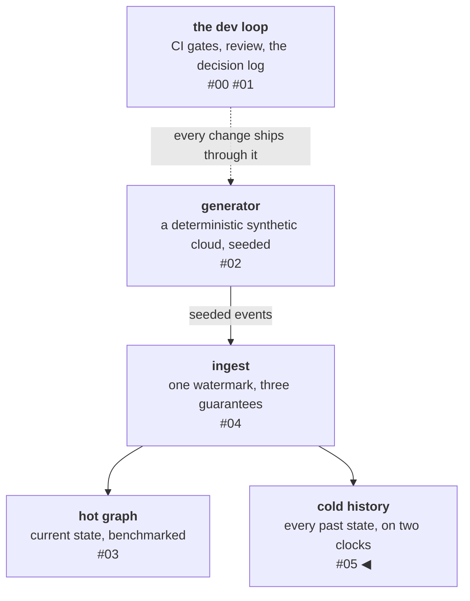

# Cold history: time travel runs on event time, not commit time

The hot store answers "what is affected *now*." Nothing, until this
phase, could answer "what was true at 14:03 last Tuesday" — and the
obvious shortcut is a trap. Iceberg ships with time travel built in,
and it is the wrong clock for the question: it answers *what had been
ingested when*, not *what was true in the world when*. The two drift
apart the first time you replay, backfill, or lag. This post is about
building the right clock on top of the wrong one — plus a benchmark
where the previous phase's tuning advice inverts exactly, and a
disaster-recovery drill whose first run failed on a case review had
missed.

<!-- more -->

!!! info "The resgraph series"
    This is the sixth post about
    [**resgraph**](https://github.com/fespino/resgraph), a mini data
    platform I am building for learning purposes. Browse
    the repository exactly as it stood when this was written:
    [`phase-4-cold-store`](https://github.com/fespino/resgraph/tree/phase-4-cold-store).
    Every snippet below is copied from that tag, trimmed only for
    length.

In this phase: the platform gets memory. The pipeline so far — a
deterministic generator streams infrastructure updates, a consumer
applies them idempotently into a graph store, traversals answer
blast-radius questions about the present. Now the same stream lands
in Apache Iceberg tables as durable history, and a query layer
reconstructs the world as of any moment. It also pays a debt — two
phases ago, tombstone garbage collection was deferred with the note
"the cold store holds history." Now it actually does.

The platform so far, with this post's piece highlighted:



!!! warning "Iceberg is overkill here"
    Apache Iceberg at this scale is overkill: a plain directory of
    parquet files would serve every query in this post. The choice is
    a learning decision more than an engineering requirement — I
    wanted hands-on time with the stack (the table format, the
    catalog, the engine interop), and it doubles as the exit path to
    a production shape. The spec records exactly that (D11), with a
    reversal condition that evicts the format if it never earns its
    costs.

## The shape: a log, and state as a view over it

The design is deliberately old-fashioned (D12). One append-only
`events` table holds every message the stream ever carried — one row
per D2 message, partitioned by `day(event_time)`, with `attrs` and
`relationships` riding as JSON strings so arbitrary keys stay
schema-stable:

```python
# src/resgraph/cold/store.py
# attrs/relationships ride as JSON strings: arbitrary attr keys stay
# schema-stable (D12).
EVENTS_SCHEMA = Schema(
    NestedField(1, "sequence", LongType(), required=True),
    NestedField(2, "event_time", TimestamptzType(), required=True),
    ...,
)

EVENTS_PARTITION = PartitionSpec(
    PartitionField(source_id=2, field_id=1000, transform=DayTransform(), name="event_day")
)
```

A second table holds periodic **state snapshots** — derived
purely from the events table, never from the hot store, so the cold
half can answer alone (deriving from the hot store would silently
couple the two stores' bugs). Reconstructing "the world at T" is a
checkpoint-plus-log read, and the whole algorithm is one SQL
statement:

```sql
-- src/resgraph/cold/queries.py (_STATE_SQL)
WITH delta AS (
    SELECT DISTINCT resource_id, resource_type, attrs, relationships, sequence, op
    FROM events
    WHERE event_time <= $t AND sequence > $wm
),
unioned AS (
    SELECT resource_id, resource_type, attrs, relationships, sequence, 'upsert' AS op
    FROM base
    UNION ALL
    SELECT * FROM delta
),
ranked AS (
    SELECT *, row_number() OVER (PARTITION BY resource_id ORDER BY sequence DESC) AS rn
    FROM unioned
)
SELECT resource_id, resource_type, attrs, relationships, sequence
FROM ranked
WHERE rn = 1 AND op = 'upsert'
ORDER BY resource_id
```

Read it bottom-up and it's the previous post's convergence property
as a query: `base` is the newest snapshot at or before T, `delta`
replays the events above its watermark, the window function lets the
highest sequence per resource win, and the final `op = 'upsert'`
filter makes deletes mean absence. That is the same shape the hot
store's own recovery uses, and the same shape databases have always
been underneath — the log is the truth, everything else is a view
that can be rebuilt from it. The canonical argument for that sentence
is Jay Kreps'
["The Log"](https://www.linkedin.com/blog/engineering/distributed-systems/log-what-every-software-engineer-should-know-about-real-time-datas-unifying);
this phase is a small working proof of it, with one deviation:
where Kafka unifies the subscribable log and the durable log,
this design splits them — the stream transports, the events table
remembers — which is why new consumers here bootstrap from the cold
store and then tail the stream, rather than replaying a topic from
offset zero.

Delivery is at-least-once and the writer stays deliberately dumb:
duplicate appends are legal, and readers dedupe on
`(resource_id, sequence)` — that's the `DISTINCT` in the `delta` CTE,
and it's correct because duplicate rows are *identical* by D2, so any
survivor is the right one. (D12 records the rejected alternative — an
`ingested_at` lineage column — precisely because a per-row wall-clock
would make duplicates non-identical and break this cheap dedupe.) A
crash between append and acknowledgment produces duplicate *rows* and
identical *answers* — the integration test asserts both halves of
that sentence, because the second without the first would be testing
nothing.

The cold consumer is a **second consumer group** on the same stream,
not a tee inside the hot ingest worker — D12 rejects the tee because
it couples the two stores' failure modes and progress, where separate
groups give each store independent position, replay, and crash
recovery for free. The accepted trade, also in D12: the stream is
bounded (`maxlen~`), so a cold consumer lagging
behind eviction loses history *silently* — where the tee would have
slowed the hot path instead. Gap detection (group position vs stream
head) is the mitigation if lag is ever plausible.

The whole stack runs in-process: pyiceberg with a SQLite-backed
catalog, a filesystem warehouse, DuckDB reading Arrow scans. It adds
zero new containers — this is the laptop shape of what would be S3
plus a REST catalog in production, with the table format and its
semantics carrying over unchanged.

!!! note "Update: the eviction notice expired unused"
    One phase later, D11's reversal condition was discharged with a
    test rather than quietly forgotten: a second engine — DuckDB's
    own Iceberg reader, no pyiceberg involved — reads the events
    table from its metadata file alone and, loaded with the repo's
    shipped SQL semantics, reproduces `state_at(T)` exactly,
    duplicates and all. The engine interop promised in the warning
    above is now a passing test instead of a claim.

## Two clocks

Iceberg's native time travel lets you query any table as of a past
snapshot. It is genuinely useful — physical isolation, rollback,
debugging what a job saw — and it is deliberately **not** this
platform's as-of API, because Iceberg snapshots are stamped in
*commit time*: the moment the ingest ran. The question users ask is
in *event time*: the moment the world changed.

While ingestion is perfectly live the two clocks agree, which is
exactly what makes the confusion dangerous. Replay a stream after an
outage and yesterday's world changes arrive in today's commits;
commit-time travel now assigns a day of history to the wrong moment.
The event-time answer stays correct throughout, because it comes from
the data — every row carries the world's own timestamp — rather than
from ingestion bookkeeping. D13 locks that in, and its rejected
alternative is the trap named exactly:

```markdown
**Rejected:** exposing Iceberg snapshot time travel as the as-of API —
correct only while ingestion is perfectly live; silently wrong the
first time history is replayed.
```

Event time carries its own caveat: an as-of answer is only as
complete as ingestion. Ask
about a very recent T while the cold consumer lags and the answer is
provisional — stragglers still in the stream will change it once they
land. Every event-time system has this completeness problem (it is
why stream processors grew their own notion of watermarks); this
platform's version is unusually tame — a single producer assigning
monotone sequences means an answer at T is final as soon as the
consumer's position passes T — but "check the consumer's lag before
trusting a fresh timestamp" is part of the query contract, not an
operational footnote.

## The benchmark: last phase's advice, inverted

The hot-store phase measured batch size 1,024 as its throughput sweet
spot, with 2,048 already regressing. The cold path is the mirror
image:

| Measure | N | Batch | Result |
|---|---|---|---|
| append | 200k | 1,024 | 24.3k events/s |
| append | 200k | 8,192 | **194k events/s** |
| append, sustained | 1M | 1,024 | **5,635 events/s** |
| append, sustained | 1M | 8,192 | **136.5k events/s** |
| `state_at` p50, snapshots on | 1M | — | 0.17–0.39 s |
| storage, data / total | 1M | 1,024 | 22.9 MB / **363.5 MB** |
| storage, data / total | 1M | 8,192 | 18 MB / **25 MB** |

At 200k events, batch 1,024 costs eight times the throughput of
8,192, because every batch is an Iceberg commit — a manifest write
and an atomic metadata swap — and commit overhead dominates small
appends. But the sweep number does not extrapolate, and the reason is
the sharper finding: run the same 1,024 configuration to a million
events and it degrades to 5,635 events/s — **24× slower** — because
each commit rewrites metadata that grows with the table's accumulated
snapshots and manifests. The small-batch tax is not a constant; it
compounds with table history. The same stream feeding two sinks has
opposite optima: the number that tuned the hot consumer would have
crippled the cold one, which is the argument for per-sink batch
knobs and for re-running sweeps at the scale you intend to operate.

The second finding is the storage column. The same million events
cost **363.5 MB** at batch 1,024 and **25 MB** at 8,192 — while the
parquet *data* is 18–23 MB either way (even that spread is the
small-files cost, in row-group form). Everything else is Iceberg
metadata, compounding across a thousand commits. Commit granularity
turned out to be a storage decision, not just a latency one.

The remedy carries a footnote: expiring old snapshots (every commit
is one) pruned the metadata log from 196 entries to 1 and freed
**zero** disk. Expiry shrinks what the query planner carries; deleting
orphaned files and compacting small ones is engine territory
(Spark/Trino), and the maintenance command's output states that
instead of implying otherwise.

For the first time in this project, every provisional budget survived
its measurement — append 13× over target, as-of latency 5×, storage
20×. After two phases of missed budgets amended by supersession, that
much headroom reads less like triumph and more like overcorrection:
the budgets were set timidly. Both directions of miscalibration are
now in the log.

## The rebuild drill and the resurrection bug

If the log is the truth and the hot store is a view, then destroying
the hot store should be a recoverable event — and that claim is only
real if you run the drill. `resgraph rebuild` reconstructs the graph
from cold history: world state at T becomes synthesized upserts
through the bulk loader, each carrying the resource's original
sequence, so every idempotency watermark survives the rebuild and a
resumed stream consumer skips replayed history instead of
re-applying it.

The first version of the drill test failed, and the cause was a gap
in the rebuild itself: rebuilding from *alive* state alone restores
watermarks only for the living. A resource deleted before T
has no node in the rebuilt store, no watermark — and when the resumed
stream redelivers one of its old upserts, the dead resource quietly
comes back to life. Resurrection by replay: state looks right, counts
look right, and a zombie walks the graph.

The fix reads the dead from the log too, and the query carries its
own reasoning — including the subtlety that made it interesting:

```python
# src/resgraph/cold/queries.py
def tombstones_at(catalog, t: datetime) -> list[dict]:
    """Resources whose last event at t is a delete — needed by rebuild:
    without them, redelivered pre-t upserts would resurrect the dead.
    Full event scan on purpose (no snapshot base): snapshots hold only
    alive rows, so a delete below the snapshot watermark would hide."""
```

It must *not* use the snapshot acceleration, because snapshots record
only alive resources — a delete below the snapshot's watermark would
be invisible to the fast path. The rebuild then replays those deletes
as tombstones through the normal ingest path, so the dead get their
watermarks back alongside the living:

```python
# src/resgraph/cold/rebuild.py
state = queries.state_at(catalog, t)
init_schema(session)
counts = load_snapshot(session, synthesize_upserts(state, t))
deletes = [
    UpdateMessage(
        sequence=d["sequence"],
        event_time=t,
        op="delete",
        resource_type=d["resource_type"],
        resource_id=d["resource_id"],
    )
    for d in queries.tombstones_at(catalog, t)
]
applied, _ = apply_batch(session, deletes)
```

The drill now proves the full loop: wipe the store, rebuild, verify
state and watermarks against the generator's oracle, attempt to
resurrect a dead resource (refused), resume the stream tail, land on
the same world.

## What I'd take to the next project

- **Ask which clock a "time travel" feature runs on.** Commit time
  and event time agree right up until replay, backfill, or lag — the
  moments you need history most are the moments they diverge.
- **Batch tuning does not transfer between sinks.** Measure each
  sink's knee; the previous component's sweet spot can be this one's
  worst case, and at small commits the cost shows up on disk as well
  as in throughput.
- **Run the destruction drill.** "The store is a rebuildable
  projection" was true-sounding prose until the drill failed on
  resurrected tombstones. The gap was invisible to review and obvious
  to the test — drills find what reviews don't.
- **State-only backups lose the dead.** Anything rebuilt from a
  snapshot of the living needs a separate answer for deletions, or
  replay will resurrect them. This generalizes well beyond graphs.

The platform now remembers. Ahead in the series: publishing this blog
properly, a query layer over both stores, and the agents the ground
truth was built for — each phase with its numbers, or it doesn't
ship.
