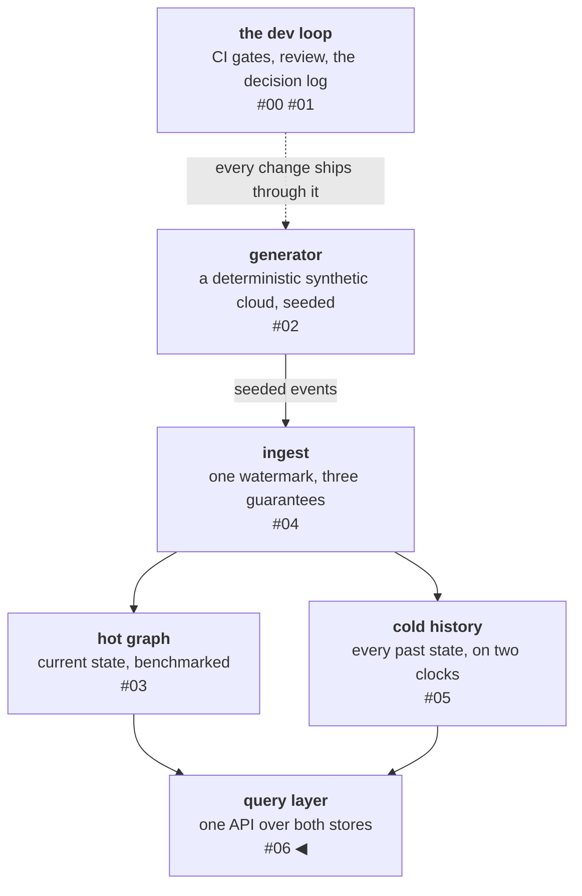

# The query layer: predicate and projection push-down across two stores

The platform now has two stores with nothing in common on the
surface: a graph store that speaks Cypher, answers in milliseconds,
and knows only the present — and an Iceberg/DuckDB cold store that
speaks SQL and holds the whole history, up to a consumer-lag behind
now.
The question users actually ask — *blast radius of this host, as of
last Tuesday* — fits neither store alone: it needs the graph's
traversal semantics applied to the cold store's history, and the
graph store doesn't have the history. This post is
about the thin layer that answers it — a filter DSL, a placement
table, and a lazy plan; the planner proper is under 200 lines, the
DSL and executor add another ~225. It is also about the embarrassing
part: I shipped predicate push-down with tests, benchmarks, and a
documentation page mapping it to the literature — while returning
every column from every scan. Reviewing the implementation against a
canonical text caught the gap — **projection push-down**, predicate
push-down's column-side sibling — and shipping it cut the headline
latency by a third (0.371 s → 0.250 s).

<!-- more -->

!!! info "The resgraph series"
    This is the seventh post about
    [**resgraph**](https://github.com/fespino/resgraph), a mini data
    platform I am building for learning purposes. Browse
    the repository exactly as it stood when this was written:
    [`phase-5-query-layer`](https://github.com/fespino/resgraph/tree/phase-5-query-layer).
    Every snippet below is copied from that tag, trimmed only for
    length.

In this phase: the data foundation closes. The pipeline so far — a
deterministic generator streams infrastructure updates, a consumer
applies them idempotently into a graph store, a cold store keeps the
full history in Iceberg, and event-time travel reconstructs the world
as of any moment. Now one HTTP surface covers both stores (D15) with
a mini planner behind it (D16), so a caller — or, next phase, an
agent — never has to know which store answers.

The platform so far, with this post's piece highlighted:



## The endpoint table is the budget

The API is a six-row endpoint table over five routes — the composite
is the blast-radius route with `?at=T`: current resource, live blast
radius, per-resource history, world-as-of-T, diff, and
blast-radius-as-of-T. Two alternatives were rejected in the decision
log (D15), and the rejections matter more than the endpoints. Raw
Cypher/SQL passthrough offers maximum power, but it couples every
caller to store choice and hands the coming agent phase an injection
surface instead of a tool surface. GraphQL's resolver flexibility is
precisely the unplanned query shape that result budgets exist to
prevent. A fixed
endpoint table *is* the budget — every list response caps at 1,000
rows and says so (`truncated`, `total_count`), and every executed
response carries `source: hot | cold | composite`, because the
previous post's two-clocks lesson doesn't stop applying at the HTTP
boundary: a caller must be able to tell which store, and therefore
which clock, produced an answer.

## The planner: a table lookup wearing engine vocabulary

The filter grammar is conjunctions only, and the parser refuses
everything else by name:

```python
# src/resgraph/query/dsl.py
if re.search(r"\bOR\b", text, re.IGNORECASE):
    raise ValueError("OR is not supported (D16: conjunctions only)")
if "(" in text or ")" in text:
    raise ValueError("grouping is not supported (D16: conjunctions only)")
preds = []
for term in (t.strip() for t in _AND.split(text.strip())):
    m = _TERM.match(term)
    if not m:
        raise ValueError(f"cannot parse filter term: {term!r}")
    value = _coerce(m["value"])
    op = m["op"]
    if op in ("<", "<=", ">", ">=") and isinstance(value, str):
        raise ValueError(f"ordering comparison needs a numeric value: {term!r}")
    preds.append(Predicate(m["field"], op, value))
```

`type=vm AND attrs.zone=z1 AND attrs.cpu>=4` parses once at the
boundary into typed predicates — parse, don't validate, the same
posture as the message schema in post 01: downstream code only ever
sees well-formed `Predicate` objects.

Planning is then a placement decision per predicate, and the
placement table is two lines — with the set of known attribute fields
*derived* from the generator's own attribute pools, the same
table-is-code discipline the spec has used since the topology table,
so placement cannot drift from the world's actual schema:

```python
# src/resgraph/query/planner.py
KNOWN_FIELDS: frozenset[str] = frozenset({"type"}) | frozenset(
    f"attrs.{key}" for pools in ATTR_POOLS.values() for key in pools
)


def place(predicates: list[Predicate]) -> tuple[list[Predicate], list[Predicate]]:
    """Split predicates into (claimable, residual)."""
    claimable = [p for p in predicates if p.field in KNOWN_FIELDS]
    residual = [p for p in predicates if p.field not in KNOWN_FIELDS]
```

Claimable predicates compile into the store best able to evaluate
them (Cypher `WHERE` on the live route, DuckDB `WHERE` on the cold
route); anything neither store claims becomes a **residual filter**,
applied in Python and flagged as a top-level field of the plan. The
DuckDB side of that compilation shows the shape — identifiers are
assembled from the validated predicate, values always travel as
bound parameters:

```python
# src/resgraph/query/planner.py
def _duckdb_where(predicates: list[Predicate]) -> str:
    clauses = []
    for i, p in enumerate(predicates):
        op = "<>" if p.op == "!=" else p.op
        if p.field == "type":
            clauses.append(f"resource_type {op} $p{i}")
        else:
            key = p.field.removeprefix("attrs.")
            if isinstance(p.value, bool):
                lhs = f"TRY_CAST(json_extract(attrs, '$.{key}') AS BOOLEAN)"
            elif isinstance(p.value, (int, float)):
                lhs = f"TRY_CAST(json_extract(attrs, '$.{key}') AS DOUBLE)"
            else:
                lhs = f"json_extract_string(attrs, '$.{key}')"
            clauses.append(f"{lhs} {op} $p{i}")
    return " AND ".join(clauses)
```

Two properties are load-bearing enough to be tests rather than prose.
First, plans are **lazy**: `plan()` returns data, nothing touches a
store until execution, and `?explain=true` returns the plan without
executing. The test runs the API with *no stores running at all*:

```python
# tests/test_query_layer.py
def test_explain_answers_without_any_store():
    # no stores are running; without explain this request would fail —
    # with it, it must not even try
    client = TestClient(api_app.app)
    r = client.get(
        "/blast-radius/vm-000001",
        params={
            "at": T_LIVE.isoformat(),
            "filter": "attrs.zone=z1 AND attrs.frobnitz=9",
            "explain": "true",
        },
    )
    assert r.status_code == 200
    body = r.json()
    assert body["plan"]["residual"] == ["attrs.frobnitz=9"]
    assert api_app.app.state.driver is None and api_app.app.state.catalog is None
```

The last assert is the difference between claiming lazy evaluation
and proving it: the driver and catalog were never created. Second,
residuals are **visible** — that `residual` field in the same test:
ask for `attrs.frobnitz=9` and the plan says a Python step will
filter what the stores couldn't. A slow query explains itself, which
is the property production EXPLAIN output exists to provide.

## The composite, and the bug I didn't write

The composite route reconstructs the as-of-T world from the cold
store, builds an in-memory dependency graph, and BFS-traverses it
with the same direction and depth cap as the live route. The subtle
part is what the filter *means*. A predicate on a blast-radius query
filters the **affected set** — but the traversal needs the **full**
topology, because the path from a z1 VM to your host may run through
a z2 load balancer. The naive implementation — push the filter into
the reconstruction, traverse what's left — type-checks, runs
*faster*, and silently drops every path through a non-matching node.
So pushed predicates on the composite run as a computed match column
in the same DuckDB scan, never as a scan reduction — `state_at` grew
an `annotate` mode for exactly this: keep every row, add a `matched`
bool — and the affected set intersects with the matches after the
traversal. The whole distinction is which side of the `SELECT` the
predicate lands on:

```python
# src/resgraph/cold/queries.py (state_at)
if where and annotate:
    sql = f"SELECT {out_sel}, ({where}) AS matched FROM ({sql})"  # nosec B608
elif where:
    sql = f"SELECT {out_sel} FROM ({sql}) WHERE {where}"  # nosec B608
```

The guard for all of it is the phase's golden test: feed both stores
the identical message sequence through their own write paths, then
assert the composite at T=now equals the live blast radius across 27
sampled roots — then again under push-down filters:

```python
# tests/test_query_integration.py
def test_boundary_holds_under_pushdown_and_residual(ctx):
    qctx, msgs = ctx
    t = msgs[-1].event_time
    for flt in ("type=vm", "attrs.zone=z1", "type=container AND attrs.restarts>=2"):
        preds = parse_filter(flt)
        for root in _roots(msgs)[:8]:
            live = execute_plan(plan(Query("blast_radius", root=root, predicates=preds)), qctx)
            cold = execute_plan(
                plan(Query("blast_radius", root=root, at=t, predicates=preds)), qctx
            )
            assert {r["id"] for r in live} == {r["id"] for r in cold}, (root, flt)
```

One of those filters is the only one with teeth:
`type=container AND attrs.restarts>=2`. The topology never places a
container directly on a host or a scaling group, so every container
in their blast radii is reachable only *through* non-matching VM
nodes — a scan-reduced implementation returns an empty set exactly
where the live route doesn't. The other two filters would pass either
implementation, which is its own lesson: covering the filter
*feature* is not covering the filter *semantics*; at least one case
has to route matches through non-matches. The two routes share no
query code, so agreement is a real cross-store proof.

## The numbers, and what they actually say

| Measure | World | Result |
|---|---|---|
| composite as-of blast radius, p50 | 10k res / 1M events | **0.250 s** (reconstruct 0.24, traverse 0.009) |
| `/world` pushed vs forced-residual, p50 | 1M events | **0.145 s vs 0.367 s (2.5×)** |
| `/world` pushed vs forced-residual, p50 | 10k events | 0.025 s vs 0.033 s (1.3×) |
| live blast radius, end-to-end p50 | 5k res + churn | **2.5 ms** |
| `plan()` + `explain()`, p50 | — | 0.012 ms |

Two findings beat the raw numbers. The composite is **a
reconstruction with a rounding error attached**: cold `state_at` is
94–97% of the total at every size; the in-memory traverse never
exceeds ~10 ms even at 30k alive resources. Optimizing this query
means optimizing reconstruction — the ephemeral-graph half of the
design never becomes the problem at this scale.

The second finding took me longer to see. The push-down delta *grows*
with scale — 1.3× at ten thousand events, 2.5× at a million. The
residual path doesn't lose because Python compares values slowly; it
loses because every row must cross the Arrow→Python boundary and
through a JSON parse before the filter can look at it, and that tax
scales with the world while the pushed filter's boundary cost scales
with the matches. **Push-down is less about where the comparison runs
than about how much data crosses the engine boundary.** That finding
set up the lesson I didn't see coming.

## The missing half: projection push-down

After the phase shipped I read Andy Grove's
[*How Query Engines Work*](https://howqueryengineswork.com/) cover to
relevant cover — the same move as reviewing the cold store against
Kreps' log essay: build first, then review the build against a
canonical text. The review found something missing. The book's
data-source contract is `scan(projection)` — the projection
parameter sits in the interface itself, stated before predicates
ever appear — and holding my planner against that contract made the
gap undeniable: mine pushed predicates diligently and returned every
column. The composite JSON-parsed the attributes of thirty thousand
reconstructed rows to return four rows of ids and types, and my own
benchmark had already named the boundary tax as the dominant cost.
Every piece of the diagnosis was in my hands; the review is what
connected them.

The fix is the book's contract, applied — visible in `state_at`'s
signature at this tag:

```python
# src/resgraph/cold/queries.py
def state_at(
    catalog,
    t: datetime,
    use_snapshots: bool = True,
    where: str | None = None,
    params: dict | None = None,
    annotate: bool = False,
    projection: tuple[str, ...] | None = None,
    where_cols: tuple[str, ...] = (),
) -> list[dict]:
```

`projection` is which data columns to return; `where_cols` are the
columns the predicate reads — scanned and evaluated, never returned —
and both prune at the Iceberg scan itself, so unrequested columns
never cross the boundary at all. The composite now travels with
relationships and types only, picking up attributes just when a
residual predicate must read them. Measured at a million events:
composite p50 **0.371 s → 0.250 s**.

## Confirmation bias, engineering edition

The projection-push-down gap is confirmation bias in engineering
form. I shipped
the row half of "ship less data," and everything I produced
afterwards — tests, benchmarks, documentation — examined what I had
built and confirmed it worked. Your own evidence can prove a thing
works; it cannot show you what's absent. That takes an external
referent: a reviewer's fresh eyes, or the literature.

Coding agents sharpen the trap. An agent works from your framing,
and current models tend to agree with it — the session becomes an
echo chamber with two voices. An agent is not "another pair of
eyes"; eyes are only worth a second pair when they're independent,
and the agent's frame is yours.

The same review settled a design doubt in the other direction. The
book separates logical plans from physical plans for three reasons —
algorithm choice per operator, multiple execution environments,
cost-based selection — and all three are absent here by design: one
algorithm per route, one environment, a spec-recorded refusal to
grow statistics. So this planner's `Plan` is a logical plan with the
physical choice pre-made, and the spec says so, with the trigger for
revisiting: the first placement decision that *needs* statistics is
the moment a physical layer earns its existence — and the moment to
adopt a federated engine rather than build one. The book's own
teaching engine makes fixed physical choices too; the separation is
pedagogy until there are real alternatives to choose between.

## Every move has an industry name

The planner is small, but nothing in it is invented: each move is a
deliberate miniature of something Trino, DataFusion, or Spark does
at full size, and the names are how you find the literature. Here
is the map:

| This repo | The industry name | Where the big engines do it |
|---|---|---|
| a predicate compiled into Cypher/DuckDB `WHERE` instead of filtered in Python | **predicate push-down** | scan operators in every engine; DataFusion's `filter_pushdown`, Iceberg row-filter scans |
| `state_at(projection=..., where_cols=...)` pruning columns at the Iceberg scan | **projection push-down** | the book's data-source contract is `scan(projection)` — columns first, predicates second; built the wrong way round here, and the review above caught it: composite p50 0.371 → 0.250 s |
| the residual step, flagged in the plan | **post-scan filter / residual predicate** | what an engine does with predicates a source can't evaluate — this one is loudly visible, and measured (the 2.5× above) |
| `plan()` returns data; nothing runs until execution | **lazy evaluation / logical plan** | DataFrame chains that defer until `collect()`; logical→physical plan separation |
| `?explain=true` returning the plan without executing | **EXPLAIN** | `EXPLAIN` in every SQL engine; this one can't show row estimates, which is the next row's point |
| the `place()` table lookup (field → capable stores) | **capability-based placement**, the degenerate case of a **cost-based optimizer** | real engines choose between *multiple possible* placements using statistics (row counts, selectivity); this planner refuses to have that problem — the moment two placements are both possible, D16's reversal condition fires |
| one query spanning Memgraph + Iceberg/DuckDB | **federated query** | Trino's connectors; the reversal condition names Trino as the adopt-line for a third store |
| the JSON `explain` output | **serialized plan**; the cross-engine standard is [**Substrait**](https://substrait.io) | plans-as-data enables interchange between engines; this one stops at JSON because exactly one engine consumes it |
| keeping filter + projection inside DuckDB/Arrow until the last step | **zero-copy / staying behind the Arrow boundary** | Arrow's whole pitch is sharing memory without reformatting; the residual tax measured above is what leaving the boundary costs |
| composite = reconstruct in cold, traverse in memory | **materialized intermediate / broadcast to a local operator** | shipping a filtered scan to a specialized operator; the benchmark shows the scan is 94–97% of the cost, the operator is noise |

## What I'd take to the next project

- **Fixed endpoints are a security and budget decision, not a
  convenience.** The rejection of passthrough is what makes result
  caps enforceable and gives the coming agent phase a tool surface
  instead of an injection surface.
- **Make laziness and residuals observable properties.** "Explain
  doesn't touch stores" is a test with no stores running; "unclaimed
  predicates are visible" is a plan field. Both cost almost nothing
  and turn design claims into regressions-waiting-to-fail.
- **Push-down is a pair.** Predicates and projection are the same
  idea; if you built one, go find out where the columns are going.
  The delta grows with scale, and it hides in serialization, not in
  the comparison.
- **Review the build against a canonical text.** Kreps' log essay
  named the subscriber-bootstrap consequence of splitting the
  transport log from the durable log; Grove's data-source contract
  exposed the projection gap here. Holding your interfaces against
  the canonical ones finds what self-review doesn't.
- **When a filtered traversal is involved, decide what the filter
  *means* before deciding where it runs.** The fast version that
  filters the topology is wrong in a way only a cross-store golden
  test will catch.

The data foundation is now closed: generate, stream, apply, remember,
and query — one surface over both stores, every budget measured.
Ahead: the part this platform was built for — wrapping these
endpoints as tools an agent can be trusted with, and building the
evaluation that tells us whether it can be.
