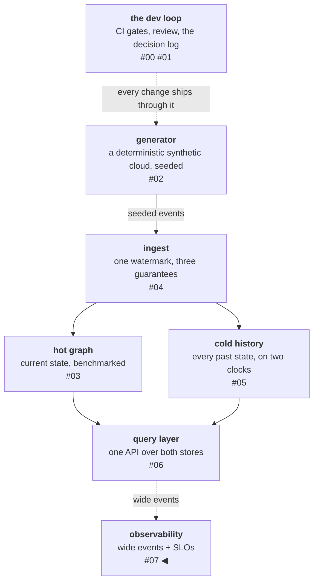

# Wide events, derived SLOs, and the drill that closed Part I

On August 1st I killed this platform's hot store — container
removed, its data gone with it, the store every live query depends
on — while a publisher pushed 2,500 updates per second into the
pipeline that feeds it. An alert fired 172 seconds later; nobody was
reading logs. The rebuild from cold history took 21 seconds: 31,641
nodes, 53,880 edges, and 19,686 tombstones. When the backlog
drained, a reconciliation against the generator's own ground truth
came back exact — 41,196 resources, zero mismatches — and not one
message had been dead-lettered through a three-and-a-half-minute
outage. That run is the capstone of everything the previous six
posts built, and this post is about the observability layer that
made it checkable — which turned out to be the platform's one
thesis, applied to itself.

<!-- more -->

!!! info "The resgraph series"
    This is the eighth post about
    [**resgraph**](https://github.com/fespino/resgraph), a mini data
    platform I am building for learning purposes.
    Browse the repository exactly as it stood when this was written:
    [`phase-6-observability`](https://github.com/fespino/resgraph/tree/phase-6-observability).
    Every snippet below is copied from that tag, trimmed only for
    length.

In this phase: the platform learns to watch itself. The pipeline so
far — a deterministic generator streams infrastructure updates, a
consumer applies them idempotently into a graph store, a cold store
keeps the full history in Iceberg, and one HTTP surface answers
questions that need both stores at once. Now it gains telemetry
(D17), objectives with enforcement (D18), and a scripted chaos drill
with a public incident report.

The platform so far, with this post's piece highlighted:



## Part I in five layers

For readers arriving here first, the platform assembled so far, each
layer with its measured number (all numbers from an Apple M3 laptop
with 8 GB RAM, stores in Docker alongside — the methodology doc
labels every figure):

- **[A deterministic synthetic cloud](02-a-deterministic-synthetic-cloud.md).** Seeded generation means every
  later test, benchmark, and evaluation gets ground truth for free.
  It is the single most reused decision in the repo — this post's
  exact reconcile exists because the generator can replay what the
  stores *should* contain.
- **[Ingest on one watermark](04-one-watermark-three-guarantees.md).** At-least-once delivery, out-of-order
  arrival, and replays, all survived by one per-resource sequence
  integer. The first implementation did 760 updates/s; profiling the
  round trips got it to 12,500.
- **[A hot graph](03-hot-graph-honest-benchmark.md).** The current world in Memgraph, built for
  traversal — blast radius is a graph question.
- **[A cold history](05-cold-history-two-clocks.md).** Every event ever, in Iceberg, with event-time
  travel — the world as of any moment, reconstructed by SQL.
- **[A query layer](06-pushdown-across-two-stores.md).** A small planner that pushes predicates and
  projections into whichever store can use them; the composite
  question — blast radius as of last Tuesday — answers in 0.25 s
  against a million-event history.

The thesis under all five: **the log is the truth; every store is a
rebuildable view over it.** The hot graph can be deleted — the drill
deletes it — because the cold history can rebuild it. If that's the
architecture for data, why would telemetry be architected
differently?

## Telemetry is data; treat it like yours

The standard observability starter kit — instrument counters, scrape
them into a time-series database, alert on queries — quietly assumes
the metrics store is primary. But a pre-aggregated counter is state
without a log: you can never ask it a question you didn't design
into it, and you can never rebuild it. That is precisely the shape
this platform's spec rejects for data. So D17 inverts the kit:

- **Wide structured events are the primary telemetry.** Every batch
  apply and every API request appends one JSON line — outcome
  counts, consumer lag, duration, route, source store — to a plain
  NDJSON file. DuckDB queries it like any other table. This is the
  telemetry *log*.
- **Prometheus is a derived, disposable view** — no volume, rebuilt
  from nothing on restart. It exists for the one thing a file cannot
  do: evaluate alert rules continuously while the platform burns.
- **A parity test forces the two layers to agree.**

The event side of that is one small class; the whole "wide events"
mechanism is an append-only NDJSON writer:

```python
# src/resgraph/obs.py
class EventSink:
    """Append-only NDJSON writer, one file per component."""

    def emit(self, kind: str, **fields) -> None:
        event = {"ts": datetime.now(UTC).isoformat(), "component": self.component, "kind": kind}
        event.update(fields)
        line = json.dumps(event, default=str)
        with self._lock, self.path.open("a") as f:
            f.write(line + "\n")
```

The parity test computes the latency SLI twice — from Prometheus's
histogram bucket and from SQL over the raw events — inside one test
that deliberately makes every third request slow. Its docstring is
the design statement:

```python
# tests/test_slo_parity.py
"""The D17 parity test: metrics are views over the event log — proven.

The composite SLI computed two independent ways must agree:
- Prometheus side: the 0.6s bucket over the request count (exact
  good-event counting, D18), taken as a delta across this test's
  requests so other tests' samples don't pollute it.
- Event side: SQL over the raw api_request events with DuckDB — the
  system of record, queried like everything else this platform calls
  truth.
If they disagree beyond rounding at the bucket boundary, one layer is
lying.
"""
```

"Metrics are views over events" is a test, not a slogan.

Two rules rode along. Instrumentation is written against the
OpenTelemetry metrics API, not a vendor client — the API is the
transferable skill, the backend a detail, which is the same argument
the spec already made for choosing standard query languages over
custom ones. And events carry **no payload bodies, ever**, with
every field bounded at 600 characters: later phases point an agent
at this platform, telemetry gets read as prompt material, and a
telemetry stream that re-broadcasts payloads is an injection path
wearing a lab coat.

## Why Prometheus at all

On a platform whose entire identity is ingesting events and
materializing views, running someone else's ingest-and-materialize
engine for telemetry needs a justification. Prometheus occupies for
telemetry exactly the slot Memgraph occupies for data — a hot,
derived, disposable serving layer over a durable log we own — and
adds two things the platform doesn't have: an always-on rule
evaluator, and **failure-domain separation**. The drill kills stores
on purpose; the thing that notices must not share their fate. For
the same reason, telemetry events never ride the platform's own
Redis transport — never share fate with the thing you watch. The
spec records an expiry condition: when the platform grows its own
reactive triggers, migrating SLO evaluation onto the platform gets
re-evaluated.

## Objectives you can show your work for

The two SLOs are ratios of good events to valid events, and both
thresholds are derived from measurements, not chosen from vibes:

- **Freshness:** 99% of scrape intervals see consumer lag at or
  under 31,500 messages — three seconds of the measured sustained
  ingest rate (10,500/s, the longer-run number, not the batch-sweep
  peak). If ingest can't clear three seconds of arrivals, the
  current-world claim is quietly false.
- **Composite latency:** 95% of blast-radius-as-of-T requests finish
  under 0.6 s — measured p95 (0.393 s) times 1.5, rounded. The
  histogram has a bucket boundary *at* 0.6 s, so "good" is counted
  exactly, never interpolated.

That bucket-boundary trick lives in the code as one constant, with
the derivation attached where the next reader will meet it:

```python
# src/resgraph/obs.py
# The 0.6 boundary IS the D18 composite threshold: good events are
# counted by the bucket, never interpolated from a quantile.
API_BUCKETS = (0.005, 0.01, 0.025, 0.05, 0.1, 0.25, 0.6, 1.0, 2.5, 5.0, 10.0)
```

The windows are per-run rather than the canonical multi-week rolling
window, and the spec says so loudly instead of pretending a laptop
project has a quarter of traffic — the consequence, also recorded:
only the fast-burn alert tier exists (fire when a 30-minute run's
error budget would exhaust within five minutes), because on a
per-run window the slow-burn tier has nothing to measure. The rule
file carries every derivation as a comment above the rules it
derives:

```yaml
# observability/rules/slo.yml
# Fast-burn thresholds: alert when a 5m window burns the run's budget
# at >= 6x the sustainable rate — i.e. would exhaust a 30-min run's
# budget in <= 5 minutes:  1 - 6 x (1 - objective).
#   freshness: 1 - 6 x 0.01 = 0.94
#   composite: 1 - 6 x 0.05 = 0.70
      - record: slo:ingest_freshness:good
        expr: max(ingest_lag) <= bool 31500
      - record: slo:ingest_freshness:ratio_5m
        expr: avg_over_time(slo:ingest_freshness:good[5m])
      - alert: IngestFreshnessFastBurn
        expr: slo:ingest_freshness:ratio_5m < 0.94
        for: 2m
```

CI runs the rule files through promtool against synthetic series:
the alerts must fire on bad series *and stay quiet on healthy
ones* — the quiet case is a series that never breaches, asserted to
raise nothing:

```yaml
# observability/rules/slo_test.yml
    alert_rule_test:
      - eval_time: 8m
        alertname: IngestFreshnessFastBurn
        exp_alerts: []
```

An alert rule that's never been tested to stay quiet is half a test.

## The drill aborted three times before it passed

The chaos drill is a script, not a ceremony: seed a world, sustain
2,500 updates/s, kill the hot store, and gate every recovery claim —
the alert must actually fire, the backlog must actually drain, and
the rebuilt store must reconcile exactly against the generator's
oracle. The script's own preamble sets the standard: "Scripted so it
is reproducible, not folklore. Every phase timestamps into a
timeline the incident note copies verbatim."

Three runs aborted before the fourth passed end to end, and the
aborts produced five findings:

1. **Readiness relapse.** The script `sleep`ed before rebuilding
   instead of waiting for a protocol handshake — violating a lesson
   this repo had already written down, the first time it applied in
   a new context. The fix is now a function in the drill script,
   carrying its own citation:

    ```bash
    # scripts/drill-hotstore-loss.sh
    bolt_wait() {
      # readiness is a protocol handshake, not an open port (phase-3 lesson)
      for _ in $(seq 1 90); do
        if uv run python -c "from resgraph.graph.client import get_driver; \
            d=get_driver(); d.verify_connectivity(); d.close()" >/dev/null 2>&1; then return 0; fi
        sleep 2
      done
      echo "memgraph never became Bolt-ready" >&2; return 1
    }
    ```

    Written-down lessons still need grep-at-review.

2. **Dirty-store inheritance.** The drill initially ran against a
   store left over from test sessions, whose old watermarks would
   have silently skipped drill messages — idempotence doing its job,
   against us. The script now recreates the container and logs why:
   "memgraph RECREATED — the drill must start empty." Drills
   construct their initial state; they never inherit it.
3. **Solo capacity is not contended capacity.** The benchmarked
   sustained 10,500 updates/s measures the hot consumer alone. With
   the cold consumer's Iceberg commits, the publisher, and the
   observability stack sharing the laptop, real capacity was
   ~3,500/s. Every benchmark number carries an implicit "with
   nothing else running"; the benchmarks doc now says so out loud.
4. **A window larger than the run judges the warmup.** A
   steady-state gate read a 5-minute SLO ratio 2.5 minutes into the
   run and correctly aborted a healthy system. The window must fit
   inside the thing it measures.
5. **Killing the wrapper is not killing the worker.** `kill -9` on
   the launcher orphaned the actual consumer, which then — correctly,
   per its own outage handling — applied its held batch into the
   empty store ahead of the rebuild. The failure you inject must be
   the failure you meant.

Finding 5 exists because of this phase's other design change: the
consumer now distinguishes **outage from poison**. A store being
*down* is retried forever with capped backoff; only a message that
*fails on a healthy store* walks the dead-letter ladder — the code
marks the distinction as a spec supersession ("D14 supersession:
outage is not poison"). The pre-drill code would have dead-lettered
the entire backlog of a 3.5-minute outage — a design-review catch
that the drill then verified under real fire: the dead-letter queue
stayed empty and flat for the whole incident.

<!-- SCREENSHOT PLACEHOLDER — capture BEFORE taking the obs profile
     down: Prometheus has no volume, so `docker compose down` erases
     the drill series permanently. In Grafana (localhost:3000), set
     the time range to 2026-08-01 19:25–19:40 UTC so the capture
     shows the T+172s detection and the 21s rebuild cited in the
     prose. Save as docs/blog/images/07-dashboard-under-load.png,
     then restore the embed below:


-->

The fourth run passed end to end, and the numbers opened this post.
One more number, with its derivation: the incident consumed the
run's freshness error budget **about 37 times over**. That's what a
total loss of the primary store *should* cost. The budget's job in
an incident of this class is detection speed, and detection came
from the SLO burn rate, not from a human noticing. The full
timeline, findings, and budget arithmetic are in the repo as a
public incident report, INC-001.

## What I'd take to the next project

- **Apply your data architecture to your telemetry, or explain the
  asymmetry.** Log-first platforms that scrape counters into an
  unrebuildable store are contradicting themselves quietly. The
  parity test is cheap and makes the claim falsifiable.
- **Derive thresholds, and put the derivation next to the number.**
  "0.6 s because measured p95 × 1.5" survives review and re-derives
  itself when the system changes. A round number chosen by feel does
  neither.
- **The aborted runs carried the findings.** All five surfaced
  before the drill's first successful run. If the script had
  "mostly worked" on the first try, every one of them would still be
  waiting in production.
- **Separate outage from poison before the fire, not during.** Any
  retry-limit-then-dead-letter design will destroy a backlog during
  an ordinary outage. The distinction is one exception tuple.
- **Test that alerts stay quiet.** Everyone tests firing. The quiet
  case is the one that pages you at 3 a.m. for nothing — or worse,
  gets the alert deleted.

Part I is closed: generate, stream, apply, remember, query — and now
watch, with objectives that have enforcement and an incident report
that shows the whole loop working under fire. Part II is the reason
the platform exists: wrapping these endpoints as tools an agent can
be trusted with. The telemetry layer was built knowing that agent is
coming — events an LLM can query and explain beat counters it can
only read, and every content-policy decision in D17 assumed the
reader might someday be a model.
