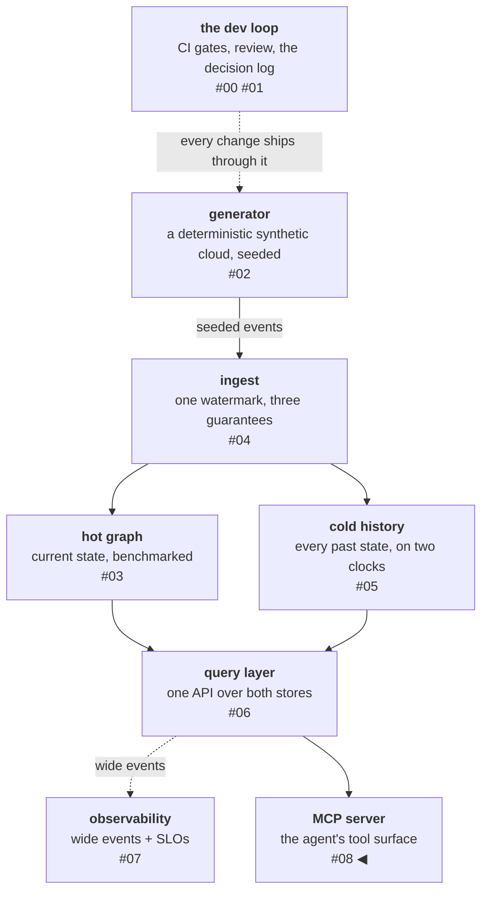

# An MCP server is an API with opinions

The most load-bearing section of this platform's new MCP server card
is titled "What this server will NOT do." No writes of any kind. No
unbounded queries — depth caps, token caps, and pagination enforced
server-side, not requested politely. No authority from the caller —
nothing in any tool schema lets a model claim its own permissions.
That section is the thesis of this phase: an MCP server is not a
transport bolted onto an API, it is an API with opinions about its
consumer — a consumer that reads error messages as instructions,
pastes every response into a finite context window, and will
eventually be trusted with an incident. Design for that consumer and
the tool surface changes shape.

<!-- more -->

!!! info "The resgraph series"
    This is the ninth post about
    [**resgraph**](https://github.com/fespino/resgraph), a mini data
    platform I am building for learning purposes.
    Browse the repository exactly as it stood when this was written:
    [`phase-7-mcp-server`](https://github.com/fespino/resgraph/tree/phase-7-mcp-server).
    The server card — the contract this post walks through — is
    [`CARD.md`](https://github.com/fespino/resgraph/blob/phase-7-mcp-server/src/resgraph/mcp/CARD.md).
    Every snippet below is copied from that tag, trimmed only for
    length.

In this phase: Part II begins, and it is the reason the platform
exists. Part I built the pipeline — a deterministic generator, an
idempotent consumer into a graph store, full history in Iceberg, one
query layer over both, an observability layer closed by a chaos
drill with a public incident report. Now those capabilities become
tools an agent can be trusted with: the MCP server (D19),
server-side budgets (D20), and investigation playbooks as MCP
prompts (D21).

The platform so far, with this post's piece highlighted:



## One registry, two surfaces, zero drift

The first opinion is architectural. This server exposes the same
five tools over two protocols — MCP for agents, HTTP for everything
else — and a dual surface forces a question that sounds trivial
until it isn't: where does a tool's definition live?

Every tool is a plain function with a Pydantic input model, a
Pydantic output model, and one thing the LLM never sees — a
keyword-only caller context, injected by the transport and absent
from the LLM-facing schema, so a caller cannot supply its own
authority, structurally:

```python
# src/resgraph/tools/canonical/traversal.py
def blast_radius(args: BlastRadiusIn, *, ctx: CallerContext) -> BlastRadiusOut:
    """Everything affected if a resource dies: dependents with a path to
    it, live (at=None) or reconstructed at a past moment (at=T)."""
```

One [`TOOL_REGISTRY`](https://github.com/fespino/resgraph/blob/phase-7-mcp-server/src/resgraph/tools/registry.py)
declares the surface, and both consumers derive from it in a loop:
the MCP server registers its tools from the registry, and the HTTP
API mounts `/tools/{name}` routes from the same entries. The MCP
side of that loop is the whole wiring:

```python
# src/resgraph/mcp/server.py
for entry in TOOL_REGISTRY:
    if "mcp" in entry.surfaces:
        server.add_tool(
            _adapter(entry),
            name=entry.name,
            description=entry.description,
            annotations=ToolAnnotations(
                read_only_hint=entry.hints.read_only,
                destructive_hint=entry.hints.destructive,
                idempotent_hint=entry.hints.idempotent,
                open_world_hint=entry.hints.open_world,
            ),
        )
```

The transport is
never the truth-bearing module: the truth about a tool — its name,
its schemas, its behavior — lives in the registry, and a transport
only carries it. You could delete both transports without losing a
single definition.

This kills a specific failure mode: schemas hand-written per
transport drift independently, until "what does `blast_radius`
accept?" has the answer "depends which surface you ask."

"Derive from one source" is a rule that decays unless something
enforces it, so the phase ships a drift guard
([test_drift_guard.py](https://github.com/fespino/resgraph/blob/phase-7-mcp-server/tests/test_drift_guard.py)):
CI assertions that
parse the source tree as an AST and fail on any tool registration
outside the registry loop, any `/tools` route outside the mount,
and any model class duplicated across surfaces — plus a signature
check that every registered implementation matches its declared
models exactly. The claim is not "currently no drift" — it is that
the surface *structurally cannot
drift without failing the build*. The same idea drives a type system:
make the wrong state unrepresentable, then stop reviewing for it.

## Task-shaped, not route-shaped

Put an API in front of an agent and the first design question is
what one tool should *be*. The field currently has three live
answers: mirror your existing REST routes one-to-one
(route-shaped), hand over an entire CLI as a single tool and let
the model compose commands (wide), or shape each tool around one
question the consumer actually asks (task-shaped). This surface is
task-shaped.

Route-shaped is usually the minimal-effort choice, and often a
deliberate one: when an API already exists, mirroring it costs
nearly nothing and ships today. The cost lands later, on the agent —
it moves the orchestration burden onto the model: the platform's
REST surface answers "what breaks if db-42 dies, as of last
Tuesday?" only through a sequence of calls the caller must order,
hold intermediate results for, and join. Every hop the
model orchestrates itself is context spent, latency added, and one
more place to go wrong. So each tool is instead one investigator's
question, whole: `blast_radius` (what breaks if this dies — live
or as of time T), `dependency_path` (why does A depend on B),
`resource_history`, `world_diff`, and one polymorphic
`fetch_resource` for detail. An agent investigating an incident
asks `blast_radius(db-42)` and gets the answer, not homework.
Anthropic's
[Building Effective Agents](https://www.anthropic.com/research/building-effective-agents)
calls this discipline agent-computer-interface design; the principle
is [poka-yoke](https://en.wikipedia.org/wiki/Poka-yoke) — the
connector that only fits the right way up. Make the mistake
structurally hard, not instructed-against.

The second answer — *wide* tools — is the one that almost won.
This becomes the better option the day the five tools stop fitting
the questions: if agent traces ever show the model improvising
around the surface — asking things the tools cannot express or
combine — the spec commits to measuring a wide-tool variant before
a sixth tool gets added. Here is why it hasn't fired. Microsoft's Azure SRE team
[reported](https://techcommunity.microsoft.com/blog/appsonazureblog/context-engineering-lessons-from-building-azure-sre-agent/4481200/)
collapsing 100+ narrow tools into roughly five — but each of their
five is an entire CLI ecosystem handed over as a single tool: the
model composes its own `az` or `kubectl` command line. Both designs
agree the tool count should be small; they disagree about what one
tool should *be* — a whole command language, or one investigator's
question. Wide won for Azure because models have seen millions of
`az` and `kubectl` invocations — the fluency is already in the
weights. resgraph's tools are bespoke; there is no trained fluency
to lean on, so task-shaped stands until the traces say otherwise.

A third option cuts across the shape question rather than
answering it: composing tools *in code*. In Anthropic's
[code execution with MCP](https://www.anthropic.com/engineering/code-execution-with-mcp)
pattern, the model doesn't call tools one at a time with every
intermediate result flowing through its context window; it writes a
small script, the script calls the tools inside an execution
environment, and only the final result reaches the context — their
benchmark cut 150k tokens to 2k, a 98.7% reduction. It is rejected
for now because it needs a sandbox — secure execution, resource
limits, monitoring — that this phase doesn't have. A sandbox is a planned
later phase; when it lands, this graduates to a measured
experiment — a composition arm against the tool-call arm, same
scenarios, tokens and pass rates side by side. Until then the spec
carries the early-warning condition: when traces show the model
running the same tool sequences by rote, or combining ref lists in
its head that a three-line script would combine exactly, the
composition question jumps the queue. A rejected alternative with a named
trigger is a decision; a rejected alternative without one is a
mood.

## What every tool declares, whatever its shape

Independent of the shape argument, every tool on this surface ships
with declared risk and operational metadata — and the intended
reader of those declarations is not the model. It is the *client*
that will compose this server with others.

The risk annotations are MCP's four standard hints, declared
explicitly on every tool — the registry dataclass makes the full
declaration set visible in one place:

```python
# src/resgraph/tools/registry.py
@dataclass(frozen=True)
class ToolRegistration:
    name: str
    fn: Callable[..., Any]
    input_model: type[BaseModel]
    output_model: type[BaseModel]
    description: str
    surfaces: frozenset[Surface]
    scopes: frozenset[str]
    privileged: bool
    hints: ToolHints  # read_only / destructive / idempotent / open_world
    timeout_s: float
    error_actions: dict[ErrorClass, ErrorAction]  # rephrase | retry | give_up
```

Declaring the hints is not optional politeness: the
[spec's defaults](https://blog.modelcontextprotocol.io/posts/2026-03-16-tool-annotations/)
assume the worst when a hint is unstated — destructive and
open-world — so an unlabeled read-only tool presents itself as
dangerous. And the labels matter beyond this server — "risk profile
is a property of the session, not of any single server": a session
may combine this read-only server with someone else's write-capable
one, and the client can only reason about the *combination* if
every server labels itself accurately. The labels here are a
contribution to someone else's security decision.

The operational metadata is per-tool `timeout_s` and an
error-action map — for each failure class, whether the productive
response is to rephrase the call, retry it unchanged, or give up.
Both answer gaps an
[enterprise MCP deployment field report](https://arxiv.org/abs/2603.13417)
observed in production: a tool without a declared timeout leaves
every client guessing how long to wait, and an error without a
declared action invites retry loops on failures no retry will fix.

## Budgets are enforced, not requested

What stops an agent from hurting itself — or the platform — with a
*legitimate* query? A blast radius
on a well-connected host is a 53,775-token answer if serialized
naively (measured below); an unbounded `depth` parameter is a
traversal the stores pay for; a twenty-minute-old payload about a
churning world is a wrong answer wearing a fresh timestamp. None of
these are misbehavior. They are the default outcomes of a naive
surface meeting a curious consumer.

The design position: every one of those failure modes gets a
control, the control lives server-side in the response protocol
itself, and none of it relies on the prompt — because a prompt
instruction is a request to a consumer that may never have read it,
may not recall it mid-task, and cannot be made to obey it. "Please
paginate responsibly" is etiquette; a token cap is a control. The
response model is where the controls live — every field below is one
of them:

```python
# src/resgraph/tools/canonical/traversal.py
class BlastRadiusOut(BaseModel):
    refs: list[ResourceRef]
    total_count: int
    truncated: bool
    depth_clamped: bool
    pagination_hint: str | None
    fetched_at: datetime
    source: Literal["hot", "cold", "composite"]
```

Five controls follow, each paired with the failure it exists to
prevent:

- **Clamps, not errors** — against the unbounded traversal. A
  `depth` beyond the traversal cap clamps and says so
  (`depth_clamped: true`). An agent that gets clamped keeps
  working; one that gets a 500 retries in a loop.
- **Refs + fetch — against the context-window blowout.** Traversals
  and diffs return bare refs — id, type, one line — and
  `fetch_resource` returns detail for the few that matter. A
  400-node blast radius with full attributes is a payload the agent
  cannot steer once received. Azure SRE's report lands the same
  rule from production: treat large tool outputs as data sources,
  not context.
- **A hard token cap on every response — against the answer no
  refs-only shaping can bound**, because fan-out is unbounded.
  Overflow paginates with `truncated: true`, an exact
  `total_count`, and the next move written in prose — because the
  consumer is a language model, so the payload itself teaches the
  follow-up. The whole mechanism is one function:

    ```python
    # src/resgraph/tools/budgets.py
    page: list[T] = list(items[offset:])
    while page and _over_cap(page, probe):
        page = page[: max(1, len(page) * 3 // 4)]
    truncated = offset + len(page) < total
    hint = (
        f"{total} results total; this page covers {offset}..{offset + len(page) - 1}. "
        f"Call {tool} again with offset={offset + len(page)} for the next page."
        if truncated
        else None
    )
    ```

    Pagination is an argument, not a separate tool; a truncated
    radius is "at least N", never "N".
- **Freshness on everything — against the stale answer.** Every
  response carries `fetched_at` and its source store. An agent
  reasoning over a twenty-minute-old payload about a live system
  needs to know to re-fetch; freshness *is* correctness when the
  world churns.
- **Errors are steering surfaces — against the mistake repeated
  forever.** A rejected filter answers with the correction in the
  error message, not in documentation.
  [Stripe's steering experiments](https://stripe.dev/blog/ai-steering-experiments)
  measured the asymmetry that justifies this: passive documentation
  goes unread — "agents simply don't wander" — while error-based
  steering reliably corrects behavior at exactly the moment the
  agent is paying attention. Birgitta Böckeler's
  [sensor work for coding agents](https://martinfowler.com/articles/sensors-for-coding-agents.html)
  lands the same rule from the harness side: sensor output should
  carry the self-correction guidance inline, written for the model
  that reads it — error messages as an API contract, not as human
  diagnostics.

## The benchmark behind the payload shape

Per this series' standing rule, a design claim about payload size
needs a number, a method, and a hardware label. The payload
benchmark
([tool_payload_bench.py](https://github.com/fespino/resgraph/blob/phase-7-mcp-server/benchmarks/tool_payload_bench.py))
measures the canonical refs-and-cap response against the
same traversal serialized fat, across 1k/10k/100k-resource worlds —
and the headline is that **at natural radii the cap barely
matters**: seed-42 blast radii top out around 30 nodes, refs-vs-fat
is a 3–4× constant factor at p95 and above, and both fit any
context window.

The row that justifies the design is the constructed one — a
900-dependent hub host, the shape a real cloud always contains and
random worlds rarely produce:

| Hub response (900 dependents) | tokens |
|---|---|
| refs page (`truncated: true`, `total_count: 900`) | **7,172** — under the 8,000 cap |
| fat (all 900 nodes, full attributes) | **53,775** — 6.7× the cap, linear in fan-out |

Fat is unbounded — linear in fan-out, so one hub query can eat a
quarter of a context window on its own. The refs response is capped
*by construction*, with pagination picking up the remainder. The
companion number makes refs+fetch work as a contract:
`fetch_resource` detail is flat at ~114 tokens p100 across every
world size — following a ref costs the same in a 1k world and a
100k one. The cap only earns its keep on hubs; the hub is what the
cap is for.

## Playbooks ship as prompts

Tools say what the agent *can* do; the phase also ships two
opinions about what it *should* do — investigation playbooks
exposed as MCP prompts:
[`incident-impact`](https://github.com/fespino/resgraph/blob/phase-7-mcp-server/skills/incident-impact/SKILL.md)
("what breaks if X dies?") and
[`change-forensics`](https://github.com/fespino/resgraph/blob/phase-7-mcp-server/skills/change-forensics/SKILL.md)
("what changed around the time things broke?"). Each is a markdown skill with a
Pydantic-validated manifest, and its tool references are checked
against the registry at startup: a playbook naming a tool that
doesn't exist fails loudly at boot, never silently at runtime.

The bodies follow a fixed six-section shape — Goal, When to use,
Steps, Tools to call, Examples, Anti-patterns — so a consuming
model learns the format once, and they state constraints before
narrative:
[Stripe's grounding-file work](https://stripe.dev/blog/build-stripe-salesforce-integrations-faster-with-agents)
found that a constraint-first core (rules, signatures, failure
modes — not tutorials) took an agent task from hours of failed
iterations to minutes. The count stays at two on evidence, not
minimalism for its own sake:
[LangChain's skills evaluation](https://www.langchain.com/blog/evaluating-skills)
measured 82% task completion with curated skills against 9%
without — and wrong-skill selection appearing at around twenty
similar skills, so similarity at scale, not count alone, is the
ceiling. And the spec records the exit condition in advance: if
prose playbooks plateau
under evaluation, the named next experiment is compiling them into
schema-validated step graphs, per the measured 53% → 67% with
step-level repair in
[AIP: A Graph Representation for Learning and Governing Agent Skills](https://arxiv.org/abs/2606.04781).

## The spec is a checklist you can run

The server card opens with a claim: "targets MCP spec revision
`2026-07-28`." That is a *pin*, and the design leans on what that
revision guarantees — the stateless core that five single-shot,
no-handle tools fit exactly, the deprecation list this surface
avoids building on. The phase's closing discipline is to run the
[spec](https://blog.modelcontextprotocol.io/posts/2026-07-28-release-candidate/)
as a checklist against the implementation, not to cite it. That found
three things — and, later, a fourth.

**First finding: the revision actually in force was not the pinned
one.** An MCP client and server *agree* on a revision at connect
time, over one of two ceremonies: the legacy `initialize` handshake,
or the stateless `discover` path the pinned revision introduces —
and the SDK negotiates `2026-07-28` only over the new path. The
phase's protocol test connected via the legacy handshake, so every
green run had quietly agreed to an older revision, and nothing
checked which revision had actually been negotiated. The suite was
green while exercising the exact path the pinned revision
deprecates: the pin, as written, was prose. The fix made the pin
real: the
[protocol test](https://github.com/fespino/resgraph/blob/phase-7-mcp-server/tests/test_mcp_protocol.py)
switched to the `discover` path and the pin became a CI assertion —
the negotiated version must equal the pin — so an SDK upgrade that
shifts it fails the build. It still went into the project's
corrections table even though nothing shipped wrong, because a log
that only audits the past isn't auditing.

The second and third findings came from the same checklist:

- **The stdout audit.** The
  [stdio binding](https://modelcontextprotocol.io/specification/2026-07-28/basic/transports/stdio)
  has one unforgiving MUST: nothing on stdout that isn't a protocol
  message. The audit question was which code had ever actually *run*
  inside the stdio server process, and the answer was only the hot
  path — the cold-store tools, backed by the libraries most likely
  to print something on first initialization, had never initialized
  there, because the protocol test only called hot tools. Now all five
  tools round-trip through the real channel with a seeded cold
  catalog in the subprocess environment, where a single stray print
  corrupts the framing and fails the parse. Coverage holes hide
  where "it passes" and "it ran" diverge.
- **Coverage has a measurement shadow.** The protocol suite spawns
  the server as a subprocess, so every server-side line it
  exercises is invisible to the coverage instrument — the number
  *dropped* from 96 to 93 while testing improved. In-process
  integration twins for the same paths brought it to 97 and caught
  one piece of genuinely dead code. A coverage number can lie in
  both directions; know where your instrument cannot see.

**The fourth finding arrived after publication**, from the same
failure class as the revision pin — caught fact-checking against the
[spec changelog](https://modelcontextprotocol.io/specification/2026-07-28/changelog)
rather than the release post. The pinned revision requires `ttlMs`
and `cacheScope` on every list and read result; left undecided, the
SDK fills in `0` and `"private"` — expired on arrival, for a catalog
that only changes at deploys. The result was conformant on the wire
and undecided in
substance. [PR #223](https://github.com/fespino/resgraph/pull/223)
declares one hint across the cacheable methods, with the reasoning
as its comment:

```python
# src/resgraph/mcp/server.py (current)
# the catalog only changes when the process does, so the TTL is the
# post-deploy blindness window on a dev-iterated catalog: five minutes;
# "public" because no tool varies by caller
_CATALOG_HINT = CacheHint(ttl_ms=300_000, scope="public")
_CACHE_HINTS: dict[CacheableMethod, CacheHint] = {
    "tools/list": _CATALOG_HINT,
    "prompts/list": _CATALOG_HINT,
    "resources/list": _CATALOG_HINT,
    "resources/read": _CATALOG_HINT,
    "resources/templates/list": _CATALOG_HINT,
    "server/discover": _CATALOG_HINT,
}
```

The protocol test asserts both fields
(`assert (cacheable.ttl_ms, cacheable.cache_scope) == (300_000,
"public")`), so an SDK default change fails the build. The lesson
sharpens: a default you didn't choose is a decision you didn't
make.

One last opinion made it onto the server card because statelessness
has a user-visible consequence: offset pagination re-runs the query
per page — exactly the stateless shape the revision asks for —
which means pages are independent reads of a churning world, not a
snapshot. The card says so and tells the consumer what to do about
it (compare `fetched_at` across pages), with the RC's
explicit-handle pattern recorded as the upgrade path if consistent
pagination is ever needed. A consistency limit stated in the
contract is a feature; buried in code, it is a trap.

## The same discipline, against OWASP's checklist

The MCP spec is one external checklist; the tool surface has a
second one.
[LLM06:2025 Excessive Agency](https://genai.owasp.org/llmrisk/llm062025-excessive-agency/)
is the standard external checklist for agent tool surfaces, and an
external checklist catches what self-designed reviews rationalize —
the same reason the spec got run as a checklist above. The walk ran
later, once the surface had its consumer and its runtime
(issue #143), so its rows also cite decisions from that arc: D26
(the permission boundary), D27 (the audit trail), D28 (the
execution protocol). It is recorded per item, including the two
items only partially closed:

| LLM06 item | Control | Status |
|---|---|---|
| 1. Minimize extensions | Five read tools, registry-canonical (D19); the toolset constructor refuses anything more | enforced |
| 2. Minimize extension functionality | Task-shaped tools (blast_radius, world_diff…), not generic query passthrough; raw query access is a recorded D15/D16 rejection | enforced |
| 3. Avoid open-ended extensions | No shell, no eval, no open-ended fetch; open-world tools refused at construction by the D26 session composition rule | enforced |
| 4. Minimize extension permissions | Tools carry `resgraph:read` scope only; `CallerContext` pins scopes per call | enforced |
| 5. Execute in user's (minimal) context | Single-principal system today — the analyst runs as the operator; no per-user identity to narrow to | partial, named gap |
| 6. Require user approval for high-impact actions | The typed approval gate (D26): rendered plan, irreversibility declared before deciding, typed step count, decision as audit record | enforced |
| 7. Complete mediation | The privileged tool is absent from the agent's tool blocks (D28) — authorization is structural, downstream of the model; a model that requests it anyway gets an error outcome (tested with an injection-shaped run) | enforced |
| 8. Sanitise inputs/outputs | Referential validation (only observed ids citable), verdict arithmetic checked, SAST in CI (bandit + CodeQL) | enforced |
| Log & monitor (harm limitation) | D27 audit trail: every llm_call/tool_call/step/approval/cutoff, hash-chained, queryable with the agent stopped | enforced |
| Rate-limiting (harm limitation) | Tool-call and token budgets in the harness (D20/D22); cost ceilings and the judge spend breaker were D29 scope at walk time | partial at walk time |

The two gaps are recorded arrival conditions, not findings the
checklist missed. Item 5 has no multi-user story because there are
no users to separate yet — it becomes real work the day a second
principal exists. The rate-limiting row's cost half landed with D29
soon after the walk: cost ceilings, the wall-clock budget, and the
judge spend breaker. A checklist row that names *when* it closes
is a plan; one that quietly stays "partial" is a debt.

## What I'd take to the next project

- **Derive every surface from one registry, and guard it with
  structure, not review.** The AST-level drift guard costs a test
  file; a second schema definition costs a silent divergence per
  refactor forever.
- **Shape tools around the consumer's questions, and record the
  rival shape with a trigger.** Wide tools and code-composition are
  real alternatives; writing down *what evidence would flip the
  decision* is what keeps the choice falsifiable.
- **Put the budget in the response, not the prompt.** Clamps that
  explain themselves, caps with exact counts, errors that steer —
  every control this phase added works even on an agent that read
  none of the documentation, which is the only agent you should
  design for.
- **Benchmark the payload shape against the pathological case.**
  Natural test worlds flattered the fat responses; the hub row is
  the design justification. Construct the case your generator
  won't hand you.
- **A pin is prose until a real call asserts it.** The revision pin
  and the stdout MUST were both "true" and both untested; running
  the spec as a checklist found the divergence a green suite could
  not.

The surface is built and the opinions are enforced. The next three
posts put a consumer on it: an analyst agent that triages incidents
through these five tools — and the evaluation harness, built first,
that decides whether anything it says can be trusted.
