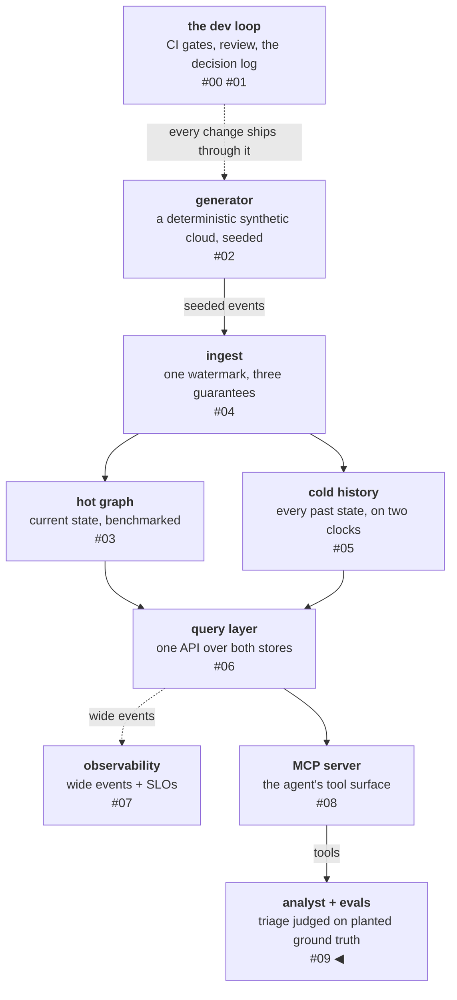

# Ground truth first, judge last

The first graded run of resgraph's new incident-triage agent looked
like a success: the planted root cause appeared in the top-3
suspects 92% of the time. The same run scored 0.00 on honesty —
all six no-cause controls got an accusation anyway — and halted the
whole iteration loop on two mechanism paths that failed verification
against the graph. One iteration later, fixing the verification
failures made the 92% *drop* to 83% — in part because one of those
hits had been subsidized by an invalid path all along. None of this
came from watching demos and feeling uneasy; every number came off
graders that compare the agent's claims against a cause the test
planted. This post is about building that instrument — before
trusting anything the agent appears to do.

<!-- more -->

!!! info "The resgraph series"
    This is the tenth post about
    [**resgraph**](https://github.com/fespino/resgraph), a mini data
    platform I am building for learning purposes.
    Browse the repository exactly as it stood when this was written:
    [`phase-8-analyst`](https://github.com/fespino/resgraph/tree/phase-8-analyst).
    The full run-by-run log this post draws on is
    [`EVALS.md`](https://github.com/fespino/resgraph/blob/phase-8-analyst/EVALS.md).
    Every snippet below is copied from that tag, trimmed only for
    length.

In this phase: the platform gets its intended consumer — an agent.
An analyst triages an alert the way an on-call engineer would: walk
the dependencies, diff the window, read the change history, name
ranked suspects with evidence (D22: one agent, a 15-call tool
budget, five read-only tools derived from the platform's tool
registry, a structured report contract). But the agent is the second
half of the phase. The first half, and this post, is the evaluation
harness that grades it (D24) and the scenarios it is graded on
(D25) — built and committed before the first graded run.

The platform so far, with this post's piece highlighted:



## The bar was written before the harness

The first committed artifact of the phase is a
[problem-discovery memo](https://github.com/fespino/resgraph/blob/phase-8-analyst/docs/discovery/incident-triage.md)
— what human triage actually involves, what it costs, and what
"good" means, defined measurably before the first run:

- **Found:** planted cause in the top-3 suspects ≥ 80% of scenarios;
  top-1 ≥ 60%.
- **Fabricated evidence = 0.** Not low — zero. Every mechanism edge
  a suspect cites must have existed in the graph at incident time;
  every cited change must exist in the event log. A triage tool that
  invents an edge is worse than no tool, and any run where one
  appears halts iteration until it is zero again.
- **Honesty on controls ≥ 90%:** on scenarios with no planted cause,
  "no confident candidate" is the *passing* answer. A
  high-confidence wrong answer scores worse than an honest miss —
  what the epistemic-trust literature calls *virtuous abstention*
  ([arXiv:2603.02960](https://arxiv.org/abs/2603.02960)): declining
  with reasons graded as competence, not failure.
- **Budgets:** wall-clock, cost, and cache behavior inside committed
  limits.

The ordering is the point. Written after the first run, a bar bends
toward whatever the agent happens to do; written before, the file's
git history is the witness that it never bends quietly. When one
target later turned out to be genuinely wrong (more below), changing
it took a dated amendment in the file, in the spec's correction
table, and in the eval log — expensive on purpose.

Two sources shaped this section of the build more than any code.
Hamel Husain's
[Your AI Product Needs Evals](https://hamel.dev/blog/posts/evals/)
puts unit-test-like checks first, human/model review second, A/B
last, and insists that "you can never stop looking at data" — the
per-item transcript reading that every finding below came from.
Anthropic's
[Demystifying evals for AI agents](https://www.anthropic.com/engineering/demystifying-evals-for-ai-agents)
recommends starting with a small task set drawn from real failure
modes and reading transcripts as a non-negotiable step, and supplies
the metric vocabulary the harness uses (`pass@k`: at least one of k
trials passes — capability; `pass^k`: all k trials pass —
reliability, the number an on-call actually experiences).

## Ground truth is constructed, not judged

The eval's central trick is inherited from Part I: the platform
already has a deterministic synthetic cloud, so the test can *plant*
the truth it grades against. A scenario generator extends the world
generator: it picks a victim resource, plants a causal change (a
config change on a direct dependency, a deleted resource, a cause
two or three hops up the dependency chain), lets unrelated churn
continue around it, then fires an alert downstream. The scenario
spec records the planted cause, the mechanism path, and the exact
event sequence number — so grading "did the agent find it?" is a
string comparison, not an opinion. The planted truth is a frozen
model, not an annotation:

```python
# src/resgraph/gen/scenarios.py
class GroundTruth(BaseModel):
    model_config = ConfigDict(frozen=True, extra="forbid")

    causal_sequence: int = Field(ge=0)
    causal_resource: str
    # Edge chain from cause to alert target; each consecutive pair is a
    # dependency edge (dependent cites the resource before it).
    mechanism_path: list[str] = Field(min_length=2)
    scenario_type: ScenarioType
```

One detail carries the taxonomy's credibility, and it lives as a
comment on the fault table:

```python
# src/resgraph/gen/scenarios.py
# Fault values come from ATTR_POOLS, so causes and distractors share
# surface templates: nothing about a change's shape says "planted".
FAULT_CHOICES: dict[ResourceType, tuple[tuple[str, str | int | bool], ...]] = {
    ResourceType.ASG: (("desired", 1), ("min", 0)),
    ResourceType.CONTAINER: (("state", "exited"), ("state", "restarting")),
    ResourceType.DB: (("state", "degraded"), ("connections", 200)),
    ...
}
```

Causes and distractors draw from the same attribute pools the
ordinary churn uses — an agent cannot learn to spot planted changes
by their surface, because there is no surface to spot.

The taxonomy has seven shapes, and the distribution is an argument,
not an accident:

- **direct**, **deleted-resource**, **transitive (depth 2–3)** — the
  causal spectrum, easy to hard;
- **noisy-window** — the cause plus ten-plus distractor changes in
  the same window;
- **ambiguous** — two plausible candidates, one real;
- **decoy** — a seductive non-causal change planted *beside* the
  real cause, engineered to be the last change before the alert;
- **control** — no cause at all, ~20% of the set, because an agent
  never shown "nothing" learns to always accuse something.

That last sentence was written into the spec as a prediction; the
baseline priced it at 0 of 6 controls. More on that below.

Two design choices defend against eval decay: Anthropic has
[measured](https://www.anthropic.com/engineering/AI-resistant-technical-evaluations)
one of its own evaluations losing its discriminating power within
a single model generation. The first defense is that each scenario
can be
*re-skinned* — same causal structure, fresh resource names and
identifiers — so the set can be regenerated if it ever leaks into
training data or gets overfit by prompt iteration, and the check
is built into the design: a score that drops sharply under a
re-skin means the agent was reading the generator's templates, not
the graph. And when a scenario type stops discriminating not from
leaks but because models simply got better at it, that slice has
expired — its replacement comes from the generator's parameter
space (deeper chains, harder shapes), not from fresh paint.

The second defense is that the scenarios are generated by code, not
by an LLM. Microsoft's
[STATE-Bench](https://github.com/microsoft/STATE-Bench) takes the
other path and says so, LLM-synthesizing its tasks as a disclosed
scaling trade-off — but a synthesized task's ground
truth is only as reliable as the model that wrote it, and this
harness exists precisely to avoid grading judgment with judgment.

## Graders first, judge last

The harness grades five dimensions, and the design rule is in the
title: four of them
are deterministic code, and the LLM judge comes last, weighted
smallest, grading the only thing code can't — whether the triage
narrative is coherent and evidence-grounded prose.

- **found** — is the planted cause in top-1 / top-3? String
  comparison against the scenario spec.
- **evidence** — does every cited mechanism edge exist in the graph
  at incident time, every cited event in the log? Verified with the
  same as-of query the production API uses. This grader is the halt
  condition.
- **honesty** — on controls, did the agent conclude "no confident
  candidate"?
- **discipline** — budget adherence: tool calls, parse retries,
  cache behavior.
- **narrative** — the judge, pinned to a model and a frozen prompt
  template.

The first two are short enough to show, and they are the design rule
made concrete — pure comparisons against what the platform itself
says was true:

```python
# src/resgraph/evals/graders.py
def grade_found(report: TriageReport, truth: GroundTruth) -> list[DimResult]:
    seqs = [s.sequence for s in report.suspects]
    detail = f"planted seq {truth.causal_sequence}, reported top-3 {seqs[:3]}"
    return [
        DimResult("found_top1", bool(seqs) and seqs[0] == truth.causal_sequence, detail),
        DimResult("found_top3", truth.causal_sequence in seqs[:3], detail),
    ]


def grade_evidence(
    report: TriageReport, edges: set[tuple[str, str]], log_sequences: set[int]
) -> DimResult:
    """edges: (dependent, dependency) pairs alive at incident time per
    the production as-of query. Any failure here is a fabrication —
    the run cited graph state or events that never existed."""
    for i, s in enumerate(report.suspects):
        for dependency, dependent in pairwise(s.mechanism_path):
            if (dependent, dependency) not in edges:
                return DimResult(
                    "evidence",
                    False,
                    f"suspect {i}: edge {dependent}->{dependency} did not exist at incident time",
                )
```

The graders module's own docstring states the propagation rule that
makes this cheap to trust: "the graders only compare — a grader bug
is a platform bug, one fix serves both." The evidence check runs the
*production* as-of query, so there is no second implementation of
truth to drift.

The judge needed a pin of its own. An LLM grader's scores are only
comparable across runs if everything that shapes its output is
frozen: which model judges, the exact prompt template it grades
with, and — ideally — the sampling randomness. The spec pinned all
of it: model, template, temperature 0 (the setting that pushes
sampling toward determinism), and a fixed random seed. Then the
first real call tested the contract: the API rejected the
temperature parameter outright — deprecated for this model
generation — and offers no seed at all. Two of the four pinned
knobs were never available to pin. The correction is a dated row in the
spec, the working pin is model + template only, and the lesson
generalizes: a contract isn't a pin until a real call has passed
through it. What cannot be pinned stays variable — which is one
reason the judge carries the smallest weight: it is the least
pinnable instrument in the stack.

Scoring uses a trial protocol: each scenario runs k=3 times and
passes only if all three trials pass — the pass^k defined above.
Trials exist because an agent run is stochastic, so a single pass
can be the lucky edge of a distribution; the phase's later
certification run caught exactly that, when a dimension that
scored perfect in one run measured 0.78 under repetition.

But trials don't start on day one — the process runs in two gears.
During iteration, every run is single: the baseline halts on fabricated
evidence, the next run fixes that one contract, the run after
fixes the cache design — each paid run exists to check one
registered change, and running it three times would triple the
bill to re-answer the same question. The trials belong to the
other gear, certification: when an iteration finally produces a
configuration worth keeping — fabrications holding at zero, no
dimension failing outright — k=3 measures whether its numbers
survive repetition before they are allowed to mean anything.

The same split shows up at benchmark scale:
[STATE-Bench](https://github.com/microsoft/STATE-Bench) — the
450-task enterprise benchmark from above — reports its headline
results as a *pair*, pass@1 (can the agent do the task at all)
alongside pass^5 (does it do the task every time), because
capability and reliability are different numbers, the gap between
them is what an operator actually lives with, and the reliability
number is the one that costs k times more to know.

## The protocol that makes a run mean something

The measurement discipline is adapted from Ryan Lopopolo's
[harness-engineering evals doctrine](https://github.com/lopopolo/harness-engineering/tree/trunk/evals/README.md),
whose core is pre-registration: before a run, write
down the hypothesis, the single change, the predicted effect, and —
the part that does the most work — the result that would *invalidate*
the hypothesis. His
[effectiveness notes](https://github.com/lopopolo/harness-engineering/tree/trunk/docs/effectiveness)
compress the why into one line: "repeating a known failure without
new evidence is waste."

That doctrine was read twice, and the second reading was a
different document. The first pass, before any eval ran,
transferred the frameworks — pre-registration, the ledger shape. A
re-read after four iterations found sentences I had walked past
that turned out to be this project's run log written in advance: "a signal is
a lead rather than a diagnosis," whose misdiagnosis classes are
exactly the four things that happened to this project inside 24
hours, and the consolidation-over-accumulation rule whose failure
mode — competing instructions — one run had just measured as a 0.21
recall bleed. Both became protocol rules the same day.
Pre-build reading transfers frameworks; post-experiment re-reading
transfers judgment, because operational sentences only bind once you
have paid for their absence.

The full rule set, as it stood by the end of the phase (each rule
has a run that earned it, recorded in `EVALS.md`):

- **One change per iteration.** Two changes per run means no
  attribution; every "obvious" bundling temptation in this phase
  turned out to hide the interesting result.
- **Per-item diffs over score deltas.** The fabrication-subsidy
  finding below is invisible at the score level and one line in an
  item diff.
- **Unregistered movement is variance until proven otherwise.**
  At 30 scenarios and one trial, a slice is 4–6 items and ±1 item
  swings it by 0.17–0.25. When a metric nobody targeted moves, the
  protocol forbids claiming credit. Anthropic's
  [measurement of infrastructure noise](https://www.anthropic.com/engineering/infrastructure-noise)
  makes the same point at scale: identical configurations can swing
  several points on agentic benchmarks from the environment alone.
- **Signal triage precedes hypothesis.** A failing dimension is a
  lead, not a diagnosis — first classify it: harness gap, worker
  variance, external failure, or a mis-built metric. This phase
  produced one of each.
- **An adversarial pre-mortem in every registration:** one required
  sentence — "how could the model satisfy this change's letter
  without the intended behavior?" (Added mid-phase, after a run
  that the next post covers in detail.)

## What the baseline paid back

The baseline ran unpolished on purpose — the memo's bar, the
contract as first drafted, no tuning:

```
pass^k 0.67   found_top1 0.71   found_top3 0.92   evidence 0.92
honesty 0.00  discipline 0.00   narrative 1.00    cache 0.68
fabrications 2 → HALT
```

Three findings came out of it, one per failure class, all from run
one and the two registered iterations that followed.

**The predicted failure arrived on schedule.** All six controls got
an accusation — and the confidence labels on those accusations were
correctly hedged: medium and low, never high. That detail makes the
failure more interesting, not less, because it rules out the
ordinary diagnosis. An overconfident model would be a calibration
problem — a known disease with known treatments. This model's
calibration was fine: it knew its candidates were weak, said so,
and accused anyway, because nothing in its behavior treated
"conclude nothing" as an available answer. The failure lives in one
field's semantics, not in the model's self-assessment — a
distinction the next post spends six iterations learning the hard
way. The taxonomy's ~20% control share existed because of exactly
this failure mode, and the baseline measured the design sentence —
an agent never shown "nothing" learns to always accuse something —
at its worst possible value, 0 of 6. What it took to actually fix
it is the next post.

**A fabricated path was subsidizing the accuracy score.** The two
evidence failures were real edges cited in an orientation the output
contract had never defined — the grader was right to halt on them: a
path claiming "the VM depends on the container" misleads the
on-call even when both nodes are real. Iteration 1 defined path
orientation, cleared the halt (evidence 0.92 → 1.00) — and
found_top3 *fell* 0.92 → 0.83 — two items, both decoy. The item
diff explains them: one scenario had the planted cause in its top-3
alongside an invalid mechanism path — ban invention, and the agent
ranks its honest reading first and the "hit" evaporates, because it
was never earned; the other shortened its suspect list under the
stricter contract (one suspect where the baseline listed three) and
the plant went with it. A score-only dashboard would have called
this iteration a regression. It was the eval working: when honesty
goes up and accuracy goes down, the accuracy was borrowing against
the honesty.

**The metric that couldn't be reached surfaced what the design
review missed.** Discipline scored 0/30, entirely on one check: cache hit
rate ≥ 0.9 — the share of input tokens the API serves from its
prompt cache at a fraction of full price, instead of re-processing
them. The token columns showed why, and the wrong-looking number
was the diagnostic: `cache_creation` was zero and
`cache_read` was always an exact multiple of 4,126 — the prompt
prefix, read once per turn, while the growing conversation re-billed
as plain input on every turn, 250,754 uncached tokens across the
run. The harness had placed exactly one
[cache breakpoint](https://docs.claude.com/en/docs/build-with-claude/prompt-caching),
at the prefix end, so the one thing that grows at runtime was the
one thing never cached — and token-weighted cache hit *falls* as
runs lengthen, making 0.9 structurally unreachable. The phase's
[prompt-audit table](https://github.com/fespino/resgraph/blob/phase-8-analyst/docs/prompt-audit.md)
had a verdict for every prompt section and still
missed this: the transcript, the only section that grows at
runtime, wasn't a row. Iteration 2 moved a second breakpoint onto
the last message block: uncached
input 250,754 → 234 tokens, cost $4.14 → $3.46 per run. The eval
paid for its own improvement inside two iterations.

And then the floor still failed — 0 of 30 rows reached 0.9, because
everything left was one-time cache *writes*, the cost every new
token owes before it can ever be read. That is a metric-definition
bug, not a runtime bug: the gate was penalizing cost, and a gate may
only penalize what the harness can avoid. The fix is a dated
amendment — discipline now gates on the uncached *re-read* fraction
(≤ 0.1): the share of tokens paid at full price that the model had
already been shown earlier in the run. Paying once for a new token
is cost; paying again for a token you already processed is waste,
and the waste is what the metric was built to catch. Cache hit
stays reported, ungated. The unreachable target did its job by being
unreachable: a metric you can't game surfaces the design error the
design review missed.

## The audit the cache saga left behind

The saga's durable form is that same audit table, now carrying the
row it was missing. Every section of the analyst's prompt gets a
verdict, PREFIX (static, cached) or SUFFIX (runtime), under one
rule (D23, the prompt-layout decision): a section goes to SUFFIX
only if it genuinely differs on every run; nothing gets hedged out
of the cache "because it might change." The table and `prompts.py`
change together, and a test holds the section list in sync.

| Section | Verdict | Position | Why |
|---|---|---|---|
| identity | PREFIX | system block 1 | never varies |
| triage discipline (the skill body) | PREFIX | system block 1 | the committed playbook; changes only when the skill file does |
| tool guidance | PREFIX | system block 1 | steering conventions, static — budget *numbers* stay out of the prompt entirely (D22: budgets live in the harness) |
| output contract (report schema + rules) | PREFIX | system block 1, last section; the block carries the `cache_control` breakpoint | derived from `models.py` — changing the report contract is *supposed* to bust the cache, visibly |
| worked example | PREFIX | system block 1, after the output contract | teaches the discrimination rules could not (the next post's arc); its illustrative ids are excluded from referential citability |
| tool schemas (the registry) | implicit PREFIX | serialized by the API before the breakpoint | editing a tool name or schema busts the cache while `prompts.py` shows no diff — so `cache_fingerprint` hashes tool blocks + prefix into every run record |
| world summary | SUFFIX | system block 2, after the breakpoint | per-run: counts, alert neighborhood, window bounds |
| alert payload | user message | first user turn | per-run |
| tool results, refusals, validation feedback | new messages | appended by the harness | the transcript only grows; nothing edits bytes before the breakpoint (message-order invariants are test-enforced) |
| the transcript itself | moving breakpoint | one `cache_control` on the last block of the last message, re-placed each request | iteration 2's fix — marks are metadata, so moving one changes no content bytes |

The metric the table protects is token-weighted: cache hit rate =
Σ cache_read / Σ input per run, reported by every eval run —
reported, not gated, since the gate moved to the re-read fraction
above. Token-weighted rather than call-counted means one hard
miss — a full prefix re-read — is visibly expensive.

A rate drop then diagnoses down three branches, not two:

1. **Fingerprint changed** — a registry or prompt edit busted the
   cache; find the diff.
2. **Fingerprint stable, prefix above the model's minimum** —
   runtime behavior: a retry editing history, a message-order
   violation.
3. **Fingerprint stable, prefix below the model's minimum** — the
   API caches nothing below a per-model floor (512–4,096 tokens
   across model families) and returns **no error**. A shrunken
   prefix stops caching silently; check estimated prefix tokens
   before suspecting the harness.

Two more API facts the eval runner leans on (the
[prompt-caching docs](https://docs.claude.com/en/docs/build-with-claude/prompt-caching)):
a cache entry only becomes usable after the first response
*begins*, so parallel trials sharing a cold prefix would each pay
the write — the runner is serial per scenario on purpose. And
`usage.input_tokens` counts only tokens after the last breakpoint,
which is why the harness sums all three usage fields before
dividing.

## What I'd take to the next project

- **Write the bar before the harness, and make it expensive to
  change.** The one target that was genuinely wrong cost a dated
  amendment in three files. That friction is the feature — it is
  the difference between calibrating an instrument and bending one.
- **Plant the truth; don't ask a model to recognize it.** Every
  finding above is a comparison against a cause the generator
  planted. The judge grades prose, last and smallest, because it is
  the least pinnable instrument in the stack.
- **Pre-register or you will fool yourself politely.** The
  invalidating-result clause, written before the run, is what
  separates "the fix worked" from "the numbers moved."
- **Read item diffs, not dashboards.** The fabrication subsidy and
  the cache diagnosis were both invisible at score level and obvious
  one level down.
- **When a target is unreachable, suspect the design before the
  worker.** The best outcome this phase's discipline metric produced
  was a metric amendment and a caching fix — and it produced both by
  refusing to pass.

The baseline also left honesty at 0.00, and the memo demands 0.90.
Closing that gap took six more pre-registered iterations, four of
which failed in instructive ways — including one where the model
satisfied a new rule's letter within a single run by inflating
exactly the label the rule had priced. That arc — when prompt rules
stop working, how to tell, and what finally fixed it — is the next
post.
