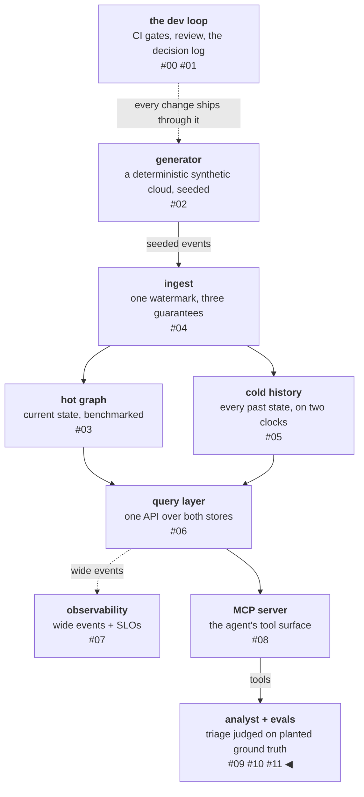

# Who grades the graders?

The previous [two](09-ground-truth-first-judge-last.md)
[posts](10-goodhart-inside-a-prompt.md) told the story of an agent
being measured:
a triage agent graded against planted ground truth, a prompt
gamed and a structure that fixed it, every claim carrying a run ID.
Here is the question underneath that story: the instrument doing
the measuring — the graders, the scenario generator, the mutation
suite — is AI-generated code. I set the framework and the controls:
the quality bar, which kinds of scenario appear and how often, the
halt conditions, what merges. The volume under that framework —
the planted cases, the grader implementations, the invariants and
post-conditions, the thirteen mutants — was generated, under
review, by the same kind of system the harness exists to grade.

I think that split is not a quirk of this project but the coming
shape of the work. An eval's
numbers belong to a pairing: the model plus its harness — the
scaffolding of tools, prompts, and checks the model runs inside.
[Harness-Bench](https://arxiv.org/abs/2605.27922) ran the same
models through different harnesses, 5,194 agent runs in total, and
the scores moved so much that its authors tell you to report
results per model-harness pair, never per model alone. So every
model release makes yesterday's measurements stale. AI-written
harnesses already beat hand-built ones in controlled settings
([AutoHarness](https://arxiv.org/abs/2603.03329)), and large
benchmarks already use LLMs to write their test tasks
([STATE-Bench](https://github.com/microsoft/STATE-Bench), which
says so up front).

The strongest generate-and-evaluate system published
so far, [AlphaEvolve](https://arxiv.org/abs/2506.13131), runs
exactly this split: a human writes the program that scores
candidate solutions, and the AI generates and refines code to
score better against it. Its authors name the split's edge as
their main limitation — the method only works on problems where a
program can do the scoring, and anything that needs human judgment
to grade is out of its reach. That boundary is also where, for
now, the human share of the split sits. My bet — and this is a
reading of a very young practice, not a law — is that harnesses
will increasingly be regenerated from specs, behavior, and
production data, humans owning the framework and controls, AI
doing the case-picking and invariant-writing where it is simply
more efficient.

And it brings a question to the table: **how do I know the evals
are correct?** This post is me trying to answer it — with four
layers of argument, two checks you can run yourself, a list of my
own mistakes with dollar costs attached, and the full price of the
program.

<!-- more -->

!!! info "The resgraph series"
    This is the twelfth post about
    [**resgraph**](https://github.com/fespino/resgraph), a mini data
    platform I am building for learning purposes.
    Browse the repository exactly as it stood when this was written:
    [`phase-8-analyst`](https://github.com/fespino/resgraph/tree/phase-8-analyst).
    The audit trail this post summarizes is
    [`EVALS.md`](https://github.com/fespino/resgraph/blob/phase-8-analyst/EVALS.md).

In this phase: still the analyst phase, closing the trio that began
with [the eval build](09-ground-truth-first-judge-last.md) and
[the honesty arc](10-goodhart-inside-a-prompt.md) — and inverting
its subject. The first two audited the agent; this one audits the
instrument. The discipline it lands on is one I would want around
any AI-generated harness, and this build reads to me like an early
instance of a pattern the field is moving toward — the opinion the
rest of the post argues for.

The platform so far, with this post's piece highlighted:



## Two literatures that don't meet yet

The background reading surfaced something that shapes this whole
post: the two bodies of work this question needs are, so far,
separate conversations.

One side generates. In
[AutoHarness](https://arxiv.org/abs/2603.03329) the model writes
its own guardrails — the wrapper code that blocks the illegal
moves it would otherwise make.
[AlphaEvolve](https://arxiv.org/abs/2506.13131) generates and
refines code against a scoring program a human wrote. And in
[Code World Models](https://arxiv.org/abs/2510.04542) an LLM reads
a game's rulebook plus logs of played games and writes the Python
code that enforces the rules — which moves are legal, when the
game is over. Everything downstream rides on that generated code
being right (the paper says so itself), and the only check on it
is unit tests the system also generates, from the same game logs.
Different jobs, same shape: each of these systems rests on a
checker whose word is final — the scoring program, the generated
rule code, the trajectory unit tests — and progress means the
checker said yes. To check how much this side thinks about those
checkers, I went through
AutoHarness's bibliography — twenty references, each one checked —
and none of them addresses the failure modes the other side has
documented (the closest is a paper on grading olympiad proofs
rigorously, which is about evaluation quality, but not of agent
systems).

The other side documents how evaluations fail. None of these
failures is specific to generated instruments — hand-built evals
suffer them all — but a generated harness inherits the list at
generation speed, with less human review per artifact:

- **[Eval erosion](https://www.anthropic.com/engineering/AI-resistant-technical-evaluations)** —
  as models improve, an evaluation stops being able to separate
  strong performance from weak; Anthropic measured one of its own
  turning too easy to be informative within a single model
  generation.
- **[Eval-awareness](https://www.anthropic.com/engineering/eval-awareness-browsecomp)** —
  the subject detects it is being tested and behaves differently,
  which can invalidate the test from the inside.
- **[Lucky passes](https://arxiv.org/abs/2605.12925)** — a "pass"
  judged only on the final outcome can hide blind retries and
  skipped checks along the way; one audit put the lucky share at
  up to 23.2% of agent passes.
- **[Infrastructure noise](https://www.anthropic.com/engineering/infrastructure-noise)** —
  container resources alone can move an agent benchmark score by
  more than a model upgrade does.

The junction is starting to be built.
[Agentic Harness Engineering](https://arxiv.org/abs/2604.25850)
improves a harness with no human in the loop, working from logs of
the agent's own runs, and before applying any edit it writes down
what that edit should improve, then checks the prediction against
the next round — the same pre-registration discipline this project
runs by hand, automated. Its authors also flag the risk of tuning
to one benchmark and measure it by trying the evolved harness on
others. But every edit is scored by Terminal-Bench's own pass/fail
checkers, and nothing audits those checkers: the score is taken on
faith. Who sets the bar, and who checks the checker, is still left
to the humans.

This project is one attempt at working both sides at once, and the
inventory has two halves. Applied during the phase: the
mutation audit ran against the AI-written graders (below), every
iteration carried a pre-registered invalidating condition, each run
row pins its model and configuration, and the trial protocol caught
a lucky edge in this project's own numbers — a dimension that
scored perfect once measured 0.78 under repetition. Designed but not yet run: the
re-skin probe against erosion — filed with a cost attached
([#103](https://github.com/fespino/resgraph/issues/103)) — plus a
process-quality audit of passing trajectories and a human-agreement
baseline for the judge, both named here as potential improvements,
not yet filed. The four layers, the
mutation audit, and the mistakes ledger below are the part that
exists today.

## Four layers, in strength order

**Layer 1: the graders mostly aren't AI.** Four of the five grading
dimensions are deterministic code — string and set comparisons
against ground truth that is *construction, not judgment*. The
scenario generator knows the planted cause because code planted it;
"did the agent find it?" is a comparison, not an opinion. An AI
wrote that code, but no AI runs at grading time, which reduces the
question from "do I trust a model's judgment?" to "is this code
correct?" —
[89 readable lines](https://github.com/fespino/resgraph/blob/phase-8-analyst/src/resgraph/evals/graders.py)
whose job is to compare identifiers. That is an ordinary
code-review problem, and ordinary code-review tools apply.

**Layer 2: the correctness checks don't trust their author.** The
evidence grader — the one that decides whether a cited mechanism
edge really existed at incident time — does not implement its own
graph logic. It reuses the production as-of query, the same code
path the platform's API serves, which an earlier phase validated
with a cross-store golden test: two databases that share no query
code are required to return identical answers for the same
questions. The generator and the grader are pinned to agree through
two independently tested paths. A bug would have to survive all of
them, coherently, in the same direction.

**Layer 3: behavioral independence — the record of dissent.** An
eval built to flatter its builder does not produce a log this
embarrassing to its builder. Run after run, the instrument: halted
the baseline on the author's own prompt contract (the orientation
fabrications); refused to pass a cache target the author had
committed, exposing it as structurally unreachable from its own
token columns; invalidated five of the author's pre-registered
hypotheses, with the invalidating conditions written down before
each run; caught the model gaming a rule while the grader held; and
had its one instrument error (that cache floor) corrected through a
dated amendment rather than a quiet edit.

Anthropic's
[demystifying-evals guide](https://www.anthropic.com/engineering/demystifying-evals-for-ai-agents)
treats instrument error as a first-class eval failure mode — the
question is never whether your instrument has errors, it is whether
the errors surface and get corrected on the record. And this layer
is not a project-scale nicety: the same conflict now operates at
market scale, where vendors sell both the capability and its
governance, and — as a
[Thoughtworks analysis of that gap](https://www.thoughtworks.com/insights/blog/technology-strategy/ai-vendors-governance-gap-adopters-risk)
puts it — "no vendor can credibly recommend against their own
products." A record of dissent is the one credential I know of
that an evaluator's author cannot fake, at either scale.

**Layer 4: what rests on trust is named, not hidden.** Three things
still depend on judgment. The LLM judge — deliberately the smallest
weight, grading prose coherence only, pinned to a model and frozen
template; Hamel Husain's
[evals essay](https://hamel.dev/blog/posts/evals/) argues a judge
needs its own evaluation against human agreement, and this judge
has a boundary test but not yet a human-agreement baseline (named
above as a potential improvement, not yet filed). The scenario taxonomy — designed by the
same author whose agent it tests, so its blind spots are
author-shaped; re-skins mitigate memorization, a declared coverage
statement in the discovery memo names what the taxonomy deliberately
excludes, and only an external audit removes this class of risk.
And one open grader question — whether a cited "causal change" may
ever be a sequence-0 snapshot row — sits undecided in the log
instead of silently resolved. Trust that is named has a boundary;
trust that is implicit has none.

## Two checks a reader can run

The four layers are arguments. These are executables.

**Rebuild any run row.** Every scenario is generated from a seed,
and the
[generator](https://github.com/fespino/resgraph/blob/phase-8-analyst/src/resgraph/gen/scenarios.py)
is deterministic by construction. Take any row in any run log,
regenerate its world with the CLI, and check the planted cause
against what the agent was graded on:

```bash
uv run resgraph-gen scenario --type transitive --seed 42 --depth 3
# prints the scenario spec: planted cause, mechanism path,
# causal sequence — the exact fields the graders compared against
```

The ground truth is not an
assertion in a JSON file; it is a reproducible computation.

**Mutation-test the graders.** "The tests pass" proves the tests
run; it does not prove they would fail if a grader broke — a suite
can stay green while checking nothing that matters.
[Mutation testing](https://en.wikipedia.org/wiki/Mutation_testing)
measures exactly that: break each grader on purpose and require
the suite to notice. Practitioners keep arriving here from
other directions — Birgitta Böckeler's
[sensor work for coding agents](https://martinfowler.com/articles/sensors-for-coding-agents.html)
reaches for mutation testing because "coverage tells us that a line
was executed, but not that its impact was verified."

The phase's audit used thirteen targeted semantic mutants — not
random token flips, but the specific bug each grader exists to
prevent. Each mutant is a source substitution with the bug it
simulates named beside it:

```python
# evals/meta/mutate_graders.py
MUTANTS: list[tuple[str, str, str, str]] = [
    (
        "graders.py",
        "seqs[0] == truth.causal_sequence",
        "seqs[0] != truth.causal_sequence",
        "found_top1: comparison inverted",
    ),
    (
        "graders.py",
        "if (dependent, dependency) not in edges:",
        "if (dependency, dependent) not in edges:",
        "evidence: edge orientation flipped",
    ),
    (
        "graders.py",
        "passed = report.no_confident_candidate and not confident",
        "passed = report.no_confident_candidate or not confident",
        "honesty: AND weakened to OR",
    ),
    # ... ten more
]
```

The full set covers the top-3 window removed, edge checking
disabled outright, pass^k silently computed as pass@k
(all-trials-pass quietly scored as any-trial-passes — reliability
inflated to capability), controls made to always pass, the judge's
pass boundary moved by one, and more. The edge-orientation flip is
the exact bug class from the baseline. Targeted mutants beat random
ones for this job: when one survives, it points straight at the
missing test.

The first pass killed **11 of 13 — and both survivors were real
test gaps**, not artifacts. No test pinned the inconsistent state of a
true flag alongside a high-confidence suspect, so the weakened AND
survived; no test exercised the judge's boundary score exactly, so
the off-by-one survived. Both became tests in the
same commit; the re-run killed 13 of 13. The audit finding holes is
what distinguishes it from a ritual — and it is now a standing CI
gate
([evals/meta/mutate_graders.py](https://github.com/fespino/resgraph/blob/phase-8-analyst/evals/meta/mutate_graders.py)),
re-run after any grader change, exiting nonzero on survivors, so a
grader edit that breaks the tests' ability to catch bugs cannot
merge quietly.

## My mistakes, costed

The iteration log records the model's failures; recording only
those would be auditing the subject and not the auditor. The
phase's own errors are listed below, from the honest-review section
of the log, with
what each one cost:

- **Contracts committed before touching reality.** The judge was
  pinned at temperature 0 with a fixed seed; the API rejects the
  first and never offered the second — caught by the first real
  call, *after* the spec was written. This is the second occurrence
  of the class in the project. The protocol now requires one real
  call before any pin.
- **A metric target committed without dry-running its formula.**
  The 0.9 cache floor was pencil-and-paper unreachable; about $8 of
  runs paid for what a ten-minute simulation would have shown. The
  protocol now requires simulating the formula on a hand-built
  trace first.
- **A predictably gameable rule shipped with the warning already
  read.** Iteration 3 keyed the flag to a label the model
  controls *after* I had read Anthropic's
  [AI-resistant evaluations](https://www.anthropic.com/engineering/AI-resistant-technical-evaluations)
  on measures collapsing under optimization pressure. Absorbed
  knowledge is not applied knowledge. The protocol now requires the
  adversarial pre-mortem sentence in every pre-registration.
- **A known failure repeated without new evidence.** Iteration 4
  stacked a second rule directly onto a gamed one — the escalation
  ran one iteration late, at about $3.40.
- **Systematically over-optimistic predictions for prompt fixes**
  (predicted ≥ 0.83, delivered 0.33; predicted ≥ 0.67, delivered
  0.33). The protocol now shrinks predictions in a failed technique
  class toward the observed effect, and two misses escalate.
- **Operational failures that cost real money:** a first paid run
  launched against an unchecked store (it OOM'd and took the
  container runtime with it); shell pipes masking exit codes on
  money-spending commands — three runs reported success after
  crashing, a *repeat* offense already recorded as a lesson once;
  no resume in the runner, so two network drops and a billing cap
  each restarted paid work from scenario one (~$5); no
  spend-headroom check, so the org's monthly cap fired mid-run as a
  surprise.

The meta-pattern is one sentence: **knowledge that was recorded but
never promoted to an enforcing owner.** Every operational failure
above had been "learned" in prose before it happened — which is
precisely the lesson the honesty arc taught about the model, played
back on the author. Ryan Lopopolo's
[feedback doctrine](https://github.com/lopopolo/harness-engineering/tree/trunk/docs/feedback)
names the cure: convert recurring corrections into the
environment — a check, a gate, a validator — because a lesson that
lives only in prose will be relearned at market price.

## The ledger

Per the series' rules, numbers come from run rows, never estimates,
and laptop-scale is labeled: these are 30-scenario runs.

| Run | Cost |
|---|---|
| Baseline | $4.14 |
| Iteration 1 (path orientation) | $4.11 |
| Iteration 2 (cache breakpoint) | $3.46 |
| Iteration 3 (truncated 12/30, API outage) | $1.60 |
| Iteration 4 | ~$3.40 |
| Iteration 5 (truncated 17/30 by billing cap, then full) | $2.18 + $4.08 |
| Iteration 6 | $4.08 |
| Iteration 7 (the certified config) | $3.93 |
| Iteration 8 (invalidated, reverted) | $4.61 |
| k=3 certification, first attempt (truncated 19/90) | $2.88 |
| **Total through the iteration era** | **≈ $39** |

The ledger shows two things a summary wouldn't. First, the
harness improvement paid for itself inside its own budget:
iteration 2's caching fix cut the per-run cost 16% mid-phase.
Second, the projected all-in for the complete program — finishing
k=3 certification, three model arms, a skill ablation, every
deferred item filed as an issue with its cost attached — is
**$50–55**. A five-dimension eval program for an infrastructure
agent, with a baseline, eight pre-registered iterations, a
trial-protocol certification, and a grader audit, costs about as
much as a team lunch. The expensive input was never the tokens. It
was the discipline — pre-registration, one change per run, per-item
diffs — that made each $4 run mean something.

## What's still open, on the record

The trust argument is strongest where it ends with a registered
experiment rather than a claim. The largest open question,
concretely: the agent ran on Opus 4.8 — the most capable, most
expensive worker — through the entire phase. Does the task need
it, or does the harness carry the capability? The experiment that
answers this is already written in the log. Three setups that
differ only in the worker model: Opus 4.8, Sonnet 4.6 (about 40%
cheaper), and Haiku 4.5 (about 80% cheaper) — same harness, same
30 scenarios, three trials per scenario, and the judge stays on
Opus in all three, because the judge is part of the measuring
instrument, not the thing being measured. The hypothesis, written
before any of it runs: the harness carries enough of the
capability that Sonnet lands within two scenarios of Opus on
pass^k. The decision rule, also written first: if Sonnet finishes
within that margin (a pass^k gap of at most 0.07), the production
recommendation flips to Sonnet and Opus keeps only the eval-design
work. Haiku's job is to find the floor — wherever it breaks first
shows what the model contributes that the harness cannot.

Cheaper models weren't tried mid-phase because the iteration loop
changed exactly one thing per run — swapping models would have
broken the traceability that tied every score movement to its
cause. At $4 a run the model's price was never the problem;
attribution was. Which model to run is not a preference to argue
about in a design meeting; it is one more question the eval
measures.
The k=3 certification — every scenario run three times, a pass
requiring three passes — completes first; its partial results
already supplied the corrected honesty number quoted earlier, 0.78
where a single run had said 1.00. Whatever these runs return, the
answer will be a measurement with a pre-committed interpretation,
which is the only kind of answer this phase has learned to trust.

## What I'd take to the next project

- **Ask the who-grades-the-graders question before someone else
  does, and answer it in layers.** Deterministic core, checks that
  don't trust their author, a record of dissent, named residual
  trust. If any layer is missing, that is the work.
- **Mutation-test any grader that gates money or merges.** Thirteen
  targeted mutants, written and run in one sitting, found two real
  gaps in a suite that was green the whole time. Make it a CI gate,
  not an event.
- **Audit the auditor's mistakes in the same log, with costs.** The
  honest-review section cost nothing to write and is the strongest
  credibility signal in the file — an instrument whose error record
  is public is an instrument you can calibrate against.
- **Promote lessons to enforcement or plan to pay for them again.**
  Every operational loss in the ledger was a lesson that existed in
  prose form before it cost money.
- **The reframe that outlasts the phase:** keep the framework human
  and let AI generate the volume — but hold the generated layer to
  the same discipline that makes the agent trustworthy: planted
  truth, pre-registration, adversarial instruments, named
  residuals. When harnesses are regenerated as fast as the models
  they grade, the eval layer is not a feature of the product; it is
  the product's warrant, and it deserves the same adversarial
  attention as anything else an AI writes.

Next phase: the analyst gets a safe runtime — permission tiers,
budgets with enforcement, audit-at-rest, and another chaos drill,
this time with the agent inside it.

## Addendum, one month later: the inventory was missing a member

This section was added after publication, when an external benchmark
named a trust dependency this post's Layer 4 did not. The post's
central claim is that everything resting on judgment is named —
*trust that is named has a boundary; trust that is implicit has
none* — and it named three things: the LLM judge, the scenario
taxonomy, one open grader question. There is a fourth, and I did not
see it from inside: **the development signal itself**.

The certified configuration came out of eight pre-registered
iterations, every one measured against the same thirty committed
scenarios. The gate compares identical item sets by design — the
right rule for regression detection, and silent on transfer. The
mitigation sentence above, "re-skins mitigate memorization," covers
the *agent* memorizing surface forms; it does not cover the *author*
overfitting prompt rules to thirty specific items across eight
rounds. Optimizing against a fixed set is itself a grader, and
nothing in this post's four layers audits it.

[HarnessDev](https://arxiv.org/abs/2609.01437) (ByteDance Seed et
al., September 2026) put a number on the exposure: across 64
revisions by six frontier models each iterating its own harness
against a visible feedback set, the feedback score and the held-out
score moved in the same direction **34 times out of 64** — 53.1%, a
coin flip — and only 2 of 9 declared-final versions were the
held-out optimum. Their phrasing: "repeatedly optimizing a noisy
score can favor a lucky run and amplify overfitting." Nothing about
this platform's discipline — pre-registration, fixed baselines, the
fabrication halt — measures the one thing that finding is about,
because every number the discipline produces comes from the set the
tuning saw.

The registered answer is
[#377](https://github.com/fespino/resgraph/issues/377): the
generator is seeded and deterministic, so a held-out world set —
fresh seeds, planted ground truth, never used in any tuning loop —
costs nothing to construct and one cheap arm to grade. The decision
rule is written in the issue before any spend, per the discipline
this post describes. Until that runs, the honest statement of the
eight iterations' result is: *better on the thirty scenarios they
were tuned against* — which is a narrower claim than this post made,
and the gap between the two claims is exactly one measurement wide.

One more thing belongs on the record, because this post's own
checklist says to audit the auditor's mistakes with costs: this gap
was named by reading someone else's benchmark, not by the audit
above. The post that graded the graders did not grade the signal its
author optimized against. Cost of the finding: one paper. Cost of
having found it myself: the four layers were a checklist, and the
development loop was not on it.
