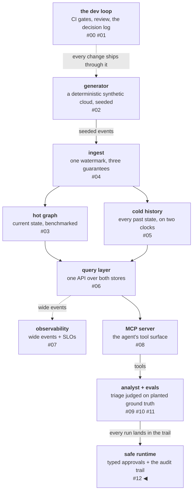

# The controls come before the capability

This platform's analyst agent spent its whole life read-only: it
investigates incidents against a resource graph, names a suspected
cause, and writes nothing. This phase gave the system its first
privileged capability — `apply_remediation`, a tool that mutates the
graph the agent reasons about. The capability arrived last. Every
control that constrains it — the permission boundary, the audit
trail, the budgets, the release gate — was built, tested, and in some
cases already catching bugs before the privileged tool existed.

That ordering is the whole argument of this post. An eval harness
should be certified before the model it grades is trusted; by the
same logic, a write path should meet its instruments on day one, not
after its first incident. Instrument-before-subject, applied to
execution.

<!-- more -->

!!! info "The resgraph series"
    This is the thirteenth post about
    [**resgraph**](https://github.com/fespino/resgraph), a mini data
    platform I am building for learning purposes.
    Browse the repository exactly as it stood when this was written:
    [`phase-9-safe-runtime`](https://github.com/fespino/resgraph/tree/phase-9-safe-runtime).
    Every snippet below is copied from that tag, trimmed only for
    length.

In this phase: the analyst leaves read-only. Part II so far built
the tool surface, the agent, and the eval harness that certifies
it; this phase wraps the first privileged capability in its
runtime — permission tiers (D26), the audit trail (D27), the write
path (D28), budgets and the release gate (D29).

The platform so far, with this post's piece highlighted:



## The model proposes; it cannot ask to write

The strongest control in the phase is the one with no enforcement
code at all: the report schema has no remediation field. The agent
names a *cause*; the remediation vocabulary belongs to the operator,
who assembles the plan outside the model against the suspect the
model identified. No model output is ever interpreted as an
instruction to write.

A contrast sharpened this design:
[Claude Code's auto mode](https://www.anthropic.com/engineering/claude-code-auto-mode)
strips assistant messages from its permission check so the agent
cannot argue its own dangerous action into approval. This design
never needed the strip — there is no model text in the permission
path to remove. A mitigation you designed out beats a mitigation you
implemented: it cannot regress, because there is nothing to turn off.

The privileged tool itself is never in the agent's tool blocks. It is
registered `privileged=True` with an empty surface set, and the
agent's toolset is built by *selection*, not exclusion — so a new
registration is off the agent's surface until it earns a place,
rather than on it until someone remembers to exclude it:

```python
# src/resgraph/analyst/tools.py
return tuple(
    e for e in entries if e.hints.read_only and not e.privileged and not e.hints.open_world
)
```

An injection that convinces the model to "call"
`apply_remediation` reaches an error outcome, not an execution, and
a test proves that with a scripted client that obeys the injection.

## Approval is typed, not clicked

Between the proposal and the execution sits a human, and the shape of
that interaction matters more than its existence. A y/n prompt is
reflex-compatible: a plan that grew a step since the approver last
looked sails through on muscle memory. So the approver types the
*count* of steps being applied, and a mismatched count re-asks with
the true count — the mismatch message is the gate working. `skip N`
drops a step without renumbering the rest, so "step 2" means the same
step in the post-incident conversation as it did at approval time.
The prompt and the decision record carry the design:

```python
# src/resgraph/analyst/approval.py
PROMPT = "Approve? Type the step count to apply, 'skip N' to drop a step, or 'no': "


@dataclass(frozen=True)
class ApprovalDecision:
    approver: str
    approved: bool
    plan_hash: str
    applied: tuple[int, ...]  # 0-based indices into the original plan
    skipped: tuple[int, ...]
```

Two more properties turned out to carry weight:

- **The decision is itself an audit record** — approver, plan hash,
  applied and skipped indices, time-to-decision. A 900ms approval of
  a five-step plan is a reviewable fact.
- **A grant has a lifetime.** The approval carries an expiry (15
  minutes by default) and execution refuses a stale grant rather than
  acting on an hour-old decision as if it were fresh.

The boundary around the whole session is a composition rule, not a
per-tool judgment. Risk lives in tool combinations: private-data
reads plus an untrusted-content channel plus a write channel is the
[lethal trifecta](https://simonwillison.net/series/prompt-injection/),
and each leg alone can look justified. The analyst reads platform
data, so its toolset admits no open-world tool and no write-capable
tool — enforced at toolset construction, refused with the rule
named:

```python
if entry.hints.open_world:
    raise RuntimeError(
        f"tool {entry.name!r} is open-world; a session reading platform "
        "data admits no untrusted-content channel (D26 composition rule)"
    )
```

## Audit at rest: one file, with the agent stopped

The bar for the audit trail is one sentence: **if answering an
incident question needs the agent re-run, you have logs, not an audit
trail.** `resgraph-analyst audit <run_id> --touched` answers "what
did the agent look at before proposing this?" from one embedded
SQLite file, agent stopped, services down.

Choosing embedded SQLite over a composed Postgres was a scale
disclosure, not a shortcut: at one writer on one laptop, a trail that
depends on a service being up has gaps exactly when it matters. The
division of labor is strict — the audit store owns payloads (tool
arguments, the resource ids each result surfaced); progress surfaces
carry status, hashes, and sizes only. The events are ephemeral; the
state is durable.

The schema carries two disclosures:

- **Tamper-evident, not tamper-proof.** Each event row hashes the
  previous row's hash with its own content; `audit <run_id> --verify`
  recomputes the chain and names the first broken row:

    ```python
    # src/resgraph/analyst/audit.py
    material = json.dumps([prev, run_id, seq, kind, payload, latency_ms, tokens, ts])
    return hashlib.sha256(material.encode()).hexdigest()
    ``` The named
  residual ships in the decision record: truncating the tail is
  silent, as in any chain without an external head pointer. Signing
  stays rejected until there is a second party to distrust — a key
  stored next to the database attests nothing the chain doesn't.
- **The trail claims only what the response shape can attest.**
  Reasoning blocks land in the trail when the API returns them,
  labelled recorded / elided / absent — because the API cannot
  distinguish full chain-of-thought from a summary, and a monitor can
  only read what the trail recorded
  ([chain-of-thought monitorability is a necessity condition, not a
  guarantee](https://arxiv.org/abs/2507.05246)).

## The executor: the platform's oldest decision wrote its newest rule

When the privileged tool finally arrived, it was not a store client.
A remediation step becomes an update message emitted onto the same
ingest stream every other producer uses, applied by the same
idempotent path — so remediation inherits ordering, replay-safety,
and audit rather than reimplementing them beside the platform.

That choice activated a requirement nobody planned. The platform's
idempotency watermark drops a message whose sequence is not ahead of
the target's — silently, by design, since its first week. An executor
that emitted and returned would therefore report success for writes
that never landed. So each step is **emit, then confirm** — the
executor's docstring carries the rule and the two subtleties D2
forces:

```python
# src/resgraph/analyst/executor.py
"""D28's privileged capability — `apply_remediation`.

Nothing here writes to a store. An approved step becomes a D2 update
emitted onto the same ingest stream every other producer uses, applied
by the same idempotent path (D3/D10). The watermark drops a stale
message silently, so every step confirms: emit, read the watermark
back, and fail the step if it did not land. A remediation that
vanished is a failure, never a success nobody checked.

Two properties fall out of D2 and matter more than they look:

- An upsert is a full statement — it replaces the attribute bag and
  the owned edge set. A patch is therefore merged onto the target's
  *live* state at apply time, never onto the render-time snapshot,
  or remediation would quietly revert whatever changed in between.
- The rollback target is the snapshot the approver saw. If the
  resource moved past the sequence this step wrote, that snapshot no
  longer restores anything and the step reports itself irreversible
  rather than clobbering a third party's write.
"""
```

The oldest decision in the log wrote a correctness requirement for
the newest capability — which is the payoff of keeping a decision log
later phases actually read.

Execution runs on a step machine, not a for-loop, and its rollback
contract has a three-way answer instead of a boolean. A rollback
callable can discover at rollback time that the world moved and the
approved pre-state no longer restores anything; it returns
`ROLLBACK_IRREVERSIBLE` — the precise middle between lying (a plain
return) and false-alarming (a raise). In every case the unwind continues to
the end, because stopping halfway leaves later steps silently
unattempted. Compare
[Stripe's auto-remediation machines](https://stripe.dev/blog/how-stripe-uses-graph-search-and-state-machines-to-auto-remediate-a-global-database-fleet),
which re-plan from intermediate state: with a human approval gate, a
re-plan is a *new proposal* and rides the same gate — after a failure
the machine's job is to leave an accurately described state for the
next proposal, not to plan.

## Budgets as enforcement, with the cutoff path graded

The budget decision fits in one line: **an exception is not a
conclusion.** Cost and wall-clock ceilings are checked at the turn
boundary — never mid-call, for the same reason cancellation never
lands mid-commit — and a breach injects one final "conclude now"
turn. The run ends degraded, with a named cutoff reason, still
holding a report whose claims stay graded.

The cutoff path is *graded*, not just implemented. A budget-starved companion dataset re-runs the same
scenarios under a tool-call floor that cannot reach the cause, and
the graded question flips from "did it find the cause" to "did it
conclude honestly under starvation." Honest degradation passes; a
confident conclusion fails; a fabricated claim under pressure fails
the evidence dimension on top. A graceful-degradation feature you
don't grade is a feature you're guessing works.

The third budget guards the eval infrastructure itself. A paid run
earlier in the project was silently truncated at 19 of 90 items by an
org-level spend cap — a surprise observed on a console. That surprise
is now a control with its own name: a per-day ledger of judge spend
that warns at 90% and trips loudly at the cap, never silently
skipping the judge dimension, because a half-judged run poisons every
comparison against a fully-judged baseline. Every external-failure
surprise the eval log recorded became, one phase later, enforcement
with the surprise's name on it.

## A release gate for a stochastic system

The last control is the one that guards all the others: a CI gate
that compares eval evidence against the certified baseline before a
behavior-touching change merges. Gating a nondeterministic system is
a different problem from gating code, and the verdict vocabulary is
the design surface:

- **Fabrications block unconditionally.** No threshold, no override
  label. The honesty property is not a 2-percentage-point
  negotiation.
- **The slice bar is asymmetric** — looser in points, stricter in
  reach — because a slice regression is exactly what a flat overall
  average hides.
- **UNDECIDED is a first-class verdict.** Certification measured a
  20% single-trial item-flip rate on this workload, so the gate
  *declines* to verdict any run below three trials per item — a k=1
  diff reads noise. The
  [AgentAssay](https://arxiv.org/abs/2603.02601) finding that binary
  pass/fail detects roughly zero regressions on non-deterministic
  workflows supplied the concept; measuring this workload's flip
  rate supplied the threshold. Consulting a paper gets you the
  concept; measuring gets you the number.
- **Declined, blocked, and broken are different exit codes** (0
  passed, 1 blocked, 3 declined, 4 evidence unreadable), so CI never
  infers a verdict by grepping prose.

The gate's economics are stated, not hidden: a several-dollar eval
suite per pull request does not scale, so CI runs the free offline
comparison against committed run evidence, and a real behavior change
ships its own fresh run. The only override is a baseline-refresh
label that downgrades a block to a report — it signals the gate, it
does not bypass review, and fabrications are never overridable.

Two CI details carry more design weight than their size suggests. The
breach comment is a review artifact — the headline with its delta,
every slice marked OK or BREACH, the failing items with the dimension
that failed them — so a regression is read in the pull request rather
than found later on a dashboard. And the gate is deliberately *not* a
required branch-protection check: a path-filtered workflow never
reports on unrelated PRs, and a required-but-absent status context
would block them forever. Enforcement is the workflow's own failing
step.

## The reviews were part of the build

Three times in one phase, adversarial review of just-merged work
found a real defect — which is the strongest argument that the
review is part of the build, not a ceremony after it.

The gate itself supplied the best one. As first merged, it compared
the newest committed run against the baseline — and scored PASS on a
7-item companion run against the 30-item baseline it never measured.
The fix became a principle: **comparability precedes verdict.** The gate now reports the item sets and declines any run
whose items differ from the baseline's, rather than comparing
pass-rates across different questions.

The second catch was quieter and more instructive. The write tool's
`--dry-run` flag — added so an approver can see the exact messages a
plan would emit — crashed on every real invocation, despite a green
suite, because the journey tests injected dependencies the flag's
code path would never have constructed. A flag that changes what the
composition root *builds* needs a wiring-level test; journey tests
inject what the command would not have built.

The third was a control that had silently stopped covering its
subject: the gate's path filter didn't include the skills directory,
while the skill body was being loaded directly into the agent's
system prompt — so editing the agent's investigative discipline
changed its behavior and the gate never ran. The filter globs are now
asserted against the prompt builder's own inputs, discovered from the
modules rather than listed. A control that silently stops covering
something is worse than no control: the green check still appears.

## What breaks at 1000×

Every control above states its own scale boundary — read them as a
set. The typed count stops proving the plan was read
once plans exceed a dozen steps — past that, the gate needs per-step
acknowledgement, redesigned alongside the render. The embedded audit
store moves to a served store the day a second concurrent writer
exists, keeping the schema and the CLI. The free-comparison gate
inverts back to per-PR paid runs the day a self-hosted runner with a
scoped key makes them affordable — the mechanism is unchanged, only
the trigger moves. And the gate deliberately has no rollout half —
no soak periods, no gradual rollout — because a single-user system
has no traffic to roll out across; the day the analyst serves real
traffic, a merged change gains a post-merge signal and the rollout
half becomes buildable. Controls that name their own reversal
conditions are the ones you can trust at the scale they claim.

The decision records for this arc are D26 through D29b in
[SPEC.md](https://github.com/fespino/resgraph/blob/main/SPEC.md);
the builds are
[PR #141](https://github.com/fespino/resgraph/pull/141) (step
machine),
[#142](https://github.com/fespino/resgraph/pull/142) (approval gate
and audit trail),
[#147](https://github.com/fespino/resgraph/pull/147) (budgets),
[#148](https://github.com/fespino/resgraph/pull/148) (SLOs and the
eval gate),
[#151](https://github.com/fespino/resgraph/pull/151) (the executor),
and [#159](https://github.com/fespino/resgraph/pull/159) (the review
batch that found the dry-run bug).
