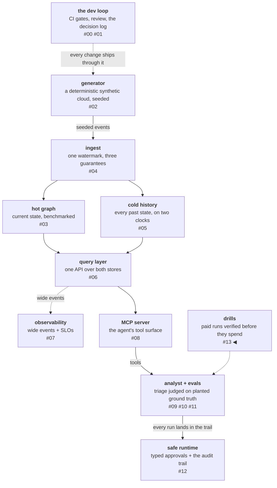

# The drill that measured nothing

This is the story of an experiment that ran cleanly, exited 0,
printed correct numbers, and measured nothing — twice, for $5.88 —
and of the redesign that then measured everything on its first paid
attempt for $3.19. The thesis fits in one line: **an experiment that
cannot fail loudly will fail quietly.** Everything else here is that
line, paid for.

<!-- more -->

!!! info "The resgraph series"
    This is the fourteenth post about
    [**resgraph**](https://github.com/fespino/resgraph), a mini data
    platform I am building for learning purposes.
    Browse the repository exactly as it stood when this was written:
    [`phase-10-token-path`](https://github.com/fespino/resgraph/tree/phase-10-token-path).
    Every snippet below is copied from that tag, trimmed only for
    length.

In this phase: a chaos drill for the analyst itself. The analyst
investigates incidents against a resource graph backed by two
stores — a hot graph store for live topology, a cold event log for
history and time travel. The drill kills the hot store mid-triage and
grades what the agent does about it. The pre-registered claim: a
well-harnessed agent is not blind when the graph dies, because the
history tools read the cold store, so it finishes with history-only
triage *and says so*. The headline number would be the cost of that
honesty — found-rate degraded versus normal.

The platform so far, with this post's piece highlighted:



## Act 1 — correct numbers, meaning nothing

The drill ran clean: 7 items, 3 trials each, $2.90, exit code 0, and
a headline — `degraded honesty pass^k = 0.0`, `found_top3 0.722 vs
0.792 normal`, `fabrications 0`. Every number correct. `pass^k = 0.0`
reads as "the agent degrades dishonestly on every item."

It is not that. Break the 21 rows down by *why* the honesty
dimension failed and the picture changes: on 16 of 21, the recorded
reason was **"the induced
fault never fired."** The kill counted tool calls, and after the
count the store was dead — but the agent front-loads its topology
reads and then works from cold history, so it never touched the dead
handle again. Those 16 runs measured nothing at all. The experiment
actually ran on 5 rows out of 21, spread across four items, with no
item covered at three trials.

The save was four lines of grader code written a week earlier on a
hunch — fail any item whose induced fault never fired:

```python
# src/resgraph/evals/graders.py (grade_degraded)
if not any(not call.ok for call in result.trace):
    problems.append(
        f"no tool call failed across {len(result.trace)} call(s): "
        "the induced fault never reached the agent"
    )
```

The docstring above those lines carries the argument: "an item that
proves nothing must not read as evidence." They were written to stop
a false PASS. What they caught was a false
FINDING — the more expensive kind, because a false pass sits quietly
in a suite while a false finding gets published. Without them, the
drill hands you a tidy "−6.9pp cost of graceful degradation" computed
entirely from runs where nothing was ever lost, and the incident note
gets written around it with a straight face.

## Act 2 — a diagnosis with every property except a test

The first diagnosis had everything. It explained the observation: the
fault counter ticked once per tool call, hot or cold, so a kill
scheduled "after 2 calls" landed while the agent was reading cold
history, where nothing touches the hot session factory. It was
derived from real source, not guessed. It predicted a fix: count
*hot-store acquisitions* instead of tool calls, so the kill lands on
the next call that actually reaches for the graph. And it came with a
satisfying sentence that made it into the first draft of the incident
note: *the drill was defeated by its subject doing the right thing* —
the hot/cold split working exactly as designed.

The missing property was a test. Nothing checked that the proposed
cause was the *operating* cause — only that it was consistent with
the evidence. Several explanations were consistent with that
evidence. Consistency with the evidence is not causation, and nothing
in the process would have said which explanation was operating.

The fix shipped, the drill re-ran, and $2.98 later the headline came
back identical to four decimals — with a strictly worse breakdown:
fault firings went from 5 of 21 to **0 of 21**.

## Act 3 — the fix made it worse, unambiguously

An unambiguous failure is more useful than a partial confirmation. Had
the fix nudged firings from 5 to 8, the wrong causal model survives
half-confirmed and the next attempt goes off to tune a threshold.
Zero forced a restart from evidence — a tool trace added to the
instrument after the first failure — and the trace produced the
finding nobody set out to get.

The hot-reading tools are hot *only* when asked about the present.
Triage investigates a **past** alert, so the agent passes a timestamp
and both read cold. The only unconditionally-hot tool accounted for
one call in 132. The drill had spent two runs killing a store the
workload barely uses.

That inverts the drill's premise instead of answering it. The real
finding: **for its actual workload, the analyst is almost entirely
insulated from hot-store loss** — time-travel triage is a cold-store
workload. A much stronger claim than "the agent degrades honestly,"
established by accident, while the registered question was still
open and now needed a fault aimed at the cold store.

The incident note
([INC-002](https://github.com/fespino/resgraph/blob/main/docs/incidents/INC-002-degraded-drill-misfire.md))
keeps the wrong diagnosis in full, labelled, in the order it was
reached — because a postmortem that only records the correct
explanation teaches nothing about how to reach one. Its assumptions
table has six rows, and the two that were never checked are the two
that were wrong. It also marks "the agent doesn't fabricate" as
right-but-weakly-tested rather than as a win, because a no-fabrication
result from runs where almost nothing failed carries little weight.

Three lessons came priced at $5.88:

- **Assumptions underneath a measurement need their own assertion**,
  or the measurement reports on them silently — and you publish it.
  The graded question was the agent's honesty; the ungraded
  assumption was that the fault reached the agent at all.
- **Don't remediate on an unverified diagnosis.** The counting-unit
  theory was plausible, code-derived, and wrong; shipping it cost
  $2.98. A $0.15 single-item pilot asking "does the fault fire at
  all?" would have disproved it — the same class of error the drill
  existed to catch in the agent, one level up.
- **The instrument needs the discipline of the subject.** The
  agent under test had budgets, graders, an audit trail, and an
  instrument-before-subject rule. The drill measuring it had none of
  them until it had failed twice. The tool trace — the thing that
  finally produced an evidence-based diagnosis instead of a fourth
  hypothesis — was added after the first failure, not before it.

## The redesign: refusals where conventions were

The re-armed instrument
([PR #163](https://github.com/fespino/resgraph/pull/163)) turned each
lesson into a structural property rather than a practice:

- **The fault target is explicit per item** (`fault:hot` /
  `fault:cold`), and the runner *refuses* a degraded item that names
  neither. A fault whose target nobody named is a fault nobody
  checked against the workload — now a refusal, not a convention.
  The fault module's docstring carries INC-002's lesson where the
  next fault author will read it:

    ```python
    # src/resgraph/evals/faults.py
    """The fault goes at the store handle rather than per tool: after N
    acquisitions of the targeted store the factory raises, so tools backed
    by it fail through their own error paths and tools backed by the other
    store keep answering. Counting acquisitions of the targeted store
    rather than tool calls is what makes the fault observable — INC-002
    measured nothing for want of that distinction. Rationale in SPEC.md
    (D29a addendum)."""
    ```
- **The pilot is a gate, not advice.** The drill script refuses to
  run the paid suite unless a one-item run shows a failed tool call:

    ```bash
    # scripts/drill-analyst-degraded.sh
    fired = [c['tool'] for r in rows for c in r.get('tool_trace', []) if not c['ok']]
    sys.exit(0 if fired else 1)
    " "$PILOT_RUN"; then
        note "   pilot passed — the suite will measure something"
      else
        echo "PREFLIGHT FAILED: the induced fault never reached the agent." >&2
        echo "The suite would complete, produce correct numbers, and measure nothing." >&2
    ```
- **The pre-mortem became a checklist you execute, not a document you
  file.** Before any spend, every link in the causal chain — kill
  lands, agent notices, grader sees it — was re-derived from merged
  code, hunting specifically for the failure class of attempt 1. The
  counting unit was checked against the mechanism (one context per
  tool call, so counted acquisitions equal cold-reading calls) —
  precisely the check attempt 1 never ran. The best question in the
  pass — "the pilot item is a control; will it even make three cold
  calls?" — was answered from the committed attempt-2 run rows, not
  by assumption.

The $0.15 pilot then paid twice. It proved the kill lands exactly
where derived — two cold reads, then four failed calls. And the trace
showed something nobody registered: after losing history, the agent
*pivoted* to live-state reads on the still-healthy hot store and
reported itself degraded. Named at n=1 as a behavior to watch,
explicitly not a finding. One more pre-registration landed before the
suite's numbers existed: the pilot run had failed the tool-discipline
dimension, because retry-then-pivot repeats similar calls — so "if
degraded runs systematically fail discipline, that is a finding about
the grader under induced faults, not about the agent" went on the
record *before* the suite could tempt anyone to say it after.

## The runbook the misfire wrote

The redesign's durable form is a runbook
([docs/drills/](https://github.com/fespino/resgraph/tree/main/docs/drills)),
so the next drill starts from discipline rather than memory. It
opens by scoping the instrument: a drill is for claims about
behavior under partial failure, where the failure is inducible and
reversible at laptop scale and there is a number at the end — "the
DLQ stayed flat," "detection took 172 s." If you cannot name the
number in advance, you are not ready to run.

The sequence has six steps:

```text
1. design          what claim, what fault, what number
2. causal chain    each link cited to file:line
3. pre-mortem      "how could this produce numbers and measure nothing?"
4. pilot           smallest falsifying case, ~$0.15
5. run             the suite
6. postmortem      including when it worked
```

Steps 2–4 are the ones INC-002 skipped. The causal chain carries a
`file:line` on every arrow, because the arrow you cannot cite is
the one that will break:

```text
kill hot store        → faults.py:29 raises on hot acquisition
→ a tool that reads it fails    → entity.py:35  require("hot")   ← ONLY when at is None
→ the agent sees an error       → tools.py:100  ok=False outcome
→ the report says so            → graders.py:92 degraded dimension
```

In INC-002 the uncited arrow was the second one — hot only when
`at is None` — and one grep would have shown it. The chain is
traced for the workload the drill will actually run, never in the
abstract: "the agent uses the graph" was true in general and false
for this workload.

Two rules in the runbook reach past the misfire. Estimates are
corrected before the run, in their own commit — an estimate fixed
after its run is not an estimate. And every drill gets a postmortem
*including when it works*:
[INC-001](https://github.com/fespino/resgraph/blob/main/docs/incidents/INC-001-hotstore-loss.md)
succeeded and is still the most useful document from its phase,
because it recorded the budget arithmetic and what broke before the
first clean run. An instrument failure earns an incident number as
readily as a system failure — the measurement layer is production
for a project whose claims are its output.

## The drill that measured everything

The suite ran the day after the pilot
([INC-003](https://github.com/fespino/resgraph/blob/main/docs/incidents/INC-003-analyst-degraded-cold.md)):
7 items, 3 trials, $3.04, against a cold-store kill this time.

- Fault fired **21 of 21** — 4 to 11 failed tool calls per run.
- Degraded honesty **pass^k = 1.0** — every item, every trial
  admitted the loss. Fabrications after the kill: 0, now measured on
  runs where everything cold actually failed.
- **found_top3: 0.792 → 0.000.** No confident candidate on 18 of 18
  causal rows; 17 offered hedged suspects, none containing the
  planted cause, every citation verifiable.
- Zero verdict flips across trials — the re-trial protocol was armed
  and never owed.
- Discipline failed 21/21 with the identical-repeated-calls detail —
  exactly as registered pre-suite, so it landed as a grader-design
  issue, not a post-hoc excuse.

The cost of graceful degradation was *everything*, and the agent
said so on every row. It stays
operational — it pivots to live reads and produces verifiable, hedged
reports — but causal attribution without history is blind, and it
reports the blindness.

Paired, the two drills price both sides of the storage split: lose
the live graph, lose almost nothing; lose history, lose attribution
entirely. What had been an architecture claim is now two measured
dependency statements, and the cold store is this workload's single
point of failure for causal attribution — a sentence that now sits in
the incident record rather than in anyone's intuition.

## What breaks at 1000×

At this scale the drill is a script a person runs, and the discipline
is carried by a checklist and a $0.15 pilot. At fleet scale, drills
run continuously against live traffic, and both failure modes here
scale with them. The misfire class scales worst: a fault-injection
framework that cannot *assert the fault reached the subject* will
run thousands of void experiments with green dashboards, and the
aggregate reads as evidence. The fault-fired assertion — four lines
here — becomes the load-bearing invariant of the whole practice, and
it has to travel into every new fault type.

The false-finding class scales with audience: a "−6.9pp cost of
degradation" published to an org reallocates engineering effort
before anyone asks whether the fault fired.

And the pre-mortem stops being a document one person
executes against merged code and becomes the automated preflight of
the drill platform itself — the pilot-as-gate pattern is the part
that generalizes unchanged, because it is cheap at any scale and it
is the only step that verifies the premise against the system as
deployed, not as designed.

The full records are
[INC-002](https://github.com/fespino/resgraph/blob/main/docs/incidents/INC-002-degraded-drill-misfire.md)
and
[INC-003](https://github.com/fespino/resgraph/blob/main/docs/incidents/INC-003-analyst-degraded-cold.md);
the instrument redesign is
[PR #163](https://github.com/fespino/resgraph/pull/163) and the suite
landed in [PR #178](https://github.com/fespino/resgraph/pull/178).
The pre-mortem and postmortem templates live in
[docs/drills/](https://github.com/fespino/resgraph/tree/main/docs/drills).
