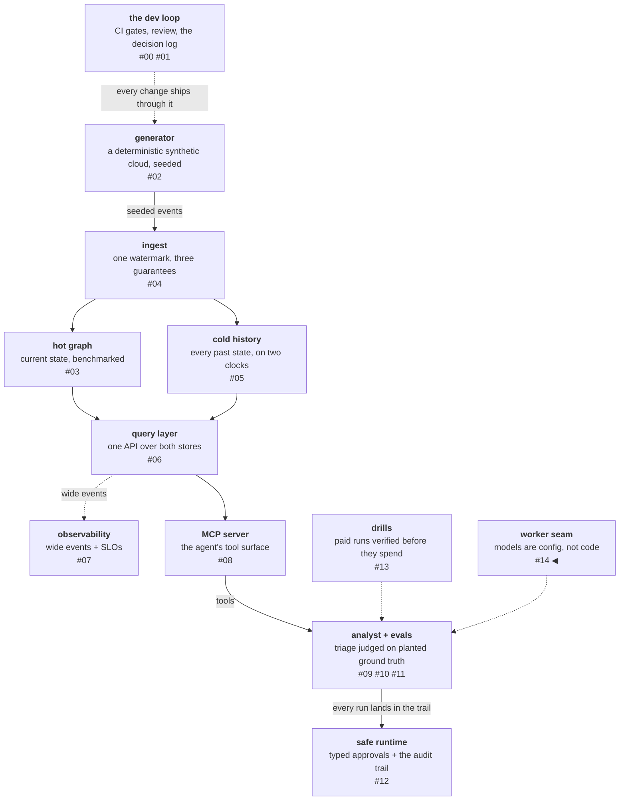

# The eval that doesn't care where a model runs

The forcing function was one sentence in a planning conversation:
"$13 per run is not feasible." The platform's analyst agent had a
certified eval suite, a release gate, and a frontier model — and a
per-run bill that made routine evaluation a budgeting event. The
question stopped being "is the model good?" and became "which model
earns its cost?" — and the harness could not ask that question,
because it only knew how to run one model.

This post is about making an eval harness model-agnostic — the seam,
the gate that had to learn what a worker is, and the three-arm
experiment that then changed the product's default model. The
punchline comes first: an eval that only ever confirmed the frontier
model would have been a press release. This one cost $28 across four
paid runs and changed the default — to the cheap model, which the
arms measured at 8× lower cost per passed triage than the frontier
arm it replaced, with one caveat now designed around. The
generalizable half is not that multiple: it is that neither model
dominated, so which one wins is decided by the cost of the two
error types rather than by a single number.

<!-- more -->

!!! info "The resgraph series"
    This is the fifteenth post about
    [**resgraph**](https://github.com/fespino/resgraph), a mini data
    platform I am building for learning purposes.
    Browse the repository exactly as it stood when this was written:
    [`phase-10-token-path`](https://github.com/fespino/resgraph/tree/phase-10-token-path).
    Every snippet below is copied from that tag, trimmed only for
    length.

In this phase: the analyst's eval suite, release gate, and certified
baseline all exist — built in the previous three posts — and every
one of them assumed a single hardcoded model. This phase makes the
worker pluggable and then runs the three-arm experiment the
pluggability exists for.

The platform so far, with this post's piece highlighted:



## The seam: a worker is configuration, not code

The change is easy to state: the eval *worker* — the model under
test — became provider-pluggable. A worker is an entry in a config
file, the harness resolves it by name, and nothing downstream
branches on where the model runs:

```yaml
# evals/models.yaml
opus:
  provider: anthropic
  model: claude-opus-4-8
  extra_args:
    thinking:
      type: adaptive
```

Two design rules did the real work:

- **Every result row embeds its resolved worker setup**, the same way
  it already embedded the git ref, the prompt fingerprint, and the
  store digests. An eval number is conditional on the model that
  produced it; a row that doesn't say which model is a number you
  cannot compare later.
- **The judge stays pinned** — one frontier model grades every arm,
  regardless of which worker ran. A judge that follows the worker to
  a cheaper model corrupts every comparison at once: the instrument
  must not move with the subject.

The request arguments belong to the worker too, which a 400 error
taught concretely: the first cheap-model pilot died on "adaptive
thinking is not supported on this model," because the runner passed a
thinking flag globally while thinking is a property *of the model*.
The fix moved request kwargs into each worker's config entry, so
selecting a worker self-documents its calling convention and that 400
is structurally impossible. The cheapest bug reports are the ones a
400 files for you: the rejected request named exactly where a
per-model fact had been misfiled as a global flag.

## The gate had to learn what a worker is

The release gate compares committed runs against a certified
baseline, and a pluggable worker breaks its core assumption: a
cheaper model's lower pass-rate on the same items *looks exactly like
a regression*. The gate would block it — wrongly, because a weaker
worker is not a code regression, it is an arms comparison.

So the gate learned one distinction. The certified baseline now
records the worker it was certified on; every aggregate records the
single worker of its run; and the gate keys on the pair. In directory
selection it *skips* a foreign-worker run the way it skips a
companion dataset — named in the skipped list, visible, never
silent. The selection function's docstring carries the rule:

```python
# src/resgraph/evals/gate.py
def gate_skip_reason(rows: list[dict[str, Any]], baseline_model: str | None = None) -> str:
    """Empty when this run is a gate candidate; otherwise why it is not.
    Companion sets, sub-k runs, and runs of a different worker than the
    baseline are all "not a gate candidate" (D29b/D29c), so selection skips
    past them to find the newest run it can verdict — a weaker local worker is
    an `arms` comparison, not a regression against the certified baseline."""
```
Asked to compare one directly, it *declines* with a reason that
points at the arms command, never a block. The practical consequence
was the answer to "do we need to redo all the captured data to run a
new model?" — no, and the answer came from the code, not from hope:
the certified baseline stands, and any new arm lands beside it as a
labeled comparison.

## The instruments got fixed before the money moved

A pattern ran through the phase: every paid experiment kept getting
postponed by an instrument fix the experiment itself demanded, and
each fix was cheap code with no spend. The gate's run selection had
gone quietly useless: once drill evidence was committed, "newest
run" always picked a companion set, so the gate declined on every
PR — accurate, and useless; a check that always says the same thing
has stopped being a check.

The skill ledger's "invoked" stage
was reading tool *names* when the question was about tool *arguments*
— "used two tools" is not "followed the method" — and it had to be
fixed before the paid run, because a ledger can only be sharp if the
run recorded the arguments. And a new `verify` command — every row
used tools, one fingerprint, item and trial counts exact — earned its
keep the same day it shipped by refusing a truncated 17-of-90 partial
before it could be compared.

There is a base rate behind that discipline: at one point mid-phase,
2 of 7 paid runs had met their registered objective. Each miss individually had a
defensible story and genuine salvage; in sequence they read like a
string of successes. The correction was procedural — postmortems lead
with objective-met-or-not, a standing ledger of every paid run
against its registration — and the instrument fixes above are what
that correction looks like in practice: verify the premise cheaply,
before the run that spends on it.

The same reset drew a scope line: after the
arms merged, three new research threads opened in a single day, each
individually interesting, and the correction was blunt — open issues
are not a queue; the phase charter is. A research thread earns a
label, not a lane. An eval program generates follow-up questions
faster than any team can run them, and a program that chases each
one is how excellent hygiene quietly stops shipping.

## The arms: three models, one harness, no code changes

The experiment itself was pre-registered with a pre-mortem per arm
and a halt condition: any fabrication count above the baseline's
stops certification. Every arm ran the same 30 items, three trials
each, with the judge pinned throughout.

**The cheap arm** ($1.62) hit the halt — 2 fabricated graph edges —
so it produced a characterization, not a certification. The
characterization was surprising on both ends: Haiku traces real
causal chains essentially as well as the tools allow (1.00 on direct
causes, 0.92 on multi-hop chains), but on *control* items — where the
honest answer is "there is no cause here" — it failed honesty on 15
of 18 trials, naming high-confidence culprits out of nothing, and in
several rows setting its own "no confident candidate" flag while
still listing suspects. From this arm alone, a story formed: the
harness transfers pathfinding, not judgment; the frontier earns its
cost on abstention.

**The reference arm** ($12.80) is why that story never shipped.
Running the frontier comparand inverted it:

| arm | pass^k | $/passed | p50 latency | fabrications | control (honesty) | transitive (recall) |
|---|---|---|---|---|---|---|
| haiku | **0.63** | **$0.085** | **20s** | 2 | 0.17 | **0.92** |
| sonnet | 0.567 | $0.706 | 106s | **7** | 0.44 | 0.50 |
| opus | 0.60 | $0.711 | 47s | **0** | **0.78** | 0.25 |

Opus abstains correctly on controls (0.78) *and incorrectly on hard
real causes* — on depth-3 chains it mostly returns "no confident
candidate" rather than committing to the multi-hop path (0.25), and
that is not a budget artifact: no cutoffs, well under the tool-call
cap. It never fabricates. Haiku is its mirror: it cracks the hard
chains and over-accuses on empty ones. The two models sit at opposite
ends of a **commit↔abstain axis**, and neither dominates — on raw
pass^k the frontier is slightly *worse* (0.60 vs 0.63) at 8× the cost
and 2.3× the latency. Which model wins is a function of the cost of
the two error types: false accusation versus missed cause. "Better"
is not scalar here.

Two methodological points paid for themselves:

- **The aggregate is a lie the slices expose.** 0.60 vs 0.63 reads as
  a tie and hides opposite strengths — the second time in one phase
  that the slice table overturned the headline number.
- **The single-arm extrapolation was wrong, and only the reference
  arm caught it.** Concluding "the frontier wins on judgment" from
  the cheap model's weakness alone is exactly the trap; the comparand
  is not optional.

**The middle arm** ($12.00) completed the map and set the second
methodological punch. The registered question was whether Sonnet
pairs the cheap model's recall with the frontier's honesty. It pairs
the mediocrity of both: recall below Haiku, honesty far below Opus,
the most fabrications (7), the lowest pass^k (0.567), the worst
latency, at near-frontier cost — dominated on every axis. And the
*registered decision rule* — "Sonnet pass^k within 0.07 of Opus →
flip to Sonnet" — evaluates *true* (0.567 ≥ 0.53). A scalar rule
would have picked the dominated model, blind to the fabrications, the
latency, and the absent saving. First the aggregate hid the
inversion; then a scalar rule nearly institutionalized it. The
decision surface is the slice profile × cost × latency ×
fabrications, never one number.

## The decision, with its asterisk

The arms changed the product. The cheap model became the default
analyst worker — in the production triage CLI and the eval harness
both — on the strength of the highest pass^k, the best recall, and,
against the frontier arm it replaced, 8× lower cost and 2.3× lower
latency. The frontier model stopped being
the default and became a periodic reference arm, watched for honesty
drift. The judge stays pinned on the frontier regardless.

The caveat ships with the decision and is load-bearing: the default
worker is *surface-for-review*, not an autonomous verdict, because it
over-attributes on empty cases and occasionally fabricates. A
follow-up arm tested whether the investigative playbook the agent
carries could close that gap cheaply. It cannot — the same
intervention that makes the cheap model better at *finding* makes it
worse at *knowing when not to*: with the playbook, recall rises
(three items flip from fail to pass) while control honesty drops
further and fabrications tick up. The caveat is a hard property of
the model, not a prompt bug, so the playbook is kept for recall and
its honesty cost is accepted — and designed around, by keeping a
human on the other side of every report.

## The local coda: the seam survives a model that doesn't fit

The original plan had the daily driver running locally. The $0 pilot
proved the seam end to end — a local model emitted valid tool calls
through the translation layer, the row landed with its full worker
setup embedded — and the honesty guards fired on their first
non-Anthropic model: the tiny 1.5B fallback hallucinated four
entities that appeared in none of its tool results, the validators
caught every one, and no valid report was produced. The guards are
provider-agnostic in fact, not just by design.

The intended 7B model never loaded: it needs ~5.1 GiB and the
container VM on an 8.6 GB laptop caps out at ~3.8. The seam turned
that from a code failure into a deployment fact — "the local daily
driver wants a ≥16 GB host" is a config statement, not a rewrite —
and the config says so plainly: the 1.5B entry is labelled a seam
smoke worker that fabricates. Committing a weak model is fine;
presenting it as a viable analyst is not.

## What breaks at 1000×

At this scale the arms table is a page and the decision was made by
two people reading slices. At fleet scale the failure modes are
institutional. The single-number leaderboard is exactly what
procurement wants, and the slice profile does not survive the slide
deck — the counter is the one this experiment stumbled into:
register the decision *rule* in advance, then check whether the rule
survives contact with the slices — this one didn't, and discovering
that before the meeting is the whole game. Arms stop
being an event and become a pipeline run per model release, at which
point the reference arm's cost dominates the budget and the pinned
judge becomes the scarce resource — the judge-drift question (who
re-certifies the instrument?) goes from academic to quarterly. And
the commit↔abstain axis stops being a curiosity: routing by error
cost — cheap high-recall model to surface, expensive high-precision
model to confirm — is the standing architecture, which means the
harness must price *pairs* of models, and the eval that didn't care
where a model runs has to stop caring how many models a verdict took.

The decision record is D29c in
[SPEC.md](https://github.com/fespino/resgraph/blob/main/SPEC.md); the
full arms write-ups with every number quoted here are in
[EVALS-HISTORY.md](https://github.com/fespino/resgraph/blob/main/EVALS-HISTORY.md);
the worker-aware gate is
[PR #195](https://github.com/fespino/resgraph/pull/195), and the seam
and pilots landed under
[#192](https://github.com/fespino/resgraph/issues/192).
