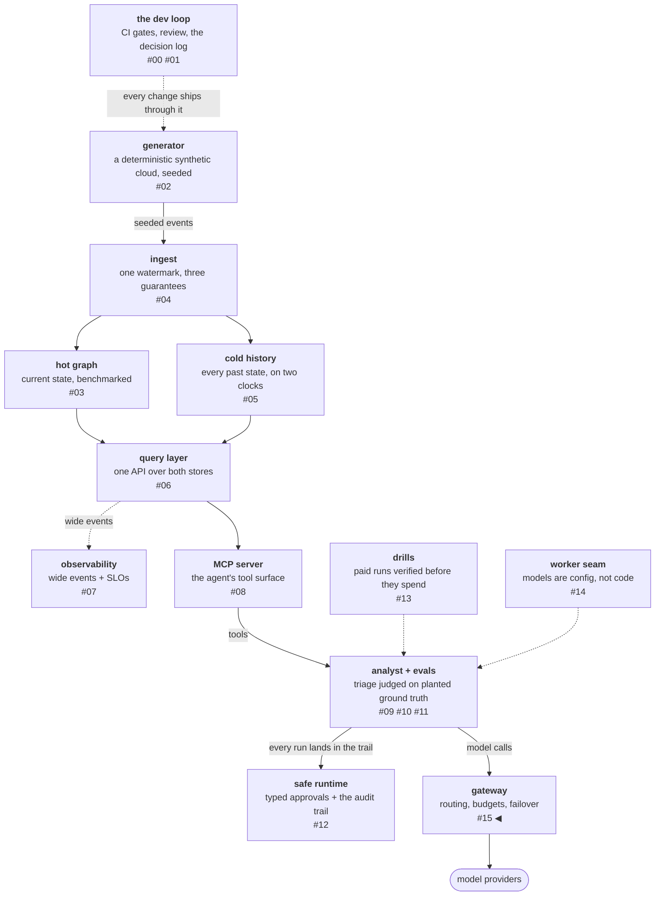

# Two backends is failover with telemetry, not load balancing

After the model arms picked a daily driver, the platform had models
in two places — a local engine and a metered API — and three
consumers (the analyst, the eval runner, the graders' light calls)
each wiring providers by hand. The fix is the obvious one, a model
gateway: one process fronting both backends behind one endpoint, the
[routing pattern](https://www.anthropic.com/research/building-effective-agents)
applied to model selection.

With two backends that differ 10× in latency and infinitely in cost
(one is free, one is per-token), symmetric load balancing is a
category error — there is no "balance" between a laptop GPU and a
metered API. What this actually is: failover with telemetry. The
structure generalizes to N backends; the balancing claim would not,
so it is not made.

<!-- more -->

!!! info "The resgraph series"
    This is the sixteenth post about
    [**resgraph**](https://github.com/fespino/resgraph), a mini data
    platform I am building for learning purposes. The
    gateway is not yet under a phase tag — browse it
    [on `main`](https://github.com/fespino/resgraph/tree/main/src/resgraph/gateway);
    snippets below are from `main` at the time of writing, trimmed
    only for length.

In this phase: the serving layer — the gateway's routing vocabulary,
its streaming semantics, the meter that prices every call, and the
load test that found the knee.

The platform so far, with this post's piece highlighted:



## Vocabulary before code: three questions, three real bugs

The routing core was built, green, and wrong three ways — and each
defect was caught by a review question about *words*, before any
traffic.

"How does this work with the config where we define models by name?"
— the router spoke raw provider model ids and inferred the backend by
sniffing the id's prefix: a second naming vocabulary, drifting from
the config, that lies the moment a hosted chat-completions model
appears. "Is *worker* the right word here?" — no: worker names an
eval *role* (worker vs judge); the gateway is roleless, and the wire
word every OpenAI-compatible client already sends is `model`,
carrying a config alias. "Shouldn't the file be called models.yaml?"
— it always held setups that both roles resolve from; renamed.

The ending vocabulary is one word per concept: a **setup** (the
config entry), **worker/judge** (eval roles), **model** (the wire
field, carrying an alias), **backend** (where a setup runs, derived
from its provider at dispatch, never from its name). The review
question that kept paying all phase: *who is the authority for this
knowledge, and is anyone quietly duplicating it?*

## The winning tier is a field, not a hunt

Selection resolves by precedence — `pin` (exact alias, no fallback,
no substitution), explicit `model` override (fallback allowed),
`task_class` default, global default — and the tier that won is
recorded on every response and every metric:
`source ∈ {pin, override, task_class_default, global_default}`. The
resolver is a straight fall-through, each tier stamping its source:

```python
# src/resgraph/gateway/router.py (resolve)
if pin:
    return RouteDecision(
        model=pin,
        source="pin",
        fallback_allowed=False,
        rationale="pinned: exact model, no fallback, no substitution",
    )
if model:
    return RouteDecision(model=model, source="override", fallback_allowed=True, ...)
if task_class is not None:
    route = table.get(task_class)
    if route is None:
        raise ValueError(f"unknown task_class {task_class!r}; have: {sorted(table)}")
    return RouteDecision(model=route.model, source="task_class_default", ...)
return RouteDecision(model=g.model, source="global_default", ...)
```

That one field is the difference between "why did this call cost
40×?" being a query and being an investigation. The pin tier exists
for exactly one client, the eval judge: a pinned judge that silently
reroutes to a cheaper model is a corrupted baseline, so a pin fails
loudly instead of degrading. The task-class defaults are registry
data with per-entry rationale refined by eval evidence — reasoning
traffic to the model the arms chose, bulk and classification traffic
to the free backend — and every routed alias must exist as a setup,
which is tested.

The registry needed one more rule, found in review: the walk and the
probe schedule originally derived their provider set from the *whole
setups file* — so a catalog-only entry (a hosted example nobody
serves) would have been probed every 15 seconds and could receive
silent fall-forward spend. The amendment: **the registry is the
serving authority; the setups file is a catalog.** The gateway
serves, walks to, and probes only what its registry routes. Notably
this reversed a deliberately-tested behavior — the earlier test
encoded the wrong authority and now proves the opposite, which is
what a test is for.

## Pure policy, thin shells

The serving slices shipped as offline state machines with I/O
shells: dispatch (health with gradual readmission, bounded admission
with a drain-derived Retry-After, choice that cannot pick a dead
backend), a clockless stream accountant, the relay as a generator
(lifecycle cleanup free via GeneratorExit), a probe round driven by
an injected clock behind a two-line thread shell. Every routing and
health rule tests without a socket; the untested surface is stdlib.
When a review claim sounded like a decision — "the TTFT estimate
deliberately shares one series across streamed and non-streamed
calls" — the challenge was "that would require at least a test,
right?" It does, and it got one whose body states the intent.
Deliberate-and-defensible without a test is just a claim.

## Streaming: the fabrication rule reaches the wire

The eval suite's oldest rule is that a fabricated claim fails
unconditionally. Streaming gives that rule a serving-layer
translation, built on one split:

- **Init failures** — connection refused, auth, unknown model, a 429
  before the first token — fail over transparently to the next
  eligible backend. Every hop appends to a `fallback_chain`; a chain
  longer than one raises an alert, because the system degraded
  silently and the operator must know. A zero-token death *is* an
  init failure: nothing reached the client, so a silent restart on
  the other backend is observably identical.
- **Mid-stream death** — the backend dies at token 500 — is never
  transparently retried. Tokens already reached the client, and a
  replay can diverge; "continue from token 500 on backend B" splices
  two models' outputs into a completion no model produced — the
  streaming version of a fabrication, disqualifying, not a
  trade-off. The gateway emits a structured `stream_error` event
  (tokens emitted, backend, reason) and the *client* decides; the
  analyst treats it like a budget cutoff — degraded, stated. The
  rule is enforced by construction: no resume path exists in the
  codebase to misuse. The relay's docstring carries the whole
  split:

    ```python
    # src/resgraph/gateway/relay.py
    """Relay one opened stream to SSE. A zero-token death restarts silently
    via ``reopen`` (which walks like an init failure and returns the next
    opened stream, or None when the walk is exhausted); a death after any
    token surfaces a ``stream_error`` and ends the stream. The admitted
    backend slot is released on every exit, including a client disconnect
    closing the generator mid-stream."""
    ```

One integration bug got through, and a question caught it: the
first streaming
implementation quietly *bypassed* the
provider seam with a duplicated payload builder — which had already
dropped the channel that carries per-worker request kwargs. Caught
not by a test but by the question "is this well integrated with the
seam?"; streaming moved inside the seam client, one payload builder
for both shapes. Duplication is where integration bugs incubate.

## The meter prices, and the meter's own accounting bugs

The gateway is the uniquely correct place to meter cost: it is the
one component that sees every call with its usage, task class,
routing source, and backend. So it prices every call into a
`gateway_cost_usd` distribution sliced by exactly those labels, and
cost-per-task became an SLO, not only a cap — because the cost
mechanisms catch different failures. Hard budgets catch catastrophe
(the runaway loop) but not drift; the eval cluster's $-per-passed
prices a model offline, per experiment; only a watched per-task
objective catches the prompt edit that doubles per-task tokens on
day one. In a per-token economy, a cost regression *is* a
reliability regression.

Availability is defined as served-or-*explicitly*-failed over total,
proven by test to hold 1.0 under 429s and surfaced stream errors —
an explicit refusal counts as availability; a spliced retry would
count as success and be a lie.

Then the meter itself went through review, and all three findings
were on vocabulary edges, none on the happy path:

- **Label drift hides in failure paths.** The request counter's
  three failure sites omitted the task-class label the served sites
  carried — so per-class cost views would silently drop exactly the
  failures they exist to show.
- **An unrecorded outcome class is a lie of omission.** Client
  disconnects released the admission slot and vanished from the
  books; they are now a named outcome in the availability
  vocabulary. Silence is not success.
- **A hit-only cache meter flatters itself.** Hits were recorded for
  both cache layers, misses for neither, and the dashboard ratio
  divided hits by *total requests* — share-of-traffic dressed as a
  hit rate. Misses are now counted per layer and the ratio is a true
  rate.

The meta-lesson generalizes past metrics: review findings cluster
where vocabulary is incomplete — missing labels, uncounted outcomes,
one-sided ratios — because the happy path gets tested by
construction and the edges accumulate silent wrongness.

## The load test ran twice, because the first run measured artifacts

Capacity numbers are the easiest place in the phase to lie by
accident, and the first run managed two accidents before any number
was kept. The single-concurrency step was contaminated by cold model
load (no warmup — TTFT read 33 s on a sample of two). And the load
client ignored the gateway's own Retry-After, hammering 51
rejections per second into the books — a load test that ignores the
server's stated contract is testing a client that shouldn't exist.

The second run's method is the first run's two lessons applied,
plus the cache trap registered at design time: analyst-shaped
streamed requests (the analyst's ~3.6k-token system prefix plus the
registry's five tool blocks, ≈ 4.4k tokens of prefix;
`max_tokens` 64), `cache_responses: false` with a per-request nonce
so no cache layer sits in the measurement path, one warmup request
loading the model off the clock, and a client that honors
`Retry-After`. Steps run 45 seconds at concurrency 1, 2, 4, 8 — not
the 10-minute steps a fleet test would use, so n per step is small
and stated rather than averaged away:

| c | n | ok | 429 | TTFT p50 | TTFT p95 | agg tokens/s |
|---|---|----|-----|----------|----------|--------------|
| 1 | 10 | 10 | 0 | 0.54 s | 11.7 s | 6.1 |
| 2 | 15 | 15 | 0 | 2.7 s | 33.2 s | **8.7** |
| 4 | 9 | 9 | 0 | 22.7 s | 26.0 s | 5.3 |
| 8 | 97 | 9 | 88 | 18.7 s | 27.8 s | 5.7 |

The findings follow, each one a prediction confirmed in the run's
own data:

- **The knee sits between concurrency 2 and 4, and it belongs to the
  model server, not the gateway** — throughput peaks at 2, falls at
  4, TTFT p50 jumps from 2.7 s to 22.7 s. The gateway's own overhead
  never appears in the curve; the throughput lever lives behind it.
- **Beyond the knee, degradation is loud and flat** — 88 orderly
  429s with drain-derived Retry-After, zero errors, throughput held.
  The bounded queue (an in-flight cap of 4 for the local backend)
  does exactly what it was built for: request cost is unknown at
  admission (the output length isn't in the request), so a full
  queue refuses rather than scaling the pool.
- **TTFT at low concurrency is bimodal** — 0.54 s with KV reuse
  versus ~11.7 s cold prefill of the 4.4k-token prefix. The mean of
  a bimodal TTFT describes no request that ever happened; the
  distribution is the deliverable, not its average.

Three disciplines from earlier posts visibly paid rent: every cache
layer was kept out of the measurement path by flags registered at
design time (the caches get their own post — a serving optimization
must be audited against every measurement path, and this platform
has three the caches would silently corrupt); the run was $0 *by
construction*, because the pin makes the paid backend unreachable —
the measured-run posture as a safety property, not only a
comparability one; and the objectives math stayed anchored to
measurement — the local backend's SLOs derive from the healthy
region at measured × 1.5 (TTFT p95 ≤ 50 s from the measured 33.2 s;
an aggregate throughput floor of ≥ 5 tokens/s), and the paid
backend's are deliberately unset, because two pilot samples are not
a baseline.

One labeling note is really a methodology note: on an 8.6 GB
laptop (an Apple M3, with the ollama model server in a container VM
capped at ~3.8 GiB) the local backend runs a 1.5B model
(qwen2.5:1.5b, Q4_K_M) — adequate for the bulk
and classification duty it serves and as the killable region for the
failover drill, useless for triage. The gateway measures serving
*shapes* at laptop scale (knees, refusal behavior, failover
semantics), not triage quality, and every number is labeled with its
hardware, with no fleet extrapolation.

## What breaks at 1000×

The title's restraint is also its scaling limit. At N heterogeneous
backends the structure holds — precedence, recorded source, health
walks — but choice within a tier becomes real scheduling, and the
EWMA-of-TTFT heuristic gives way to actual queue-state feedback; the
knee analysis then has to be run per backend class, because the
capacity lever still lives in the model servers and a fleet has
several different ones. The recorded-source field stops being a
debugging convenience and becomes the substrate of cost attribution
— at fleet volume, "which tier chose this backend and what did it
cost" is the input to routing-policy reviews, budget enforcement,
and the argument between teams about who pays for fall-forward. And
the mid-stream fabrication rule gets more expensive exactly where it
matters more: at scale the temptation to resume dead streams grows
with their frequency, and the defensible line stays the one drawn
here — a structured error the client handles beats a spliced
completion no model produced, at any volume.

The decision records are D30–D33 in
[SPEC.md](https://github.com/fespino/resgraph/blob/main/SPEC.md);
the build landed as
[PR #202](https://github.com/fespino/resgraph/pull/202) (router),
[#203](https://github.com/fespino/resgraph/pull/203) (dispatch),
[#204](https://github.com/fespino/resgraph/pull/204) (accounting),
[#205](https://github.com/fespino/resgraph/pull/205) (server),
[#207](https://github.com/fespino/resgraph/pull/207)
(streaming),
[#208](https://github.com/fespino/resgraph/pull/208) (entrypoint and
probes), [#212](https://github.com/fespino/resgraph/pull/212)
(metrics), and [#215](https://github.com/fespino/resgraph/pull/215)
(the load test); the raw load-test rows are
[docs/capacity-load-results.json](https://github.com/fespino/resgraph/blob/main/docs/capacity-load-results.json).
