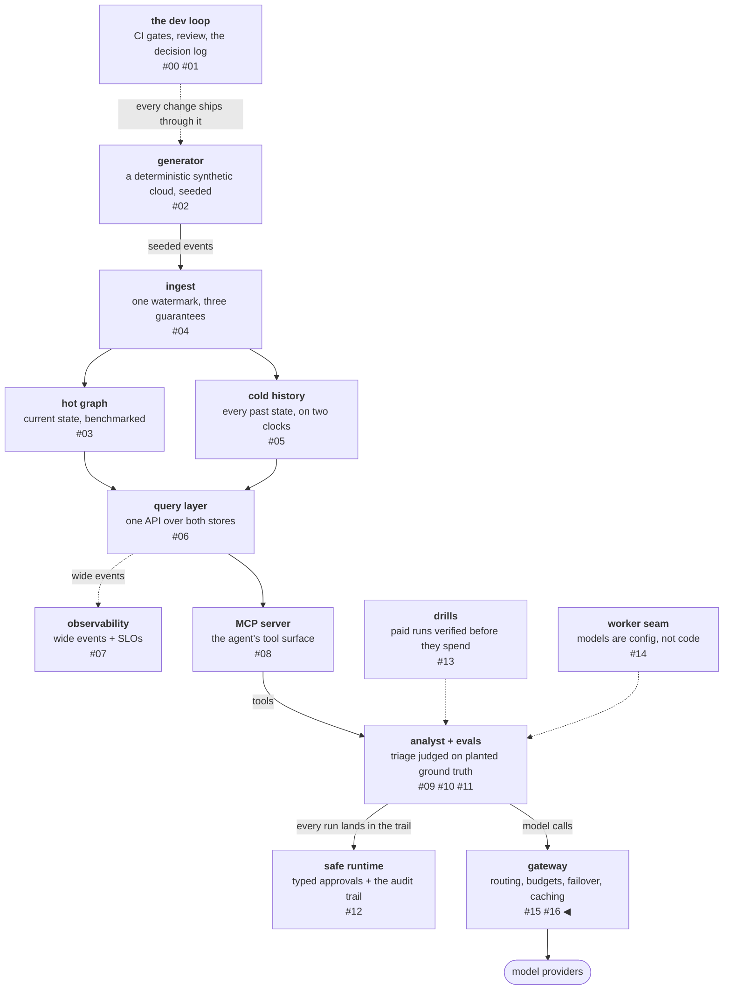

# Cache the investigation, never the answer

The gateway from the last post has two cache layers. The provider's
prefix cache saves work on a *shared prefix across different
requests* — the analyst's system prompt and tool schemas, identical
on every call. The gateway's own response cache saves work on
*identical full requests* — the same bytes in, the stored response
out. The two layers solve different problems and fail in different
ways, and almost everything that went wrong or almost-wrong in
building them came from letting intuitions about one leak into the
other. This post keeps them apart.

The deeper finding is the title: for an investigating agent, cache
the steps of the investigation, never the answer — the answer must
be earned against the live world on every request. The post gets
there in order: first the proof that the gateway never breaks the
provider's cache, then the two rules that govern the response
cache, then the three review questions that produced that
invariant, and finally the replay receipts that measured both
layers.

<!-- more -->

!!! info "The resgraph series"
    This is the seventeenth post about
    [**resgraph**](https://github.com/fespino/resgraph), a mini data
    platform I am building for learning purposes. The
    gateway is not yet under a phase tag — browse it
    [on `main`](https://github.com/fespino/resgraph/tree/main/src/resgraph/gateway);
    snippets below are from `main` at the time of writing, trimmed
    only for length.

In this phase, continued: the gateway's two cache layers — the
provider's prefix cache the gateway must not break, and the
response cache the gateway owns.

The platform so far, with this post's piece highlighted:



## The prefix cache: the gateway's job is to not break it

The provider-side prefix cache predates the gateway; the platform's
prompt architecture was cache-aware from birth, with a stable
prefix and tools placed before variable content. The gateway's
obligation is purely negative: it must route without reordering or
rewriting messages, and it must pass the per-request cache-usage
fields through, because a gateway that busts its upstream's cache
is a net negative at any hit rate.

Writing the *proof* of that obligation found two holes that had
survived every existing test. The gateway's request model rejected
the analyst's production system shape — a block list carrying
`cache_control` — so the caching discipline literally could not pass
through the hop. And the response model dropped the provider's cache
usage fields, which means the hit-rate instrumentation would have
read zero through the gateway forever, indistinguishable from a dead
cache.

The first hole carries a testing lesson: *incidental coverage is not
regression coverage*. The one guard that existed was there because a
fixture happened to use blocks; the obligation is now stated by
tests named after the claim they prove:

```python
# tests/test_gateway_server.py
def test_cache_usage_fields_pass_through_the_hop(tmp_path):
    client, _ = caching_harness(tmp_path)
    r = client.post("/v1/generate", json=dict(ANALYST_SHAPED_BODY))
    assert r.status_code == 200
    assert r.json()["usage"]["cache_read_tokens"] == 900
    assert r.json()["usage"]["cache_creation_tokens"] == 25


def test_cache_control_marks_survive_the_hop_untouched(tmp_path):
    client, received = caching_harness(tmp_path)
    assert client.post("/v1/generate", json=dict(ANALYST_SHAPED_BODY)).status_code == 200
    kwargs = received[0]
    assert kwargs["system"] == ANALYST_SHAPED_BODY["system"]
    assert kwargs["messages"] == ANALYST_SHAPED_BODY["messages"]
    assert kwargs["system"][0]["cache_control"] == {"type": "ephemeral"}
```

The second lesson rode along in the same PR: *a fake smart enough
to be wrong needs tests of its own*. The harness had a memoizing
cache fake, and it got cut for a dumb one whose assertions carry
the proof.

The offline proof then got its one paid receipt, with the
pre-mortem treatment every paid run gets here. Attempt 1 failed
through the pre-mortem's own registered failure mode, and the
registered guard — cache-creation tokens must be nonzero before
anything is read into call 2 — stopped any false conclusion. The
pilot's prompt was the analyst's system prefix alone, 3,611 tokens,
which sits *under* the provider's 4,096-token cacheable minimum: the
provider cached nothing, and the attempt cost $0.007. The premise
was wrong in an instructive way, because the production analyst
caches fine — its tool schemas serialize into the prefix and carry
it over the minimum. The prefix you cache is bigger than the prompt
you wrote.

Attempt 2 ran at the production analyst shape, about 4.4k tokens,
and behaved exactly as registered: 4,800 cache-creation tokens on
call 1, 4,800 cache-read tokens on call 2, through a running
gateway hop, with the gateway's own response cache provably out of
the way. The whole receipt cost three cents. The division of labor
is deliberate: fakes prove the gateway can never regress its half,
and one paid pair proves the provider's half, once.

## The response cache: eligibility is data, hits confess

The second layer maps a full-request hash — the alias plus
canonical request kwargs — to a completed response, holds each
entry for 15 minutes, and bounds the table with LRU eviction.
Identity is the full request semantics:

```python
# src/resgraph/gateway/cache.py
def cache_key(alias: str, kwargs: dict[str, Any]) -> str:
    canonical = json.dumps({"alias": alias, "kwargs": kwargs}, sort_keys=True)
    return hashlib.sha256(canonical.encode()).hexdigest()
```

A one-token difference is a different resource, which is precisely
where HTTP's URL-plus-Vary intuition breaks down for model serving.

Two rules govern the layer, and both are enforced in the serve path
itself:

- **Eligibility is data, and narrow.** Only non-streamed requests
  whose serving setup declares `temperature: 0` are cacheable — the
  deterministic local workers qualify; the sampled paid setups never
  do, because replaying one random draw as *the* answer would pass
  off a sample as a truth. Streams are never cached.
- **A hit says so.** Every served-from-cache response carries
  `cached: true`, with usage preserved from the original generation.

```python
# src/resgraph/gateway/server.py (the serve path)
# The response cache answers only byte-identical repeats of
# deterministic requests: a temperature-0 setup, non-streamed. A
# sampled response replayed as the answer would be a quiet lie, so
# anything else is a pass-through — and a hit says cached=true.
key = None
if req.cache_responses and gw.setups[first].get("temperature") == 0:
    key = cache_key(first, _request_kwargs(gw, first, req))
    hit = gw.cache.get(key)
    if hit is not None:
        return hit.model_copy(update={"cached": True})
```

## Three questions, escalating

Each review question found something its premise didn't predict.

**"Couldn't this serve stale results?"** Classic staleness turns out
to be structurally absent — and the reason is load-bearing. The
model has no side channel to the data stores: the world state the
analyst reasons over lives *in the request bytes*, fetched
harness-side and delivered as tool results. A changed world is a
changed byte sequence is a different key is a miss.

But the question flushed out a hazard its premise didn't name:
**the cache is an instrument hazard.** This platform has three
measurement paths a response cache would silently corrupt — the
eval suite (k identical trials served from cache replay one draw,
and pass^k collapses into pass@1), the load test (byte-identical
replayed traffic absorbed by the cache idles the backends, and the
measured knee is the cache's, not the model server's), and the
failover drill (cached replays mask the killed backend, reporting
resilience the serving path never demonstrated). All three share
the failure shape named in
[INC-002](https://github.com/fespino/resgraph/blob/main/docs/incidents/INC-002-degraded-drill-misfire.md),
the drill-misfire postmortem: a run that completes, produces
numbers, and measures nothing — this time delivered by an
optimization instead of a bug.

The mitigation is a `cache_responses: false` flag on every measured
call, honored on read *and* write —
`test_cache_responses_false_bypasses_read_and_write` states the
claim — and it was registered at design time rather than discovered
at drill time. A serving optimization must be audited against every
measurement path, not just the traffic.

**"Do we always send the entire world state?"** No — and precision
here matters: the request carries the *observed slice*, not the
world. What the agent fetched this turn is in the tool-result bytes;
what it never observed is invisible to model and cache alike. That
forced the design documentation to show analyst-shaped traffic — a
tool-use turn, the tool result carrying the fetched resource with
its config version and `fetched_at` — instead of toy prompts.

**"What if the world changes under the same question?"** This
produced the convergence invariant. The question alone never
produces the answer — the analyst investigates. A pre-tool turn can
only cache the model's decision of *what to look at*, which a
deterministic model emits identically for identical bytes anyway.
The tools then execute live against the current stores — tool
execution is never cached by this layer — and a changed world
enters the next turn's bytes, which produces a different key, a
miss, and fresh reasoning from that point on.

For an entire run to be served from cache, every tool result must be
byte-identical to a prior run's — that is, the world, as observable
through the tools, did not change. And since every tool envelope
carries `fetched_at`, even that is rare outside deliberate replays:
cross-run hits effectively occur on pre-tool turns and in the replay
traffic the layer exists for. The answer is never cached; the
investigation's steps are.

The response-cache PR carries the counterexample that bounds the
claim: a world change *invisible to the tools* can make a cached
answer wrong — and it makes the fresh answer identically wrong.
That defect lives in what the tools can see, not in cache policy.
The remaining window is a model swapped under the same alias inside
one TTL.

## The replay receipt: the path that had never run

The phase's exit gate demanded a measured hit-rate table on replayed
production traffic — and collecting it delivered the phase's
cheapest lesson. The eval-suite-through-gateway wiring, the exact
path the headline claim rested on, had *never executed*: the paid
pilot had gone through the seam client directly. "The suite is wired
to the gateway" was a claim about a code path, and a code path that
has never run is a hypothesis.

The $0 rehearsal — one recorded item replayed twice with the
response cache on — crashed twice before it measured anything. The
eval CLI assumed every setup carries a `model` key (gateway setups
don't; the gateway resolves serving). Multi-turn conversations died
serializing echoed tool-use blocks back onto the wire. Both got
fixes with regression tests, and both are exactly what the rehearsal
was for: the crashes were the receipts.

Then the numbers came in better than registered. The replay hit 4
of 4 cacheable lookups, covering the whole recorded four-turn
investigation byte-for-byte: it served 432.6 seconds of recorded
local generation in 0.07 seconds and left 13,634 backend tokens
unspent, while sampled traffic stayed uncacheable by design.

The paid receipt passed first try (~$0.12): a normal suite row
whose new `llm_trail` field records the winning source, backend,
and cache outcome for every call, so the per-call *outcome* now
sits beside the routing *intent* the rows already carried.

## What breaks at 1000×

The response cache's rules are the fragile ones. At multi-tenant
scale, "identical bytes" can span users, and a shared full-request
cache becomes a cross-tenant information channel unless identity
joins the key — the single-user design gets to ignore what a fleet
cannot.

The measured-run bypass also stops being a flag a disciplined client
remembers: with hundreds of eval and drill consumers, run context
has to propagate structurally (the way trace context does) so that
*being a measurement* is a property the platform enforces, not a
convention each script honors.

The convergence invariant itself scales cleanly — it depends only on
"the model has no side channel to the stores," an architecture
property to defend at any size. And the prefix cache flips from
optimization to economics: at fleet volume the prefix-cache hit rate
is a line item that dwarfs the response cache's savings, which means
the gateway's purely negative obligation — don't break the upstream
cache — becomes a tested invariant on every routing change, exactly
as it is here, just with more zeros on the bill it protects.

The decision record is D32 in
[SPEC.md](https://github.com/fespino/resgraph/blob/main/SPEC.md).
The prefix-cache proof is
[PR #210](https://github.com/fespino/resgraph/pull/210) and its paid
receipt [PR #214](https://github.com/fespino/resgraph/pull/214); the
response cache — with the full worked example, the world-change
counterexample, and the convergence argument — is
[PR #211](https://github.com/fespino/resgraph/pull/211); the replay
table and the suite-through-gateway receipt are
[PR #221](https://github.com/fespino/resgraph/pull/221).
