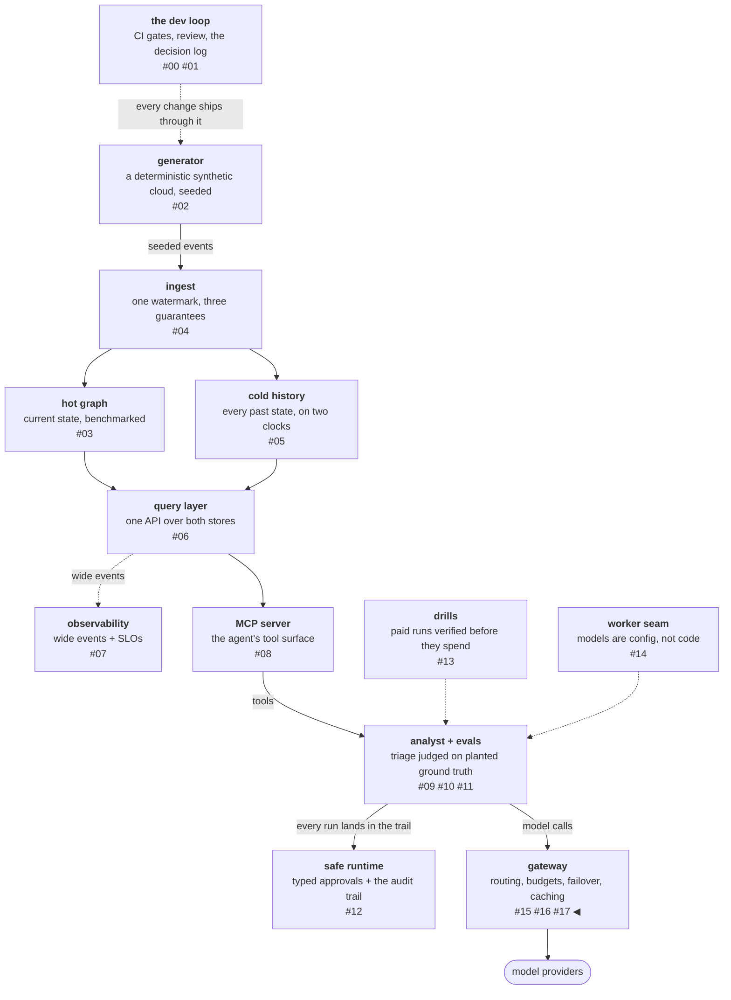

# Day-2 of serving: the drill's findings became the backlog

The gateway was built, load-tested, and metered. What remained was
the question day-1 engineering cannot answer: what does this system
actually do when its backend dies under traffic? The failover drill
— kill the local model server mid-run under five lanes of
analyst-shaped traffic, restore it three minutes later — was the
last item on the phase's exit gate, and it produced two lists. The
behaviors that were designed all held, with receipts. The three
discoveries nobody designed became the next month's backlog, and
this post is about both — because the summary of a good drill is
"everything worked, and it found three things anyway."

<!-- more -->

!!! info "The resgraph series"
    This is the eighteenth post about
    [**resgraph**](https://github.com/fespino/resgraph), a mini data
    platform I am building for learning purposes. The
    gateway is not yet under a phase tag — browse it
    [on `main`](https://github.com/fespino/resgraph/tree/main/src/resgraph/gateway);
    snippets below are from `main` at the time of writing, trimmed
    only for length.

In this phase, continued: day-2 of the serving layer — the failover
drill that closed the exit gate, what held under the kill, the three
findings nobody designed, and the four fixes they became.

The platform so far, with this post's piece highlighted:



The drill itself got the paid-run discipline every spend gets here:
a pre-mortem executed against merged code (which paid before the
drill even ran — reading the stream factory revealed that streams
cannot fall forward at all, re-scoping the drill's paid claim to
the non-streamed lane before the money moved), a pilot, and a
registered cost (~$0.088 actual against ~$0.15 registered).

## What held, with receipts

- **Fall-forward worked and was recorded.** 47 of 47 non-streamed
  routed requests fell forward to the paid backend during the kill,
  each response carrying its fallback hop — the recorded-source
  discipline paying out under live failure.
- **Zero substituted pins across 11,452 responses.** The
  dead-backend pin failed loudly 18 times; the pinned judge ran 22
  of 22 untouched. The no-substitution guarantee held exactly where
  it exists to hold — under pressure.
- **The mid-stream contract held.** One mid-generation kill
  delivered 5 tokens and then a structured
  `stream_error{tokens_emitted: 5}`. No resume path exists, so no
  splice can — the by-construction argument surviving contact with
  a live kill.
- **The price of availability became a number: $1.08/hour** of
  fall-forward spend at drill traffic, measured warm-prefix and
  linear in volume. Until the drill, "fall-forward buys
  availability with money" was a design sentence; after it, it was
  a calibration input.

One subtlety was confirmed live: recovery has two clocks. Routed
traffic returned on the *first* attempt after restore — the walk
tries the routed model regardless of health state — while probe
readmission flapped through the model reload before converging.
Both clocks are better learned before an incident than during one.

## The three discoveries nobody designed

**1. Explicit failure without backpressure is a hot loop.** The
streamed failure path is explicit at every layer — lazy open,
zero-token death detection, an exhausted reopen walk, a structured
error in ~15 milliseconds. That exact promptness let a *polite*
client hammer **11,231 requests in 182 seconds**. The non-streamed
rejection path carries Retry-After; this path carried nothing — so
the client that faithfully models the server's contract found the
one road with no contract on it. Fast, explicit refusals without
pacing information are an invitation to retry at wire speed.

**2. The degradation alert only counts survivors.** The log
screamed `fallback chain length 2` eleven thousand times; the alert
built for exactly this condition slept through it. The chain
histogram was emitted only when a request ended *successfully* —
and the requests degrading hardest are precisely the ones that
don't. The pre-mortem had predicted the alert's silence, for the
wrong reason; the drill upgraded a wrong explanation into an
observability bug.

**3. The kill lands where the time is.** The scheduled mid-stream
kill hit prefill, not generation: with TTFT around 21 seconds of a
~23-second request, the token window is ~2 seconds wide, so "kill
mid-stream" on a slow local model almost always means "kill
mid-prefill." The pre-mortem had registered exactly this miss with
a free repeat as the remedy; one targeted re-kill after the fifth
token collected the mid-generation death. The failure you induce
lands where the request spends its time, not where your mental
model puts it.

## The findings became fixes, each with its lesson

**The alert that counted survivors** got the smallest fix with the
most general lesson. The chain histogram now emits on every failed
terminal too, and the regression test asserts *emission on the
failure path* — not evaluation of the alert rule:

```python
# tests/test_gateway_slo.py
def test_failed_walks_record_their_chain_length(tmp_path, monkeypatch):
    """The INC-004 blind spot: a request that degrades through the whole
    walk and dies must still feed the chain histogram."""
```

The rule had a test; the rule's test proves "given this series, the
alert fires." Nothing anywhere proved the code ever produces the
series. Survivorship bias isn't only a data-analysis trap — it can
be compiled into your instrumentation, behind a green CI leg.

**The hot loop** got an eager refusal. When the routed backend's
health is already known-down and no streamable fallback exists, a
streamed request is now refused at admission — before any open —
with `Retry-After` set to the probe cadence: the client is told to
come back exactly when the answer can next change.

```python
# src/resgraph/gateway/server.py (the streamed path)
if not within and _no_streamable_fallback(gw, first, unstreamable):
    obs.GATEWAY_REQUESTS.add(1, {**labels, "outcome": "refused_503"})
    raise HTTPException(
        503,
        detail=f"backend {routed_backend.name!r} is down and no streamable "
        "fallback is up; retry after the next probe round",
        headers={"Retry-After": str(max(1, int(_probe_cadence(gw, first))))},
    )
```

The fix knowingly regresses recovery — for up to ~45 seconds after
the local model actually returns, streams are refused while health
readmits — and in a normal review that trade-off is a matter of
taste to argue about. Here both sides had numbers from the drill: a
60-per-second hot loop against a sub-minute refusal window. The
decision record holds a priced trade, not a preference. A measured
drill turns contested trade-offs into arithmetic.

**The fall-forward bill** got a budget. The failover promise
narrowed: the gateway fails over transparently within a stated
budget, then refuses explicitly with the reason stated. The module
docstring carries the scope:

```python
# src/resgraph/gateway/budget.py
"""The fall-forward spend budget: the failure path's money, bounded.

The walk buys availability with money in one direction only (local-down
makes every free call a paid one), so fallback-served paid traffic gets
a per-UTC-day cap: warn once at 90%, then paid candidates leave the
walk and the refusal is explicit and distinct. Routed paid traffic, pins,
and unpriced backends are out of scope by construction."""
```

The cap covers exactly one thing — fallback-served paid traffic,
the one direction where the walk spends money the router didn't
choose to spend — and is calibrated by the drill's measured
$1.08/hour. When the daily cap is reached, paid candidates leave
the walk; free candidates keep serving; and the resulting refusal
is a *distinct* outcome with its own signal, because "down since
the gateway refuses to pay past the cap" must never read as
"everything is down." Three flows stay deliberately unbudgeted:
registry-routed paid traffic (intended spend, governed by its own
caps), pins (they never walk), and measured runs (pinned with
failover disabled). The
design rule underneath came from the platform's budget decision a
phase earlier: a guard that only measures is not a guard — this
platform enforces budgets, it does not watch them.

**The idle heartbeat bill** went through the most review of the
four. The quiet bug was that an idle gateway probed the paid API
every 15 seconds — roughly $7/month of "are you alive?" sent to a
managed service with its own SLOs, spend that hums instead of
announcing itself. The first fix derived "probeable" from the pricing table
(priced → never probed) — and review caught the hidden coupling:
pricing a previously-free endpoint would have *silently stopped its
probes*, and the pricing table would own a concern that isn't its.

The shipped design is declarative: a setup is probed if and only if
it declares `probe_interval_s` — the declaration is both the opt-in
and the cadence — and then successive review questions kept
deleting switches (the CLI probe flag, the server construction
parameter) until the probe loop simply starts iff any setup
declares a cadence. The docstring on the resolver carries the
rationale:

```python
# src/resgraph/gateway/server.py
def _probeable(gw: Gateway) -> dict[str, str]:
    """Routed providers whose setup declares `probe_interval_s` — probing
    is opt-in per setup. Undeclared means never probed: uptime spends
    nothing by default, and failures surface per-request through the
    walk; declaring a probe on a priced setup is a deliberate spend."""
    return {p: a for p, a in gw.routed().items() if "probe_interval_s" in gw.setups[a]}
```

Three lessons travel:

- **Presence-as-semantics needs a boundary guard.** The moment "key
  present" means "on," a declared cadence of `0` means a hot spin —
  a spend bug on a priced setup. It is refused loudly at startup,
  never clamped: the file is the authority, so the file must be
  right.

    ```python
    # src/resgraph/gateway/server.py (create_app)
    cadence = setup.get("probe_interval_s")
    if cadence is not None and float(cadence) <= 0:
        # wait(0) spins: a hot probe loop, and a spend bug on a priced setup
        raise SystemExit(f"setup {name!r}: probe_interval_s must be > 0, got {cadence}")
    ```

- **A suppressor is safe where a peer switch isn't.** A single
  `ignore_probes` override exists for tests and embedders — shaped
  asymmetrically, it can silence declared probes in one process but
  cannot invent probing the catalog never declared. It keeps the
  convenience without creating a second authority.
- **Name the boundary of your own design.** The downside — no
  runtime kill switch; changing probing means editing the file and
  restarting — got an issue with its trigger named, not a hack: the
  restart *is* the switch while restarts cost seconds, and the
  pre-refuted alternatives are written down in that issue so nobody
  reaches for the drift-shaped one later.

Config authority is a budget: every flag that can contradict the
file spends it. The review questions that delete parameters beat
the ones that add them.

## What breaks at 1000×

Day-2 at this scale is a drill someone runs and four PRs; at fleet
scale it is the entire job, and each finding names its scaled form.
The survivorship class generalizes furthest: any metric emitted
from a code path that failure skips is structurally blind, and at
fleet scale nobody can read the logs that would reveal the
contradiction — emission-on-failure-path tests have to be a
standing requirement of instrumentation review, not a lesson one
team learned.

The hot loop scales with client count: at thousands of clients, a
refusal path without pacing information isn't a curiosity, it is a
self-inflicted DDoS, which is why every refusal this gateway now
emits — 429, eager 503, budget 503 — carries retry-timing.

The fall-forward budget becomes an organizational control: at fleet
volume, "availability bought with money" is a per-team line item,
and the distinction the small system drew — refusal-by-budget must
not look like an outage — becomes the difference between a finance
conversation and a false page.

And probes at fleet scale invert the economics again: ten thousand
endpoints probing at 60 seconds is real money and real load, which
is the declarative design's quiet advantage — cadence lives in the
catalog, where a fleet can reason about its total, not in ten
thousand processes' flags.

The drill's full record is
[INC-004](https://github.com/fespino/resgraph/blob/main/docs/incidents/INC-004-gateway-failover.md)
with its evidence bundle; the fixes are
[PR #226](https://github.com/fespino/resgraph/pull/226) (chain
emission on the error path),
[#227](https://github.com/fespino/resgraph/pull/227) (the eager
503), [#228](https://github.com/fespino/resgraph/pull/228) (the
fall-forward budget), and
[#230](https://github.com/fespino/resgraph/pull/230) (opt-in
probes); the decision amendments live under D31 and D33 in
[SPEC.md](https://github.com/fespino/resgraph/blob/main/SPEC.md).
