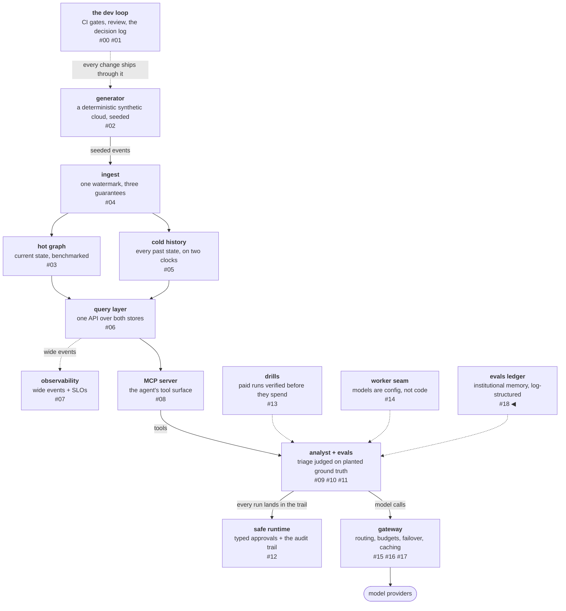

# Institutional memory is a log-structured store

This platform keeps a lab notebook. Every experiment against the
analyst agent — every pre-registered hypothesis, every run's verdict,
every dollar spent, every wrong diagnosis with its correction — lands
in one append-only file, `EVALS.md`. Append-only is a feature: a
registration you can rewrite after the run is not a registration, and
a history that hides its misses selects worse questions each round.

Then the notebook became model input, and the feature became a bill.

<!-- more -->

!!! info "The resgraph series"
    This is the nineteenth post about
    [**resgraph**](https://github.com/fespino/resgraph), a mini data
    platform I am building for learning purposes.
    Browse the repository exactly as it stood when this was written:
    [`phase-10.5-institutional-memory`](https://github.com/fespino/resgraph/tree/phase-10.5-institutional-memory).
    Every snippet below is copied from that tag, trimmed only for
    length.

In this phase: a maintenance half-phase between the serving work
and the next build. The eval notebook splits into an archive that
is never fed to a model and a working set that is — with the
boundary enforced in code and fingerprinted per run.

The platform so far, with this post's piece highlighted:



One of the registered experiments asks a model to propose the next
harness iteration itself: given the rules, the evidence, and the
current prompt, propose exactly one change, with a falsifiable
prediction, in the same format a human registration uses. The script
that runs that experiment fed the model the *entire notebook* —
which had grown to 1,642 lines, about 23,400 tokens, of which the
overwhelming majority was closed history: iterations already run,
experiments already concluded, registrations already discharged.

Three things are wrong with that, in increasing order of subtlety.
It costs money on every proposal call, forever, on a file that only
grows. It dilutes attention — the ~3k tokens of rules that actually
constrain a proposal were buried under ~20k tokens of archaeology.
And the closed history includes the complete forensic record of how
the platform's own graders were gamed and patched over eight
iterations — handing that dossier to a model whose job is to propose
changes *to the harness that grades it* is an unforced error.

The fix was already in the repository. It just hadn't been applied
to the repository's own memory.

## One file, two jobs

The notebook was serving two roles with opposite requirements:

- **The archive role** wants completeness. Every registration,
  outcome, and wrong turn kept and labelled, so any decision can be
  re-derived and any run redone. This role is why append-only is
  non-negotiable.
- **The context role** wants a small, current working set: the
  protocol rules that bind *now*, the registrations that are open
  *now*, the base rates that keep predictions calibrated. This role
  is what gets fed to a model.

Below some size, one file serves both. Past it, every line added for
the archive degrades the context, and every deletion proposed for
the context betrays the archive. The naive resolution — "have an AI
summarize it, keep a backup somewhere" — fails the archive role
three ways: a summarized open registration is a *different
commitment* (the entire point of pre-registration is that the words
are fixed before the run); a summary that cannot be diffed cannot be
audited; and an ad-hoc backup is where history goes to get lost.

The platform's storage layer solved this exact problem in its data
plane long ago. The cold store is an append-only event log. The hot
store bootstraps from checkpoint-plus-log. Nothing is ever
summarized in place: a snapshot is *written*, the log is *kept*, and
any state is recoverable by replay. Institutional memory gets the
same architecture:

| File | Role | Fed to models? |
|---|---|---|
| `docs/evals-archive/EVALS-<date>-<gitref>.md` | the snapshot in the safe — byte-exact copy, committed *before* any edit | never |
| `EVALS-HISTORY.md` | the closed record — moved verbatim, append-only, in original order | never |
| `EVALS.md` | the working set — protocol rules, the full paid-run ledger, the environment pin, every open registration | the marked slice only |
| `docs/evals-compaction-runbook.md` | the procedure — so the next compaction is a checklist, not a judgment call | never |

The runbook opens with the invariants that make the table safe to
operate:

```markdown
- **Archive before edit.** A byte-exact snapshot of EVALS.md lands in
  `docs/evals-archive/EVALS-<date>-<gitref>.md`, committed on its own,
  BEFORE any working-file change.
- **Nothing is rewritten, only moved.** Closed material transfers to
  EVALS-HISTORY.md verbatim, appended in original order. No AI
  summarization on this path.
- **What stays in the working file:** the protocol rules, the paid-run
  ledger in full (the base-rate instrument), the environment pin, and
  every OPEN registration verbatim. Open means the registered run has
  not happened and the experiment is live — a parked issue counts as
  live; a closed issue's registration is closed with it.
- **Pointers, both directions.** The working file's history index
  names what moved and where; EVALS-HISTORY.md's head names the
  archive snapshot. "Redo" is one file open, not archaeology.
- **Never fed:** EVALS-HISTORY.md and the archive snapshots are for
  humans and audits; only the working file (its context-core slice)
  reaches a model.
```

The split itself was file surgery, not editing: a script partitioned
the 1,642 lines by section, moved the closed ranges, and *asserted*
that kept-plus-moved equals the archived original byte for byte. The
assertion output went in the pull request. Nothing was reworded —
which is the property that makes the whole operation reviewable in
minutes and reversible by concatenation.

The fed context went from 23,404 tokens to ~3,380 — an 86% cut with
zero drift risk, because drift requires rewriting and nothing was
rewritten.

## What a model is actually fed, and why each part

This part needs precision, because "we feed the model our docs"
hides all the decisions.

Exactly **one** consumer feeds notebook content to a model:
`scripts/propose_iteration.py`, and it runs only during a registered
self-proposal experiment — it has run once; a second is registered
and pending. Ordinary eval runs never see the notebook. The analyst
investigating an incident never sees it. CI never sends it anywhere.
The blast radius of this entire design is one script that runs a few
times a year, on purpose, with a ledger entry.

When it runs, the prompt has four parts:

```
[fixed instructions]      the experiment's hard constraints, verbatim
                          in the script: ONE change; harness surfaces
                          only (graders, judge, validators are
                          instruments, not the model's to touch);
                          target the named residual buckets; numeric,
                          falsifiable prediction

<evals_log>               the CONTEXT CORE of EVALS.md (~3.4k tokens):
                          the marked regions only — protocol rules,
                          the paid-run ledger, the environment pin,
                          open registrations

<per_item>                a pass/fail-per-trial digest computed fresh
                          from the certified run's JSONL rows — never
                          from the notebook

<prefix>                  the analyst's current system prompt, verbatim
```

Each part has a reason to exist, and the reasons are different:

- **The rules are fed because the proposal must *be* a valid
  registration.** The model's output is committed verbatim and then
  judged against the same protocol a human registration faces —
  signal triage before hypothesis, one change, an adversarial
  pre-mortem sentence, a prediction with its invalidating result. It
  cannot follow a format it cannot see.
- **The ledger is fed because base rates keep predictions
  calibrated.** The paid-run ledger records every run against its
  registered objective — including the misses. A proposer that can
  see "10 of 15 objectives met" writes different predictions than
  one fed only success stories. This is the same reason the ledger
  exists for humans.
- **Open registrations are fed so a proposal cannot collide** with
  an experiment that is registered and pending — two changes aimed
  at the same surface would confound each other's runs.
- **The per-item digest is fed because it is the evidence.** It says
  *where* the harness currently fails — which items, how many
  trials, which dimensions — and it is computed from the run rows at
  call time, so it cannot go stale in the notebook.
- **The current prompt prefix is fed because it is the object being
  edited.** The constraints require the proposal to quote the exact
  text to add or replace; you cannot quote what you cannot read.

And what is deliberately *not* fed: the closed history. Not the
eight iterations, not the honest-review section's account of the
author's mistakes, not the mutation-testing record of how the
graders were verified, not the forensics of every patched loophole.
If the working set is the briefing, the history is the case files —
and the case files include the security audit.

## The boundary is enforced, not hoped for

Two mechanisms keep this from decaying, and both fit in one small
module:

```python
# src/resgraph/evals/context.py
"""The fed slice of the institutional-memory working file (D34).

What a model is fed is part of the experimental configuration: the
context-core markers in EVALS.md bound the fed regions, and the
fingerprint of the exact fed text lands in the proposal artifact — the
same envpin discipline that pins prompt fingerprints and store digests."""

_REGION = re.compile(r"<!-- context-core -->\n(.*?)<!-- /context-core -->", re.DOTALL)


def context_core(path: Path = EVALS_PATH) -> str:
    """The concatenated marked regions — never the whole file. Loud when
    no markers exist: silently feeding everything is how the working
    set decays back into the archive."""
    regions = _REGION.findall(path.read_text())
    if not regions:
        raise SystemExit(f"{path}: no context-core markers; refusing to feed the whole file")
    return "".join(regions)


def context_fingerprint(text: str) -> str:
    return hashlib.sha256(text.encode()).hexdigest()
```

**The markers** delimit the fed regions, and the extraction refuses
an unmarked file loudly rather than falling back to reading
everything.
That default matters: the failure mode of context hygiene is never a
dramatic break, it is a quiet regression to feed-it-all the first
time someone reorganizes the file. The navigation index that points
humans at the history sits *between* the marked regions, in the file
but outside the prompt.

**The fingerprint** — the SHA-256 of the exact fed slice, and of the
full assembled prompt — is stamped into every proposal artifact's
header, next to the token counts. What a model is fed is part of the
experimental configuration, the same way the prompt prefix and the
store digests already were: pinned by hash, recorded per run. Before
this, two proposal experiments run months apart would have read
different notebooks (the file grew 45% during a single phase) with
nothing recording what either model saw. Now "did the context
change?" is answered by comparing two lines in two committed files.

## The registered doubt

One assumption in this design is unmeasured, and it stays visible
rather than assumed away: that the lean context produces *better*
proposals, not just cheaper ones. The first proposal experiment ran
with the full notebook; nothing has yet run with the lean one. The
plausible failure is specific — a lean-context model re-proposing an
idea a closed iteration already tried and killed, because the record
of the killing moved to a file it no longer reads.

That failure mode is mechanically checkable, so the next proposal
experiment's registration carries a binding line: the proposal is
diffed against the closed iterations' registered changes, and a
re-proposal of a dead idea triggers the fallback — 3–6 line digests
of closed iterations, AI-written under committed instructions and
reviewed as a pull-request diff, added to the working set only on
that evidence. The unmeasured assumption became a falsifiable check
with a pre-committed remedy, which is the same posture every other
experiment here gets.

## Two lessons that traveled

**Section titles rot; the tracker is the authority.** The split
required classifying what was "open", and five of six sections
titled
"registered, run pending" turned out to be closed — the runs had
happened, the outcomes were recorded *inside the sections*, and
nobody had updated the headings. Deciding by title would have kept
~500 lines of closed history in the fed working set. The runbook now
says it plainly: "titles go stale; the issue is the authority."

**A default you didn't choose is a decision you didn't make** — the
context edition. Feeding the whole file was never decided; it was
the path of least resistance when the file was small, silently
compounding as the file grew. The marker-and-refuse design inverts
the default: growing the *fed* surface now requires an explicit act
(moving a marker) that shows up in a diff, while growing the archive
stays free.

## What breaks at 1000×

At this scale, the working-set problem is structural and the split
solves it. Scale the inputs and the mechanism changes shape. When
compactions accumulate — many archives, many history volumes, more
knowledge files crossing the fed boundary — a split can no longer
hold the working set small, and retrieval becomes the mechanism:
index the archive, fetch what the task needs, and inherit a new
obligation to fingerprint *what was retrieved* per call, not just
what was on disk. The reversal condition is written into the
decision record: this design holds while the working set fits in
~10k tokens.

And when multiple agents write memory concurrently, the
single-writer append-only file becomes a real log system with the
usual ordering problems — at which point institutional memory is not
*like* a log-structured store; it simply is one, and gets operated
like the rest of them.

The decision record for all of this is D34 in
[SPEC.md](https://github.com/fespino/resgraph/blob/main/SPEC.md);
the split itself, with the partition assertion and the numbers, is
[PR #234](https://github.com/fespino/resgraph/pull/234).
