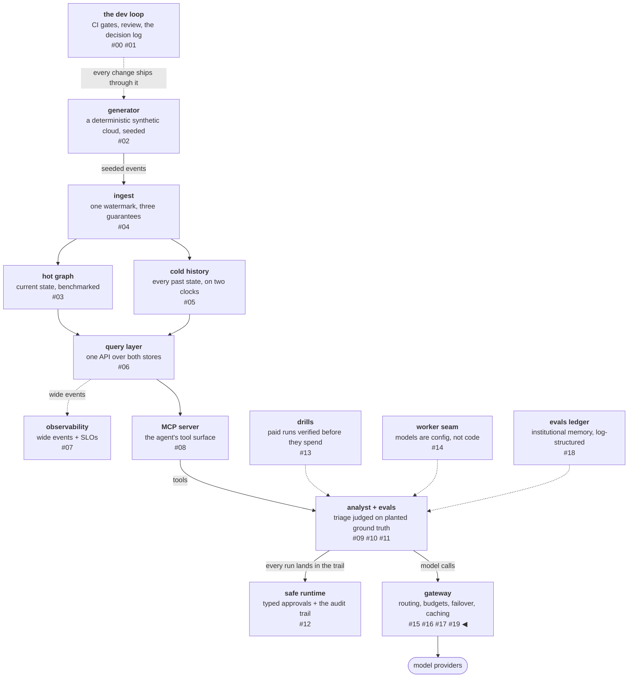

# The gateway against its full-size reference

The gateway from the serving posts is a deliberate miniature of a
layer the industry runs at scale. [OpenRouter](https://openrouter.ai)
serves four hundred–plus models through a single interface, and its
[routing documentation](https://openrouter.ai/docs/features/provider-routing)
is detailed enough to compare against mechanism by mechanism. This
post holds the miniature against that reference — the same move as
reviewing the query layer against a canonical text, applied to a
living system's documentation instead of a book — with each distance
measured rather than waved at. Claims about OpenRouter's mechanisms
cite their documentation; claims about this gateway cite merged
decisions.

<!-- more -->

!!! info "The resgraph series"
    This is the twentieth post about
    [**resgraph**](https://github.com/fespino/resgraph), a mini data
    platform I am building for learning purposes. The
    gateway is not yet under a phase tag — browse it
    [on `main`](https://github.com/fespino/resgraph/tree/main/src/resgraph/gateway);
    the decisions and issues cited below are the sourcing.

In this phase, continued: the serving arc closes with an external
review — the gateway held against the full-size version of its own
layer, and the gap list that review produced, filed as the next
phase's charter.

The platform so far, with this post's piece highlighted:



## The layer, in plain terms

Think of DoorDash. A city has four hundred restaurants — the
models — and every family used to call each one separately:
different phone numbers, menus in different formats, different ways
to pay. The app collapses that into one interface: one menu format,
one order flow, one payment. It knows every menu, every price,
who's open, who's running slow tonight — and if the kitchen you
wanted is closed, it offers you the next one. Now imagine the app
going one step further: you say "dinner for four, under forty
dollars, fast," and it picks the restaurant for you. That step is
model routing.

You pay the app; the app pays the restaurants — and the app holds
a singular position in the market, because it sees every order in
the city and the money flows through it. Stripe has
[agreed to acquire OpenRouter](https://stripe.com/newsroom/news/stripe-agrees-to-acquire-openrouter)
— a deal [reported at $7 billion](https://finance.yahoo.com/technology/ai/articles/stripe-acquires-openrouter-7b-turning-091812340.html),
though the announcement names no price — and Stripe's stated reason
lands on exactly this position: tokens are "the central currency
for companies building with AI," and the pair will "help businesses
maximize profitability by routing their requests intelligently and
spending their tokens efficiently." A payments company is buying
the layer the money flows through, and says so.
And the web's original design expected middlemen of exactly this
kind: HTTP's layered-system constraint explicitly allows standing
in the middle, because its designers knew that routing, caching,
policy, and failover would live there.

This gateway is a tiny DoorDash for six restaurants instead of four
hundred, with the same jobs: one menu format, pick the kitchen,
watch who's slow, count the money. The rest of the post is the
comparison, mechanism by mechanism.

## One interface: a wire shape and a name catalog

A single interface is two things: a wire shape and a name catalog —
in the analogy, the menu format and the restaurant directory.

The wire shape is the part everyone gets for free by now — an
OpenAI-compatible request schema is the lingua franca, a de-facto
standard defined by one vendor's
[API reference](https://platform.openai.com/docs/api-reference/chat)
rather than by any standards body — and this gateway speaks a close
dialect of it (D30 — the gateway shape: two backends, task-class
routing, recorded source). The interesting part
is the catalog. The gateway's `model` field carries a served-model
*alias*, never a raw provider id: where an alias actually runs —
provider, base URL, real model id, request kwargs — is a property of
its registry entry, resolved at dispatch (D29c — the
provider-pluggable seam). The payoff is that adding a provider is a
config row, not code, and nothing downstream can sniff a name to
guess a backend:

```yaml
# evals/models.yaml — a setup: alias -> where it runs and how to call it
openai:
  provider: openai
  capabilities:
    tools: true
  model: gpt-4o
  base_url: https://api.openai.com/v1
  api_key_env: OPENAI_API_KEY
```

Their four hundred models is this registry's six
setups with more rows; the seam is the same shape.

The measured distance: OpenRouter's catalog has one primitive this
registry lacks. In their model, one *model* is served by many
*provider endpoints* — the routable unit is the endpoint, and there
is a
[per-model endpoints API](https://openrouter.ai/docs/api/api-reference/endpoints/list-all-endpoints-for-a-model)
listing each provider's price, quantization, and live performance
for the same weights. This registry originally conflated the two —
one alias, one serving location — and every routing mechanism in the
next section is degenerate without the split: choosing among two
fixed backends is a coin flip; choosing among N endpoints per model
is an algorithm. That distinction was the first workstream of the
gap slate, and it has since landed: an alias may declare
`endpoints:` — one model, many serving locations — the gateway
selects among them per request (health, then latency), and a pin
must then name one (`alias@name`), because serving location is part
of what a measured run pins — quantization can differ per endpoint.

## Routing: capability filters, health prioritizes, speed and cost weight

Routing is the app picking the kitchen, and OpenRouter's documented
selection pipeline has an order of operations: capability filters,
health prioritizes, speed and cost weight. Each stage has a
counterpart here.

**Capability filters.** A provider that cannot run the request —
wrong context length, no tool support — is not a candidate at any
price. OpenRouter checks this per request when the caller sets
`require_parameters`; this gateway resolves it through task classes,
where each class of work routes to setups declared able to serve it.
Theirs is the stricter contract (the request states what it needs;
the catalog answers), and adopting per-request admission is on the
slate.

**Health prioritizes — it does not filter.** The documented
mechanism is precise: providers with significant outages in the last
30 seconds are *deprioritized*, not removed — they remain in the
pool as fallbacks. That soft form matters because binary health is a
blunt instrument: a backend at a 20% error rate should earn less
traffic, not zero. This gateway's health machinery is the hard
form — probe-driven state with gradual readmission after three
consecutive healthy probes, and the probes are tiny generation
probes rather than TCP pings, because a server can 200 its health
endpoint while generation has collapsed (D33 — serving SLOs). The
platform has down-and-readmit; it lacks earn-less-while-flaky. The
slate adds the soft form beside the hard one.

**Speed is a percentile set, not an average.** OpenRouter tracks
latency and throughput per endpoint as p50/p75/p90/p99 over a
rolling five-minute window, and exposes them in the endpoints API.
This gateway keeps a single exponentially-weighted moving average of
time-to-first-token — and the platform's own load test argues
against its own design: measured TTFT on this hardware is bimodal
(0.5 s on a warm prefix vs ~12 s on a cold prefill), and the mean of
a bimodal distribution describes no request that ever happened.
Percentile windows are the speed mechanism done properly; the EWMA
was the placeholder. This is the clearest case in the whole
comparison where the big system's design is simply right and the
miniature is scheduled to converge.

**Cost is a weighted lottery.** The documented default is
inverse-square price weighting: with providers at $1, $2, and $3 per
million tokens, the cheapest is nine times more likely than the
priciest to be picked first (1/1² : 1/2² : 1/3²). It is a lottery
rather than a hard sort so that cheap providers get most of the
traffic without the expensive ones starving — a starved provider is
one you learn nothing about. This gateway's cost mechanism is a
different lever held for the same reason: cheap-by-default tiers,
with paid backends reachable through failover under a per-day spend
budget. The failover drill priced the unbudgeted version of that
walk at $1.08/hour — the day the free backend dies, every free call
silently becomes a paid one — which is why the budget exists (D31's
fall-forward cap): availability bought with money gets a cap and a
named refusal.

One design detail from their docs to copy outright: when a caller
sets `sort` or `order`, load balancing is disabled entirely. The
market mechanism and the caller override are mutually exclusive by
construction — you get the lottery or you get your list, never a
blend that neither party can predict.

And their docs get one piece of vocabulary exactly right:
constraints split into hard and soft by *what happens when they
fail*. `max_price` refuses the request outright if nothing fits;
`preferred_max_latency` and `preferred_min_throughput` only
deprioritize endpoints that miss the threshold. Refusing loudly
versus preferring quietly is the same split this platform's
refusal-with-reason vocabulary draws — a request that cannot be
served within its stated constraints should fail with the constraint
named, not degrade into something nobody asked for.

## Billing: the meter in the money path

Billing is the mechanism everyone underrates, and the analogy's
last job — the app is where the money flows. The structural fact is
that the gateway is the one component that sees every call with its
model, its token usage, its outcome, and its caller. Whatever sits
in that position is the natural meter, and a meter in the money path
is a business.

The miniature already has the meter half. Every call through the
gateway lands in a cost distribution sliced by task class, backend,
and routing source, and per-task cost is a service-level objective,
not just a cap — because a prompt change that doubles per-task
tokens violates an objective the first day, long before any monthly
cap trips (D33's cost-per-task amendment). Refusals carry reasons,
and the reasons are load-bearing: `budget_503` means "the gateway
refuses to pay past the cap," which must never read as "everything
is down."

Billing is the meter plus two more pieces: identity and a wallet.
Identity is knowing *who* consumed — per-caller keys with per-key
ledgers. The wallet is prepaid balance decremented from the meter,
refusing when empty. The doc-validation pass turned up a convergence
nobody planned: OpenRouter's error vocabulary already draws the
exact line this platform's does. An empty balance returns
[402 `payment_required`](https://openrouter.ai/docs/api-reference/errors);
routing that cannot satisfy the request returns 503. "You spent your
money" and "we cannot serve you" are different sentences with
different audiences, and both platforms refuse to conflate them.
Their key model also splits capabilities — the key that spends is
not the key that administers (the credits API requires a management
key) — which is the shape the per-caller identity work adopts.

The remaining distance is the wallet itself and the usage surface,
and both are on the slate. Neither is conceptually hard; the point
of building them is that "centralized billing" stops being a phrase
and becomes three verifiable mechanisms with tests.

## What the review produced

Two design debates surfaced once the layer was in pieces, and they
are decisions, not features.

**Who is sovereign over routing?** The caller knows its request; the
operator knows the fleet. Every mechanism above picks a side:
caller-set constraints narrow the candidate set but never broaden it
past what the registry routes — the registry stays the authority,
and a caller can only shrink its world. OpenRouter's
sort-disables-balancing rule is the same principle stated
differently: override and market mechanism never blend.

**Compliance is a routing dimension.** Their provider preferences
include `zdr` (zero-data-retention-only routing) and
`data_collection` — where your prompt may go is a constraint of the
same kind as how much you will pay. A gateway that can route by
price can route by policy with the same machinery, which is why
policy belongs in the selection pipeline rather than bolted beside
it.

The gap between the miniature and the full-size layer is now a
public work list — the
[gateway phase charter](https://github.com/fespino/resgraph/issues/263)
files every distance named above as a workstream, each buildable and
measurable at laptop scale against replayed traffic for roughly
nothing. Some distances are declined on purpose: no mutable "latest"
aliases (a name that silently changes meaning breaks
reproducibility — pins are this platform's thesis), no leaderboards
without a population, no 400-model catalog for its own sake. The
claim was never scale. The claim is that every mechanism in this
layer can be built, measured, and stated at its actual size — and
that building the six-backend version teaches you what the
full-size layer is made of.

All numbers here are laptop-scale and labeled as such; methodology
and hardware for every measured figure live in
[BENCHMARKS.md](https://github.com/fespino/resgraph/blob/main/BENCHMARKS.md).
