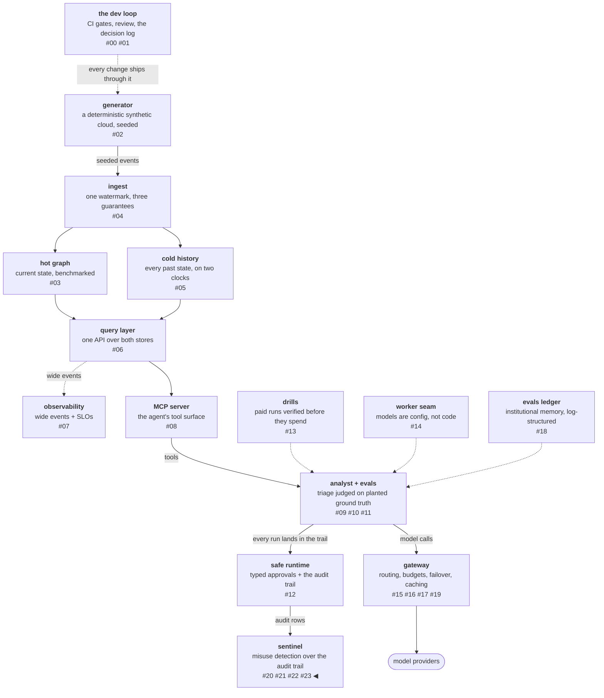

# Labels are the product

An alarm is only as good as what happens when it rings. The previous
three posts built a detector: a threat model and a corpus, two free
layers with a funnel, a paid judge with an earned scope. This post
builds the desk where the human sits — a review queue where every
flag arrives with its evidence highlighted, every verdict is
recorded with how long it took, and every label teaches the system
permanently, in code. Then a closeout audit asks one question of
every artifact the phase produced and finds the flywheel's most
important file had a writer and no reader.

<!-- more -->

!!! info "The resgraph series"
    This is the twenty-fourth post about
    [**resgraph**](https://github.com/fespino/resgraph), a mini data
    platform I am building for learning purposes.
    Browse the repository exactly as it stood when this was written:
    [`phase-11-sentinel`](https://github.com/fespino/resgraph/tree/phase-11-sentinel).
    Every snippet below is copied from that tag, trimmed only for
    length.

In this phase, closing: the final workstream
([#255](https://github.com/fespino/resgraph/issues/255) →
[PR #260](https://github.com/fespino/resgraph/pull/260), decision
D39 — the review queue and the flywheel: labels close loops in code)
and the audit that closed the charter
([#261](https://github.com/fespino/resgraph/issues/261) →
[PR #262](https://github.com/fespino/resgraph/pull/262)).

The platform so far, with this post's piece highlighted:



## The desk, in plain terms

The hall monitor flags a report; the teacher checks it. When the
teacher says "that was actually fine," the monitor does not cross
the rule out of the book — one sticky note goes in the notebook:
this student, this report, cleared. When the teacher says "that
*was* cheating," the report goes into a practice pile the monitor
re-drills on every morning. The rule book never shrinks because one
alarm was wrong, and a confirmed trick is never forgotten. The rest
of the post is that notebook as a data model — plus the audit that
discovered the practice pile was being filled and never re-read.

## The queue is a database, not a dashboard

The review queue is embedded SQLite, for the same reason the audit
trail is (D27's rationale, re-applied): a queue that depends on a
service being up loses labels exactly when it matters. The schema is
the whole design:

```python
# src/resgraph/sentinel/queue.py
_SCHEMA = """CREATE TABLE IF NOT EXISTS reviews (
    run_key TEXT PRIMARY KEY,
    enqueued_at TEXT NOT NULL,
    evidence TEXT NOT NULL,
    l3_tag TEXT,
    status TEXT NOT NULL DEFAULT 'pending',
    reviewer TEXT,
    decided_at TEXT,
    seconds_to_decision REAL
)"""
```

Three columns carry the phase's lessons. `evidence` stores the
triggering evidence — which rules fired and why, the top z-scores
against that worker's own baseline, the paid judge's tag — because
the previous post measured what happens when a reviewer, human or
model, gets a flag without its highlighting: they re-derive the
detection, worse. `seconds_to_decision` is the rubber-stamp detector
from the approvals work pointed at the reviewer: a 900-millisecond
decision on a complex flag is a reviewable fact. And `status` is an
enum, not prose, because a status compiles into consequences and
free-form notes do not — D39 records "free-form review notes as the
label" among the rejected designs.

Decisions are append-only. A decided run cannot be re-decided, and
re-enqueueing it does not reopen it:

```python
# src/resgraph/sentinel/queue.py — ReviewStore.decide
        if prior != "pending":
            raise SystemExit(f"{run_key!r} already decided ({prior}); decisions are append-only")
```

## The flywheel closes in code

Each verdict has a mechanical consequence, and both consequences are
committed files, so tuning history is a reviewable diff rather than
a memory. A false positive writes a scoped exclusion — that rule,
for that run, nothing else:

```python
# src/resgraph/sentinel/queue.py
def _append_exclusions(run_key: str, evidence: list[str], path: Path) -> int:
    """A scoped exclusion per (rule, run) — never a rule disable: the
    rule stays live everywhere else, and the carve-out is a reviewable
    committed diff."""
```

The scanner applies exclusions at the flag level, and a test holds
the scope (`test_a_scoped_exclusion_suppresses_one_rule_for_one_run_only`):
the excluded rule stays silent on the reviewed run and stays live on
every other run. Disabling a rule to silence one alert is how
detection quietly goes blind — the same lesson as the eval gate's
"a check that silently stops covering something is worse than no
check," now with the carve-out shape enforced by a test.

A confirmed catch appends the run to `confirmed.jsonl` by reference:
from that day on, this attack shape is part of the recall floor. And
the floor itself is a CI command, exit 0 or 1 — the release-gate
shape from the eval phase (D29b) pointed at the detector:

```console
$ uv run resgraph-sentinel gate
gate: PASS (recall floors held, rules silent on benign, FP within budget)
```

The gate blocks on three conditions: any seeded or confirmed attack
going uncaught, any rule flagging benign traffic, and the benign
false-positive rate breaching its 3% budget. A threshold retune, a
new rule, a profile change — all of them ride through this gate,
which is what "retunes belong to the flywheel, on labels" meant back
when the fence multiplier was chosen.

## The wrong test that taught the coverage map

The gate needed a block test: lobotomize a rule, assert the gate
fails. The first attempt killed `budget_anomaly` — and the gate
stayed green. That looked like a broken test and was actually a
measurement: `repeat_loop` independently catches every budget-abuse
plant, so the corpus's budget attacks are double-covered — defense
in depth that was discovered rather than designed. The probes,
by contrast, are caught by exactly one rule, so the committed test
kills that one:

```python
# tests/test_sentinel_flywheel.py
def test_the_gate_blocks_a_tuning_change_that_misses_a_known_attack(monkeypatch):
    def lobotomized(row, th):
        return None

    # probes are caught by exactly one rule (measured: their one planted
    # call is feature-invisible to L2), so killing it must block
    monkeypatch.setitem(rules.RULES, "forbidden_tool_attempt", lobotomized)
    result = CliRunner().invoke(cli.app, ["gate"])
    assert result.exit_code == 1
    assert "recall floor" in result.output
```

A blocked test told me which rules are load-bearing. That coverage
map — these attacks are double-covered, those hang on a single rule
— is knowledge the design documents did not contain, and it fell out
of a test that refused to pass.

## The closeout audit: every artifact needs a consumer

The phase charter has an exit gate, and closing it was an audit with
one question per artifact: *what consumes this?* The question found
a hole
([#261](https://github.com/fespino/resgraph/issues/261)):
`confirmed.jsonl` had a writer and no reader. Reviewers' confirmed
catches were being appended to a file nothing read back, while the
gate's docstring promised that "any seeded or confirmed attack goes
uncaught" blocks. The docstring held a promise the code didn't. It
is the same failure shape as the drill that measured nothing, one
level up: an artifact that records without feeding anything measures
nothing — the practice pile was being filled and never re-read.

The fix ([PR #262](https://github.com/fespino/resgraph/pull/262))
makes the gate load the confirmed runs and hold them to the floor,
with a subtlety worth copying — a confirmed run that disappears from
the scanned stream entirely must also block, because unverifiable
must not pass silently:

```python
# src/resgraph/sentinel/cli.py — gate_cmd, the confirmed floor
    for key in sorted(q.load_confirmed()):
        if key not in scanned:
            failures.append(f"confirmed catch not in the scanned stream: {key}")
        elif key not in flagged:
            failures.append(f"confirmed catch would now be missed: {key}")
```

The audit's second finding was about the coverage number that had
looked fine. The suite reported high percentages while four real
gaps hid inside them: the queue CLI was entirely untested (and an
unpatched test there would have written to the *committed*
exclusions file — the same trap the classifier's call-cap tests had
to dodge), two of the gate's three block branches had never fired,
and `load_exclusions` parsing had never executed because the
suppression test injected the set directly. This is the fifth time
this phase that reading the missing lines paid where reading the
percentage would not have. The closeout added the end-to-end queue
CLI test on patched paths and the gate tests that fire every branch.

## What breaks at 1000×

The queue's own reversal condition is recorded in D39: a second
reviewer moves it from embedded SQLite to a served store, because
append-only needs an arbiter once two people hold pens. The deeper
break is the posture.
[Clio](https://www.anthropic.com/research/clio) is the reference
point: at population scale, detection stops being "a human reads the
flagged transcript" and becomes "a human reads a pattern and a
sample," with individuals protected by construction. At one reviewer
and laptop volume, every flag is individually reviewable, so this
phase runs the former and records the inversion in the charter
instead of building it. What transfers already is the discipline
Clio implies at any scale: the reviewer sees the triggering
evidence, never the haystack, and aggregation — per-rule precision,
per-layer funnels — is a first-class product of the pipeline rather
than an afterthought over logs.

The arc closes here, and the phase distills to five sentences. The
cost-ordering of layers is the architecture, and 29-of-381 is a
measurement, not a claim. The benign false-positive rate is the
headline; attack recall is the supporting act. Two registered passes
that both scored 5/20 located the paid layer's bound in the corpus
rather than the prompt, and the scope was narrowed to match. Every
artifact needs a consumer, every append needs a reader, every
promise needs a gate leg. And one arms table answered two different
model-selection questions, because "which error is expensive"
depends on the seat.

The decision record is D39 (the review queue and the flywheel:
labels close loops in code) in
[SPEC.md](https://github.com/fespino/resgraph/blob/main/SPEC.md);
the work landed as
[PR #260](https://github.com/fespino/resgraph/pull/260) and
[PR #262](https://github.com/fespino/resgraph/pull/262), closing the
phase charter
[#250](https://github.com/fespino/resgraph/issues/250).
