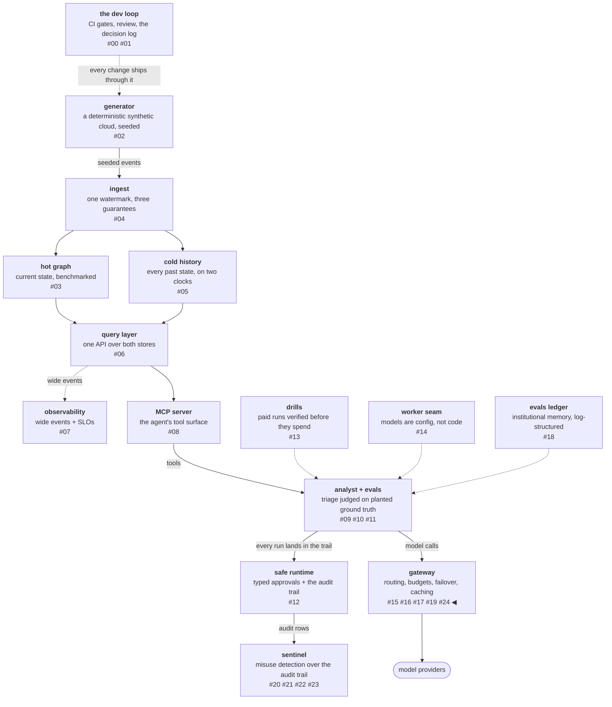
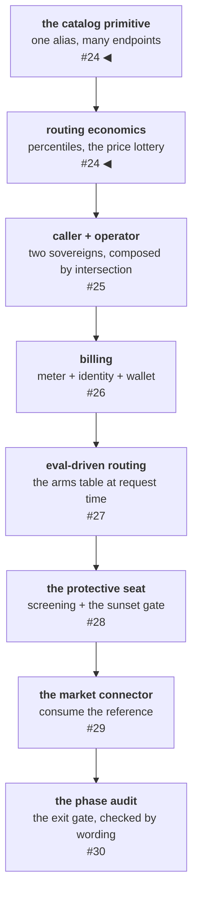

# One alias, many endpoints

The gateway review two posts ago produced a work list, and the first
item on it was not a feature. It was a missing noun: the reference
gateway routes *endpoints* — one model served from many places —
while this registry conflated a model's name with its serving
location, and every routing mechanism worth building is degenerate
without that split, because choosing among two fixed backends is a
coin flip and choosing among N endpoints per model is an algorithm.
This post lands the noun, then the routing economics it unlocks:
speed as percentiles, outage as deprioritization, and cost as a
lottery whose measured receipt — 0.449× the worst case of
latency-first routing — is committed as a test anyone can re-run.

<!-- more -->

!!! info "The resgraph series"
    This is the twenty-fifth post about
    [**resgraph**](https://github.com/fespino/resgraph), a mini data
    platform I am building for learning purposes.
    Browse the repository exactly as it stood when this was written:
    [`phase-12-gateway`](https://github.com/fespino/resgraph/tree/phase-12-gateway).
    Every snippet below is copied from that tag, trimmed only for
    length.

In this phase: the arc that post 19 chartered. That post held the
miniature gateway against its full-size reference and filed every
measured distance as a work list — the
[phase charter](https://github.com/fespino/resgraph/issues/263) —
and this phase executes the list, workstream by workstream, each one
validated against the reference's documentation before any code.

The platform so far, with this post's piece highlighted:



The arc itself has a plan, and this post covers its first two
workstreams:



## The primitive, in plain terms

Back to the food-delivery app from post 19. A restaurant's name on
the menu is one thing; the kitchens that cook under that name are
another — the same dish can come out of a downtown kitchen or a
suburban one, at different speeds and different costs, and the app
picks the kitchen per order. Until this workstream, this gateway's
menu had exactly one kitchen per name, which made "pick the kitchen"
a sentence with nothing to decide. The change is one noun: the
*alias* stays what callers name, and the *endpoint* — where it
actually runs — becomes the unit everything downstream routes,
prices, and health-checks.

## The alias names, the endpoint serves

The whole primitive is an expansion function over the existing
config file (D40 — the catalog primitive: one alias, many endpoints;
/v1/models; capability admission). A setup may declare `endpoints:`
— named partial setups merged over the alias's own keys — and a
setup without the key is its own single endpoint, so the existing
1:1 world stays byte-identical:

```python
# src/resgraph/gateway/registry.py — expand()
    for alias, setup in setups.items():
        if "@" in alias:
            raise SystemExit(f"alias {alias!r}: '@' is reserved for endpoint ids")
        entries = setup.get("endpoints")
        if entries is None:
            table[alias] = setup
            aliases[alias] = [alias]
            continue
        ...
        parent = {k: v for k, v in setup.items() if k != "endpoints"}
        for entry in entries:
            eid = f"{alias}@{name}"
            table[eid] = {**parent, **{k: v for k, v in entry.items() if k != "name"}}
```

The config file documents the shape with a worked example — explicit
about its own status, because this laptop runs one serving stack and
the committed catalog therefore has no active multi-endpoint alias
yet:

```yaml
# evals/models.yaml — the endpoints shape (commented example in the file)
#   qwen-local-1.5b:
#     model: qwen2.5:1.5b
#     context_window: 8192
#     endpoints:
#       - name: ollama
#         provider: ollama
#         base_url: http://localhost:11434/v1
#         quant: Q4_K_M
#       - name: llamacpp
#         provider: llamacpp
#         base_url: http://localhost:8081/v1
#         quant: Q8_0
```

Two details in the expansion carry most of the design. Each expanded
endpoint gets its *own* dispatch state — health, queue, latency
window — because two serving locations must not share one health
record. And the failure walk hops within the alias first (same
model, different serving) before falling across models, so "this
kitchen is down" is answered by the same restaurant's other kitchen
before the app changes restaurants. The response's `model` field
carries the served endpoint id, which means provenance got more
precise, not different.

## A pin binds to an endpoint

Look at the example again: the two kitchens declare different
`quant` values — the same weights, quantized differently per serving
location, which means they are not the same instrument. So pinning a
multi-endpoint alias refuses as ambiguous rather than picking
silently:

```python
# src/resgraph/gateway/server.py — pin resolution
        ids = gw.aliases.get(target)
        if ids and len(ids) > 1:
            raise HTTPException(
                400, detail=f"pin {target!r} is ambiguous across endpoints {ids}; pin one of them"
            )
```

A pin exists so a measured run can name exactly what it measured,
and serving location is part of that — the same discipline that pins
the eval judge and stamps worker setups into run rows, extended one
level down. A softer word (`pin_model`: exact weights, serving free
to float) was argued through four alternatives and parked with a
two-condition trigger
([#286](https://github.com/fespino/resgraph/issues/286)) rather than
built, because vocabulary earns its way in only when a caller exists
who needs it — and a strict word must never quietly erode into its
soft cousin.

## Capability admission: undeclared admits

The catalog also learned to answer "can this endpoint serve this
request at all," and the default direction of that answer is a
decision worth stating:

```python
# src/resgraph/gateway/registry.py
def capability_mismatch(setup: dict[str, Any], *, wants_tools: bool, max_tokens: int) -> str | None:
    """Why this endpoint cannot serve the request, or None if it can.

    Filters on DECLARED capability only: an undeclared capability admits
    (the catalog is not fully annotated; refusing on ignorance would
    refuse everything). Reversal: flip to strict once every committed
    setup declares its capabilities."""
```

A request that needs tools excludes endpoints declaring `tools:
false`; a `max_tokens` above a declared context window excludes; and
when everything is excluded, the refusal names every reason. But an
*undeclared* capability admits, because a half-annotated catalog
under strict admission would refuse nearly everything. Keep that
default in mind — three posts from now, the eval-routing workstream
adopts the exact opposite default for its own admission question,
and the pair is an argument about what each mechanism promises.

## Speed became a percentile set

With endpoints in place, the routing economics workstream (D41 —
percentile windows, the price lottery, soft outage deprioritization)
replaced the speed instrument. The old one was a single
exponentially-weighted moving average of time-to-first-token, and
the retrospective on it is worth a paragraph, because it was not a
mistake: the EWMA was the right minimal instrument when the decision
was a two-backend tie-break. Three things then outgrew it. The
decision got finer — N endpoints per alias instead of two backends.
The day-2 load test measured TTFT as bimodal (half a second on a
warm prefix, ~12 s on a cold prefill), and the mean of a bimodal
distribution describes no request that ever happened. And the
serving SLOs were already percentiles, so the platform's own
vocabulary had outgrown its selection key.

The replacement is a rolling window read as percentiles:

```python
# src/resgraph/gateway/dispatch.py
class RollingWindow:
    """Timestamped samples over a sliding window, read as percentiles
    (nearest-rank). Empty window reads None — an unmeasured backend is a
    fact, not a zero."""

    def percentile(self, p: int, now: float | None = None) -> float | None:
        now = time.monotonic() if now is None else now
        self._evict(now)
        if not self.samples:
            return None
        ordered = sorted(v for _, v in self.samples)
        rank = max(1, ceil(p / 100 * len(ordered)))
        return ordered[rank - 1]
```

Keeping both instruments was rejected: two speed opinions per
backend make whichever one a code path happens to read a silent
policy. And the window brought a property the EWMA never had — it
forgets. The EWMA carried hour-old estimates as confidently as fresh
ones; the window empties in five minutes, and an idle backend
returns to *unmeasured*, which deliberately sorts first so it can
earn measurement. Stale confidence became measured ignorance.

## A 30-second window deprioritizes; only the health machine eliminates

The reference gateway's outage handling is soft — a provider with
recent failures is ranked down, not removed — and this workstream
adopted the soft form beside the existing hard one:

```python
# src/resgraph/gateway/dispatch.py
@dataclass
class ErrorWindow:
    """Outcome events over a short window; the rate DEPRIORITIZES, never
    eliminates — the hard down/readmit machine owns elimination."""

    def soft_deprioritized(self, now: float | None = None) -> bool:
        ...
        if len(self.events) < SOFT_ERROR_MIN_EVENTS:
            return False
        failures = sum(1 for _, ok in self.events if not ok)
        return failures / len(self.events) >= SOFT_ERROR_RATE
```

A backend failing half its recent attempts should earn less traffic,
not zero — binary health is a blunt instrument, and a backend at a
20% error rate is evidence, not a verdict. One boundary got drawn
deliberately: the gateway's own queue-full rejections do not count
in the error window, because admission is this gateway's state, not
the endpoint's failure.

## Cost is a lottery, not a sort

The last mechanism is the one with the cleanest one-line rationale
in the codebase. Ordering candidates puts free endpoints first —
cheap-by-default is a *tier*, because an unpriced endpoint in an
inverse-square lottery would carry infinite weight — then groups
priced endpoints by health evidence and samples within each group:

```python
# src/resgraph/gateway/server.py
def _sample_by_inverse_square_price(gw: Gateway, eids: list[str]) -> list[str]:
    """Weighted order without replacement, weight 1/price² — the
    documented market mechanism: at $1/$2/$3 the cheapest is 9× likelier
    than the priciest to go first, and the expensive one never starves.
    A lottery, not a sort: a hard sort starves the endpoints it ranks
    last, and a starved endpoint is one you learn nothing about."""
```

That docstring is the whole argument. A hard price sort would send
every request to the cheapest endpoint and leave the others
unmeasured — and five minutes later, unmeasured is all the router
would know about them. The lottery keeps the expensive endpoints
observed at low cost.

## The receipt: 0.449×, committed as a test

The phase charter demanded the cost clause as a number, and the
number ships as a seeded, hardware-independent policy simulation
that *is* the test suite:

```python
# tests/test_gateway_economics.py
def test_the_measured_cost_delta_vs_latency_first_routing():
    """The exit-gate measurement (#263 item 3): the same request stream
    priced under both policies. Latency-first routing in the worst case —
    the priciest endpoint is the fastest — pays $3/mtok on every request;
    the lottery pays the share-weighted price. The delta is the cost
    clause's whole argument, and it is a measured number, not a claim."""
    shares = _first_pick_shares(_gw(dict(PRICES)))
    lottery_price = sum(shares[f"m@{n}"] * p for n, p in PRICES.items())
    latency_first_price = PRICES["steep"]
    ratio = lottery_price / latency_first_price
    # expectation: (36·1 + 9·2 + 4·3) / 49 / 3 = 66/147 ≈ 0.449
    assert ratio == pytest.approx(0.449, abs=0.02)
```

At $1/$2/$3 per million tokens, first-pick shares land on 36/49,
9/49, and 4/49 — the inverse-square shape — and the share-weighted
price is 0.449× what latency-first routing pays in its worst case.
The test is the receipt: re-run it to reproduce the number, no live
traffic and no particular hardware required. The row in
[BENCHMARKS.md](https://github.com/fespino/resgraph/blob/main/BENCHMARKS.md)
says exactly what it is — a mechanism measurement over a seeded
simulation, not a production traffic study.

One more find from this workstream deserves its sentence: coverage
reported 98% and the missing lines turned out to be the non-streamed
path's tokens-per-second observation, which could never fire because
that path stamps content and finish with one timestamp.
Tokens-per-second is structurally a stream measurement, so the fix
was deletion. The percentage said fine; the missing line said "you
built an observation point that observes nothing."

## What breaks at 1000×

At the reference gateway's scale the catalog is four hundred models
by many providers each, which makes the endpoint table a database
with churn, not a YAML file — endpoints appear, reprice, and retire
daily, and the events *about* the catalog become a stream of their
own. Two later posts in this arc meet that head-on: the lifecycle
gate treats an endpoint's retirement as a contract with dates, and
the market connector reads the reference's own catalog as exactly
such a stream. The lottery also stops being a per-request draw and
becomes a traffic-shaping policy with fairness questions — at
millions of requests, a 4/49 share is a real revenue stream to
whoever runs the expensive endpoint, and the weights turn into
economics someone will negotiate.

The decision records are D40 (the catalog primitive: one alias, many
endpoints; /v1/models; capability admission) and D41 (routing
economics: percentile windows, the price lottery, soft outage
deprioritization) in
[SPEC.md](https://github.com/fespino/resgraph/blob/main/SPEC.md);
the work landed as
[PR #273](https://github.com/fespino/resgraph/pull/273)
([#264](https://github.com/fespino/resgraph/issues/264)) and
[PR #289](https://github.com/fespino/resgraph/pull/289)
([#265](https://github.com/fespino/resgraph/issues/265)) under the
phase charter
[#263](https://github.com/fespino/resgraph/issues/263). The next
post adds the second sovereign: the caller gets a contract, the
operator gets a plane, and the two compose by intersection.
