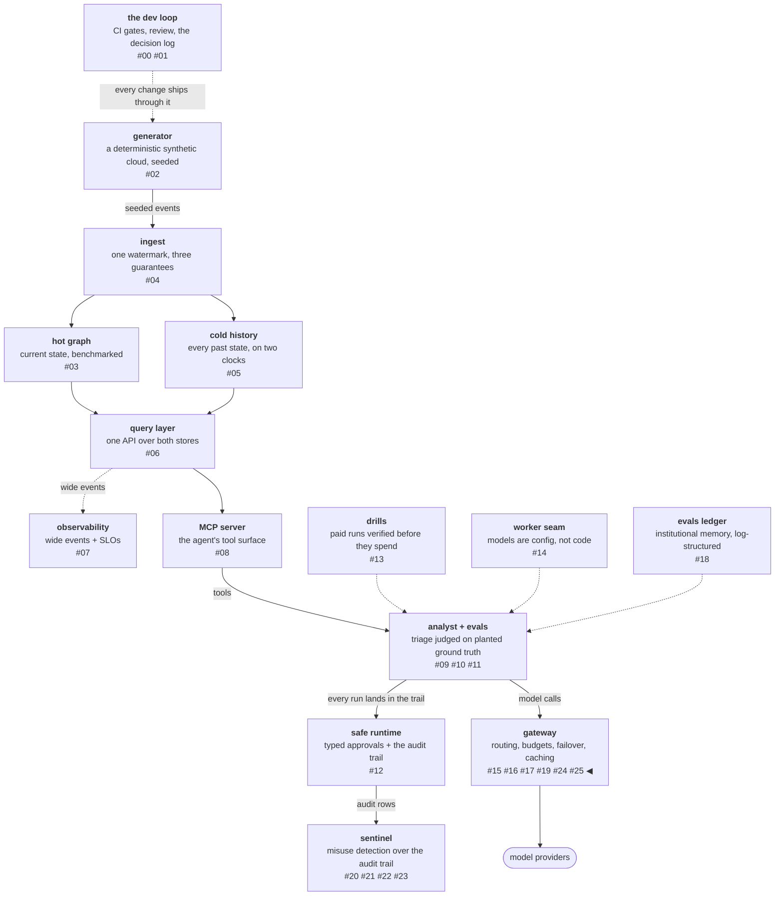

# The caller narrows, the operator rules

Two parties constrain what a request may reach, and they are not the
same person. The caller states preferences about its own traffic —
"nothing above this price, prefer fast." The operator states rules
about someone else's traffic — "this caller reaches only these
models." This workstream gives each a vocabulary, composes the two
by intersection, and keeps them distinguishable by what failure
means: a caller constraint that cannot be met is a 400 the caller
can fix, and an operator policy refusal is a 403 they cannot. The
crispest rule in it is borrowed from the reference gateway verbatim:
a caller-supplied sort disables the routing lottery entirely — and a
poisoned random-number generator proves it.

<!-- more -->

!!! info "The resgraph series"
    This is the twenty-sixth post about
    [**resgraph**](https://github.com/fespino/resgraph), a mini data
    platform I am building for learning purposes.
    Browse the repository exactly as it stood when this was written:
    [`phase-12-gateway`](https://github.com/fespino/resgraph/tree/phase-12-gateway).
    Every snippet below is copied from that tag, trimmed only for
    length.

In this phase, continued: the previous post gave the gateway its
routable unit and its routing economics; this one adds the third
workstream of the charter — who may steer the route, and how far
([#266](https://github.com/fespino/resgraph/issues/266) →
[PR #290](https://github.com/fespino/resgraph/pull/290), decision
D42 — the caller contract and the operator plane).

The platform so far, with this post's piece highlighted:



## The two voices, in plain terms

In the food-delivery app, a customer can say "nothing over twenty
dollars, and I'd rather it come fast" — statements about their own
order, and if no restaurant fits, the app tells them so and they can
raise the budget. A company account manager can say "employees on
this account order only from these three restaurants" — a statement
about *other people's* orders, and when an employee tries the fourth
restaurant, "talk to your account manager" is the only fix. Same
app, two voices, and the app must never confuse them, because the
remedies are different. That distinction is this whole post.

## The request grew a contract

The caller's half arrives as new request fields, and the comment
splits them into the two kinds that matter:

```python
# src/resgraph/gateway/server.py — GenerateIn
    # hard constraints refuse loudly; soft preferences deprioritize
    caller: str | None = None  # attribution-only until W4 binds it to a key
    max_price: float | None = None  # hard: effective per-mtok ceiling
    preferred_max_latency: float | None = None  # soft: TTFT p50 seconds
    preferred_min_throughput: float | None = None  # soft: tps p50
    only: list[str] | None = None
    ignore: list[str] | None = None
    sort: Literal["price", "latency", "throughput"] | None = None
```

The hard/soft vocabulary is adopted from the reference gateway's
documentation, where it is the crispest design idea on offer:
constraints split by *what happens when they fail*. A hard
constraint refuses the request outright; a soft preference only
reorders candidates. Two different promises, two different words —
and D42's rejected list keeps them apart on purpose: soft
preferences that exclude were rejected because that is what hard
constraints are for, and two vocabularies for one behavior blur
both.

## Hard refuses loudly, soft deprioritizes on evidence

The hard constraint names its evidence in the refusal:

```python
# src/resgraph/gateway/server.py
def _price_ceiling(gw: Gateway, req: GenerateIn, eids: list[str]) -> list[str]:
    """`max_price` is HARD: if nothing fits the ceiling, refuse loudly
    with the cheapest available price named — never serve above a stated
    ceiling (their crispest design idea, kept verbatim)."""
    ...
    if not kept:
        cheapest = min(priced.values())
        raise HTTPException(
            400,
            detail=f"max_price {req.max_price}/mtok refused: cheapest "
            f"admitted endpoint costs {cheapest}/mtok",
        )
```

A refusal that names the cheapest admitted price turns "no" into
"no, and here is the number that would have been a yes" — the caller
can fix their 400 because the 400 says how.

The soft preference has a subtler rule, and it is one line:

```python
# src/resgraph/gateway/server.py
def _misses_preference(gw: Gateway, req: GenerateIn, eid: str) -> bool:
    """An unmeasured endpoint cannot miss a preference; checked at p50."""
```

Nothing is held against a window that has seen no traffic. A
preference is checked against measured p50, and an endpoint with an
empty window has not *missed* anything — it is unmeasured, which the
previous post established is a fact, not a zero. One authority
decision rides on top: in candidate ordering, a missed stated
preference ranks worse than the gateway's own recent-error signal.
The caller's stated need outranks the router's opinion — a
deliberate ordering, not an accident of tuple sorting.

## Narrowing can only shrink

`only` and `ignore` let a caller carve the candidate set, and the
function's docstring states the invariant the whole plane obeys:

```python
# src/resgraph/gateway/server.py
def _narrow(req: GenerateIn, eids: list[str]) -> list[str]:
    """Caller narrowing: `only`/`ignore` shrink the candidate set and can
    never grow it — an `only` naming something outside the routed
    candidates adds nothing (narrow-never-broaden, the suppressor shape)."""
```

A caller can shrink its world and never widen it past what the
registry routes — the registry stays the authority. Narrowing to
nothing is a 400 that says so, because an empty set the caller
constructed is a mistake the caller can un-make.

## `sort` disables the lottery, and a poisoned RNG proves it

The reference gateway documents an either/or rule: when a caller
sets a sort, load balancing turns off entirely — the caller's list
or the market mechanism, never a blend that neither party can
predict. Adopted as-is, and made falsifiable by the test suite's
bluntest instrument:

```python
# tests/test_gateway_contract.py
    class _Poisoned:
        def random(self):
            raise AssertionError("the lottery must not run under a sort override")

    gw.rng = _Poisoned()
    client = TestClient(app)
    out = _gen(client, model="qwen", sort="price")
    assert out.status_code == 200 and out.json()["model"] == "qwen@ollama"  # free is cheapest
```

If any code path consults the lottery while a sort is set, the RNG
raises and the test fails. The either/or rule is not a comment — it
is an assertion.

The sort itself carries a mirror worth pausing on. Under a strict
latency or throughput sort, an unmeasured endpoint sorts *last*:

```python
# src/resgraph/gateway/server.py — _strict_sort
# unmeasured sorts last under a strict sort: the caller asked for
# proven speed, and an empty window proves nothing
```

Default routing puts unmeasured endpoints *first*, so they can earn
measurement. A strict sort puts them last, because the caller asked
for proven speed and an empty window proves nothing. The same
evidence answers two different questions with two opposite
orderings — which is what it looks like when an ordering is a
decision rather than a habit.

## The operator plane is a file

The operator's half is a committed policy file, small enough to show
whole:

```yaml
# evals/gateway-policy.yaml
# The operator plane: per-caller allow-lists the gateway enforces
# on every request carrying that caller name — including pins (operator
# authority outranks every caller word). A caller listed here reaches
# ONLY what its `only` names (aliases, endpoint ids, or providers); a
# caller not listed is unrestricted. Policy composes with the caller's
# own narrowing by intersection: both sides can only shrink the set.
#
# No callers are governed yet; the schema, when one is:
#
# callers:
#   replay-harness:
#     only: [qwen-local-1.5b]
#   analyst:
#     only: [haiku, ollama]
```

Three design choices live in those comment lines. Policy entries are
allow-lists, never deny-lists, because an allow-list fails closed
when a new model lands in the catalog and a deny-list fails open —
the operator's silence must not authorize by accident. Policy binds
pins: operator authority outranks every caller word, including the
strongest one. And an unlisted caller is unrestricted, because the
operator has said nothing about it, and "said nothing" must not mean
"nothing allowed" on a gateway that serves its own laptop.

A policy refusal is a 403, and the enforcement sits at the top of
resolution:

```python
# src/resgraph/gateway/server.py — _policy_filter
    kept = [e for e in eids if policy_allows(allowed, e, gw.setups[e])]
    if not kept:
        raise HTTPException(
            403, detail=f"policy for caller {caller!r} allows none of these endpoints"
        )
```

## The limitation, recorded in triplicate

`caller` is self-declared attribution until the next workstream
binds it to an API key, and that gap is written down three times —
in D42, in the policy file's own comments, and in the code — so no
reader of any one artifact can mistake the mechanism for
authentication. A policy keyed on a self-declared header governs
cooperating callers, not adversarial ones. The tempting fix,
default-deny for unlisted callers, was rejected in the same breath:
locking a door whose key is a header the visitor writes themselves
is theater, and D42 says real default-deny arrives with real
identity or not at all.

Two test-design lessons from this workstream stayed in the suite's
own comments, and both transfer. The free tier preempts before
preferences act — the first draft applied preferences across the
tier boundary, and a red test taught the pipeline's real order. And
a served request feeds the latency windows, so a test that serves
traffic and then asserts on stats must order its assertions around
its own side effects — the instrument observes the test observing
it.

## What breaks at 1000×

At multi-tenant scale the policy file is the governance surface an
organization actually operates: hundreds of governed callers,
policies owned by teams, and change review on the file becomes
change review on who-may-reach-what. The self-declared caller ends
immediately — the next post binds names to keys — and the plane
grows vocabulary this phase deliberately did not build: the
reference gateway routes by data-retention policy (`zdr`) with the
same machinery it routes by price, and the charter records
compliance-as-a-routing-dimension as the natural extension, because
a gateway that can filter candidates by any declared fact can filter
by policy facts the moment someone declares them.

The decision record is D42 (the caller contract and the operator
plane) in
[SPEC.md](https://github.com/fespino/resgraph/blob/main/SPEC.md);
the work landed as
[PR #290](https://github.com/fespino/resgraph/pull/290) under the
phase charter
[#263](https://github.com/fespino/resgraph/issues/263). The next
post closes the loop the caller field opened: identity becomes a
key, the key gets a wallet, and the meter the gateway always was
becomes billing.
