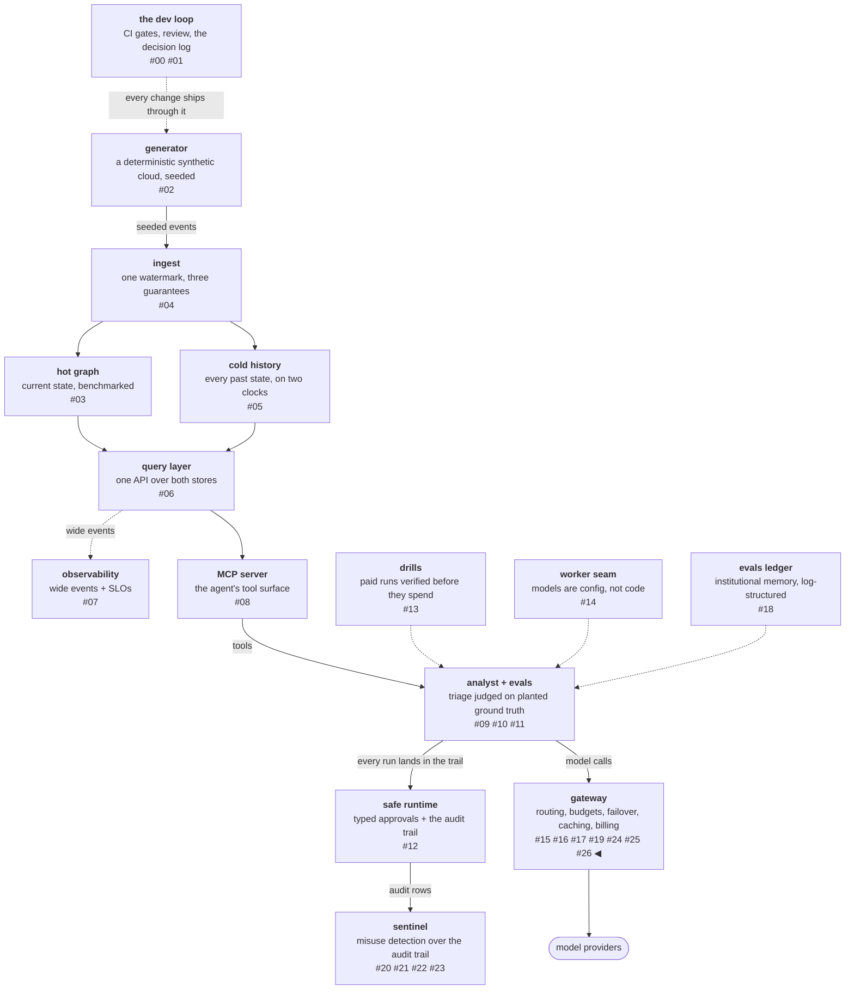

# Billing is a meter, an identity, and a wallet

The gateway-review post called billing the clause everyone
underrates: the gateway is the one component that sees every call
with its model, its tokens, its outcome, and its caller, so whatever
sits there is the natural meter. The meter has existed since the
token-path phase — per-call cost sliced by task class, backend, and
routing source. Billing is that meter plus two missing pieces:
knowing *who* consumed, and letting them prepay. This workstream
adds both, and the sharpest thing in it is a distinction between two
kinds of "no": an empty wallet is not a busy gateway, and the
refusal vocabulary keeps the two sentences apart.

<!-- more -->

!!! info "The resgraph series"
    This is the twenty-seventh post about
    [**resgraph**](https://github.com/fespino/resgraph), a mini data
    platform I am building for learning purposes.
    Browse the repository exactly as it stood when this was written:
    [`phase-12-gateway`](https://github.com/fespino/resgraph/tree/phase-12-gateway).
    Every snippet below is copied from that tag, trimmed only for
    length.

In this phase, continued: the previous post left one gap open on
purpose — the caller was a self-declared header. This workstream
([#267](https://github.com/fespino/resgraph/issues/267) →
[PR #294](https://github.com/fespino/resgraph/pull/294), decision
D43 — billing is meter + identity + wallet) closes it for keyed
traffic and builds the wallet on top.

The platform so far, with this post's piece highlighted:



## The wallet, in plain terms

The delivery app finally opens customer accounts. An account has a
name, a prepaid balance, and every receipt shows the order's price.
Two situations now end in "no order for you," and they must never
share a sentence: *your balance is empty* — add money, your problem
to fix — and *the app's own daily spending cap tripped* — wait, our
problem, nothing about your account. Confuse the two and customers
top up wallets to fix outages, or wait patiently on an empty
balance. The rest of the post is those two sentences, plus the
machinery that makes the first one possible.

## Identity is a key in the environment

Accounts live in a committed file, and the file refuses to hold
secrets — small enough to show whole:

```yaml
# evals/gateway-accounts.yaml
# Billing accounts: identity + wallet. Each account names the
# environment variable holding its API key (the secret NEVER lives in
# this file) and its prepaid grant in USD. A request presenting the key
# (x-api-key header) is authenticated as the account; its spend is
# decremented from the grant by the meter, and an empty balance refuses
# with 402 payment_required — "you spent YOUR balance", distinct from
# budget_503's "you hit OUR cap". A top-up is a granted_usd edit here:
# a reviewable diff. Spend state lives in data/gateway-balances.json.
#
# No accounts are configured yet; the schema, when one is:
#
# accounts:
#   replay-harness:
#     key_env: RESGRAPH_KEY_REPLAY
#     granted_usd: 5.00
```

The loader enforces the no-secrets rule instead of documenting it:

```python
# src/resgraph/gateway/accounts.py — load_accounts
        if "key" in entry:
            raise SystemExit(
                f"account {name!r} carries an inline key; keep the secret in the "
                "environment and name it with key_env instead"
            )
```

Authentication itself is deliberately boring:

```python
# src/resgraph/gateway/accounts.py
def resolve_account(accounts: dict[str, dict[str, Any]], presented: str) -> str | None:
    """The account whose key matches, or None; an unset env var never
    authenticates."""
    for name, entry in accounts.items():
        expected = os.environ.get(entry["key_env"])
        if expected and hmac.compare_digest(expected, presented):
            return name
    return None
```

Two guard rails around it: an unknown key is a 401, never an
anonymous fallthrough — a wrong key must not silently demote a
request to unbilled traffic — and a `caller` field that contradicts
the key's account is a 400, because attribution and identity must
not disagree in one request. Traffic with no key at all stays
allowed and self-attributed, exactly as the previous post decided:
this gateway serves its own laptop, and mandatory keys arrive when
an operator needs them, not before.

## The wallet refuses with the overdraft visible

A wallet is a prepaid grant decremented by the meter's own cost
records — cumulative, not daily, because a wallet is not a ledger
that resets at midnight. The refusal when it empties carries the
numbers:

```python
# src/resgraph/gateway/server.py
def _check_balance(gw: Gateway, account: str | None) -> None:
    """The wallet's refusal: 402 `payment_required` — "you spent YOUR
    balance", a different sentence from budget_503's "you hit OUR
    cap". Only authenticated accounts with a grant are metered."""
    ...
    if state.remaining_usd <= 0:
        raise HTTPException(
            402,
            detail=f"payment_required: account {account!r} spent its balance "
            f"(${state.spent_usd:.4f} of ${granted:.4f} granted)",
        )
```

The 402-versus-503 split was designed from this platform's own
refusal family — `budget_503` has meant "the gateway refuses to pay
past its cap" since the token-path phase — and then the
doc-validation pass found the reference gateway's error table
drawing the identical line: 402 for an empty balance, 503 for
routing that cannot serve. Convergent evolution is a pleasant form
of design review: two systems that never saw each other's internals
arrived at the same boundary because the boundary is real.

Notice what the refusal detail admits: spend can read *above* the
grant. That is the overdraft, and it is stated rather than hidden. A
request's cost is unknown at admission — output length is not in the
request, the same fact that bounds the dispatch queues — so the
wallet check is pre-serve: admit while remaining is positive, charge
after serving, and the final request may overshoot by one request's
cost. The alternative, refusing on an *estimated* cost, was
rejected as guessing dressed up as a refusal. A bounded, visible
overshoot beats an unbounded claim of precision.

## One bookkeeper

The usage surface reads the meter's own appended rows and nothing
else:

```python
# src/resgraph/gateway/server.py
    @app.get("/v1/usage")
    def usage(...) -> dict[str, Any]:
        """The usage surface, served from the meter's own records —
        per (day, account, endpoint): requests, tokens, cost. Gated by
        the management key when one is configured: the key that spends
        is not the key that administers."""
```

Deriving it from the Prometheus metrics was rejected: the metrics
exist for dashboards, and a billing surface that derives from
anything the serve path didn't write is a second bookkeeper that can
disagree with the first. The endpoint is gated by a management key
when one is configured — an inference key is never a management key,
the spend/administer capability split the reference gateway also
draws — and open on a laptop with none configured.

The last piece is the cost echo: every response carries `cost_usd`,
always on. Cache hits echo and record $0, because a hit spends no
backend tokens; free traffic is metered in the ledger but never
decrements a wallet. A row that knows its cost returns it.

## The trap fired live, again

The feature's first test run wrote 4.8 KB of fabricated usage rows
into the real `data/gateway-usage.jsonl`. This is the same failure
shape the sentinel arc hit when the classifier's call-cap tests
touched the real call ledger — a module whose default paths point at
`data/` will eventually be constructed by a test that forgets to
redirect them. The fix is structural rather than disciplinary, an
autouse fixture no test can forget:

```python
# tests/conftest.py
@pytest.fixture(autouse=True)
def _billing_ledgers_in_tmp(tmp_path, monkeypatch):
    """Billing ledgers go to a per-test directory, never data/."""
    from resgraph.gateway import accounts

    monkeypatch.setattr(accounts, "BALANCES_PATH", tmp_path / "gateway-balances.json")
    monkeypatch.setattr(accounts, "USAGE_PATH", tmp_path / "gateway-usage.jsonl")
```

The review question "is a monkeypatch the cleanest way to do this?"
got a recorded answer instead of a shrug: not really — the clean fix
is one settings module with a call-time-resolved data root for every
`data/` writer, replacing the per-concern fixtures with one. That
refactor is parked as
[#295](https://github.com/fespino/resgraph/issues/295) with the
trap's history attached, so the third occurrence of this failure
shape has an issue to point at.

## What breaks at 1000×

At real scale the wallet stops being a JSON file and becomes
accounting infrastructure: charges need idempotency keys so a
retried request cannot bill twice, reconciliation needs to prove the
ledger sums to the balances, and disputed rows need a state machine
rather than an edit. The part that survives unchanged is the
vocabulary: 402-your-balance versus 503-our-capacity is the
load-bearing contract at any size, and the pre-serve check's bounded
overshoot just gets a name accountants already use — pending
authorization versus settled charge. The meter-in-the-money-path
thesis from the review post is also no longer hypothetical: the
reference gateway's acquirer is a payments company, and this
workstream is the laptop-sized version of why that position was
worth buying.

The decision record is D43 (billing is meter + identity + wallet) in
[SPEC.md](https://github.com/fespino/resgraph/blob/main/SPEC.md);
the work landed as
[PR #294](https://github.com/fespino/resgraph/pull/294) under the
phase charter
[#263](https://github.com/fespino/resgraph/issues/263). The next
post is the phase's thesis made literal: the eval suite the platform
already paid for becomes a routing axis, and "quality" stops being a
marketing word.
