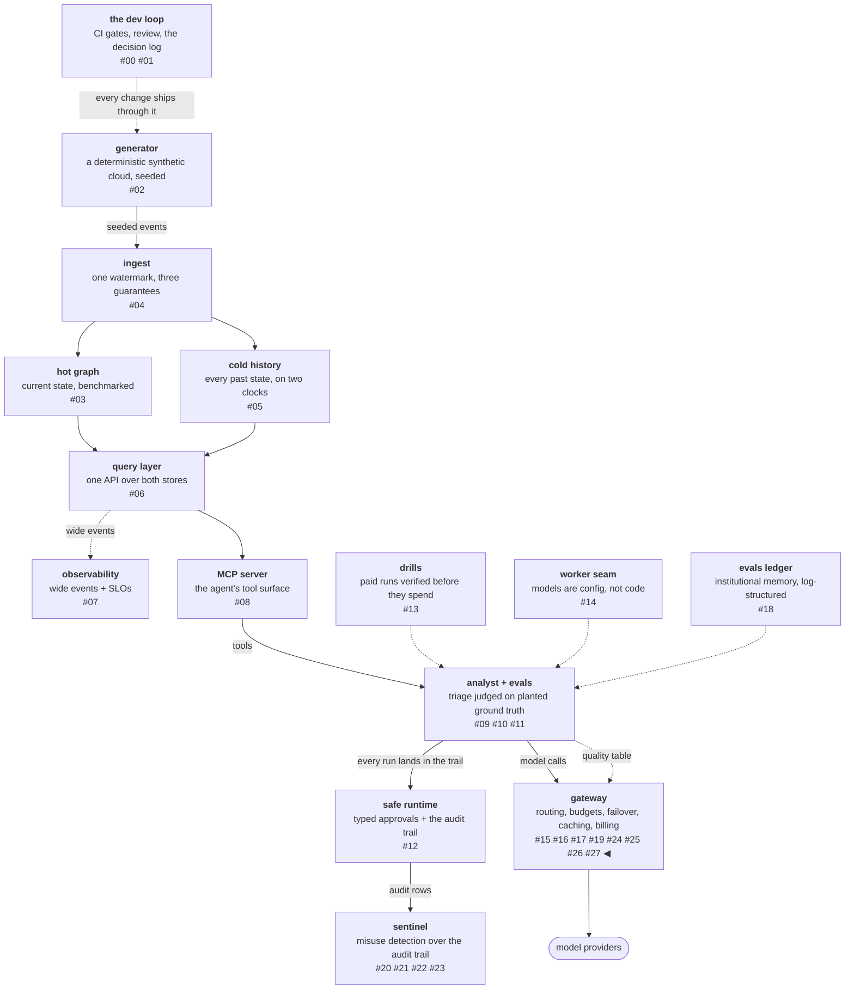

# No eval, no route

Routing by "quality" is the axis every gateway advertises and almost
none grounds, because grounding it requires evals with planted
ground truth and a calibrated judge — and those are expensive to
build for a routing feature. This platform already paid for them
three phases ago, so this workstream spends nothing new: the arms
table that picked the analyst's worker, then picked the misuse
judge, now answers its third question — which alias serves this
class of request — at request time. The receipt is the phase's
biggest number, and the qualitative half is what generalizes:
per-call price comparison is structurally blind to delivery rate,
so cheap can buy wrong. The magnitude is a property of the fixture,
not of the mechanism — over a 200-request stream against two arms
chosen to mirror measured shapes, price-only routing solves ~10 and
routing with a measured floor solves 180, and a different pair of
arms moves that ratio anywhere.

<!-- more -->

!!! info "The resgraph series"
    This is the twenty-eighth post about
    [**resgraph**](https://github.com/fespino/resgraph), a mini data
    platform I am building for learning purposes.
    Browse the repository exactly as it stood when this was written:
    [`phase-12-gateway`](https://github.com/fespino/resgraph/tree/phase-12-gateway).
    Every snippet below is copied from that tag, trimmed only for
    length.

In this phase, continued: with the catalog, the economics, the
contract, and billing in place, the fifth workstream
([#268](https://github.com/fespino/resgraph/issues/268) →
[PR #298](https://github.com/fespino/resgraph/pull/298), decision
D44 — eval-driven routing: the arms table at request time) is the
one the phase exists to prove.

The platform so far, with this post's piece highlighted — and note
the new edge, because it is the post:



## The third question, in plain terms

The delivery app has been running taste tests for months — the same
standardized order sent to every kitchen, graded against a known
answer key. Those scores already settled two arguments: which
kitchen gets the everyday orders, and which chef judges the taste
tests themselves. This workstream asks the scores a third question,
per order: for *this kind* of dish, which kitchens have proven they
can cook it at all — and among those, which is cheapest per plate
that actually arrives right? A kitchen that has never taken the
taste test does not get the guaranteed orders, no matter how cheap
it is. That is the whole design, and the rest is enforcement.

## The table is generated, never hand-written

The quality table is a committed file, and its most important
property is what it refuses to contain:

```python
# src/resgraph/gateway/quality.py — load_quality
            if missing:
                raise SystemExit(
                    f"quality entry {task_class}/{alias} lacks {missing}: "
                    "a score without provenance is an opinion, not a measurement"
                )
```

Every entry carries the run file and date it came from, because the
table is generated from eval runs by `resgraph-evals routing-table`,
never edited by hand — the builder derives pass^k and cost per
passed triage from run files through the same arms machinery the
model experiments use. And the committed table ships *empty*:

```yaml
# evals/routing-quality.yaml
# No multi-arm run files are committed yet, so no scores are either;
# the schema, once `resgraph-evals routing-table` generates it:
#
# scores:
#   judgment:
#     haiku:
#       passk: 0.78
#       cost_per_passed: 0.085
#       run: evals/runs/<file>.jsonl
#       date: "2026-08-19"
```

The multi-arm run files behind the real scores are not committed to
the repo, so the scores are not either. Fabricating plausible
numbers to make the feature look inhabited was not an option — an
empty file that tells the truth is a design artifact, and the loader
that would refuse a fabricated entry without a run path is its
enforcement.

## No eval, no route

Eligibility comes before any weighting, and the eligibility rule is
the post's title:

```python
# src/resgraph/gateway/quality.py
def eligible(
    table: dict[str, dict[str, dict[str, Any]]],
    task_class: str,
    candidates: list[str],
    min_passk: float,
) -> list[str]:
    """Candidates whose measured pass^k clears the floor. An unmeasured
    candidate is ineligible — no eval, no route: the floor is a
    guarantee, and a guarantee cannot rest on an absent measurement."""
    scores = table.get(task_class, {})
    return [a for a in candidates if a in scores and scores[a]["passk"] >= min_passk]
```

Three posts ago, capability admission decided the opposite default:
an *undeclared* capability admits, because refusing on ignorance
would refuse everything. Here an *unmeasured* candidate is
ineligible. The pair is not an inconsistency — it is the same
platform answering two different questions. Capability filtering is
a convenience that must not refuse on missing annotations; a pass^k
floor is a *guarantee*, and a guarantee cannot rest on a measurement
nobody made. What a mechanism promises decides its default, and
both defaults are argued in their decision records.

Among the eligible, the ordering reuses the previous posts'
machinery with the weight that matters: a free arm above the floor
preempts, picked by pass^k; priced arms run the inverse-square
lottery weighted by measured *cost per passed triage* — not cost per
call, because a cheap arm that rarely passes is expensive per
delivered answer, and both numbers come from the same run.

## Degrade, never refuse

When nothing clears the floor, the route falls back to the class's
static default with a logged warning:

```python
# src/resgraph/gateway/server.py — _quality_route
    ok = eligible(gw.quality, task_class, list(route.candidates), route.min_passk)
    if not ok:
        log.warning(
            "[gateway:quality] no candidate clears pass^k %.2f for %s; static default serves",
            route.min_passk,
            task_class,
        )
```

A routing optimization must not turn a servable request into a
refusal — the floor governs *which* eligible candidate serves, never
*whether* the request is served. Pins and explicit overrides outrank
quality routing entirely. And a served quality decision explains
itself: the source is `quality_route`, and the rationale names the
winning entry's run and date —

```python
# src/resgraph/gateway/server.py — _quality_route's decision
    return RouteDecision(
        model=pick,
        source="quality_route",
        fallback_allowed=True,
        rationale=(
            f"pass^k {entry['passk']} >= {route.min_passk} per {entry['run']} ({entry['date']})"
        ),
    )
```

The provenance rides all the way from the eval run into the response
metadata: a caller can ask "why this model?" and get a run file and
a date, not a vibe.

## The receipt: 18×, and what price-only routing cannot see

The measured comparison uses fixture arms mirroring the measured
shapes — a strong arm at real cost against a cheap arm that rarely
passes — and prices the same 200-request stream under both policies:

```python
# tests/test_gateway_quality.py
    picks = [(_gen(client, task_class="judgment")).json()["model"] for _ in range(n)]
    scores = TABLE["scores"]["judgment"]
    quality_solved = sum(scores[p]["passk"] for p in picks)
    # price-only picks the cheapest cost-per-passed arm every time
    price_pick = min(scores, key=lambda a: scores[a]["cost_per_passed"])
    price_solved = n * scores[price_pick]["passk"]
    assert picks and set(picks) == {"good"}
    assert quality_solved == pytest.approx(180.0)  # 0.9 * 200
    assert price_solved == pytest.approx(10.0)  # 0.05 * 200: cheapest solves 5%
    assert quality_solved / price_solved == 18.0  # the floor is the whole difference
```

Per-call price comparison is structurally blind to delivery rate: it
sees $0.02 versus $0.10 and picks the cheap arm, which then fails
19 requests in 20. Cost per *passed* triage is the number that
carries what a caller actually buys, and the floor keeps cheap from
buying wrong. The 18× is the difference between those two ways of
reading the same table, measured over the same stream — floors
before weights, so cheap never buys wrong.

## The bug the new tests flushed out

One latent bug fell to this workstream's tests, and its shape is
worth keeping. Request resolution looked up task-class defaults
against the module-level `DEFAULT_REGISTRY` instead of the
gateway's injected `registry` — invisible for an entire phase,
because every prior test suite's catalog happened to contain the
default aliases, so the wrong lookup kept returning right answers.
The quality tests built a gateway whose registry disagreed with the
default, and the bug surfaced on the first run. An injected
dependency whose default silently shadows the injection is only
testable by a test whose world disagrees with the default — a test
world that mirrors production too faithfully can be too agreeable to
catch anything.

## Addendum, one phase later: the floor had a sibling hole

This section was added after publication, when a later mini phase
asked the mechanism above a question the post never did. The policy
this post describes is floor, then free-preempt, then an
inverse-square lottery on cost per passed triage — and its thesis is
that a floor keeps cheap from buying *wrong*. The floor does that.
What nothing in the same mechanism did was keep cheap from buying
**worse in every way**.

The receipt is uncomfortable. With two arms clearing a 0.7 floor —
one at pass^k 0.90 and $0.10 per passed triage, the other at 0.75
and $0.15 — the lottery sends **30.8% of the stream to the second**,
which is worse on quality *and* more expensive. Weighting by cost
alone cannot see "worse on every axis," because it only looks at
one. The fix is a Pareto frontier between the floor and the draw: an
arm is dominated when another eligible arm is at least as good
everywhere and strictly better somewhere, and dominated arms are
excluded before the lottery runs, with the exclusion logged and the
arms named. Over the same 200-request stream that moves ~170.8
solved to 180.0 — about nine solved runs per two hundred, bought by
not spending on an arm that was never going to win
([`src/resgraph/gateway/quality.py`](https://github.com/fespino/resgraph/blob/main/src/resgraph/gateway/quality.py),
D51 — the quality router spends only on the frontier, and staleness
asks for a re-run).

The obvious objection is the interesting part, and it is why this
addendum exists rather than a one-line correction. Exploration
usually justifies exactly this kind of spend: you keep a weaker arm
in the pool because serving it *teaches you something about it*.
That argument is valid one layer down and invalid here, and the
difference is structural. The routing economics of post 24 keep a
flaky endpoint eligible precisely because **serving it updates the
latency window it is ranked by** — the traffic buys information.
Serving an arm never updates its pass^k: quality comes from eval
runs against planted ground truth, and a served request has no
answer key. A pull at this layer returns no reward signal, so a
dominated arm's traffic is pure loss, and an aged score can only be
refreshed by re-running the arms — which is why staleness here is a
re-measurement signal announced once at load, never a reduced
traffic share.

Two smaller things travelled with it. The table had been
**discarding an axis it already measured**: the arms summary computes
latency percentiles and the table builder emitted only pass^k and
cost, so the router was blind on an axis the eval program had
already paid for. Latency now travels with the score under the same
provenance rule — and it matters for dominance, because over two
axes an arm that trades quality and cost for being five times faster
reads as dominated and would have been pruned. Dominance compares
only the axes both scores record, so older tables behave exactly as
they did.

This is the
[multi-objective bandit](https://arxiv.org/html/2506.13125) shape,
and reading it that way is what supplied both halves: vector rewards
with a Pareto front instead of a single best arm, and policies like
[Pareto-UCB1](https://ai.vub.ac.be/sites/default/files/MO_MAB_IJCNN_Accepted_v2.pdf)
and [Pareto set identification](https://arxiv.org/html/2606.18785)
that prune dominated arms once dominance is statistically safe while
spending exploration on arms whose front-membership is still
uncertain. The staleness half is the
[non-stationary bandit](https://arxiv.org/pdf/0805.3415) problem,
whose answer is forgetting — discounted or sliding-window
estimates — which this platform already implements one layer down
and had not implemented here. What does *not* transfer is
exploration-by-pulling, for the structural reason above: those
policies assume a pull yields a reward observation, and at this
layer it does not.

And the way this was found is the part worth stealing. It did not
come from a review of the routing code. It came from reading
[an industry post about programmable heterogeneity](https://www.callosum.com/blog/programmable-heterogeneity)
— which argues for searching a configuration space toward a Pareto
front, and whose underlying paper,
[The Principle of Maximum Heterogeneity](https://arxiv.org/abs/2604.07602),
carries a second clause the vendor summary drops: environmental
demand places an *upper bound* on useful heterogeneity. Neither is
about routing tables. Asking this platform's own policy the same
question is what exposed
something no per-layer review could see, because the two halves were
each locally reasonable: the routing layer *forgets by construction*
(rolling windows, an idle backend returns to unmeasured), while the
quality table forgot nothing and weighted a months-old score exactly
like yesterday's. Same concern, opposite policies, neither of them
chosen. That is now a standing review shape in this repo — pick a
concern, ask every layer what its policy is, and record each
difference as decided or drifted
([#329](https://github.com/fespino/resgraph/issues/329)).

## What breaks at 1000×

The table's missing constraint appears the moment tables refresh:
score expiry. Nothing rots at this scale — the committed table is
regenerated per baseline event — but a fleet regenerating tables
from continuous eval runs needs max-age semantics, or a
January measurement quietly floors a June route; D44 records expiry
as the natural next constraint rather than building it early. The
deeper scale question is the eval bill: a floor per task class per
model means the eval suite runs per model release, and the routing
feature's true cost is the measurement program behind it — which is
why most gateways advertise quality routing and route by price: they
have the router, but not the ground truth.

The decision record is D44 (eval-driven routing: the arms table at
request time) in
[SPEC.md](https://github.com/fespino/resgraph/blob/main/SPEC.md);
the work landed as
[PR #298](https://github.com/fespino/resgraph/pull/298) under the
phase charter
[#263](https://github.com/fespino/resgraph/issues/263). The next
post seats a protector in the request path — a screen that reads
every request and never blocks one, and a lifecycle gate that would
rather serve 410 Gone than a lookalike model.
