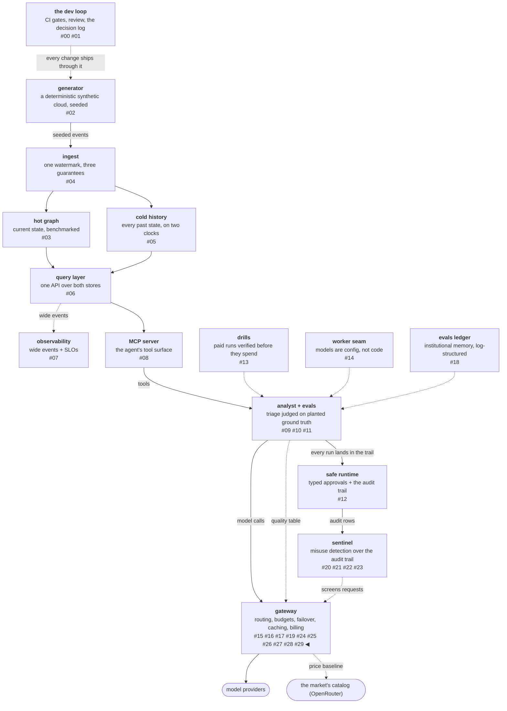

# Consume the reference, deliberately small

Every workstream in this arc so far replicated a mechanism of the
reference gateway against local traffic. The last one consumes the
reference instead: one connector ingests OpenRouter's public models
catalog, and exactly one consumer reads it — a price-baseline
comparison that puts this platform's hand-maintained price table
next to the market's, row by row. The interesting engineering is not
the HTTP call. It is everything decided before and around it: the
access-posture judgment recorded before code, the one field the
snapshots refuse to keep, and the rule that a wrong price silently
attributed is worse than a stated "unmatched."

<!-- more -->

!!! info "The resgraph series"
    This is the thirtieth post about
    [**resgraph**](https://github.com/fespino/resgraph), a mini data
    platform I am building for learning purposes.
    Browse the repository exactly as it stood when this was written:
    [`phase-12-gateway`](https://github.com/fespino/resgraph/tree/phase-12-gateway).
    Every snippet below is copied from that tag, trimmed only for
    length.

In this phase, continued: the seventh workstream
([#270](https://github.com/fespino/resgraph/issues/270) →
[PR #302](https://github.com/fespino/resgraph/pull/302), decision
D46 — the market connector: consume the reference, deliberately
small) is the integration slice, and "deliberately small" is its
design constraint: one pull, committed snapshots, one consumer.

The platform so far, with this post's piece highlighted — the map
gains an external node:



## The walk across the street, in plain terms

The counter finally walks across the street and photographs the big
food court's menu board — once a day, politely, name tag on — and
pins the photo next to its own menu. Same dishes, same prices: good,
the house menu checks out. And one dish the house serves for free
turns out to cost real money over there, which is worth knowing
before anyone writes a business plan around it.

## The posture was judged before the code

The pre-flight question was not technical: may this connector call
that endpoint at all? The terms of service never grant API access
explicitly and reserve broad rights over "Materials." The judgment,
recorded on the issue before any code, reads the operator's own
serving posture as evidence: the catalog is served
`cache-control: public, max-age=300` from Cloudflare's CDN with
wildcard CORS. You do not CDN-cache a resource as `public` and
simultaneously intend it to be secret — a documented API endpoint
served that way is an invitation to arbitrary clients, and calling
it is not scraping the site.

The verdict was GO with conditions, and the conditions bound the
exposure rather than decorate it: documented endpoint only, at most
one pull per day, a User-Agent naming this repo, and snapshots as
deletable fixtures. If the operator ever objects, the consumer
degrades to "no market baseline" — not a broken gateway. The
connector's constants carry the manners:

```python
# src/resgraph/gateway/market.py
MODELS_URL = "https://openrouter.ai/api/v1/models"
USER_AGENT = "resgraph-catalog-connector/0.1 (+https://github.com/fespino/resgraph)"
```

## 401 is a defined outcome, not an error

The endpoint answers without authentication today, but the OpenAPI
spec marks it bearer-authenticated — so open access is observed
behavior, not contract, and the connector treats the door closing as
a state to surface and stop on:

```python
# src/resgraph/gateway/market.py — fetch
    if resp.status_code in (401, 403):
        raise SystemExit(
            f"market catalog now requires auth (HTTP {resp.status_code}): the open "
            "access was observed behavior, not contract — stop polling; this is a "
            "defined outcome, not an error to retry"
        )
    if resp.status_code == 429:
        raise SystemExit("market catalog rate-limited us (HTTP 429): stop for this run")
```

Never a retry loop against someone else's free resource. The same
restraint keeps polling out of the serving process entirely: the
catalog moves on week timescales, so a manual or cron pull matches
that pace, and the serve path stays network-free.

## Facts are free, prose is someone's

The committed snapshots preserve every key in every row — the drift
tests want the whole shape — with one exception, and the exception
is a copyright decision expressed as a schema decision:

```python
# src/resgraph/gateway/market.py
REDACTED = "[redacted: authored prose is not republished; see the source url]"


def redact(rows: list[dict[str, Any]]) -> list[dict[str, Any]]:
    return [
        {k: (REDACTED if k == "description" and v else v) for k, v in row.items()} for row in rows
    ]
```

A catalog row is 415 rows of uncopyrightable facts — ids, prices,
context windows — and exactly one authored field. The facts are
committed; the prose is not. Each snapshot also records its source
URL and fetch time, the same provenance rule the quality table
enforces: no provenance, no baseline.

Drift, meanwhile, is not hypothetical — it was observed within the
phase itself. Rows fetched at build time carried six fields the
phase's own documentation-validation pass had not listed two days
earlier. The shape validator runs on the wire response and on every
loaded snapshot alike, names what broke, and refuses rather than
best-efforts, so a drifted catalog stops the connector instead of
feeding it garbage.

## A wrong price is worse than no price

Matching a market row to a local endpoint is declared or mechanical,
never fuzzy:

```python
# src/resgraph/gateway/market.py
def market_prices(rows: list[dict[str, Any]]) -> dict[str, dict[str, Any]]:
    """Normalized id-tail -> the listing's per-mtok facts. A tail two
    authors share auto-matches nothing (a wrong price silently
    attributed is worse than an honest 'unmatched'); an explicit
    `market:` id in models.yaml still reaches those rows exactly."""
```

An id-tail that two authors share auto-matches nothing, and an
unmatched endpoint is reported as unmatched — a fact, not a zero,
the same epistemics the routing stats use for an empty window. The
one consumer then prints the comparison, and this is its real
output on the committed snapshot:

```console
$ uv run resgraph-gateway market-baseline
market: https://openrouter.ai/api/v1/models @ 2026-08-20T00:38:32+00:00 (415 models)
haiku: ours=$6.00 market=$6.00 (anthropic/claude-haiku-4.5) ratio=1.0
haiku-via-gateway: ours=$6.00 market=$6.00 (anthropic/claude-haiku-4.5) ratio=1.0
openai: ours=$12.50 market=$12.50 (openai/gpt-4o) ratio=1.0
opus: ours=$30.00 market=$30.00 (anthropic/claude-opus-4.8) ratio=1.0
qwen-local-1.5b: ours=free market=unmatched
qwen-local-7b: ours=free market=$0.30 (qwen/qwen-2.5-7b-instruct)
sonnet: ours=$18.00 market=$18.00 (anthropic/claude-sonnet-4.6) ratio=1.0
```

Three kinds of row, three kinds of value. The 1.0 ratios are
independent confirmation that the hand-maintained price table agrees
with the market — the platform's cost numbers cross-checked against
an external source for the first time. The qwen-7b row prices a
standing decision: run it locally for free, or route to the same
weights on the market for $0.30 per million tokens — a build-vs-buy
row with a real number in the buy column. And one row in this
table's *first* version exposed a genuine bug in this platform's own
catalog — the story the next post opens with, because it was the
phase audit's best catch.

## Addendum, one phase later: the inversion started

Added after publication, when the closing prediction below — that a
daily manual pull becomes a pipeline — stopped being a prediction.
Three changes landed, and the first exists because this post's own
drift check had a hole.

**A schema check catches only what someone enumerated.** The
validator shown above refuses a response whose *declared* fields are
missing or malformed, which is the wrong shape for the failure this
post itself reported: rows arriving with six fields nobody had
listed. So the connector now fingerprints each pull's set of row
shapes and compares it against the previous snapshot, naming fields
rather than requiring anyone to have declared them:

```python
# src/resgraph/gateway/market.py @ phase-13.5-frontier-routing
def drift(previous: list[dict[str, Any]], current: list[dict[str, Any]]) -> list[str]:
    """What changed in the catalog's SHAPE between two pulls. Names the
    fields rather than requiring anyone to have enumerated them: a
    field nobody declared is exactly the one that gets missed."""
```

The distinction that makes it work sits in the neighbouring
docstring: rows legitimately differ from each other, since an
omitted optional field is not drift, so shapes are a fingerprint to
compare *across* pulls and never a count to threshold *within* one.

**The cadence became collected rather than intended.** The pull ran
manually, which meant it did not run — the directory held one file
for as long as nobody remembered. A scheduled workflow now pulls
daily and commits the snapshot, which is the cron pull the decision
already called honest, and the serving path stays network-free. It
is also the one job here that commits without review, recorded
rather than taken quietly: the commit step stages the snapshot
directory and nothing else, which bounds what the job as written
does rather than what a compromised runner would respect.

**And the decision now says git is the store.** That buys what a
bucket does not — a pull request shows which prices moved,
provenance rides the commit history, the record deletes in one
command if the upstream terms demand it — and it cannot query:
ninety days of price history means reading ninety files. Stated
without hedging, because it matters more than the mechanism: a
repository is a serviceable store for a daily 826 KB file and the
wrong answer at any real volume, and nothing here is a
recommendation to keep observational data in version control (D46's
2026-08-21 amendments; the retention rule is now live at ~24 MB a
month, [#332](https://github.com/fespino/resgraph/issues/332)).

## What breaks at 1000×

The deliberate smallness is what breaks. At fleet scale the market
catalog is not a baseline — it is an input: prices feed procurement,
endpoint listings feed routing, uptime feeds SLOs, and the connector
becomes exactly the kind of external dependency the rest of this
phase built defenses around — which is why the umbrella explicitly
chartered the market-as-world treatment *out* of this phase. The
restraint list also inverts at scale: a daily manual pull becomes a
pipeline with freshness SLOs, and the access-posture judgment this
post made from observed headers becomes a signed agreement, because
a business input needs a contract, not an inference from
cache-control.

The decision record is D46 (the market connector: consume the
reference, deliberately small) in
[SPEC.md](https://github.com/fespino/resgraph/blob/main/SPEC.md);
the work landed as
[PR #302](https://github.com/fespino/resgraph/pull/302) under the
phase charter
[#263](https://github.com/fespino/resgraph/issues/263). One post
remains in this arc: the exit-gate audit that closed the phase, what
it caught, and the case for auditing a charter by its wording rather
than its spirit.
