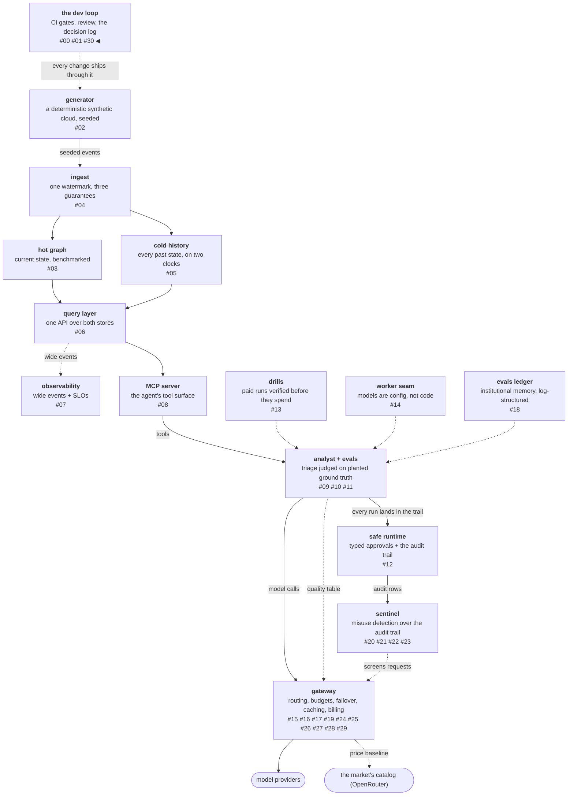

# The phase that audited itself

A phase charter with an exit gate is a registered prediction: before
the work, it states what done means. This post closes the gateway
arc with the audit that held the phase to that registration — item
by item, against the gate's *wording* rather than its spirit —
because a registration you only audit charitably was never a
registration. The audit's best catch was a paid model the billing
convention would have served for free, found because one table
printed the house price next to the market's. And the phase's last merged
change reversed a rule this series had enforced eighteen corrections
deep, which is its own story about working with a decision log.

<!-- more -->

!!! info "The resgraph series"
    This is the thirty-first post about
    [**resgraph**](https://github.com/fespino/resgraph), a mini data
    platform I am building for learning purposes.
    Browse the repository exactly as it stood when this was written:
    [`phase-12-gateway`](https://github.com/fespino/resgraph/tree/phase-12-gateway).
    Every snippet below is copied from that tag, trimmed only for
    length.

In this phase, closing: the exit-gate audit
([#303](https://github.com/fespino/resgraph/issues/303) →
[PR #305](https://github.com/fespino/resgraph/pull/305)) and the
decision-pointer reversal
([#296](https://github.com/fespino/resgraph/issues/296) →
[PR #297](https://github.com/fespino/resgraph/pull/297)), after
which the umbrella
[#263](https://github.com/fespino/resgraph/issues/263) closed on
the audit's findings.

The platform so far — this post's piece is the loop everything ships
through, because the closeout is about process, not the gateway:



## The closeout, in plain terms

At the end of the opening month, the counter takes down the list of
promises it posted on day one and reads it item by item against what
actually happened — the till against the receipts, the menu against
the photo of the competitor's menu hanging next to it. It writes
down the two places where what it did differed from what it
promised, instead of deciding the promises basically meant whatever
it did. And it finds one dish it had been giving away by accident,
caught only because the two menus hung side by side.

## The catch: a paid model, metered at $0

The billing posts established a convention: no price on file means
unmetered, designed for local weights where "free" is simply true.
The audit found `gpt-4o` sitting in the catalog as a routable setup
with no row in the pricing table — a paid, hosted model the
convention would have zero-billed. Nobody read the config and
noticed. The market-baseline table caught it, because its first
version printed `ours=free market=$12.50` side by side, and a free
price next to a twelve-dollar listing reads as exactly what it was.

The fix landed twice, instance and class. The price row closes this
case ($2.50/$10.00 per million tokens, matching the market listing
that exposed it). The class fix is a load-time warning: a setup
whose base URL is not local, with no price on file, logs "it meters
$0" at startup — a warning rather than a refusal, because
schema-only worlds and billing-off runs are legitimate.

The best evidence the class fix was needed came from the repo's own
test suite: adding the price row *broke a budget test*, whose
fixture had used the literal name `gpt-4o` to mean "some unpriced
model." The convention slip was not hypothetical — it was already
encoded in a fixture, waiting to institutionalize itself. The
fixture now names a model that is not anyone's paid product, which
is the transferable rule: a real product's name in a fixture is a
claim about that product, and one day the claim gets checked.

## The repo broke its own benchmarks rule

Two of this arc's headline numbers — the 18× quality-floor result
and the screening latency — had been quoted in PR bodies and issue
threads but never entered
[BENCHMARKS.md](https://github.com/fespino/resgraph/blob/main/BENCHMARKS.md),
against the repo's own rule that no number ships without methodology
and hardware. The audit added both rows, and re-measuring the screen
fresh for its entry produced the sharper number:

```text
# BENCHMARKS.md — the screening entry (Apple M3, 2,000 calls, 1.9 KB payload)
| metric | value |
|---|---|
| p50 | 39.5 µs |
| p99 | 47.4 µs |
| max | 53.0 µs |
```

A rule that only binds when someone remembers it is a habit, not a
rule — the audit is the mechanism that makes it binding, and the
finding says the drift starts in the gap between "the number is in
the PR" and "the number is in the ledger."

## Deviations recorded, not smoothed

Two findings changed no code, and writing them down anyway is the
method. The exit gate's wording said the economics receipts would be
"measured on replay"; the actual instruments were seeded policy
simulations. The choice was right — neither the lottery nor the
quality floor reads request content, so replaying real traffic adds
realism nothing consumes — but the wording promised one instrument
and the work used another, and the audit records the substitution
instead of letting the receipts imply replay. An exit gate is a
registered prediction; auditing it by wording, not spirit, is what
makes the registration worth anything.

The second was a silently dropped word. The charter named three
lifecycle states — announced, deprecated, sunset — and D45 shipped
two, with the validator refusing the third. The two-state design
stands on its merits: a state with no date semantics and no gate
behavior is vocabulary without a contract. But the decision to drop
it was never written down, so the audit wrote it into D45's rejected
list, marked as recorded late. A right call that leaves no record is
indistinguishable, later, from an oversight.

## The reversal: navigation is not narration

The phase's last story is about the decision log itself. This series
has a hard rule, enforced through eighteen corrections: no D-number
citations in code — no inline "per D40" comments, no rationale
paraphrased next to the logic it shaped. Then a re-read of the
[decision-log post](01-decisions-with-reversal-conditions.md)
surfaced what the rule had quietly cost: that post promises every
component points back at a decision, and in the zero-pointer end
state the only route from a module to its decisions was git-blame →
commit → SPEC, which decays through refactors.

The resolution distinguishes two jobs the rule had been treating as
one. *Narration* — rationale in comments, per-function citations —
stays banned; it goes stale and the SPEC owns it. *Navigation* — an
address — gets exactly one line, at the end of a module docstring:

```python
# src/resgraph/gateway/registry.py — the last line of the module docstring
Decisions: D40 (SPEC.md).
```

One pass added the line to the modules whose attribution is
unambiguous and skipped the rest, because a wrong address is worse
than none. The reverse direction — SPEC listing file anchors — was
rejected on the drift argument: code changes faster than the SPEC,
so pointers must live in the artifact that changes and aim at the
one that doesn't. The eighteen corrections and the post's promise
were both right, aimed at different failure modes, and the unit of
the rule turned out to be the anchor point, not the citation.

## The arc, closed

Seven workstreams, one audit, and the phase distills to five
sentences. Validate the reference's documentation before building
against it, in both directions — the one suspicion this phase
raised against the docs turned out wrong, and the check was the
point. A receipt is a committed, seeded test — 0.449× and 18× are
re-runnable, not quoted. One platform can hold two opposite defaults
when they answer different promises: undeclared capability admits,
unmeasured quality is ineligible. An exit gate is audited by its
wording, and deviations are recorded rather than smoothed. And the
arms table answered three questions from one measurement — worker,
judge, and route — which is the compounding return on ground truth
this whole series keeps banking.

The phase also names what it declined, so the list is a decision
rather than a horizon: compliance-as-a-routing-dimension, a
quantization filter, and the EWMA-versus-percentile replay
comparison all stand unbuilt in the charter's closing audit. The
work landed as
[PR #305](https://github.com/fespino/resgraph/pull/305) and
[PR #297](https://github.com/fespino/resgraph/pull/297); the
umbrella closed on the
[exit-gate audit](https://github.com/fespino/resgraph/issues/263#issuecomment-5350013503).
The next phase changes posture entirely: instead of building a
miniature of a layer, it integrates a real observability product —
and replicates only the parts where building teaches more than
using.
