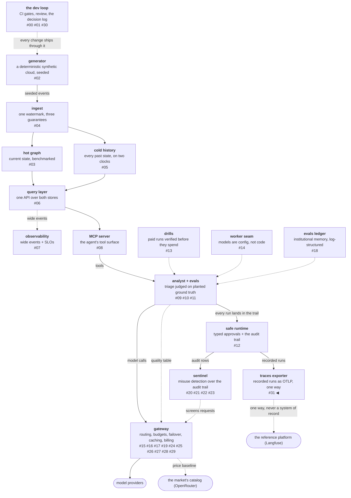

# One-way export, and the half of the phase that stayed parked

An **integration slice** is a piece of work whose deliverable is a
claim about somebody else's product: is their read path good enough
for an agent, does their meter agree with mine, can their vocabulary
express what my evals measure. That makes it different in kind from
the replication slices this series has been shipping, where the
deliverable is a mechanism I control. The distinction sounds
academic until it decides what you may merge, which is what happened
here: this phase set out to integrate a real observability platform
and to replicate the parts of it worth building, and the integration
half is parked in full because the machine to answer its questions
does not exist on my desk.

What did ship is the code half of the first slice — an exporter that
sends recorded runs one way, and an acceptance test that reads them
back through the product's own APIs and reconciles them against the
audit store.

<!-- more -->

!!! info "The resgraph series"
    This is the thirty-second post about
    [**resgraph**](https://github.com/fespino/resgraph), a mini data
    platform I am building for learning purposes.
    Browse the repository exactly as it stood when this was written:
    [`phase-13-observability`](https://github.com/fespino/resgraph/tree/phase-13-observability).
    Every snippet below is copied from that tag, trimmed only for
    length.

In this phase: the platform stops building miniatures of a layer and
meets a real product. The umbrella is
[#243](https://github.com/fespino/resgraph/issues/243), and it holds
two groupings — integration, which asks questions of
[Langfuse](https://langfuse.com/) itself, and replication, which
rebuilds mechanisms from its published architecture over this
platform's own events. This post covers the first slice
([#308](https://github.com/fespino/resgraph/issues/308) →
[PR #314](https://github.com/fespino/resgraph/pull/314), decision
D47 — Langfuse integration is one-way, and the round-trip is the
acceptance test) and the parking decision that shapes everything
after it.

The platform so far, with this post's piece highlighted — the map
gains a second external node:



## The slice that cannot be finished against a fixture

Self-hosting the reference platform is six containers — web, worker,
ClickHouse, MinIO, Redis, Postgres — against a documented
recommendation of four cores and 16 GiB. This laptop has 8 GiB and
also runs the platform's own stores. So the integration grouping is
parked entirely, on the record at
[#317](https://github.com/fespino/resgraph/issues/317), and the
argument for parking is the part worth carrying to another project.

Every integration slice's *deliverable* is an answer about the real
product. Is the read path agent-grade? Can their score vocabulary
express pass^k across trials? Does their cost table agree with the
gateway's meter? Does their evaluator agree with a judge pinned to a
model and a frozen template? Each of those is a question about
software I do not control, and none of them can be answered by a
test double. I could write every one of those slices against
fixtures, watch the suite go green, and merge them. The artifacts
would look finished and would have measured nothing — which is
exactly the failure this repository has an incident about, INC-002,
where two paid runs completed, produced numbers, and measured
nothing for want of a two-minute check.

A parked slice states a question that is still open. A slice whose
findings are hypotheses wearing a merged pull request states a false
answer, and states it in the most credible place a project has. The
repository's `README` names the parked half in its phase table
rather than letting an absent artifact imply completeness:

```markdown
Phase 13's integration half is parked
(#317): self-hosting the reference platform needs more machine than
this host has, and a slice whose deliverable is a claim about the
real product cannot be honestly finished against fixtures.
```

The unpark triggers are recorded with the parking, because a park
with no exit is an abandonment with better manners: a host with at
least 16 GiB, or a measured attempt with the platform's own stores
down — the stack may fit tightly, and that measurement is itself a
finding — or their cloud free tier as the receiving end, which costs
no local memory and exercises the same APIs at the price of sending
recorded synthetic traffic off the machine. That last one is an
operator's call and gets recorded on the issue when it is made.

## The deprecation notice did the design review

The exporter's code half needed no containers, so it shipped. It was
sketched against the product's ingestion API, and the phase's
standing documentation-validation step — read the reference's own
docs before building against them — found that API deprecated with
an announced sunset of 2026-11-16. The supported path is OTLP over
HTTP, which is
[OpenTelemetry](https://opentelemetry.io/docs/specs/otlp/)'s wire
protocol rather than a vendor shape.

The replacement fits better than the original plan, for a reason
that has nothing to do with support windows. This exporter sends
*recorded* runs: rows that were written to the audit trail hours or
days ago, replayed out of SQLite. Their SDK's context managers
instrument live code, so a replay would have to fight them for
control of the clock. OTLP spans carry explicit start and end
timestamps as fields, so an exported run keeps the trail's own time:

```python
# src/resgraph/langfuse/otlp.py
def to_nanos(ts: str) -> int:
    return int(datetime.fromisoformat(ts).timestamp() * 1_000_000_000)
```

A vendor-neutral protocol turned out to be the one that could
express a replay, and the deprecation notice is what forced the
question. The general form is worth stealing: validating a
dependency's documentation before writing against it is usually sold
as risk reduction, and it is at least as often a design review you
did not know you needed.

## One way, and the trail keeps the clock

D47's structural half is a single sentence with no reversal
condition: resgraph records feed Langfuse, and Langfuse never
becomes a system of record. The audit store keeps its authority, and
the exporter is a copy. Everything else in the slice follows from
that, starting with the mapping — a run becomes a trace, and every
audit event becomes a child span carrying the sequence number it was
written under:

```python
# src/resgraph/langfuse/otlp.py
_KIND_TYPES = {"llm_call": "generation", "tool_call": "tool", "step": "event"}


def trace_id(run_id: str) -> str:
    return hashlib.sha256(f"run:{run_id}".encode()).hexdigest()[:32]


def span_id(run_id: str, seq: int) -> str:
    return hashlib.sha256(f"span:{run_id}:{seq}".encode()).hexdigest()[:16]
```

Both identifiers are derived rather than generated, which is what
makes the export idempotent: the same run exported twice produces
the same trace and span ids, so a re-run overwrites rather than
duplicating. The root span uses `seq = -1`, a sequence number the
trail never issues, so the run's own span can never collide with an
event's.

The audit sequence rides along as metadata on every span, and that
one attribute is what makes the round-trip below possible at all:

```python
# src/resgraph/langfuse/otlp.py — _event_span
    attrs.append(_attr("langfuse.observation.metadata.audit_seq", seq))
```

Without it, reconciliation would have to match rows by timestamp and
name, which is a fuzzy join by another name. With it, every fetched
observation carries the primary key of the row it came from.

## Usage always, cost never

Generations carry token usage. They deliberately do not carry
`cost_details`, and the omission is the slice's sharpest design
decision.

One of the parked integration slices asks whether their cost
tracking agrees with this platform's own meter. If the exporter sent
this platform's computed cost, that slice would fetch the number
back, compare it against itself, and report perfect agreement
forever. It would complete, produce a number, and measure nothing.
Withholding the field forces the product to price the traffic with
its own table, which is the only version of that comparison that can
disagree.

That is the INC-002 question — *how could this complete, produce
numbers, and measure nothing?* — asked at design time about a slice
that will not run for months, rather than after the spend. The cost
of asking early was one field left out of a JSON document.

The token split shows the same posture from the other side:

```python
# src/resgraph/langfuse/otlp.py
def _usage(event: dict[str, Any]) -> dict[str, int]:
    # the split only when the trail recorded it — never invented from a total
    payload = event["payload"]
    if "input_tokens" in payload:
        return {"input": payload["input_tokens"], "output": payload["output_tokens"]}
    return {"total": event.get("tokens") or 0}
```

Their pricing needs input and output tokens separately, and the
trail historically recorded only the sum. The fix was additive — new
keys beside the old total, so no existing row changed — and rows
written before the change export the total they actually have. A
split could be estimated from a typical ratio, and the estimate
would be indistinguishable from a measurement once it was in their
database. Absence is reported as absence, which is a rule this
platform keeps re-earning at every layer.

## The acceptance test reads it back

Export alone is half an integration. The other half is the question
the phase actually cares about: can an agent on this side read the
data back out and use it? So the acceptance test is a command that
fetches the exported trace through the product's own read APIs and
reconciles it against the audit store, exiting nonzero on any
mismatch:

```python
# src/resgraph/langfuse/cli.py
@app.command()
def roundtrip(
    run_id: str = "",
    db: str = str(DEFAULT_DB),
    endpoint: str = DEFAULT_ENDPOINT,
    measure: str = "totalTokens",
) -> None:
    """The acceptance test: fetch the exported trace back through
    their read APIs — a row leg (observations) and an aggregate leg
    (metrics) — and reconcile both against the audit store. Exits
    nonzero on any named mismatch."""
```

Two legs, because the product exposes two different read layers and
they have different strengths. The row leg pulls observations and
checks them one at a time against the events that produced them:

```python
# src/resgraph/langfuse/reconcile.py — reconcile_rows
    for event in events:
        seq = event["seq"]
        obs = fetched.get(seq)
        if obs is None:
            mismatches.append(f"seq {seq} ({event['kind']}): no observation came back")
            continue
```

Each mismatch is a sentence naming what disagreed, and the check
runs in both directions — a fetched observation the trail never
wrote is reported too:

```python
# src/resgraph/langfuse/reconcile.py — reconcile_rows
    extra = set(fetched) - {e["seq"] for e in events}
    for seq in sorted(extra):
        mismatches.append(f"seq {seq}: observation exists that the trail never wrote")
```

The aggregate leg asks their metrics endpoint to sum the same
traffic and compares that against the run's own totals. It exists
because the two layers fail differently: a row-level fetch can
succeed while an aggregate is computed over the wrong window, and an
aggregate can agree while individual rows are missing.

```python
# src/resgraph/langfuse/reconcile.py — reconcile_aggregate
    ours = (run.get("tokens_in") or 0) + (run.get("tokens_out") or 0)
    theirs = sum(int(float(row.get(measure_field) or 0)) for row in metrics_rows)
    if theirs != ours:
        return [f"aggregate: {theirs} tokens from their metrics vs {ours} from the runs table"]
```

The aggregate query targets `v2` of the metrics API because the
`v1` traces view was removed, which is the kind of detail that only
turns up when you write the read half. That is the point of making
the acceptance test machine-shaped rather than a screenshot: an
awkward or lossy read path becomes a measured finding about where
the product assumes a human eyeball, instead of a shrug.

There is one more piece of defensive shape in the read path, and it
is there because the two APIs do not agree with each other:

```python
# src/resgraph/langfuse/reconcile.py — observation_rows
        meta = row.get("metadata")
        if isinstance(meta, str):
            try:
                meta = json.loads(meta)
            except ValueError:
                meta = {}
```

Metadata comes back as a parsed object from one endpoint and as a
JSON string from another. Handling both is three lines; discovering
it required running the round-trip against the real thing, which is
the whole argument for not simulating this half.

## A profile heavier than the host

The compose profile shipped anyway, digest-pinned and loopback-only
like every other service in this repository, with its constraint
written where someone will read it:

```yaml
# compose.yaml
  # Langfuse profile: opt-in, and heavier than everything above combined
  # (their stack recommends 16 GiB) — run it with the store stack DOWN:
  #   docker compose --profile langfuse up -d
```

Initialization runs headless, with fixed organization, project and
API keys supplied as environment variables, so the exporter needs no
click-through in a web UI before it can send anything. That matters
more than it sounds: a setup step that only a human can perform is a
step that will not run in CI and will be misremembered in six
months.

Only the web port binds to the host, at `127.0.0.1:3001`, because
3000 already belongs to this project's Grafana. The credentials in
that file are local development placeholders behind loopback binds,
which is the same rationale the observability profile's anonymous
Grafana admin runs on — the "local only" argument is only true if
the bind address makes it true.

## What I'd take to the next project

- **Validate a dependency's documentation before writing against
  it.** Here it killed the planned transport before a line existed
  and handed back a better one. The deprecation notice was the
  design review, and the check cost an afternoon of reading.
- **Decide the direction of an integration once, structurally.** One
  system of record, one copy, and no reversal condition. Every later
  question about conflicts and merges answers itself, because there
  is nothing to merge.
- **Withhold the field that would let a future comparison agree with
  itself.** A reconciliation that can only succeed is not a
  reconciliation, and the cheapest moment to notice is while
  designing the export it will read.
- **Make the acceptance test read the data back by machine.** An
  export you have only looked at in a dashboard is an export you
  have not tested, and the read path is where a product's assumptions
  about human eyeballs become visible.
- **Park the work you cannot finish, and say so where the work is
  listed.** A parked slice with recorded unpark triggers is a
  statement about what is still unknown; the same slice merged
  against fixtures is a false claim in the most credible place your
  project has.

The decision record is D47 (Langfuse integration is one-way, and the
round-trip is the acceptance test) in
[SPEC.md](https://github.com/fespino/resgraph/blob/main/SPEC.md);
the code landed as
[PR #314](https://github.com/fespino/resgraph/pull/314) under the
umbrella [#243](https://github.com/fespino/resgraph/issues/243),
and the parking decision is
[#317](https://github.com/fespino/resgraph/issues/317). The next
post starts the replication half, where the deliverables are
mechanisms rather than claims about someone else's software: a
pipeline that stops the producer from ever writing to the analytical
store, and the measurement whose headline number I refuse to quote.
