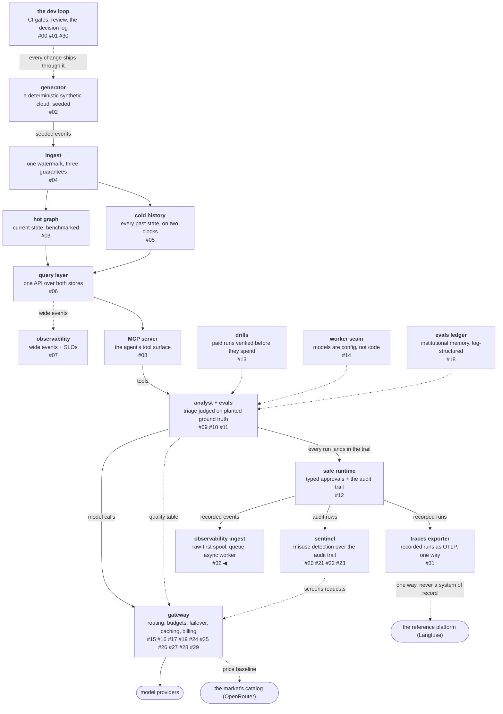

# Raw-first ingestion, and the ratio I refuse to sell

**Raw-first ingestion** means the producer's write path ends at an
immutable file: a call content-addresses its batch, writes it once,
enqueues a reference, and returns. Everything else — parsing,
enrichment, pricing, the write into the analytical store — happens on
an asynchronous leg that the producer never waits for. The shape
comes from the reference platform's own migration to a spool and a
queue, and this post rebuilds it over this project's events and
grades it on the three properties it exists for.

It also produces the largest number in the phase, 42.8×, which is
real and which I will not quote as a headline. The two arms are
doing different jobs, and the sentence that survives a change of
fixture is a different one.

<!-- more -->

!!! info "The resgraph series"
    This is the thirty-third post about
    [**resgraph**](https://github.com/fespino/resgraph), a mini data
    platform I am building for learning purposes.
    Browse the repository exactly as it stood when this was written:
    [`phase-13-observability`](https://github.com/fespino/resgraph/tree/phase-13-observability).
    Every snippet below is copied from that tag, trimmed only for
    length.

In this phase, continued: the previous post covered the integration
half and why the rest of it is parked. This is the first replication
slice ([#318](https://github.com/fespino/resgraph/issues/318) →
[PR #320](https://github.com/fespino/resgraph/pull/320), decision
D48 — raw-first ingestion: the producer writes to a spool, never to
the store), where the deliverable is a mechanism rather than a claim
about somebody else's product. The engine is DuckDB by the phase's
recorded decision, so the whole thing adds no containers.

The platform so far, with this post's piece highlighted:



## The counter and the filing clerk

The kitchen used to hand every order straight to a slow filing
clerk, and the counter waited while the clerk wrote it into the big
ledger. Now the counter drops a carbon copy in a box and moves on.
The clerk works from the box at their own pace, and if the clerk
faints mid-shift the box still holds every order, so the ledger can
be written again from scratch.

## The whole pipeline, in four moves

Producing side: content-address the batch, write one file, enqueue a
reference. Consuming side: claim a reference, read the raw file,
enrich, flush, ack. Here is the entire asynchronous leg:

```python
# src/resgraph/ingest/worker.py
def drain(spool: Spool, queue: RefQueue, sink: Sink, *, limit: int = 16) -> dict[str, int]:
    """One worker pass over whatever is claimable."""
    refs = queue.claim(limit)
    written = 0
    for ref in refs:
        rows = [enrich(event) for event in spool.read(ref)]
        written += sink.write(rows)
        queue.ack(ref)
    return {"batches": len(refs), "rows_written": written}
```

The ordering inside that loop is the whole durability argument, and
the next three sections are each one line of it.

## The producer's write path ends at raw

The spool is a directory of immutable files named by the hash of
their contents:

```python
# src/resgraph/ingest/spool.py
    def write(self, batch: list[dict[str, Any]]) -> str:
        body = "".join(json.dumps(event, sort_keys=True) + "\n" for event in batch)
        ref = hashlib.sha256(body.encode()).hexdigest()[:16]
        path = self.root / f"{ref}.jsonl"
        if not path.exists():
            self.root.mkdir(parents=True, exist_ok=True)
            path.write_text(body)
        return ref
```

Content-addressing does two jobs at once here. A re-sent batch
overwrites nothing, because the same bytes produce the same name, so
a producer retrying after a timeout costs one `exists()` call.
And the reference that goes on the queue is a claim about content
rather than a pointer to a location, so redelivery is a file lookup
and never a coordination problem.

The queue itself is a SQLite table with three columns, which is the
smallest thing that can express "enqueued, claimed, acked":

```python
# src/resgraph/ingest/spool.py
_QUEUE_SCHEMA = """
CREATE TABLE IF NOT EXISTS refs (
  ref TEXT PRIMARY KEY,
  enqueued_at REAL NOT NULL,
  claimed_at REAL
);
"""
```

A broker was rejected with its reversal condition attached: SQLite
holds a laptop's backlog and adds no container, and the trigger to
revisit is a second concurrent worker — the same trigger the audit
store already records, because it is the same problem.

## Delivery is at-least-once, and the sink absorbs it

`claim` stamps rows rather than deleting them, and the crash path is
a separate method that puts stamped-but-unacked claims back:

```python
# src/resgraph/ingest/spool.py
    def reclaim(self, older_than_s: float, *, now: float | None = None) -> list[str]:
        """Claims a worker took but never acked come back — the crash
        path, and the reason delivery is at-least-once."""
```

That guarantee is only survivable because the ack lands *after* the
flush, never before. A worker that dies between the write and the
ack leaves a claim to be reclaimed, and the batch is delivered a
second time. A worker that acked first would leave the claim gone
and the rows missing, which converts a crash into silent loss —
which is the exact failure raw-first exists to prevent, and it is
recorded in D48's rejected list rather than left as a coding habit.

Redelivery is free because the sink writes idempotently on an event
key:

```python
# src/resgraph/ingest/sink.py
        self._con.executemany(
            f"INSERT INTO observations ({columns}) VALUES ({placeholders})"  # nosec B608
            " ON CONFLICT DO NOTHING",
            [[row.get(column) for column in COLUMNS] for row in rows],
        )
```

The key is `f"{run_id}:{seq}"` — the identity the audit trail
already assigns every event, reused rather than invented. This is
the D3 watermark idea one layer up: the stream consumer deduplicates
on a sequence the producer owns, and so does this. Applying the
platform's own discipline to somebody else's architecture is what a
replication slice is for.

## The measurement, and the headline it suggests

The spike times each batch twice — once through the producer path,
once written straight into the columnar store — with nothing
draining the queue, so the backlog grows to 500 batches:

| producer path | p50 | p99 | max |
|---|---|---|---|
| spool + enqueue a reference | **567 µs** | 1.04 ms | 19.2 ms |
| straight into the columnar store | 24.3 ms | 33.4 ms | 55.8 ms |

That is 42.8× at p50, on an Apple M3 with 8 GB of RAM, with the
method and hardware recorded in
[BENCHMARKS.md](https://github.com/fespino/resgraph/blob/main/BENCHMARKS.md).
"Our ingest is 43× faster" would be a lie assembled entirely out of
true components. Row-by-row inserts are an analytical store's worst
case — that is *why* you keep one off the producer's path, and it
means the ratio is a property of the fixture rather than of the
mechanism. Give the direct arm batched inserts and it improves by an
order of magnitude without a single line of this pipeline changing.

The claim the run actually supports is the one that survives a
change of fixture: the producer's cost stopped depending on the
sink's state. That claim needed its own measurement, because a
speedup ratio cannot support it. The spike splits its own samples in
half and compares the producer against itself:

```python
# src/resgraph/ingest/worker.py — measure_backpressure
        # the isolation property itself: an empty backlog against a full one
        "queued_early_p50_us": early,
        "queued_late_p50_us": late,
        "backlog_drift": late / early,
```

The first half of the run, with the backlog climbing from empty, has
a producer p50 of 557 µs. The second half, with 250 to 500 batches
piled up behind it, has 539 µs — a drift of 0.97×. The producer does
not notice the queue filling behind it, and now that is measured
rather than inferred from a ratio that was quietly doing duty for a
claim it could not support.

That distinction — a sentence in a pull request with no measurement
under it — is one of three instances the next post is built around.

## Skipping the spool costs replayability

The best finding in the slice arrived as a surprise from the
measurement's own machinery. The direct arm writes into the sink and
leaves no raw file behind, so when the sink is rebuilt from the
spool, those rows cannot come back. Here it is end to end on a small
run — twenty batches through each arm, twenty events per batch:

```console
$ uv run resgraph-ingest drain --limit 100
20 batches, 400 rows, 0 pending
$ uv run resgraph-ingest stats
raw batches 20 | pending 0 inflight 0 | sink rows 800 digest f2bf1e9ab1591c6f
$ uv run resgraph-ingest replay
20 batches replayed, 400 rows, digest f11edc3a0889814c
$ uv run resgraph-ingest stats
raw batches 20 | pending 0 inflight 0 | sink rows 400 digest f11edc3a0889814c
```

Eight hundred rows before the replay, four hundred after. The four
hundred that vanished are precisely the ones written by the arm that
skipped the spool, and they vanished because nothing durable ever
held them. A queue is normally sold on latency; the half that
matters after an outage is that raw is authoritative and the store
is disposable. The property is now pinned by test rather than left
as an argument.

The same property is what makes the *next* slice possible at all.
The sink writes one wide row per observation, with run-level
properties copied onto each one, and whether that layout is right is
an open question. A store you can rebuild from raw is a store you
can re-shape, so the layout stays a question instead of hardening
into a commitment.

## Enrichment happens where the producer is not waiting

Everything expensive lives on the asynchronous leg, including
pricing:

```python
# src/resgraph/ingest/worker.py — enrich
    return {
        "event_key": f"{event['run_id']}:{event['seq']}",
        "run_id": event["run_id"],
        "seq": int(event["seq"]),
        "kind": event["kind"],
        "ts": event["ts"],
        "latency_ms": event.get("latency_ms"),
        "tokens": event.get("tokens"),
        "cost_usd": estimate_cost(tokens, str(run.get("model") or "")),
        "run_model": run.get("model"),
        "run_git_ref": run.get("git_ref"),
        "run_started_at": run.get("started_at"),
        "payload": json.dumps(payload, sort_keys=True),
    }
```

Cost is computed once, at enrichment, from the tokens the trail
recorded and the same pricing table the gateway and the market
baseline read. Pricing at read time was rejected for a reason worth
stating: a price is a fact about the moment a call was made, so
recomputing it per query means every historical answer silently
changes the day the rate card does.

## What I'd take to the next project

- **End the producer's write path at an immutable file.** Everything
  downstream becomes reschedulable, and the failure mode changes
  from "data lost" to "data late", which is a different class of
  incident.
- **Content-address the batch.** Idempotent retries, free
  redelivery, and a reference that means something on its own all
  fall out of one hash.
- **Ack after the write, never before.** It is one line of ordering
  and it is the entire difference between at-least-once and silent
  loss.
- **Do not quote a ratio whose size belongs to the baseline.** State
  what the two arms were doing, and lead with the claim that
  survives a change of fixture — here, that the producer's cost is
  independent of the backlog behind it.
- **Measure the property you claim, not a proxy for it.** A speedup
  number and an isolation claim are different assertions, and only
  one of them was measured until somebody asked.

The decision record is D48 (raw-first ingestion: the producer writes
to a spool, never to the store) in
[SPEC.md](https://github.com/fespino/resgraph/blob/main/SPEC.md),
with the receipt in
[BENCHMARKS.md](https://github.com/fespino/resgraph/blob/main/BENCHMARKS.md);
the work landed as
[PR #320](https://github.com/fespino/resgraph/pull/320). The next
post is about the three checks in this slice that failed, or nearly
failed, in the same way — a timing assertion that passed alone and
broke under load, a claim with no measurement under it, and a
coverage filter I wrote from my own guesses about where the risk
was.
