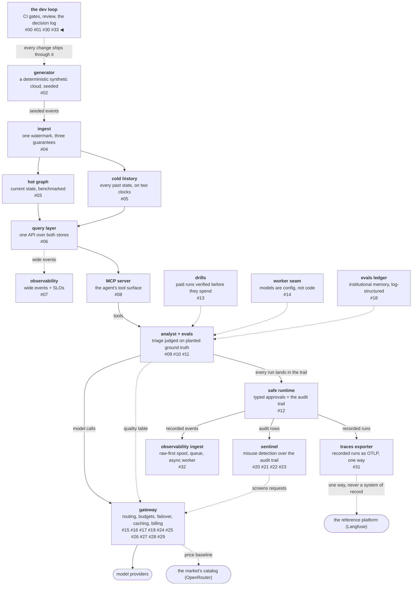

# The checks you scope yourself

Every check has a scope somebody chose: which duration a test
bounds, which sentence a reviewer verifies, which files a coverage
report gets read for. When the check itself is wrong, it fails
loudly and you fix it. When the *scope* is wrong, nothing fails —
the check runs, passes, and reports on the wrong thing, which
arrives as confident silence rather than as an error.

This post is four instances of that shape, all from one slice of one
phase. Three of them were caught by a person asking a question, and
one by a static analyzer. None of them could have been caught by a
test, because in each case the check was doing exactly what it was
told.

<!-- more -->

!!! info "The resgraph series"
    This is the thirty-fourth post about
    [**resgraph**](https://github.com/fespino/resgraph), a mini data
    platform I am building for learning purposes.
    Browse the repository exactly as it stood when this was written:
    [`phase-13-observability`](https://github.com/fespino/resgraph/tree/phase-13-observability).
    Every snippet below is copied from that tag, trimmed only for
    length.

In this phase, continued: this post has no decision of its own. It
covers the verification work inside the raw-first ingestion slice
([#318](https://github.com/fespino/resgraph/issues/318) →
[PR #320](https://github.com/fespino/resgraph/pull/320)) and the
architecture review that followed it
([#322](https://github.com/fespino/resgraph/issues/322) →
[PR #323](https://github.com/fespino/resgraph/pull/323)), which
means it belongs to the development loop rather than to the platform
— the same place posts
[#00](00-security-from-the-first-commit.md) and
[#01](01-decisions-with-reversal-conditions.md) live.

The platform so far, with this post's piece highlighted:



## Instance one: an assertion about wall-clock time

The ingestion slice's headline property is that the producer does
not slow down as the backlog grows, so the first version of its test
asserted the thing that had just been measured: p99 under 5 ms. It
passed when run alone. It failed at 16 ms when the full suite ran,
because 780 sibling tests were contending for the same disk and the
same cores.

The reflex fix is to loosen the bound. The better question came from
review, and it was comparative: this repository already has a
wall-clock assertion that has never flaked, so what makes that one
safe?

```python
# tests/test_gateway_lifecycle.py
def test_screening_pays_its_latency_budget():
    """The seat is affordable: p50 under 1ms on realistic payloads —
    measured here so a heavier rule set fails this test, not the SLO."""
    messages = [{"role": "user", "content": "investigate the crash_loop on container-000016 " * 40}]
    samples = []
    for _ in range(200):
        t0 = time.perf_counter()
        screen(messages)
        samples.append(time.perf_counter() - t0)
    assert sorted(samples)[100] < 0.001
```

Three conditions hold there, and all three have to hold before CI
may bound a duration at all.

It bounds a **median rather than a tail**. A tail is precisely what
contention inflates: one unlucky scheduling decision moves p99 and
leaves p50 where it was. The failed assertion bounded p99, which is
the sample most sensitive to everything happening around it.

The work is **CPU-only rather than I/O**. Screening is regular
expressions over a string, so it competes for a core and nothing
else. The ingestion producer path writes a file and commits to
SQLite, so it competes for the disk with every other test that
touches one.

The **headroom is about 25×**, not about 5×. The screen runs in tens
of microseconds against a millisecond bound. The producer path runs
at 567 µs against a 5 ms bound, which leaves a factor of nine for
every source of noise on a loaded runner to share.

The screening budget satisfies all three conditions and the
ingestion assertion violated all three, which is why one has never
flaked and the other flaked on its first contended run. What shipped
instead is three assertions, each catching something the other two
cannot:

```python
# tests/test_ingest_pipeline.py
    result = worker.measure_backpressure(spool, queue, sink, batches=60, size=20)
    assert result["backlog"] == 60
    assert result["backlog_drift"] < 3  # the property: a full backlog costs the producer nothing
    assert result["speedup_p50"] > 2
    # a catastrophe budget, not an SLO: loose enough to survive a loaded
    # runner, tight enough to fail if I/O reappears on the producer path
    assert result["queued"]["p50_us"] < 20_000
```

The first is **self-calibrating**: `backlog_drift` compares the
producer against itself, early in the run against late in the run,
so a slow runner slows both sides and the ratio holds. No hardware
constant appears anywhere in it, which is what makes it portable
from my laptop to a CI container without a tuning pass.

The second is a **smoke ratio**. Two is a long way from the measured
42.8×, and that distance is the point: the assertion answers "is the
queue still cheaper than the store" rather than "is it exactly as
cheap as it was in August".

The third is a **catastrophe budget** with roughly 35× of headroom,
and its docstring says what it is not. It cannot detect drift and it
is not trying to. Its only job is to fail if somebody puts I/O back
on the producer's path, which would move 567 µs to tens of
milliseconds and blow through the bound regardless of how loaded the
runner is.

The rule the repository now carries, earned twice: **CI asserts
properties and catastrophes; BENCHMARKS.md asserts numbers, where
the hardware is declared beside them.** A number in a test is a
number nobody can interpret, because the machine it ran on is not
written down anywhere near it.

## Instance two: a sentence with no measurement under it

The same review question turned up something worse than a flaky
test. The pull request claimed that the producer's cost had stopped
depending on the sink's state — and nothing in the run had measured
latency against backlog. The 42.8× speedup ratio had been quietly
standing in for a claim it cannot support, because a ratio between
two arms says nothing about how either arm behaves as the queue
fills.

The fix was to split the samples in half and compare the producer
against itself, which is where `backlog_drift` came from in the
first place: 557 µs with the backlog climbing from empty, 539 µs
with 250 to 500 batches piled up, a drift of 0.97×. The
[previous post](32-raw-first-ingestion.md) covers that mechanism.

What belongs here is the shape of the miss. The verification was not
missing — the slice had a benchmark, a table, and a passing test.
The verification was *scoped to a different claim than the one being
made*, and no amount of running it would have said so. A reviewer
asking which sentence had a measurement under it is a check with a
scope nobody chose in advance, which is exactly why it found
something.

## Instance three: a filter built from my own guesses

The architecture review that followed shipped three small modules,
and I told Fran all three were at 100% coverage. The pull request
then reported 85% on the patch. Both statements were true. Three
files were at 100%, and a fourth — `gateway/cli.py`, holding the two
things written last and tested never — had gone from 100% to 80%,
fourteen uncovered statements between a standalone drift command and
the auto-drift block inside the pull.

The cause was not the missing tests. It was how I checked. The local
gate prints a coverage line for every file in the repository, and I
read that output through a filter —
`ingest/reconcile`, `gateway/market`, `ingest/cli` — which is a
claim: *these are the files where the risk lives.*
I assembled it in about four seconds out of my own expectations
about which code was new. The file that regressed printed, scrolled
past unread, and produced no error, because a filter never reports
what it was not asked about. A wrong filter fails as silence.

The repository's standing rule is to read the missing lines and
never trust the summary number. The twist is that the number I
trusted here was one I had manufactured myself, seconds earlier, out
of my own guesses. The fix is unglamorous: print every file in the
packages the change touched — about twenty lines — and read them.

The four tests written afterwards each assert a behaviour rather
than touching a line, which is the difference between closing a
coverage gap and closing a verification gap: a pull that introduces
a field names its own drift and the snapshot it compared against, a
first pull stays silent, and a lone snapshot is refused as not a
comparison.

## Instance four: the assertion that would vanish

The last one was found by a machine, and it is the third
[CodeQL](https://codeql.github.com/) finding this series has written
up, after a wrapper lambda and a log-injection path. The query is
`py/side-effect-in-assert`, and four assertions in the new test file
matched it:

```python
# tests/test_ingest_pipeline.py — before
    assert spool.write(batch) == first
    assert sink.write([]) == 0
    assert queue.reclaim(older_than_s=0.0)
    assert worker.drain(spool, queue, sink)["rows_written"] == 4
```

Every one of those does real work inside the assertion: writes a
file, writes to the store, mutates the queue. Python removes `assert`
statements entirely under `-O`, and the side effect goes with them —
so the test is correct today and a silent no-op the moment somebody
runs the suite with optimizations on. The fix is mechanical:

```python
# tests/test_ingest_pipeline.py — after
    again = spool.write(batch)
    assert again == first
    empty = sink.write([])
    assert empty == 0
    reclaimed = queue.reclaim(older_than_s=0.0)
    assert reclaimed
    retried = worker.drain(spool, queue, sink)
    assert retried["rows_written"] == 4
```

This belongs with the other three because the failure mode is the
same: the check does not report anything wrong on its way to
covering nothing. The difference is that a static analyzer can see
this one, which is the argument for having a static analyzer in the
gate rather than a policy about writing careful assertions.

## What I'd take to the next project

- **Before asserting on a duration, check three things**: that the
  bound is on a median rather than a tail, that the work is CPU-only
  rather than contending for I/O, and that the headroom is a factor
  of twenty rather than a factor of five. Violate one and the
  assertion becomes a flake generator on a loaded runner.
- **Prefer a self-calibrating property to a constant.** A ratio of
  the same code against itself carries no hardware assumption, so it
  survives the move from a laptop to a CI container without a tuning
  pass.
- **Say in the test what a loose bound is for.** A catastrophe
  budget and a service-level objective look identical in source and
  mean opposite things, and the next person to tighten it needs to
  know which one they are holding.
- **Ask which sentence has a measurement under it.** Reviewing the
  claims rather than the diff finds the class of error where every
  artifact is real and one of them is answering a different question.
- **Never verify through a filter you wrote from memory.** The
  pattern is a claim about where the risk is, it is made in seconds,
  and when it is wrong it produces silence instead of an error.

The verification work described here landed inside
[PR #320](https://github.com/fespino/resgraph/pull/320) and
[PR #323](https://github.com/fespino/resgraph/pull/323). The next
post goes back to the platform, and to a measurement that would have
shipped the opposite of its own conclusion if it had been run once
instead of three times.
