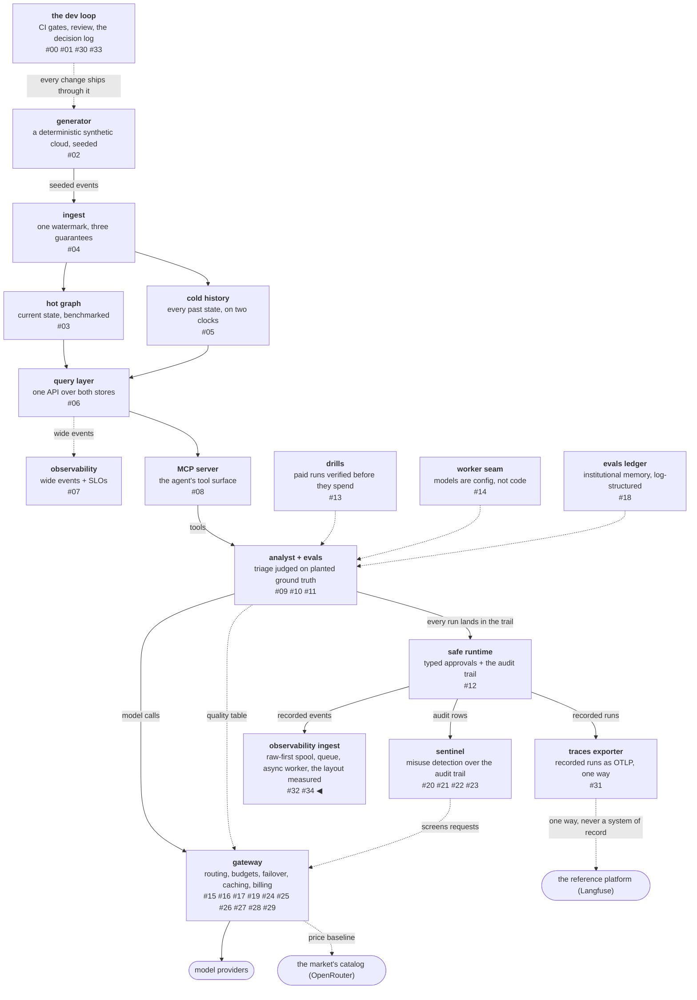

# Wide versus normalized, and the number that inverted under scale

The **wide-table claim** is that one immutable append-only table,
with the parent record's properties copied onto every child row,
beats a normalized pair joined at read time — and beats it by enough
to justify the duplication. The reference platform's migration
publishes that claim with figures attached: roughly 3× less memory
and roughly 20× faster queries. The previous slice built a sink in
exactly that shape without testing the premise, which left the
layout as an assumption sitting under a pipeline.

This post measures it. The result is not the ratio; it is *where the
ratio lives*, which turns out to be a different place than the claim
suggests. And the storage half of the experiment would have shipped
the opposite of its own conclusion if I had run it once instead of
three times.

<!-- more -->

!!! info "The resgraph series"
    This is the thirty-fifth post about
    [**resgraph**](https://github.com/fespino/resgraph), a mini data
    platform I am building for learning purposes.
    Browse the repository exactly as it stood when this was written:
    [`phase-13-observability`](https://github.com/fespino/resgraph/tree/phase-13-observability).
    Every snippet below is copied from that tag, trimmed only for
    length.

In this phase, continued: the second replication slice
([#319](https://github.com/fespino/resgraph/issues/319) →
[PR #321](https://github.com/fespino/resgraph/pull/321), decision
D49 — the wide layout stays, for the dedup it avoids rather than the
join). The previous post built the pipeline that writes the wide
rows; this one asks whether that shape earns what it costs.

The platform so far, with this post's piece highlighted:



## Three arms, because two would have hidden the answer

The obvious experiment has two arms: the wide table against a
normalized pair. That comparison is the one the published claim
makes, and it silently bundles two different effects together.

A normalized layout receiving at-least-once delivery holds
duplicates unless something removes them. If the write path does not
deduplicate, the read path has to, and every query pays for it
forever. So the experiment runs a third arm — the same normalized
pair carrying the duplicates that redelivery leaves, read through a
`QUALIFY row_number()` filter:

```python
# src/resgraph/ingest/layouts.py
_PLAIN = "events"
_DEDUPED = "(SELECT * FROM events QUALIFY row_number() OVER (PARTITION BY event_key) = 1)"
```

Separating the arms is what makes the result interpretable: with two
arms you learn that wide is faster, and with three you learn *which
of the two things it avoids* is doing the work.

## The arms refuse to be timed until they agree

Before any clock starts, every arm answers the same four questions
and the answers are compared against each other. A disagreement
aborts the run:

```python
# src/resgraph/ingest/layouts.py — compare
    reference = answers(paths["wide"], "wide")
    for layout in ("normalized", "normalized_dedup"):
        got = answers(paths[layout], layout)
        for query in QUERIES:
            if got[query] != reference[query]:
                raise SystemExit(
                    f"{layout} disagrees with wide on {query}: the layouts hold different "
                    "data, so any timing between them would measure nothing"
                )
```

A layout comparison whose arms hold different data produces numbers
and measures nothing, which is this repository's INC-002 failure
wearing a benchmark's clothes. The usual defence is a habit —
remember to check the arms — and habits are exactly what fails at
11pm on the run that finally works. Here it is a precondition of the
measurement, so the failure mode is a refusal rather than a
plausible table.

The same construction handles fairness on the input side: all three
arms are built from a single generated row set, so no arm can be
holding better-shaped data than another.

## Where the ratio actually lives

Four questions, two of which need the run's model and two of which
never leave the events table. Thirty thousand observations across a
thousand runs, DuckDB in-process on an Apple M3 with 8 GB of RAM,
median of nine repeats after a warm-up:

| query | wide | normalized | normalized + dedup-on-read |
|---|---|---|---|
| run_timeline (no join) | 0.231 ms | **0.181 ms** | 2.425 ms |
| latency_p99_by_kind (no join) | 0.358 ms | **0.349 ms** | 2.231 ms |
| cost_by_model (join) | **0.421 ms** | 1.237 ms | 2.535 ms |
| spend_per_run (join) | **0.717 ms** | 1.343 ms | 3.082 ms |

The wide layout wins 2.9× and 1.9× on the two questions that need a
join, and it loses slightly — 0.97× and 0.78× — on the two that do
not. Fatter rows cost more to scan, and when no join disappears
there is nothing to pay for that cost with.

That is a more useful sentence than a headline ratio, because it
tells you when to adopt the shape: the win is exactly "a join
disappeared," and it is available only to the queries that would
have joined. A workload of single-run timelines gets nothing from
this layout and pays the scan.

Against the published claim of roughly 20× faster queries, the
direction reproduces for join queries at 1/1000 scale and the
magnitude does not. That is not a refutation — a laptop running
DuckDB and a fleet running ClickHouse are different measurements,
and the ratio between two engines is not a property either of them
carries. What a laptop can do is locate where a win comes from. How
big it gets at scale is a question this hardware cannot answer, and
saying so is part of the result.

## The dominant effect is the dedup, not the join

The third arm is where the large numbers are: 4.3× to 10.5× against
the normalized layout that has to deduplicate on read. That range is
several times the join win, and it is the finding that changes what
the layout is *for*.

The magnitude belongs to the fixture, and it is worth naming
precisely: this arm replays every tenth event, so a duplicate rate
of 10% is what the read-side filter is paying off. A lower
redelivery rate shrinks the number and a higher one grows it. What
does not move with the fixture is the shape — a window function over
the whole table on every query, against nothing at all — and that is
the part worth carrying somewhere else.

Most of what a wide immutable table buys is never paying for
deduplication at read time. Which means this slice, set up to test
somebody else's layout claim, ended up measuring why the *previous*
slice's sink was right to deduplicate on write. The two are one
argument: the sink absorbs redelivery once, at write time, on a key
the audit trail already owns, and every query afterwards is free of
it.

In plain terms: the wide table is not fast because it avoids
looking things up in another table. It is fast because somebody
already threw away the duplicate orders before they reached the
ledger, so the clerk never has to check for them again.

## Storage runs the other way

| storage at 30k rows | wide | normalized |
|---|---|---|
| file size | 2,109,440 B | **1,323,008 B** |

That is 1.59× the bytes, against a published claim of roughly 3×
*less* memory. Propagating run properties onto every row is not
free, and columnar compression softens the cost without erasing it.
The direction here inverts outright rather than merely differing in
magnitude, which is a stronger disagreement than the query numbers
and gets reported as such.

## The number that inverted under scale

Here is the part I would want another engineer to take away from
this post. The storage ratio reads:

- **0.75×** at 3,000 rows — the wide table looks *smaller*
- **1.00×** at 9,000 rows — byte-identical
- **1.59×** at 30,000 rows

The middle row is the giveaway. No real layout difference produces
two byte-identical files; that only happens when both files are
sitting on the same allocation step. DuckDB allocates in fixed
blocks, so below roughly 10,000 rows a file's size reports how many
blocks were claimed rather than how much data is in them. The small
measurements are measurements of the filesystem.

The first run of this experiment was at 800 rows. It would have
shipped "the wide layout is cheaper on disk" with exactly the
confidence the final table carries, into a decision record, with a
receipt attached. Nothing about that run looks wrong from inside it.

A number that inverts when you scale it was never measuring the
thing you named it after. The fix is boring and cheap: run the
measurement at three sizes before believing any of them, and treat
an inversion between sizes as a signal that the small end is
measuring something other than your variable. D49 records the
inversion in its rejected list rather than the appendix, because the
small-scale number is the one somebody would otherwise repeat.

## The pattern has a name, a spec, and no numbers

The thesis this slice measures is not the reference platform's
invention. It is formalized as
[ActivitySchema 2.0](https://github.com/ActivitySchema/ActivitySchema/blob/main/2.0.md)
(Ahmed Elsamadisi / Narrator): one immutable append-only wide table
per entity — `activity_id`, `ts`, `customer`, `activity`,
`feature_json` — with eleven named temporal relations (first ever,
last before, first after, aggregate between) standing in for joins
outright.

Two things make it worth citing here. The first is precedent. This
platform's observations table maps onto that spec almost column for
column: `customer` becomes `run_id`, `activity` becomes `kind`,
`feature_json` becomes `payload`. The D2 update-message stream and
the D17 wide events landed on the same shape earlier in the series
for their own reasons. Three independent arrivals at one layout is
convergence rather than invention, and presenting it as invention
would be a small lie of omission.

The second is the gap. The spec *asserts* the wide-table advantage
and publishes no measurement, which is exactly the hole the table
above fills: the join win is modest, the dedup-avoidance win is
large, and the storage cost runs the other way. A named pattern with
a specification, an implementation, and no numbers is an invitation
rather than a conclusion.

Its status, checked on 2026-08-20 and stated plainly: untouched
since 2022-12-20, 445 stars, no 3.0, one substantial implementer.
That reads as dormant rather than superseded — its idea absorbed
into wide-event practice and cheap columnar storage — and it should
not be presented as a live standard.

Two mismatches also belong on the record, so the kinship is not
overclaimed. The schema has no entity-relationship story, because
its temporal relations connect activities of the *same* entity,
which makes a blast-radius question across related resources
inexpressible. And it carries a single clock, where this platform's
cold store needs event time and observation time held apart.

## What I'd take to the next project

- **Make the arms prove they agree before anything is timed.** A
  benchmark whose arms hold different data is the most credible way
  to publish a wrong number, and one equality check converts that
  failure into a refusal.
- **Add the arm that separates two bundled effects.** Two arms told
  me the wide table was faster; the third told me it was the dedup,
  which is the finding that transfers.
- **Report where a win lives, not how big it was.** "It wins exactly
  where a join disappears" survives a change of engine, scale and
  workload. "2.9× faster" does not.
- **Run a storage or memory measurement at three sizes.** Allocation
  granularity dominates small files, and an inversion between sizes
  is the cheapest available evidence that you are measuring the
  wrong thing.
- **When a published figure does not reproduce, say which
  measurement you made.** A laptop at 1/1000 scale disagreeing with
  a fleet is not a refutation, and dressing it up as one would be
  the same overclaim in the other direction.

The decision record is D49 (the wide layout stays, for the dedup it
avoids rather than the join) in
[SPEC.md](https://github.com/fespino/resgraph/blob/main/SPEC.md),
with the full table, hardware and method in
[BENCHMARKS.md](https://github.com/fespino/resgraph/blob/main/BENCHMARKS.md);
the work landed as
[PR #321](https://github.com/fespino/resgraph/pull/321). The next
post is the review that asked one question of every control this
pipeline had — what failure is this blind to? — and found two shapes
that nothing covered.
