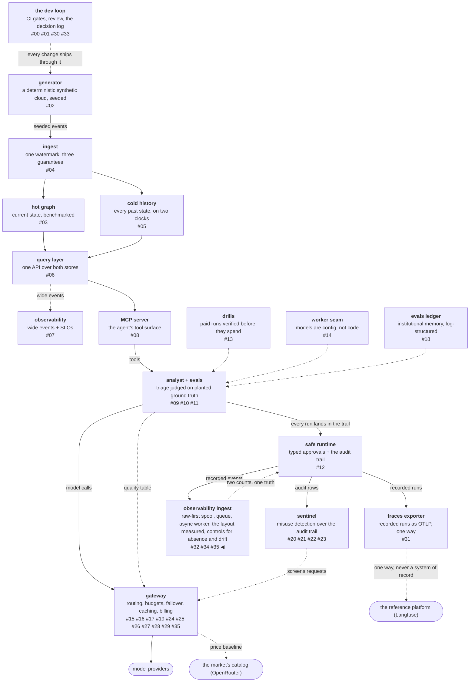

# Two failures the pipeline could not see

An **architecture review** here means one question asked of every
control already built: what failure is this blind to? Not "does it
work" — the tests answer that — but what *class* of thing it is
structurally incapable of perceiving. Asked of the ingestion
pipeline from the last three posts, it found two shapes nothing
covered, and both of them are shapes where every component reports
healthy while data is being lost.

The findings are not bugs. Nothing in the pipeline was doing the
wrong thing, and no test could have failed. They are gaps in what
the existing controls can see at all, which is why a review found
them and a test suite could not.

<!-- more -->

!!! info "The resgraph series"
    This is the thirty-sixth post about
    [**resgraph**](https://github.com/fespino/resgraph), a mini data
    platform I am building for learning purposes.
    Browse the repository exactly as it stood when this was written:
    [`phase-13-observability`](https://github.com/fespino/resgraph/tree/phase-13-observability).
    Every snippet below is copied from that tag, trimmed only for
    length.

In this phase, continued: the review slice
([#322](https://github.com/fespino/resgraph/issues/322) →
[PR #323](https://github.com/fespino/resgraph/pull/323), decision
D50 — absence is a separate question from disagreement). It is not a
replication slice; nothing here comes from the reference platform's
architecture. It is the phase turning its own question — what does
this pipeline not know? — on the work of the three preceding posts.

The platform so far, with this post's piece highlighted:



## The failure that keeps every light green

Suppose the producer stops. Not crashes — stops, because a scheduled
job was disabled or a credential expired or somebody renamed a
queue.

The spool is empty, because nothing is being written. The queue is
drained, because the worker finished everything and there is nothing
new. The sink is idle. The error rate is zero, and it is zero for
the best possible reason: nothing is arriving to fail. Every
component in the pipeline reports healthy, and every dashboard is
green, through total data loss.

Health monitoring watches components. A stopped producer is not a
sick component — it is an *absent* one, and absence has no
component to be sick.

Volume alarms are the reflex answer, and they are both noisy and
deaf. Noisy, because a quiet weekend reads as an outage. Deaf,
because a partial outage — one of four producers stopping — reads as
a quiet weekend. A threshold on a rate cannot distinguish "less"
from "none of a subset", and tuning it trades one of those failures
for the other rather than fixing either.

## A second count, from a source the pipeline does not own

The control that works compares two counts of the same thing, where
one of them is written by something outside the pipeline. The audit
trail records an event per step of every recorded run, and the
pipeline's sink holds a row per observation, so those two numbers
have to agree per run:

```python
# src/resgraph/ingest/reconcile.py
def reconcile(audit_path: Path, sink_path: Path) -> list[str]:
    """Every recorded run against what the sink holds, per run."""
    recorded, held = _audit_counts(audit_path), _sink_counts(sink_path)
    findings = []
    for run in sorted(set(recorded) | set(held)):
        theirs, ours = recorded.get(run), held.get(run)
        if ours is None:
            findings.append(f"{run}: {theirs} events recorded, nothing in the sink")
        elif theirs is None:
            findings.append(f"{run}: {ours} rows in the sink the trail never recorded")
        elif theirs != ours:
            findings.append(f"{run}: {theirs} events recorded, {ours} rows in the sink")
    return findings
```

Three distinct gaps, three distinct sentences: recorded but absent,
present but never recorded, and counted differently. Collapsing them
into one "mismatch" would throw away the part that tells you where
to look — the second case is a bug in the pipeline, the first is a
delivery failure, and the third is usually partial.

The authority argument matters more than the arithmetic. The trail
is written by the thing being measured — the agent runtime — and not
by the pipeline doing the measuring. A count the pipeline computes
about itself proves only that it is internally consistent, which is
the property a broken pipeline is most likely to have. The test pins
all three shapes at once:

```python
# tests/test_ingest_reconcile.py
def test_every_kind_of_gap_is_named(tmp_path):
    audit = _audit(tmp_path / "a.db", {"lost": 5, "short": 4})
    sink = _sink(tmp_path / "s.duckdb", {"short": 2, "orphan": 3})
    assert reconcile.reconcile(audit, sink) == [
        "lost: 5 events recorded, nothing in the sink",
        "orphan: 3 rows in the sink the trail never recorded",
        "short: 4 events recorded, 2 rows in the sink",
    ]
```

## And the control has its own blind spot

Reconciliation cannot see the failure it was built for.

When the producer stops, the trail records nothing and the sink
receives nothing. Both counts are zero. They agree, and agreement is
the shape of perfect health, so the control reports a clean bill
through exactly the outage that motivated it.

So absence gets a second, separate question — not a better version
of the first one, because no refinement of "do these two counts
agree" can distinguish "nothing happened" from "nothing was
supposed to happen". The question is how old the newest recorded
event is:

```python
# src/resgraph/ingest/reconcile.py
def silence_seconds(audit_path: Path, *, now: float | None = None) -> float | None:
    """Age of the newest recorded event. Reconciliation agrees at zero
    when a producer stops, so absence needs its own question."""
```

It returns `None` for an empty trail rather than zero or infinity,
because a trail that has never held anything is a different state
from one that has gone quiet, and the caller decides which of those
is an error. Naive timestamps are treated as UTC rather than
rejected, since the trail has rows predating the offset convention.

The nesting is the part worth carrying elsewhere: **a control that
covers a blind spot has its own blind spot**, and the second one is
not optional. Two controls exist here not because two is thorough,
but because each is structurally blind to the other's failure.

Both are refusals rather than dashboards. The command exits nonzero
with every gap stated, so it can gate a pipeline rather than
decorate a wall:

```python
# tests/test_ingest_reconcile.py
def test_a_stopped_producer_is_reported_even_when_the_counts_agree(tmp_path):
    audit = _audit(tmp_path / "a.db", {"run-0": 4})
    sink = _sink(tmp_path / "s.duckdb", {"run-0": 4})
    result = CliRunner().invoke(
        cli.app,
        ["reconcile", "--audit-db", str(audit), "--sink-path", str(sink), "--quiet-after-s", "1"],
    )
    assert result.exit_code == 1
    assert "nothing recorded for" in result.output
```

The counts agree, and the command still fails. That test is the
whole decision in six lines.

## The third blind spot: a schema check sees only what you enumerated

The same review question, asked of the market connector from the
[previous arc](29-consume-the-reference-deliberately-small.md),
found a control with a hole of exactly this kind. That connector
validates each pull against the fields it declares, and refuses a
response that is missing one or has it malformed.

The counterexample was already on the record, inside the same phase.
Rows fetched at build time carried six fields that the phase's own
documentation-validation pass had not listed two days earlier. The
declared-field validator was untroubled, because nothing it had
declared was missing. A human reading a diff caught it.

The fix inverts the question. Instead of asking whether what I
expected is still there, fingerprint the field *set* of every row
and compare it against the previous pull:

```python
# src/resgraph/gateway/market.py
def drift(previous: list[dict[str, Any]], current: list[dict[str, Any]]) -> list[str]:
    """What changed in the catalog's SHAPE between two pulls. Names the
    fields rather than requiring anyone to have enumerated them: a
    field nobody declared is exactly the one that gets missed."""
    before = {field for shape in field_sets(previous) for field in shape}
    after = {field for shape in field_sets(current) for field in shape}
    findings = []
    if appeared := sorted(after - before):
        findings.append(f"fields new since the previous pull: {appeared}")
    if vanished := sorted(before - after):
        findings.append(f"fields gone since the previous pull: {vanished}")
```

The design constraint is the interesting half, and it is stated in
the neighbouring docstring so nobody later turns it into a
threshold:

```python
# src/resgraph/gateway/market.py
def field_sets(rows: list[dict[str, Any]]) -> dict[frozenset[str], int]:
    """The distinct row shapes present, with how many rows carry each.
    Catalog rows legitimately differ (an omitted optional field is not
    drift), so the shapes are a fingerprint to compare ACROSS pulls —
    never a count to threshold within one."""
```

The committed snapshot holds five distinct row shapes, and all five
are legitimate: an optional field that a particular listing omits is
not drift. So shape cardinality *within* a pull is noise, and only
the delta *between* pulls carries signal. Getting that backwards
produces a control that alarms on the catalog's normal variety and
teaches everyone to ignore it.

## "Aren't we already using Iceberg for this?"

That was the best reviewer question of the phase, and the answer
became a rejection recorded in D46 (the market connector) rather
than a shrug. The instinct is right: this platform owns an Iceberg
cold store whose advertised job includes schema evolution, so
tracking a source's changing shape looks like precisely its purpose.

It is not, and the reason generalizes well past this repository.
**Iceberg tracks the schema you declare, not the source's.** A new
upstream field enters its history only once somebody evolves the
table to hold it — which requires having already noticed the field.
The detector would depend on the discovery it exists to make.

Both loading strategies fail for the same reason from opposite
directions. Typed columns silently drop undeclared fields at write
time, which is exactly the failure the fingerprint exists to catch.
A JSON-blob column keeps everything and leaves the schema history
vacuous about the only part that varies — and this platform contains
its own counterexample, since the cold table already stores `attrs`
and `relationships` as plain strings.

A format that versions your schema tells you what you changed, never
what changed under you.

The reversal condition is where the boundary sits. When the market
stops being a reference table and becomes a world — prices as events
with an event time distinct from their observation time — that is
the cold store's job, and Iceberg time travel replaces comparing two
files. Files while it is reference data, Iceberg when it becomes
history.

## The raw-first dividend, with a receipt at last

One more control gap turned up, and closing it produced the best
argument for the layout three posts ago.

The sink silently drops any enriched field it has no column for.
That is the same shape as the incremental-model default that
discards new columns without complaint, which is a well-known scar
in analytics engineering. Raw-first is what makes it survivable: the
spool kept the whole event, so widening the schema and replaying
fills in the past as well as the present.

```python
# tests/test_ingest_pipeline.py
def test_a_new_column_is_born_with_full_history(tmp_path, monkeypatch):
    """Raw-first's dividend: a lens can be reground and reapplied to
    history. The sink drops what it has no column for; the spool does
    not, so widening the schema and replaying fills the past too."""
```

The test records eighteen events with no `turn` column in existence,
adds the column, widens the enrichment, and replays from raw:

```python
# tests/test_ingest_pipeline.py
    assert (total, filled) == (
        18,
        6,
    )  # every llm_call in history, recorded before the column existed
```

Six of eighteen, which is exactly the `llm_call` rows — the only
ones whose payload ever carried a turn number. History filled for
every row that had the data, and stayed empty for the rest.

**A gate cannot un-reject; a lens can be reground and reapplied to
history.** That is a better reason for raw-first than the durability
argument D48 originally shipped with, and it only became visible
once a review went looking for what the sink could not see.

## What I'd take to the next project

- **Ask each control what it cannot perceive.** Not whether it
  works — what class of failure it is structurally blind to. The
  answers are not bugs, so nothing else in your process will find
  them.
- **Health monitoring cannot see absence.** Every component is
  healthy when a producer stops, so the control has to be a second
  count from a source your pipeline does not own.
- **Then check whether that control is blind to silence too.** Two
  counts agreeing at zero is the shape of perfect health, and the
  fix is a separate question rather than a better threshold.
- **Validate the shape you did not declare.** "Is what I expected
  still here?" is a weaker question than "what is here that I never
  thought to expect?", and the second one is a set difference
  between two pulls.
- **Make the control refuse rather than display.** A number on a
  dashboard needs somebody to be looking; a nonzero exit code stops
  a pipeline whether anyone is looking or not.

The decision record is D50 (absence is a separate question from
disagreement) in
[SPEC.md](https://github.com/fespino/resgraph/blob/main/SPEC.md),
with the Iceberg rejection and its reversal condition recorded under
D46; the work landed as
[PR #323](https://github.com/fespino/resgraph/pull/323). The next
post closes the phase: four claims from a published architecture,
three that reproduced and one that inverted, and the closeout audit
that found a shipped behaviour with no decision entry — triggered by
nothing more than asking which group a slice belonged to.
