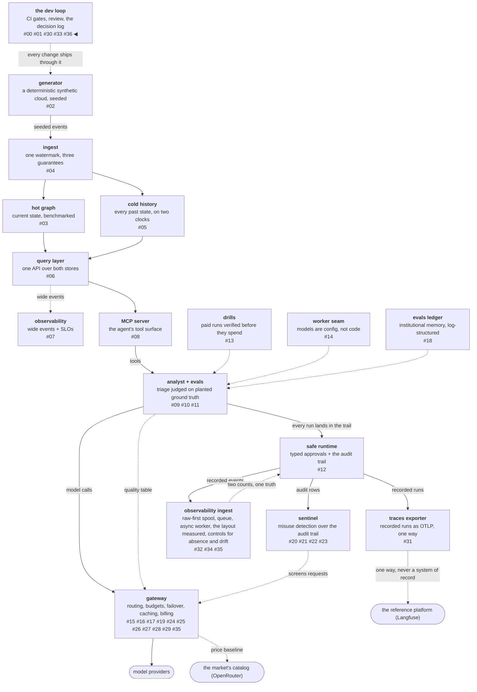

# Three held, one inverted

A **replication** is a grading exercise: you take somebody's
published architecture, rebuild it over your own data, and check
which of its claims survive contact with a different scale and a
different engine. The result is only informative if it can come out
mixed. A replication that confirms everything is marketing with
citations, and one that refutes everything is usually measuring
itself wrong.

This phase rebuilt four claims and graded them: three reproduced and
one inverted. This post closes the phase with that grading, starting
with the one that broke, and with the two findings the closeout
audit produced — including a behaviour that had shipped with no
decision entry, discovered by asking nothing more sophisticated than
which group a slice belonged to.

<!-- more -->

!!! info "The resgraph series"
    This is the thirty-seventh post about
    [**resgraph**](https://github.com/fespino/resgraph), a mini data
    platform I am building for learning purposes.
    Browse the repository exactly as it stood when this was written:
    [`phase-13-observability`](https://github.com/fespino/resgraph/tree/phase-13-observability).
    Every snippet below is copied from that tag, trimmed only for
    length.

In this phase, closing: the closeout merge
([PR #324](https://github.com/fespino/resgraph/pull/324)), after
which the umbrella
[#243](https://github.com/fespino/resgraph/issues/243) closed on its
own closing note. The phase's decisions are D47 through D50, plus an
amendment to D46 that came out of the phase's own architecture
review.

The platform so far, with this post's piece highlighted:



## The claim that inverted

The wide-layout claim is the one that did not survive, and it failed
in two different ways that are worth separating.

On query time, the direction reproduced and the magnitude did not.
The published figure is roughly 20× faster queries; the measurement
here is 2.9× and 1.9× on the two questions that need a join, and
slightly negative on the two that never join. A fleet running one
engine and a laptop running another are different measurements, so
this is a disagreement about magnitude rather than a refutation.

On storage the direction inverted outright: 1.59× the bytes, against
a published claim of roughly 3× *less*. There is no reading of that
as the same result at a smaller scale — it points the other way.

And the dominant effect turned out to be something the claim does
not mention. Against a normalized layout carrying the duplicates
that at-least-once delivery leaves, the wide table wins 4.3× to
10.5×, which is several times the join win. The wide layout is
mostly buying the absence of read-time deduplication, at a duplicate
rate of one row in ten in this fixture. That reframes the shape from
"joins are expensive" to "deduplicating on read is expensive", which
is a different piece of advice with a different reason to adopt it.

Saying which claim broke first is a deliberate ordering. The three
that held are more reassuring to write and less useful to read.

## The three that held

**The producer's cost decouples from the store.** Measured rather
than asserted: 567 µs to spool-and-enqueue against 24.3 ms writing
the same batch straight into the columnar store, with the backlog
climbing to 500 batches and the producer's own latency drifting
0.97× between an empty backlog and a full one. The 42.8× ratio is
not the headline, because row-by-row inserts are an analytical
store's worst case — which is the argument for keeping one off the
producer's path rather than a benchmark win.

**At-least-once delivery plus idempotent writes is effectively
once.** The ack lands after the flush, so a worker that dies
mid-batch leaves a reclaimable claim rather than a hole, and the
redelivered batch writes zero rows.

**Raw is authoritative and the columnar store is disposable.** Drop
the store, rebuild it from the spool, and match the digest. The
dividend is now pinned by test rather than argued: widen the schema,
replay, and history fills in, because a column that did not exist
when the events were recorded is still derivable from raw.

## What stays unmeasured, said out loud

Every integration claim in this phase is untested, because
self-hosting the reference platform needs more machine than this
host has. Whether their read path is agent-grade, whether their
score vocabulary can express pass^k across trials, whether their
meter agrees with the gateway's, whether their evaluator agrees with
a judge pinned to a model and a frozen template — the code halves
exist and the questions have no answers.

That gap is written into the phase table in the repository's own
`README`, where somebody skimming the project will meet it, rather
than left to be inferred from an absent artifact:

```markdown
Phase 13's integration half is parked
(#317): self-hosting the reference platform needs more machine than
this host has, and a slice whose deliverable is a claim about the
real product cannot be honestly finished against fixtures.
```

What a repository does with the work it could *not* do is a legible
signal, and hiding it is the only way to fail that test. The
unpark triggers are recorded with the parking, so the state is
"open, with conditions" rather than "quietly dropped".

## A taxonomy question is a cheap audit

The closeout audit here was not a ceremony with a checklist. It
started with one bookkeeping question — are all of these slices
integration slices? — asked because the phase index needed each
slice filed under a grouping.

Answering it required walking every slice and naming where it
belonged, and that walk turned up L9. Its drift half had been
recorded as an amendment to D46. Its reconciliation half had been
recorded nowhere: a shipped behaviour, tested, merged, with no
decision entry anywhere in the specification. It became D50 before
the phase could close.

No test could fail on that, and no linter could see it. The gap was
between the code and the decision log, and the only thing that
crosses that boundary is somebody reading both. Asking where each
piece belongs is the cheapest available way to find the pieces that
belong nowhere.

## The audit's base rate is now worth quoting

This is the third closeout audit in three phases to produce a real
finding, so the practice can be reported as a rate rather than
asserted as a virtue.

The gateway phase's exit-gate walk found instrument deviations —
seeded simulations where the gate's own wording had promised replay
— and a lifecycle state that had been dropped silently. This phase's
audit found a shipped behaviour with no decision entry. And the same
gateway audit left a note against the market connector saying that a
scheduled pull would need a retention rule "decided before the
directory grows, not after"; scheduling that pull a day later made
the condition live, and the rule was filed rather than discovered
later as a bloated clone.

Three audits, three findings, none of which would have failed a
test. The useful audit note is the one that names the future event
that will make it matter.

## Merge mechanics, the second occurrence

One process finding earned a standing rule, because it happened
twice.

Resolving a conflict in the GitHub web interface creates a merge
commit. A branch carrying a merge commit then makes "Rebase and
merge" fail with `This branch can't be rebased`, which arrives as a
surprise at exactly the moment you are trying to land the work. The
gateway phase hit this in one workstream; this phase hit it again in
the layout slice. Squash is the fallback that keeps the main branch
linear.

The more important half is the second rule: **a conflict resolved in
the web interface gets its merged tree verified before it gets
merged.** Both branches here had added an import and a command to
the same `ingest/cli.py`, which is precisely the situation where a
web-based resolution silently keeps one and drops the other. The
check is to read that file in the merged tree and run the full local
gate against it, rather than trusting the interface's clean badge. A
conflict marker is a question about text; the gate is the only thing
that answers the question about behaviour.

## What I'd take to the next project

- **Grade a replication and publish the mixed result.** Three held
  and one inverted is what an informative replication looks like;
  four-for-four means the exercise could not have told you anything.
- **Lead with the claim that broke.** It is the part a reader cannot
  get from the original source, and burying it under the
  confirmations is how a replication becomes an endorsement.
- **Write the parked work where the work is listed.** A README that
  names what could not be done is a stronger artifact than one that
  quietly contains only successes.
- **Ask a bookkeeping question at closeout.** "Which group does each
  piece belong to?" costs minutes and finds the pieces that belong
  nowhere — here, a shipped behaviour with no decision entry.
- **Verify a merged tree you did not merge yourself.** A clean badge
  is a statement about text conflicts, and the gate is the only
  thing that makes a statement about behaviour.

The phase closed on
[PR #324](https://github.com/fespino/resgraph/pull/324) with the
tag [`phase-13-observability`](https://github.com/fespino/resgraph/tree/phase-13-observability),
and the umbrella's
[closing note](https://github.com/fespino/resgraph/issues/243)
records what the replication established and what remains
unmeasured. The next post is a one-pull-request phase run with the
full ceremony on purpose, because what it produced was a boundary on
somebody else's literature — the routing layer where the standard
answer from the bandit papers is exactly wrong, and the reason is
structural.
