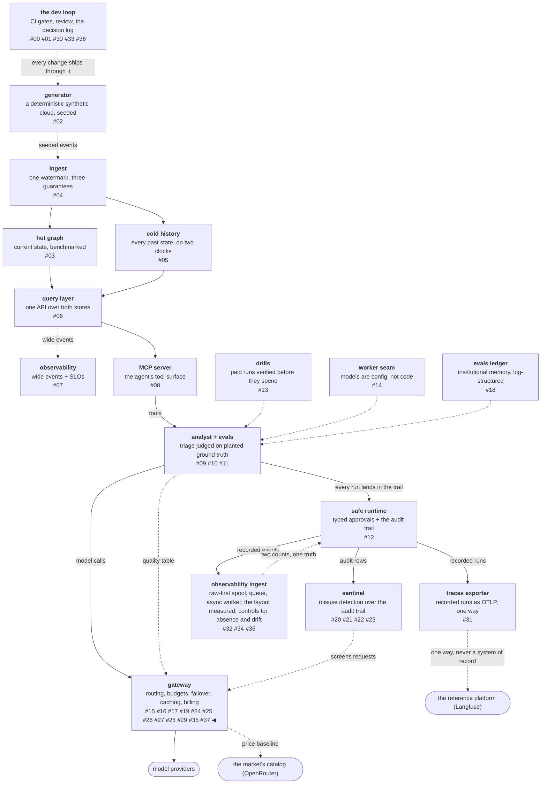

# The Pareto frontier, and where the bandit literature stops applying

A **multi-objective bandit** is the version of the multi-armed
bandit problem where each arm's reward is a vector rather than a
number — quality *and* cost *and* latency — so "the best arm" stops
existing and is replaced by the **Pareto front**: the set of arms
that no other arm beats on every axis at once. That is exactly the
shape of routing a request among model endpoints whose eval scores,
prices and latencies all differ, and the literature on it is decades
deep.

Reading that literature supplied precise names for both halves of
the problem this mini-phase existed to fix. It also supplied a
standard answer that is wrong here, for a structural reason no paper
states out loud, because no paper needs to: their pull is an
observation and mine is not. Separating the vocabulary from the
policy was the whole phase.

<!-- more -->

!!! info "The resgraph series"
    This is the thirty-eighth post about
    [**resgraph**](https://github.com/fespino/resgraph), a mini data
    platform I am building for learning purposes.
    Browse the repository exactly as it stood when this was written:
    [`phase-13.5-frontier-routing`](https://github.com/fespino/resgraph/tree/phase-13.5-frontier-routing).
    Every snippet below is copied from that tag, trimmed only for
    length.

In this phase: a mini phase of exactly one pull request
([#325](https://github.com/fespino/resgraph/issues/325) →
[PR #327](https://github.com/fespino/resgraph/pull/327), decision
D51 — the quality router spends only on the frontier, and staleness
asks for a re-run), run with the full phase ceremony on purpose. A
literature pass first, an exit gate, a decision entry with its
rejected alternatives, a committed receipt, and a row in the phase
index — because the output worth having was a *boundary on prior
art*, and a boundary discovered informally does not survive contact
with the next person who reads the same papers.

The platform so far, with this post's piece highlighted:



## What the previous design left on the table

D44 made routing an eval decision taken at request time: among the
endpoints registered for a task class, keep the ones whose measured
pass^k clears a floor, then spend among the survivors using a
lottery weighted by the inverse square of cost per passed triage.
The floor is a guarantee, and the lottery keeps cheap arms preferred
without starving the rest.

The gap is in the word "among". Clearing the floor makes an arm
eligible, and the lottery then looks only at price — so an arm that
is worse on quality *and* more expensive than another eligible arm
still draws traffic. In the committed receipt that is 30.8% of a
task class's stream going to an arm that loses on every axis the
table records.

## The literature named it in an afternoon

The shape has a name. In
[multi-objective multi-armed bandits](https://arxiv.org/html/2506.13125)
each arm's reward is a vector, the single best arm is replaced by
the Pareto front, and the policies —
[Pareto-UCB1](https://ai.vub.ac.be/sites/default/files/MO_MAB_IJCNN_Accepted_v2.pdf),
[Pareto set identification](https://arxiv.org/html/2606.18785) —
prune dominated arms once dominance is statistically safe while
spending exploration budget on arms whose membership in the front is
still uncertain.

The staleness half has its own literature.
[Non-stationary bandits](https://arxiv.org/pdf/0805.3415) are the
case where an arm's reward distribution changes over time, and the
standard answer is *forgetting*: discounted estimates, or a sliding
window that drops old observations entirely.

Two hours of reading gave precise names to both halves of a problem
this project had been describing in its own words, which is most of
what a literature pass is for. It also handed over the obvious next
step, which turned out to be the trap.

## Where it stops applying, and why the reason is structural

The standard policy keeps dominated arms on a small exploration
share, so their measurements stay fresh and a genuinely improving
arm can climb back. That argument is not foreign here — this project
had *already made it*, one layer down. D41 keeps an expensive
endpoint at 8.2% of dispatch traffic precisely so it never goes
unmeasured, and the write-up's own sentence was that a starved
endpoint is one you learn nothing about.

Same repository, same shape, an argument I already believed. It is
still invalid one layer up, and the reason is not a matter of
degree.

Serving an endpoint **updates the latency window it is ranked by**.
The pull is itself the measurement, so the traffic buys information
and the exploration argument holds.

Serving an arm **never updates its pass^k**. Quality on this
platform comes from eval runs against planted ground truth, and a
served production request has no answer key — nobody knows whether
the answer was right, because knowing would require the ground truth
that only the eval harness plants. A pull at the quality layer
returns no reward signal at all.

Once that is stated, both halves of the design stop being judgment
calls and become consequences. A dominated arm's traffic is pure
loss, because it cannot even buy the measurement that might have
justified it. And stale evidence can only be answered by re-running
the arms, never by re-routing to them, because routing produces no
evidence to be fresh.

The bandit literature assumes a pull is an observation. The entire
design question was noticing where that assumption is false in my
own system — and the assumption is so foundational to the field that
no paper says it out loud.

## Dominance, in code

An arm is dominated when another eligible arm is at least as good on
every axis both scores record and strictly better somewhere:

```python
# src/resgraph/gateway/quality.py
def dominates(a: dict[str, Any], b: dict[str, Any]) -> bool:
    """True when a is at least as good as b on every axis both record
    and strictly better on one. Serving an arm never updates its
    pass^k — there is no answer key at request time — so an arm that
    loses everywhere cannot earn its way back by being served."""
    comparable = [(k, lower) for k, lower in AXES if a.get(k) is not None and b.get(k) is not None]
    if not comparable:
        return False
```

That first line is doing quiet compatibility work. An axis that one
side never recorded is not compared at all, so a quality table
written before this change behaves exactly as it did — the arms are
compared on the two axes those entries carry, and nothing is
silently treated as zero.

The frontier is then the arms nobody dominates:

```python
# src/resgraph/gateway/quality.py
def frontier(scores: dict[str, dict[str, Any]], candidates: list[str]) -> list[str]:
    """The candidates no other candidate dominates, order preserved."""
    known = [a for a in candidates if a in scores]
    return [a for a in known if not any(dominates(scores[o], scores[a]) for o in known if o != a)]
```

And the router takes the frontier before the lottery draws, logging
the exclusion with the arms named rather than dropping them
silently:

```python
# src/resgraph/gateway/server.py — _quality_route
    ok = eligible(gw.quality, task_class, list(route.candidates), route.min_passk)
    ...
    scores = gw.quality[task_class]
    admitted = frontier(scores, ok)
    if len(admitted) < len(ok):
        log.info(
            "[gateway:quality] %s: %s excluded, worse on every measured axis",
            task_class,
            sorted(set(ok) - set(admitted)),
        )
```

The order is floor, then frontier, then lottery. The floor is a
promise to the caller; the frontier is a statement about what is
worth paying for; the lottery is how the remaining budget gets
spent.

## The fix would have been wrong without the axis it could not see

Reading this project's own table builder beside the papers turned up
something that looked like tidying. `arm_summary` computes latency
percentiles from every eval run, and the routing-table builder
emitted only pass^k and cost per passed triage. The column was
measured and then dropped at the boundary between the two.

That is not tidying, and shipping dominance without fixing it first
would have been a bug wearing a fix's clothes. Over two axes,
dominance calls an arm dominated when it is worse on quality and
cost — *including* an arm that is worse on both precisely because it
is several times faster. That is not a dominated arm. It is a
genuine trade, and pruning it would have looked like an improvement
in every metric I was then able to see.

So the axis went into the table first, travelling with the score
under the same provenance rule everything else in that file obeys:

```python
# src/resgraph/evals/cli.py — routing_table
            "latency_p50_s": (
                round(summary["latency_p50_s"], 3) if summary["latency_p50_s"] is not None else None
            ),
            "run": path,
            "date": date,
```

Two things generalize from that ordering. A dominance test is only
as trustworthy as the axes it can see, so the axis inventory comes
before the comparison logic — always, and not as a matter of taste.
And the loss here was invisible everywhere except in the code: the
axis was never missing from the *measurement*, only from the
*builder*, so no artifact showed a gap and no test could have failed
on it, because nothing downstream had ever seen the column. That
class of bug gets its own post, next.

## Staleness asks for a re-run, once

The aging half is announced at load, exactly once, and never enters
a routing decision:

```python
# src/resgraph/gateway/server.py
    for task_class_name, arms in quality.items():
        aged = stale(arms, list(arms), today, QUALITY_MAX_AGE_DAYS)
        if aged:
            # a re-measurement signal, never a routing input: serving an
            # arm produces no pass^k, so a stale score cannot refresh itself
            log.warning(
                "[gateway:quality] %s: evidence older than %d days for %s; re-run the arms",
                task_class_name,
                QUALITY_MAX_AGE_DAYS,
                sorted(aged),
            )
```

The tempting alternative is to let staleness reduce an arm's weight,
which sounds prudent and is wrong twice over. Reduced traffic still
cannot refresh a score, so it buys nothing; and the arm whose
evidence is oldest is often the platform's best-measured arm, so
down-weighting it degrades service to express an opinion about
bookkeeping. It is in D51's rejected list with that reasoning
attached.

## The receipt, and what it is worth

Two arms clearing a 0.7 floor, at pass^k 0.90 with $0.10 per passed
triage and 4.0 s at p50, against 0.75 with $0.15 and 9.0 s. The
second is dominated: worse on every axis the table records. Over a
200-request stream, committed as a test rather than quoted from a
run:

| policy | share to the dominated arm | solved (of 200) |
|---|---|---|
| floor, then inverse-square price lottery (D44) | 30.8% | 170.8 |
| floor, then frontier, then lottery (D51) | **0%** | **180.0** |

About nine solved runs per two hundred, bought by not spending on an
arm that loses everywhere.

The magnitude belongs to the fixture and should not be quoted
without it. This is a two-arm table, and the share a dominated arm
takes grows with how cheap it is, because the lottery weights by
inverse square of cost. A cheaper loser takes a bigger share and
makes the fix look better; a dearer one makes it look trivial.

The result that survives a change of fixture is qualitative: the
spend bought *nothing at all*. That is a different claim from "the
spend was inefficient", and it is the one that follows from the
disanalogy — the traffic could not even buy the measurement that
might have justified it.

## Two opposite memory policies, and nobody chose either

One more finding came out of reading two layers together.

D41 forgets by construction. Rolling five-minute windows replaced a
since-boot exponential average precisely so that stale confidence
becomes ignorance, with an idle backend returning to *unmeasured*
rather than coasting on an hour-old estimate.

D44's quality table, built later, forgot nothing. A score from a run
months old carried exactly the weight of yesterday's.

Neither of those was a decision. It is drift between two layers
built at different times, each locally reasonable, jointly
incoherent, and invisible to anyone reading only one of them.
Consistency across layers is a property nobody owns until somebody
asks a question that spans them, which is why a cross-layer walk is
now its own tracked piece of work
([#329](https://github.com/fespino/resgraph/issues/329)) rather
than something to be trusted to surface on its own.

## What I'd take to the next project

- **Read the literature for the vocabulary, then check its
  assumptions against your system.** Naming your problem correctly
  is most of the value, and importing the matching policy without
  checking what it assumes is how you inherit somebody else's
  preconditions.
- **Ask whether serving an arm measures it.** If it does,
  exploration is an investment; if it does not, traffic to a worse
  arm is pure loss and the aging problem has to be solved by
  re-measuring instead.
- **Inventory your axes before you write a comparison over them.** A
  dominance test with a missing axis prunes real trades and reports
  itself as a correctness fix.
- **Make a staleness signal ask for evidence, not redistribute
  traffic.** The two look interchangeable and only one of them can
  actually refresh anything.
- **Run the full ceremony on a one-pull-request change when the
  output is a boundary.** The decision record, the rejected
  alternatives and the reversal condition are what make a boundary
  survive the next person who reads the same papers.

The decision record is D51 (the quality router spends only on the
frontier, and staleness asks for a re-run) in
[SPEC.md](https://github.com/fespino/resgraph/blob/main/SPEC.md),
with the receipt in
[BENCHMARKS.md](https://github.com/fespino/resgraph/blob/main/BENCHMARKS.md)
and its reversal condition recorded beside it: a quality signal that
updates from served traffic — an online grader, or planted ground
truth in production requests — would make a pull informative again
and put Pareto-UCB's confidence-based pruning back on the table in
place of plain dominance. The work landed as
[PR #327](https://github.com/fespino/resgraph/pull/327).

The next post is about the dropped axis rather than the frontier:
why no test could have caught a metric that stops crossing a
boundary, and the guard that answers it by discovering the inputs
instead of listing them.
