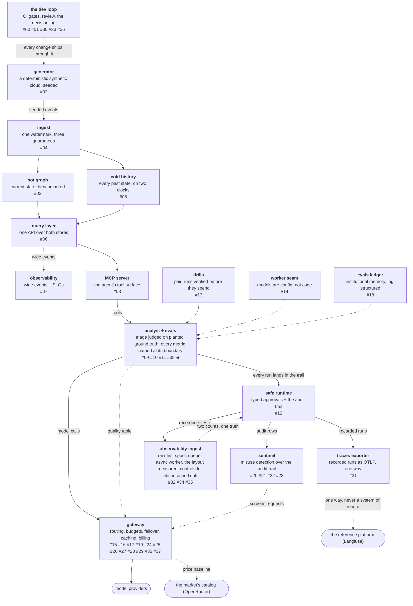

# The bug no test could fail on

A test fails when an expectation is violated. That makes a whole
class of defect invisible by construction: if a value stops crossing
a boundary and **nothing on the far side has ever seen it**, there
is no expectation to violate. Every test passes, every check is
green, and the thing that was measured simply never arrives.

The previous post found one of those — a routing table blind to
latency for months, on an axis the eval harness had been computing
the whole time. This post is about the class rather than the
instance, because this repository turned out to contain three of
them, and the oldest one had already produced the remedy.

<!-- more -->

!!! info "The resgraph series"
    This is the thirty-ninth post about
    [**resgraph**](https://github.com/fespino/resgraph), a mini data
    platform I am building for learning purposes.
    This work landed after the `phase-13.5-frontier-routing` tag, so
    browse the repository as it stood when this was written at
    [`db838c0`](https://github.com/fespino/resgraph/tree/db838c0).
    Every snippet below is copied from that commit, trimmed only for
    length.

In this phase: the specification indexes this work as *post-13.5*
([#328](https://github.com/fespino/resgraph/issues/328) →
[PR #343](https://github.com/fespino/resgraph/pull/343), decision
D52 — a measured metric crosses a boundary named, or stays behind
with a reason). It is the direct follow-on to the previous post's
second finding, and it amends two earlier decisions: D44's quality
table and D51's dominance axes.

The platform so far, with this post's piece highlighted:



## The oldest instance: a gate that stopped covering its input

The CI eval gate runs the agent against planted ground truth on
pull requests that touch the agent. "Touch the agent" is expressed
as a path filter in a workflow file — a list of globs — and that
list shipped without `skills/**`.

At the time, a skill's body was being loaded straight into the
system prompt. So editing the agent's investigative discipline
changed what the agent did, and the gate did not run, and the pull
request went green. Nothing failed. The control was not broken; its
*scope* had quietly stopped matching reality, which produces a green
check rather than an error.

The fix was not to add one glob. It was to stop maintaining a list
beside the thing it guards:

```python
# tests/test_eval_gate_scope.py
"""The eval gate's trigger must cover everything that changes what the
agent does (D29b — agent SLOs and the CI eval gate).

This exists because the filter shipped without `skills/**` while the
skill body was being loaded straight into the system prompt: editing
the agent's investigative discipline changed its behavior and the gate
never ran. A control that silently stops covering an input is worse
than no control — the green check still appears.

So the inputs are discovered rather than listed. Any new file the
prompt builder reads, and any new module whose content is embedded in
the prompt, has to be inside the gate's paths or this fails.
"""
```

The test reads the workflow's own globs, asks the prompt builder
which files it reads, and fails when the second set is not covered
by the first:

```python
# tests/test_eval_gate_scope.py
def gate_globs() -> list[str]:
    doc = yaml.safe_load(WORKFLOW.read_text())
    # PyYAML reads the `on:` key as the boolean True
    trigger = doc.get("on", doc.get(True))
    return list(trigger["pull_request"]["paths"])
```

A control that maintains its own list of what to watch will
eventually watch the wrong list. The fix is to derive the list from
the thing being watched.

## The same shape, twice more

**The routing table dropped a measured axis.** `arm_summary`
computed latency percentiles from every eval run; the table builder
emitted pass^k and cost and nothing else. The
[previous post](37-the-frontier-and-where-the-literature-stops.md)
covers what that cost — a dominance test blind on an axis it needed
— and why fixing the axis had to come before shipping the
comparison. What belongs here is why it survived so long: no
artifact showed a gap, and no test could have failed, because
nothing on the far side had ever seen the column.

**The enrichment worker projects a fixed column set.** The
observability sink from post
[#32](32-raw-first-ingestion.md) writes typed columns, and the
enrichment step decides which fields of a raw event become columns.
A field nobody projects is dropped in silence — the same shape as
the incremental-model default that discards new columns without
complaint. That boundary is softer than the other two, because raw
is authoritative and the whole payload is stored, and it still gets
its exclusions written down:

```python
# src/resgraph/ingest/worker.py
# D52 at the ingest boundary — softer, because `payload` is stored whole
# and raw is authoritative.
NOT_PROJECTED: dict[str, str] = {
    "run": "expanded into the run_* columns rather than stored as a struct",
    "payload": "stored whole as JSON; the typed columns are extracts, not replacements",
}
```

Three instances, three subsystems, one shape. That is the argument
for treating it as a rule rather than fixing the latency column and
moving on.

## The rule, and the manifests that carry it

Every metric a producer computes is, at each boundary it reaches,
either a named input on the far side or an exclusion recorded with
its reason. The exclusions are the interesting half, because writing
one forces the argument that would otherwise be an accident:

```python
# src/resgraph/evals/arms.py
NOT_SUMMARISED: dict[str, str] = {
    "rows": "trials x items; `trials` and `items` carry it apart",
    "model": "single-model guard for the gate's baseline matching; `models` carries the set",
    "dims": "per-dimension pass rates are the gate's regression surface, not an arm ranking",
    "failing_items": "a reviewer's worklist for one run, meaningless once aggregated",
    "fabrications": "the offending items; `fabrication_count` is the comparable quantity",
```

The carried set is a mapping rather than a list, so the routing
table builder writes what the manifest says instead of keeping its
own field list:

```python
# src/resgraph/evals/arms.py
# summary key -> (quality-table field, decimal places)
ROUTING_INPUTS: dict[str, tuple[str, int | None]] = {
    "pass_all_trials": ("passk", 4),
    "cost_per_passed": ("cost_per_passed", 6),
    "latency_p50_s": ("latency_p50_s", 3),
    "latency_p95_s": ("latency_p95_s", 3),
    "fabrication_count": ("fabrication_count", None),
    "models": ("workers", None),
}
```

And the guard applies the eval gate's own remedy: it calls the
producers on a committed run and discovers what they return today,
rather than comparing two lists a human keeps in sync.

```python
# tests/test_metric_boundaries.py
def test_no_aggregate_metric_reaches_the_arm_summary_by_being_forgotten(rows):
    produced = set(aggregate(rows))
    forwarded = set(arm_summary("haiku", rows))
    unclassified = produced - forwarded - set(NOT_SUMMARISED)
    assert not unclassified, (
        f"aggregate() produces {sorted(unclassified)}, which arm_summary neither carries "
        "nor lists in NOT_SUMMARISED — decide whether an arm is ranked on it"
    )
```

Four failures are possible, and each one is a real state somebody
could ship. A metric that is neither carried nor excluded fails. An
exclusion that outlives the metric it names fails, so the manifest
cannot rot into a list of ghosts. An axis the router ranks on that
the builder never writes fails. And a field the builder writes that
the loader silently drops fails, which is the same boundary
mirrored:

```python
# tests/test_metric_boundaries.py
def test_the_router_reads_every_field_the_builder_writes(summary, tmp_path):
    """The far side of the same boundary: a field the builder emits and
    the loader silently drops is the identical failure, mirrored."""
```

## The audit found the issue's own premise one boundary short

The issue, written from the previous phase's review, assumed the
metrics were being dropped at the routing-table builder. Reading the
code found two boundaries, not one. `aggregate()` produces nine
metrics that `arm_summary` never forwards, which is where
`degraded_rows`, `cache_hit_mean` and the per-dimension pass rates
were already being lost a layer earlier than anyone had looked.

This repository's standing rule is to verify the premise against the
code rather than against the document, because a document is a
hypothesis about the code. Here it caught a document I had written
myself three days earlier.

## One of the proposed fixes was wrong

The issue argued that `degraded_rows` should become a routing input:
an arm that reaches its answers by degrading is a different
proposition from one that does not, even at equal pass^k. That reads
as obviously correct, and reading the grader says otherwise.

`degraded` is the analyst admitting it lost something. On a planted
`store_degraded` item, admitting it is *required to pass*. So the
raw count sums a virtue and a vice: on a run with N planted faults,
the best possible arm scores about N and the worst scores zero.
Ranking on it would prefer the arm that noticed nothing.

It ships as an exclusion carrying the condition that would make it a
metric:

```python
# src/resgraph/evals/arms.py
    "degraded_rows": (
        "counts reports that admitted degradation, which is required to pass a planted "
        "store_degraded item and suspect on a clean one — the raw count sums a virtue and "
        "a vice. Becomes a metric when the harness splits it by whether a fault fired"
    ),
```

That is the second consecutive phase where a plausible, well-argued
fix would have been wrong and only reading the implementation caught
it — the previous one being the dominance test that would have
pruned genuine trades. Two for two is worth stating as a rate, in
the same way the closeout audits are: a proposed fix is a hypothesis
about code somebody has not read yet.

## What changed as routing behaviour

Classifying every metric forced three decisions that had been going
unmade.

**A fabrication disqualifies, it does not merely rank.** The eval
gate blocks a merge on any fabrication unconditionally, and the
router then weighted arms as though the dimension did not exist —
two components, one concern, opposite policies, and nobody chose
either. A nonzero count now makes an arm ineligible regardless of
floor or price:

```python
# src/resgraph/gateway/quality.py — eligible
    """Candidates whose measured pass^k clears the floor and whose run
    fabricated nothing. An unmeasured candidate is ineligible — no
    eval, no route: the floor is a guarantee, and a guarantee cannot
    rest on an absent measurement."""
```

The count is a *required* table field rather than a defaulted one,
and that choice is the same finding D50 made at the ingest layer
wearing different clothes: an entry generated before the count
existed would otherwise route exactly like a clean arm, because
absence would read as zero. A decision earning its keep twice in two
unrelated components is the argument for writing decisions down in a
form general enough to travel.

**The tail is a fourth dominance axis.** D41 ranks endpoints on
percentiles rather than means because time-to-first-token on the
local backend is bimodal, and admitting only p50 to the dominance
test reproduced exactly the averaging that decision rejects. An arm
can win the median and lose the tail that a caller with a deadline
actually meets, so both travel now.

**The score names the worker that earned it.** `workers` travels
with `run` and `date`. The eval gate already refuses a run from a
different worker than its baseline; the routing table had the same
exposure — an alias whose score came from a run of some other model
— and no way to see it.

## What I'd take to the next project

- **Look for values that stop crossing a boundary.** The failure is
  invisible to tests by construction, so it will not appear in any
  report you already read.
- **Derive a control's scope from the thing it guards.** A hand-kept
  list beside a system is a second source of truth that drifts
  silently and fails as a green check.
- **Make the guard call the producers.** Reading what a function
  actually returns today is the difference between a test that
  checks a list and a test that checks reality.
- **Write the exclusion, not just the inclusion.** "Why is this
  metric not a routing input" is a question with an answer worth
  keeping, and half of those answers turn out to carry the condition
  that would reverse them.
- **Treat a proposed fix as a hypothesis about unread code.** Twice
  running, the well-argued fix here would have shipped a new bug
  wearing a correctness fix's clothes.

The decision record is D52 (a measured metric crosses a boundary
named, or stays behind with a reason) in
[SPEC.md](https://github.com/fespino/resgraph/blob/main/SPEC.md),
where its reversal condition is that the manifest becomes ceremony
if the metric set churns fast enough — at which point the guard
should assert the carried set and let exclusions go unnamed. The
work landed as
[PR #343](https://github.com/fespino/resgraph/pull/343).

Two of the findings here came from asking a question that spans
layers rather than one that lives inside a component: the quality
table forgetting nothing while the dispatch layer forgets by
design, and the eval gate blocking a fabrication that the router
priced at zero. Neither was visible to anyone reading one layer at a
time, which is why the cross-layer walk is now its own piece of
work — and where this series goes next.
