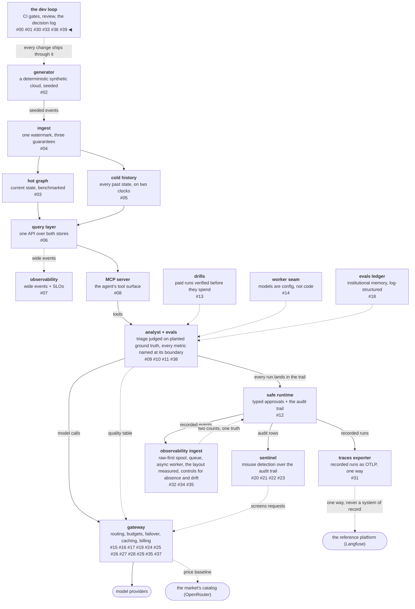

# Ask every layer the same question

A **cross-layer consistency review** is a walk with a one-sentence
method: pick a concern, ask *every* layer of the system what its
policy on that concern is, and mark each difference between layers
as either *decided* or *drifted*. Decided means somebody compared
the two policies and chose; drifted means the difference exists
because nobody ever put them side by side. The test is not whether
layers agree — the platform's best pairs disagree on purpose — it
is whether the difference was ever the subject of a decision.

Run over this platform with five concerns, the walk cost nothing but
reading and produced sixteen findings, not one of which is a layer
being wrong. Every finding is two layers, each locally reasonable,
jointly incoherent. That is exactly why they survived every
per-layer review that came before.

<!-- more -->

!!! info "The resgraph series"
    This is the fortieth post about
    [**resgraph**](https://github.com/fespino/resgraph), a mini data
    platform I am building for learning purposes.
    This work landed after the `phase-13.5-frontier-routing` tag, so
    browse the repository as it stood when this was written at
    [`ffa83b4`](https://github.com/fespino/resgraph/tree/ffa83b4).
    Every snippet below is copied from that commit, trimmed only for
    length. The clock fix described mid-post landed just after, in
    [PR #356](https://github.com/fespino/resgraph/pull/356).

In this phase: the review itself
([#329](https://github.com/fespino/resgraph/issues/329) →
[PR #353](https://github.com/fespino/resgraph/pull/353)), whose
full record is committed as
[`docs/reviews/cross-layer-2026-08.md`](https://github.com/fespino/resgraph/blob/main/docs/reviews/cross-layer-2026-08.md)
— every finding with its `file:line` citations, so this post can
excerpt where the record already carries the detail. The findings
worth acting on are filed as
[#348](https://github.com/fespino/resgraph/issues/348) — already
fixed in [PR #356](https://github.com/fespino/resgraph/pull/356),
whose story is below —
[#349](https://github.com/fespino/resgraph/issues/349),
[#350](https://github.com/fespino/resgraph/issues/350) and
[#351](https://github.com/fespino/resgraph/issues/351), with
[#352](https://github.com/fespino/resgraph/issues/352) collecting
the tail. This is the sibling of the
[previous post](38-the-bug-no-test-could-fail-on.md): that one is
how a metric disappears between two layers; this one is how two
layers disagree without either being wrong.

The platform so far, with this post's piece highlighted:



## Twice by accident is a method waiting to be named

This walk did not come from a checklist recommendation. It came from
noticing that the same shape of finding had turned up twice, both
times by accident, while doing something else.

The first was in mini-phase 13.5. The dispatch layer forgets by
construction — rolling windows, an idle backend returning to
*unmeasured* — while the quality table one layer up forgot nothing,
weighting a months-old score exactly like yesterday's. Neither
policy was wrong. Nobody had chosen the difference, and it surfaced
only because a literature pass happened to put the two layers in one
head at one time.

The second was in the metric-boundary work: the eval gate blocks a
merge on any fabrication unconditionally, and the router weighted
arms as though the dimension did not exist. Same concern, opposite
policies, no decision — found while classifying metrics for an
unrelated rule.

Two accidental discoveries of the same shape is a method waiting to
be named. The third time it was a checklist: five concerns —
**memory, time, provenance, refusal, identity** — asked of every
package in the repository, each answer recorded in a table, each
difference marked decided or drifted.

## Drifted does not mean wrong

The definitional move that makes the walk useful is that *drifted*
is not a synonym for *incorrect*. Almost every finding is two layers
each solving its own problem well, which is exactly why per-layer
review kept passing them.

The proof that the distinction carries weight is the pairs that
produced **zero findings**. The platform's memory policies disagree
by design: D41's dispatch stats forget continuously, D51's quality
table never forgets and announces staleness instead — and that
difference is *argued*, because serving a request updates the
latency window it is ranked by while producing no pass^k. A pull is
an observation at one layer and not at the other. Likewise the
registry **admits** an endpoint on an undeclared capability while
the router **refuses** an arm on an unmeasured score — opposite
defaults, both with their reasoning written down, because an
undeclared capability is a config gap and an unmeasured quality is
an absent guarantee.

Opposite policies, both decided: zero findings. Sixteen differences
nobody ever compared: sixteen findings. The walk grades the
reasoning, not the agreement.

## One concern in depth: which clock does each layer record?

Time is the concern worth walking in public, because its sharpest
finding is the platform's own argument turned on itself.

D13 gave the platform two clocks — **event time**, when the world
changed, and **observation time**, when the pipeline saw it — and
rejected Iceberg's commit-time travel as the as-of mechanism
precisely because the two drift apart under backfill, replay and
lag. The query layer honours the split: every response carries both
`at` and `fetched_at`. That decision is from July, published in
[post #05](05-cold-history-two-clocks.md).

Now the finding ([#348](https://github.com/fespino/resgraph/issues/348)).
The generator stamps events on simulated world time, starting at a
fixed epoch:

```python
# src/resgraph/gen/churn.py
WORLD_EPOCH = datetime(2026, 1, 1, tzinfo=UTC)
```

The remediation executor — added months later, in the safe-runtime
phase — stamps the events it emits with its injected clock, whose
default is real wall time:

```python
# src/resgraph/analyst/executor.py
    now: Callable[[], datetime] = lambda: datetime.now(UTC)
```

```python
# src/resgraph/analyst/executor.py — _message
        return UpdateMessage(
            event_time=self.now(),
```

Both producers reach the same stream and land in the same cold-store
`event_time` column. `state_at(T)` resolves state by the
highest-sequence event with `event_time <= T` — so with a seeded
world sitting in January and remediation writes stamped with
today's date, every remediation sorts after every generated event
regardless of what actually happened, and an as-of query for a
January timestamp cannot see a remediation at all. The platform's
headline capability reads one column carrying two timelines.

The platform rejected commit-time travel because commit time and
event time drift apart, and then added a producer that writes
commit time into the event-time column. Each side is locally
reasonable: the generator's clock is the world's, and `now()` is
the natural default for a component acting in real time. The
incoherence exists only in the column where they meet, which no
per-layer review ever looks at.

What keeps it from being an outage also matters: the executor's
clock is injectable and every test injects it, and live remediation
is an operator path the eval harness does not exercise. Neither is a
defence of the default — it is the reason the default survived.

The fix ([PR #356](https://github.com/fespino/resgraph/pull/356))
hinges on what a remediation *is*, and the option that *sounds*
more honest — an intervention from outside the world, kept on its
own timeline — is the one that dies on contact with production. An
autoscaler resizing a pool, an operator rotating a credential and
this agent restarting a container are all the same kind of thing:
mutations of one infrastructure by different actors. Real systems
record *who caused a change* as a dimension and keep *when it took
effect* on the one shared clock, because the moment interventions
live on a separate timeline, every as-of query omits a fix that had
already taken effect and "did the remediation precede the second
alert" — the question the store exists to answer — becomes
unanswerable. What genuinely lives outside the world is the
*decision* to remediate (intent, approval, attribution), and that
already rides the audit trail on observation time. The executor
emitting into the same stream as the generator was correct
architecture; only the clock source was wrong.

So the rule is that the clock belongs to the world, not the
producer. The executor now anchors to the alert's `fired_at`; its
clock is still injectable but no longer has a default, because a
silent wall-clock read *is* the bug. The CLI requires `--fired-at`
instead of defaulting an omitted flag to wall clock — the sibling
mistake one step earlier. And one existing test dissolved in a
satisfying way. The preview-vs-apply test had always compared the
two messages like this:

```python
# tests/test_analyst_executor.py
    assert sent.model_dump(exclude={"event_time"}) == previewed.model_dump(exclude={"event_time"})
```

That exclusion existed *because* two wall-clock reads can never
agree — the suite carried the finding's fingerprint before the
review named it. Both sides now stamp the same anchor and the
comparison includes `event_time`.

The receipt test caught two more bugs on its way in. Writing the
as-of receipt flushed out a latent one: the executor computed the
next sequence with `(applied_seq or -1) + 1`, so a resource at
sequence **0** read as never-applied and was assigned a message the
watermark silently drops — zero is a sequence, absence is `None`,
the same absence-vs-zero confusion this review's concern list keeps
finding. And the receipt's first draft failed *nondeterministically*
on exactly that collision, via the cold reader's arbitrary
equal-sequence tie-break — the review's F11 finding demonstrating
itself inside the test written for F5.

## The fix itself needed the same review

That version passed CI. An adversarial pass then found it claiming
more than it does, and the hole is invisible to every test in the
repository.

The anchor is not "the world's clock" — it is the world's clock
*when the alert fired*, and the remediation takes effect after
investigation and approval. The two coincide only in a **frozen**
world, where nothing arrives during triage. Which is every seeded
world this repository can construct — so no receipt in the suite
can falsify the anchor, because the flaw lives in a deployment
shape the tests cannot instantiate. Run it against a live
deployment, where wall clock *is* the world clock: alert at 14:00,
fix applied at 14:45. The discarded wall-clock default stamped
14:45 — correct there — and the anchor stamps 14:00, backdating
the fix by the whole triage duration, while the audit trail records
the true apply time. Two committed records disagreeing about when
one act happened, by a measurable margin: the fix had manufactured
a fresh instance of the exact cross-layer shape the review exists
to catch.

The resolution is a sentence, not code. What the implementation
actually stamps is the intervention's **placement** — the earliest
world time at which it can be said to exist: exact in a frozen
world, a lower bound in a live one, with the audit trail
authoritative for when the act was applied. That is a legitimate
design; it is also a *different claim* than "the world's clock,"
and the difference is precisely the kind this post says must be
written down rather than discovered. The D13 amendment now states
the placement semantics, rejects wall-clock-at-apply explicitly —
*despite* it being exact in a live deployment, because one default
cannot serve both shapes — and carries the reversal condition: a
triage path that can observe the world's current clock would make
the stamp the effect time everywhere and dissolve the caveat. The
pass's third hit — per-resource order now rests entirely on
sequences minted by two producers that never coordinate — is filed
as [#370](https://github.com/fespino/resgraph/issues/370).

Two tells from the arc, worth more than the fix. When the old
answer and the new answer *partition the deployments between them* —
wall clock right live and wrong simulated, the anchor exact
simulated and a lower bound live — the semantics are
under-specified, and the real fix is a sentence. And a fix
validated only in worlds where its approximation is exact is
unvalidated; the countermeasure here was social, not technical —
attack your own merged-in argument before someone else has to.

## The recurring shape: a strict consumer above a lax producer

Across all five concerns, one shape kept coming back. A layer
enforces a hard requirement, and the layer below it mints the
required value without checking it — so the guarantee is enforced at
the only point where checking is impossible, because the value has
already been asserted.

The cleanest instance is provenance
([#351](https://github.com/fespino/resgraph/issues/351)). The
quality table refuses a score that arrives without its origin:

```python
# src/resgraph/gateway/quality.py — load_quality
            missing = [k for k in REQUIRED if not entry.get(k) and entry.get(k) != 0]
            if missing:
                raise SystemExit(
                    f"quality entry {task_class}/{alias} lacks {missing}: "
                    "a score without provenance is an opinion, not a measurement"
                )
```

And here is where the required values come from, in the builder one
layer down:

```python
# src/resgraph/evals/cli.py — routing_table
        run_id = rows[0].get("run_id", Path(path).stem)
        date = f"{run_id[:4]}-{run_id[4:6]}-{run_id[6:8]}" if len(run_id) >= 8 else run_id
        ...
        scores[alias] = entry | {"run": path, "date": date}
```

`run` is whatever path string the operator typed on the command
line, and `date` is sliced out of the first row's run id with the
filename as a fallback. Nothing checks either against the run file's
own environment pin, and the `git_ref` that is on every row is
dropped at this exact boundary. The reader's guarantee rests on the
writer's unvalidated string.

The same shape appears twice more in the same concern. The eval
gate defends `baseline.json`, and the command that writes that
baseline never verifies the run it aggregates — a run that failed
the fabrication halt can become the bar the gate defends. And D38
requires the sentinel to stamp setup *and* template hash per
verdict; the classifier stamps the hash and discards the model name.
That last one is the single finding in the review that is not drift
between two reasonable positions — a decision was written and half
implemented.

The lesson generalizes cleanly: when you harden a consumer, walk
down one layer and check who produces the thing you now require.
Hardening the top of a stack feels like progress precisely because
the refusal is visible, while the unchecked mint below it is not.

## A published criticism is not a design review

The most uncomfortable finding is one this series handed to itself.

While preparing the layout experiment of
[post #34](34-wide-versus-normalized.md), the phase notes criticised
an external activity-schema specification for modelling activities
with a single timestamp and no way to express late arrival. Days
later, the same phase shipped the D48 observations sink: one `ts`
column, event time, no observation time — the criticised shape,
rebuilt from scratch, by the people who had just written the
critique ([#349](https://github.com/fespino/resgraph/issues/349)).

The pipeline even *captures* an observation clock and destroys it:
the queue stamps `enqueued_at` on every reference, and the ack
deletes the row at the moment the sink row is written. The
consequence is that a replay is indistinguishable from live ingest
by any stored value — which is precisely the property D13 built the
two-clock distinction to preserve.

Knowing a failure class well enough to write it up — twice, counting
D13 itself — did not stop it entering by a third door. A criticism
you publish lives in your notes; a design review lives in your diff,
and only one of them was present when the sink's schema was written.

## Verify the finding against the code, not the report of the code

One correction from the walk itself belongs in the method, because
it is the standing rule of this repository pointed at a new target:
my own reviewer output.

The identity walk initially reported the response cache as
returning one account's completion to another — the cache does not
key on the account, and D43 makes the account the identity of a
caller. Alarming, and wrong. Reading the key shows why:

```python
# src/resgraph/gateway/cache.py
def cache_key(alias: str, kwargs: dict[str, Any]) -> str:
    canonical = json.dumps({"alias": alias, "kwargs": kwargs}, sort_keys=True)
    return hashlib.sha256(canonical.encode()).hexdigest()
```

The full request — messages, system prompt, tools, every argument —
is inside the key. A hit requires the second caller to have sent
byte-identical content, so nobody can pull content they did not
already supply. The real findings are quieter and still undecided
([#350](https://github.com/fespino/resgraph/issues/350)): a
**cross-account subsidy**, because the hit is metered at
`cost_usd=0.0` against the second account in a system whose whole
point is that the meter is trustworthy, and a narrow **existence
oracle**, because `cached: true` tells a caller that somebody asked
this exact question within the TTL.

The rule this repository keeps re-earning is *verify the premise
against the code, not against the document*. A review is a document
too. The alarming version of a finding is the one most worth
re-deriving from source before it goes in the record, because it is
the one most likely to be repeated.

## Why the walk finds what thorough reviews cannot

The comparison that makes the method the story: a harnessability
review last week walked one agent-repository system end to end,
carefully, and found four things. This walk found sixteen.

Not because it looked harder — because a question that spans layers
cannot be asked from inside one. A per-layer review of the quality
table sees a hard provenance requirement and approves. A per-layer
review of the table builder sees reasonable defaults and approves.
The finding exists only in the pair, and no amount of rigour inside
either layer can produce it. Both counts depend on their scope —
sixteen is a function of five concerns times every package, and a
sixth concern would raise it — so the durable claim is not the
number; it is that the walk's findings are *invisible in principle*
to the reviews that preceded it, which is the same argument the
[previous post](38-the-bug-no-test-could-fail-on.md) made about
tests and dropped metrics, one level up.

## What I'd take to the next project

- **Walk one concern across every layer, in a table.** Layer,
  policy, what it ages or refuses or requires, decided or drifted.
  The table format is what forces the question to actually span the
  system instead of sampling it.
- **Grade the reasoning, not the agreement.** Two layers with
  opposite policies and recorded arguments are healthier than two
  layers that agree by coincidence.
- **When you harden a consumer, check its producer.** The strict
  requirement above an unchecked mint is the recurring failure
  shape, and the strictness is what hides it.
- **Treat your own published criticisms as review checklist
  entries.** A failure class you can write about is not a failure
  class you will notice in your own diff unless something forces the
  comparison.
- **Re-derive the alarming finding from source.** Reviewer output is
  a document; the code is the territory. The correction here changed
  a content-leak claim into a metering bug, which is a different fix
  with a different urgency.
- **Attack the fix against the deployments your tests cannot
  build.** The clock fix's hole was invisible to every world the
  suite can construct, and the tell was cheap to spot in review:
  the discarded solution was *right somewhere*. When old and new
  answers split the deployment shapes between them, write the
  semantics down before merging the code.

The full record, with every finding cited to `file:line`, is
[`docs/reviews/cross-layer-2026-08.md`](https://github.com/fespino/resgraph/blob/main/docs/reviews/cross-layer-2026-08.md);
the follow-ups worth acting on now are
[#349](https://github.com/fespino/resgraph/issues/349),
[#350](https://github.com/fespino/resgraph/issues/350) and
[#351](https://github.com/fespino/resgraph/issues/351) —
[#348](https://github.com/fespino/resgraph/issues/348) is closed by
the fix above, which spawned
[#370](https://github.com/fespino/resgraph/issues/370) — with the
tail collected in
[#352](https://github.com/fespino/resgraph/issues/352) rather than
scattered across sixteen tickets nobody reads.

The reusable artifact is the concern list, not the findings.
Memory, time, provenance, refusal and identity are questions any
layered system can be asked, and each produced findings here. A
sixth is already visible and was deliberately not walked:
**authority** — who may cause a side effect, and how does each
layer know. The approval gate, the gateway's scopes, the MCP
surface's curation and the collector's write credential are four
answers that have never been put side by side. The method outlives
the article, which is the point of naming it.
