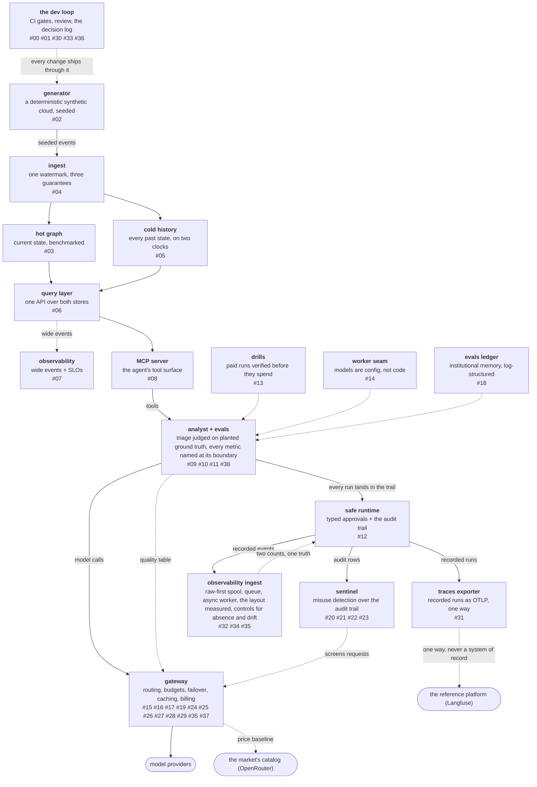

# resgraph

[resgraph](https://github.com/fespino/resgraph) is a mini data
platform I am building for learning purposes. A synthetic
cloud-infrastructure world streams updates into a graph hot store
and an Iceberg cold store, queryable by traversal and time travel;
on top sit an investigating agent, the eval harness that grades it,
and a serving gateway.

The goal is to practice, at laptop scale, the disciplines a serious
data-and-AI platform runs on — decision logs, measured benchmarks,
evals, drills, budgets — and to write down what each one costs and
buys. Every number ships with its hardware and methodology.

## The map

One node per piece of the platform; the chapter numbers name the
devlog posts that build it. Every post carries this map grown to its
own chapter, so reading in order watches it fill in.

## Devlog

Notes written as the work was done.

<!-- posts:auto -->
